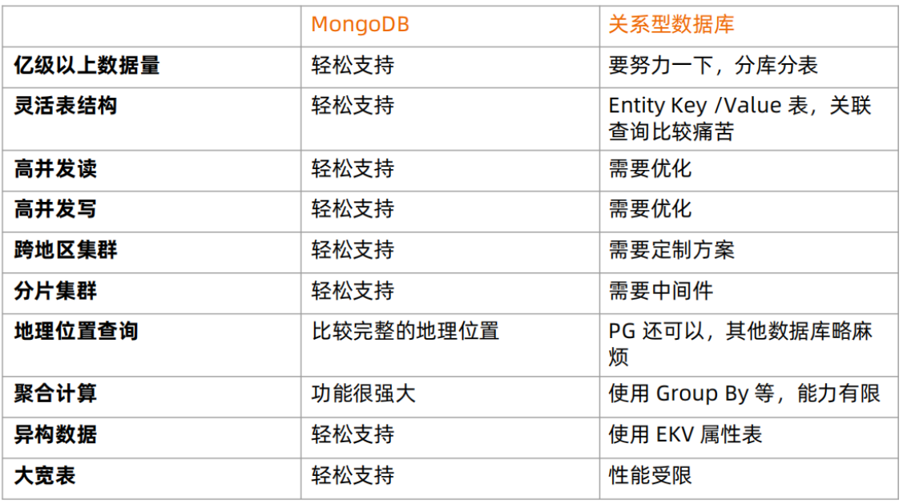
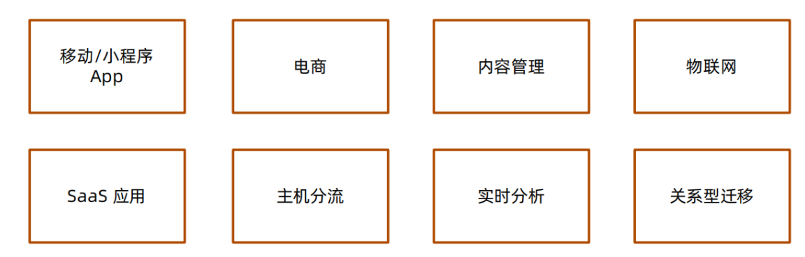
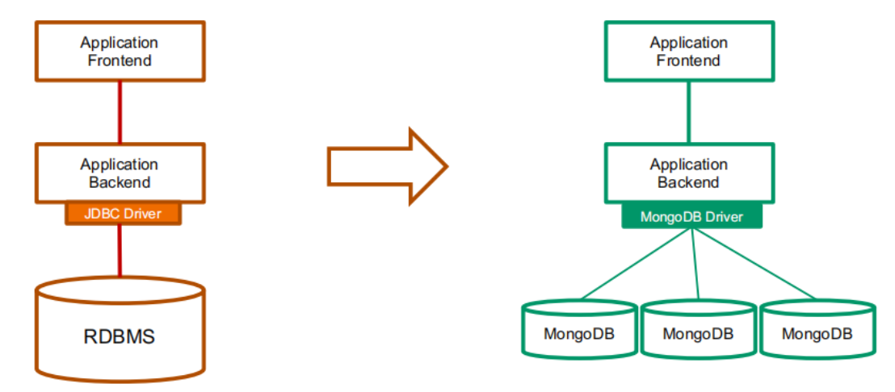
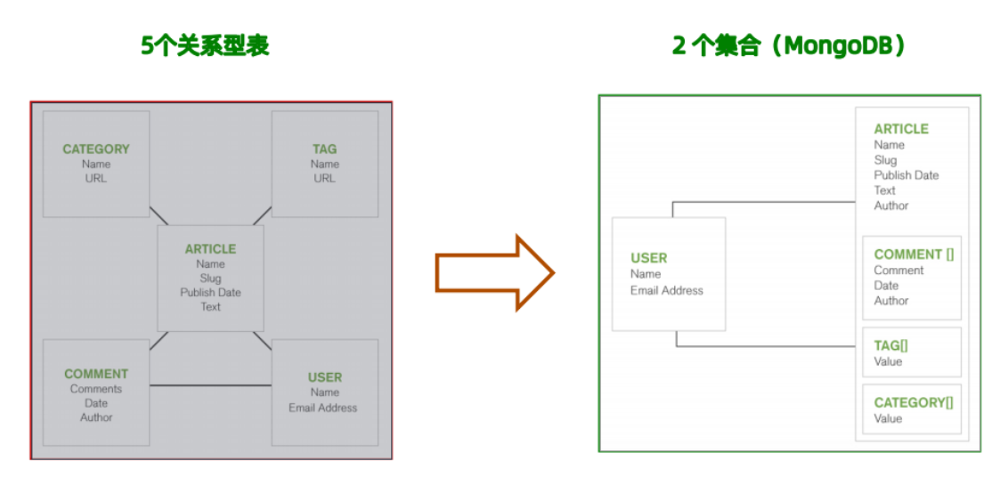
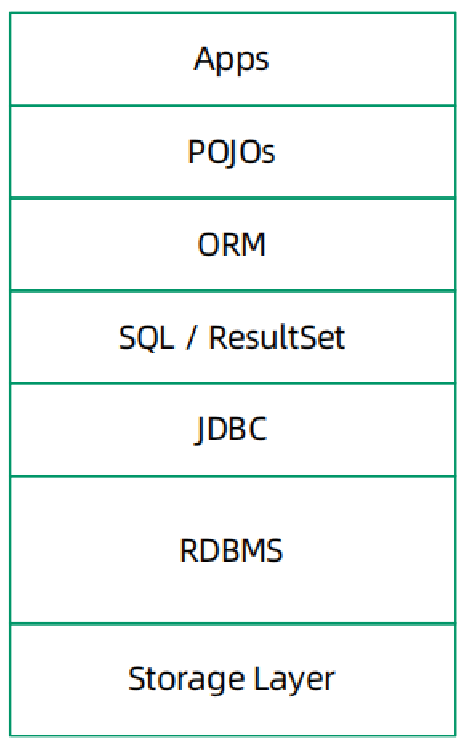
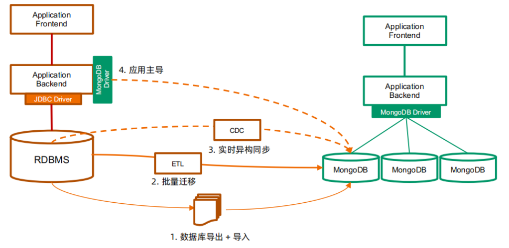
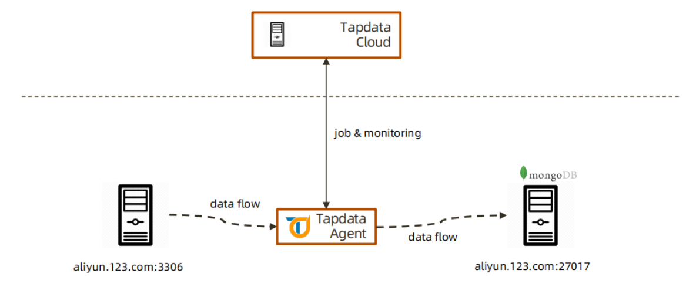

# 异构平台在线迁移

## 一、为什么要迁移至MongoDB

### 1、MongoDB数据库定位

>● OLTP /OLAP 数据库
>● 原则上 Oracle 和 MySQL 能做的事情，MongoDB 都能做（包括 ACID
>事务）
>● 优点：横向扩展能力，数据量或并发量增加时候架构可以自动扩展
>● 优点：灵活模型，适合迭代开发，数据模型多变场景
>● 优点：JSON 数据结构，适合微服务/REST API

### 2、基于功能选择 MongoDB



### 3、基于场景选择 MongoDB



## 二、迁移痛点

>关系型到关系型 – 相对简单
>• Oracle -> MySQL, Oracle – PostgreSQL
>
>关系型到文档型 – 相对复杂
>• Oracle -> MongoDB
>
>需要考虑：
>• 总体架构 (从单体式到分布式）
>• 模式设计（从关系模型到文档模型）
>• SQL 语句 / 存储过程 / JDBC / ORM
>• 数据迁移 （如何处理已有数据？）

### 1、单点到分布式



### 2、模式转换



### 3、迁移主流程



```bash
RDBMS:
• 存储过程
• 运维工具、脚本
• 权限设置
• 数据库监控备份及恢复
Storage: 
• 典型的关系型数据库部署在 SAN 上
• MongoDB支持 SAN, 但是使用本地存储
• 可以最大化的提高性能
JDBC: 
MongoDB 没有原生态 JDBC, 而是采用自带的驱动程序：
• 自带连接池管理
• 事务支持
SQL/RS:
MongoDB 不支持SQL的增删改，结果集也不是 ResultSet

等..
```

## 三、DBA主要关注--数据迁移

### 1、迁移方式

>• 数据库导出+导入
>• 批量迁移工具
>• 实时同步工具
>• 应用主导迁移



### 2、各种迁移方式的特点

```bash
1. 数据库导出导入
步骤：
- 停止现有的基于 RDBMS 的应用
- 使用 RDBMS 的数据库导出工具，将数据库表导出到 CSV 或者 JSON（如 mysqldump） - 使用 mongoimport 将 CSV 或者 JSON 文件导入 MongoDB 数据库
- 启动新的 MongoDB 应用
备注：
- 适用于一次性数据迁移
- 需要应用/数据库下线，较长的下线时间

2. 批量同步
步骤：
- 安装同步工具（如 Kettle / Talend） 
- 创建输入源（关系型数据库）
- 创建输出源（MongoDB） - 编辑数据同步任务
- 执行
备注：
- 适用批量同步，定期更新, 特别是每晚跑批的场景
- 支持基于时间戳的增量同步，需要源表有合适的时间戳支持
- 对源库有较明显的性能影响，不宜频繁查询
- 不支持实时同步

3. 实时同步
步骤：
- 安装实时同步工具（如Informatica / Tapdata） 
- 创建输入源（关系型数据库）
- 创建输出源（MongoDB） - 编辑实时数据同步任务
- 执行
备注：
- 基于源库的日志文件解析机制，可以实现秒级数据的同步
- 对源库性能影响较小
- 可以支持应用的无缝迁移

4. 应用主导迁移
步骤：
1. 升级已有应用支持 MongoDB
2. 数据插入请求直接进入 MongoDB
3. 数据查询和更新请求首先定向到 MongoDB
4. 如果记录不存在，从 RDBMS 读出来并写入到 MongoDB
5. 重复步骤3
6. 当步骤4在限定时间段（一星期、一个月）没有被调用，认为迁移完成
备注：
- 需要研发团队配合 ，有一定开发和测试量
- 为保证不遗漏数据，仍然先要执行一次批量同步
```

## 四、实时同步方案-TPDATA应用




