# MongoDB集群中的数据一致性和隔离性保证

## 一、writeConcern

### 1、什么是 writeConcern

>writeConcern 决定一个写操作落到多少个节点上才算成功。类似于MySQL中的半同步复制。主要保证数据最终一致性
>• 0：默认值。发起写操作，不关心是否成功；
>• 1: 集群最大数据节点数：写操作需要被复制到指定节点数才算成功；
>• majority：写操作需要被复制到大多数节点上才算成功。

#### 1.默认行为

>3 节点复制集不作任何特别设定（默认值）。

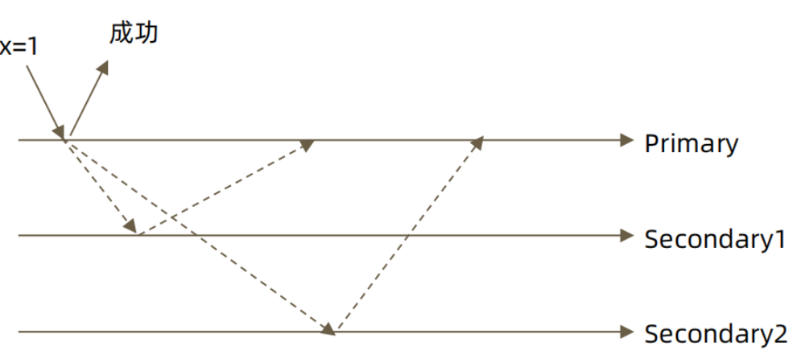

#### 2.w: "majority"

>大多数节点确认模式,其中包括主节点

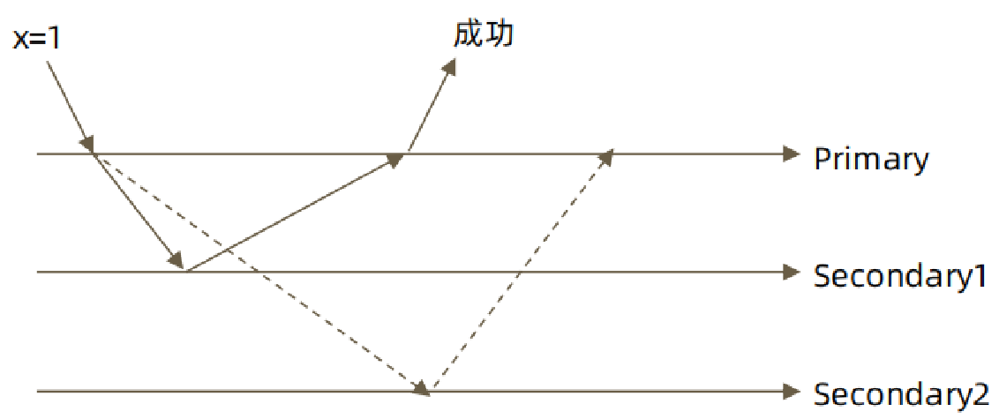

#### 3.w: "all"

>全部节点确认模式。

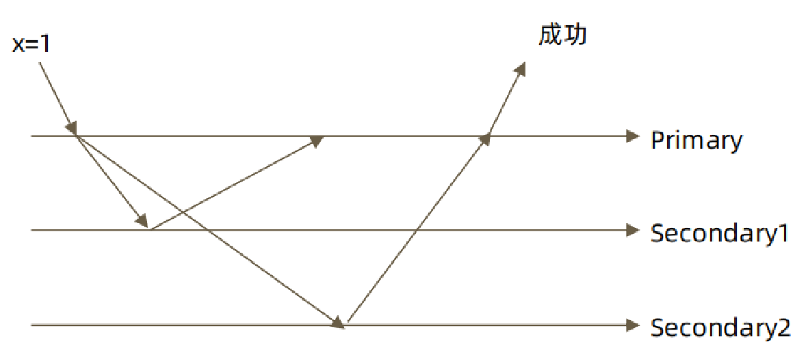

### 2、 journal日志

>writeConcern 可以决定写操作到达多少个节点才算成功，journal 则定义如何才算成功。journal日志类似于MySQL中的redo日志。是在WriteConcern基础上对于数据安全的进一步保证。
>
>取值包括：
>• true: 写操作落到journal 文件中才算成功；
>• false: 写操作到达内存即算作成功。

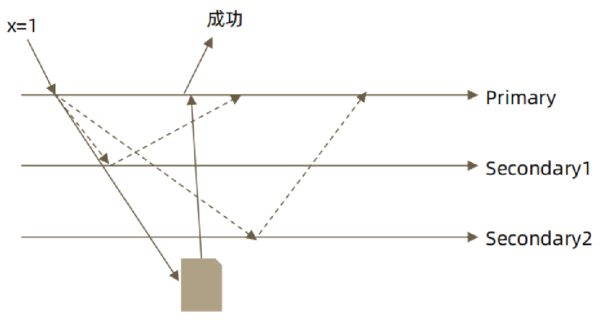

### 3、writeConcern 测试

```bash
在复制集测试writeConcern参数
db.test.insert( {count: 1}, {writeConcern: {w: "majority"}})
db.test.insert( {count: 1}, {writeConcern: {w: 3 }})
db.test.insert( {count: 1}, {writeConcern: {w: 4 }})

配置延迟节点，模拟网络延迟（复制延迟）
conf=rs.conf()
conf.members[2].slaveDelay = 5
conf.members[2].priority = 0
rs.reconfig(conf)

观察复制延迟下的写入，以及timeout参数
db.test.insert( {count: 1}, {writeConcern: {w: 3})
db.test.insert( {count: 1}, {writeConcern: {w: 3, wtimeout:3000 }})
```

### 4、注意事项

>• 虽然多于半数的 writeConcern 都是安全的，但通常只会设置 majority，因为这是等待写入延迟时间最短的选择；
>• 不要设置 writeConcern 等于总节点数，因为一旦有一个节点故障，所有写操作都将失败；
>• writeConcern 虽然会增加写操作延迟时间，但并不会显著增加集群压力，因此无论是否等待，写操作最终都会复制到所有节点上。设置 writeConcern 只是让写操作等待复制后再返回而已；
>• 应对重要数据应用 {w: “majority”}，普通数据可以应用 {w: 1} 以确保最佳性能。

## 二、readPreference读配置

### 1、介绍

>readPreference 决定使用哪一个节点来满足正在发起的读请求。
>
>可选值包括：
>• primary: 只选择主节点
>• primaryPreferred：优先选择主节点，如果不可用则选择从节点
>• secondary：只选择从节点
>• secondaryPreferred：优先选择从节点，如果从节点不可用则选择主节点
>• nearest：选择最近的节点

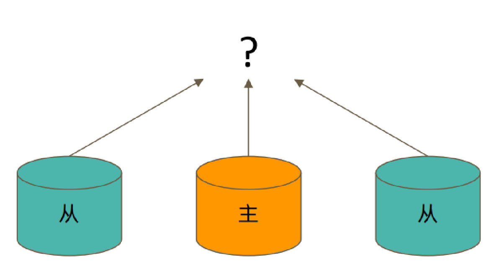

### 2、readPreference 场景举例

>• 用户下订单后马上将用户转到订单详情页——primary/primaryPreferred。因为此时从节点可能还没复制到新订单；
>• 用户查询自己下过的订单——secondary/secondaryPreferred。查询历史订单对时效性通常没有太高要求；
>• 生成报表——secondary。报表对时效性要求不高，但资源需求大，可以在从节点单独处理，避免对线上用户造成影响；
>• 将用户上传的图片分发到全世界，让各地用户能够就近读取——nearest。每个地区的应用选择最近的节点读取数据。

### 3、readPreference 与 Tag

>readPreference 只能控制使用一类节点。Tag 则可以将节点选择控制到一个或几个节点。
>
>考虑以下场景：
>• 一个 5 个节点的复制集
>• 3 个节点硬件较好，专用于服务线上客户
>• 2 个节点硬件较差，专用于生成报表
>可以使用 Tag 来达到这样的控制目的
>• 为 3 个较好的节点打上 {purpose: "online"}
>• 为 2 个较差的节点打上 {purpose: "analyse"}
>• 在线应用读取时指定 online，报表读取时指定reporting
>更多信息请参考官方文档：readPreference

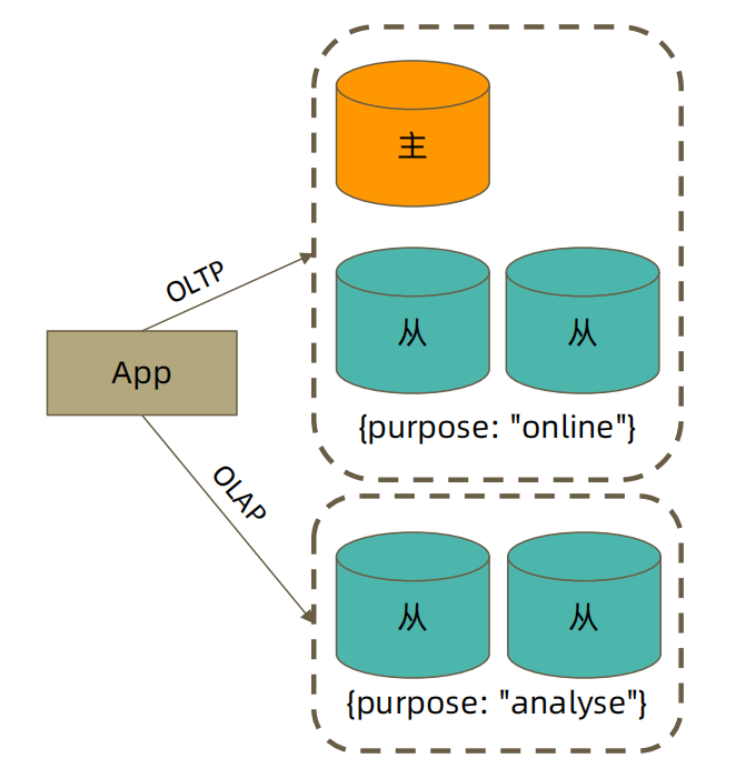

### 4、readPreference 配置

```bash
通过 MongoDB 的连接串参数：
• mongodb://host1:27107,host2:27107,host3:27017/?replicaSet=rs&readPreference=secondary

通过 MongoDB 驱动程序 API：
• MongoCollection.withReadPreference(ReadPreference readPref)

Mongo Shell： 
• db.collection.find({}).readPref( “secondary” )
```

### 5、readPreference 实验: 从节点读

```bash
• 主节点写入 {x:1}, 观察该条数据在各个节点均可见
• 在两个从节点分别执行 db.fsyncLock() 来锁定写入（同步）
• 主节点写入 {x:2}
• db.test.find() 
• db.test.find().readPref(“secondary”)
• 解除从节点锁定 db.fsyncUnlock() 
• db.test.find().readPref(“secondary”)
```

### 6、注意事项

>• 指定 readPreference 时也应注意高可用问题。例如将 readPreference 指定 primary，则发生故障转移不存在 primary 期间将没有节点可读。如果业务允许，则应选择 primaryPreferred；
>
>• 使用 Tag 时也会遇到同样的问题，如果只有一个节点拥有一个特定 Tag，则在这个节点失效时将无节点可读。这在有时候是期望的结果，有时候不是。
>
>• 如果报表使用的节点失效，即使不生成报表，通常也不希望将报表负载转移到其他节点上，此时只有一个节点有报表 Tag 是合理的选择；
>
>• 如果线上节点失效，通常希望有替代节点，所以应该保持多个节点有同样的 Tag；
>
>• Tag 有时需要与优先级、选举权综合考虑。例如做报表的节点通常不会希望它成为主节点，则优先级应为 0。

## 三、readConcern读隔离性保证

### 1、什么是 readConcern？

>在 readPreference 选择了指定的节点后，readConcern 决定这个节点上的数据哪些是可读的，类似于关系数据库的隔离级别。可选值包括：
>• available：读取所有可用的数据; 
>• local：读取所有可用且属于当前分片的数据; 
>• majority：读取在大多数节点上提交完成的数据; 
>• snapshot：读取最近快照中的数据;
>• linearizable：可线性化读取文档; 

### 2、readConcern: local 和 available

>在复制集中 local 和 available 是没有区别的。两者的区别主要体现在分片集上。

#### 1.场景

>• 一个 chunk x 正在从 shard1 向 shard2 迁移；
>• 整个迁移过程中 chunk x 中的部分数据会在 shard1 和 shard2 中同时存在，但源分片 shard1仍然是chunk x 的负责方： 
>• 所有对 chunk x 的读写操作仍然进入 shard1； 
>• config 中记录的信息 chunk x 仍然属于 shard1；
>• 此时如果读 shard2，则会体现出 local 和 available 的区别：
>	local：只取应该由 shard2 负责的数据（不包括 x）；
>	available：shard2 上有什么就读什么（包括 x）；

#### 2.注意事项

>• 虽然看上去总是应该选择 local，但毕竟对结果集进行过滤会造成额外消耗。在一些无关紧要的场景（例如统计）下，也可以考虑 available； 
>• MongoDB <=3.6 不支持对从节点使用 {readConcern: "local"}；
>• 从主节点读取数据时默认 readConcern 是 local，从从节点读取数据时默认readConcern是 available（向前兼容原因）。

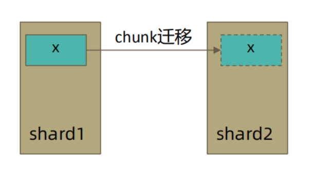

### 3、readConcern: majority

>只读取大多数据节点上都提交了的数据。考虑如下场景：
>● 集合中原有文档 {x: 0}；
>● 将x值更新为 1；

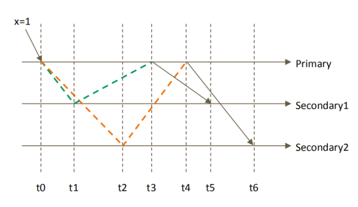

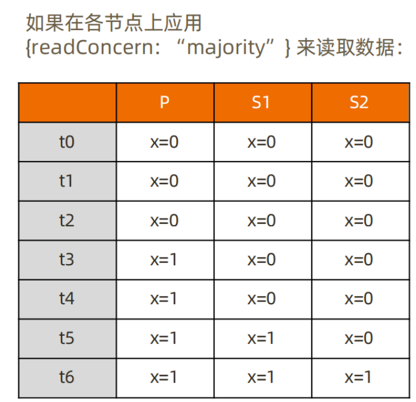

#### 1.实现方式

>考虑 t3 时刻的 Secondary1，此时：
>• 对于要求 majority 的读操作，它将返回 x=0；
>• 对于不要求 majority 的读操作，它将返回 x=1；
>如何实现？
>节点上维护多个 x 版本，MVCC 机制MongoDB 通过维护多个快照来链接不同的版本：
>• 每个被大多数节点确认过的版本都将是一个快照；
>• 快照持续到没有人使用为止才被删除；

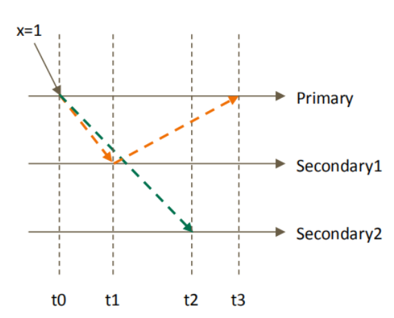

#### 2.避免脏读

>MongoDB 中的回滚：
>• 写操作到达大多数节点之前都是不安全的，一旦主节点崩溃，而从节还没复制到该次操作，刚才的写操作就丢失了；
>• 把一次写操作视为一个事务，从事务的角度，可以认为事务被回滚了。所以从分布式系统的角度来看，事务的提交被提升到了分布式集群的多个节点级别的“提交”，而不再是单个节点上的“提交”。在可能发生回滚的前提下考虑脏读问题
>• 如果在一次写操作到达大多数节点前读取了这个写操作，然后因为系统故障该操作回滚了，则发生了脏读问题；使用 {readConcern: “majority”} 可以有效避免脏读

### 4、如何实现安全的读写分离

#### 1.场景

```bash
向主节点写入一条数据；立即从从节点读取这条数据。如何保证自己能够读到刚刚写入的数据？
下述方式有可能读不到刚写入的订单:

db.orders.insert({ oid: 101, sku: ”kite", q: 1})
db.orders.find({oid:101}).readPref("secondary")
```

#### 2.使用 writeConcern + readConcern majority 来解决:

```bash
db.orders.insert({ oid: 101, sku: "kiteboar", q: 1}, {writeConcern:{w: "majority”}})
db.orders.find({oid:101}).readPref(“secondary”).readConcern("majority")
```

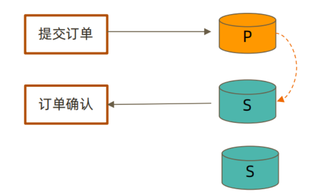

### 5、读隔离性和MySQL的对比

>readConcern 主要关注读的隔离性， ACID 中的 Isolation，但是是分布式数据库里特有的概念
>readCocnern： majority 对应于MysQL事务中隔离级别中的哪一级？

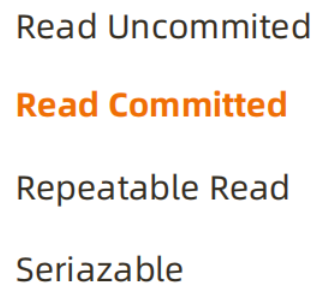

## 四、MongoDB的ACID事务支持

### 1、介绍

>MongoDB 虽然已经在 4.2 开始全面支持了多文档事务，但并不代表大家应该毫无节制地使用它。相反，对事务的使用原则应该是：能不用尽量不用。
>通过合理地设计文档模型，可以规避绝大部分使用事务的必要性
>
>为什么？
>事务 = 锁，节点协调，额外开销，性能影响.

### 2、MongoDB ACID 多文档事务支持

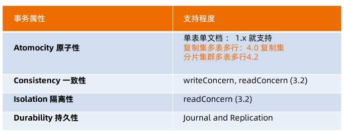

### 3、使用方法

```bash
MongoDB 多文档事务的使用方式与关系数据库非常相似：
try (ClientSession clientSession = client.startSession())
{
    clientSession.startTransaction();
    collection.insertOne(clientSession, docOne);
    collection.insertOne(clientSession, docTwo);
    clientSession.commitTransaction();
}
```

### 4、事务的隔离级别

>● 事务完成前，事务外的操作对该事务所做的修改不可访问
>● 如果事务内使用 {readConcern: “snapshot”}，则可以达到可重复读 Repeatable Read

### 5、实验：启用事务后的隔离性

```bash
db.tx.insertMany([{ x: 1 }, { x: 2 }]);
var session = db.getMongo().startSession(); 
session.startTransaction();
var coll = session.getDatabase('test').getCollection("tx");
coll.updateOne({x: 1}, {$set: {y: 1}}); 
coll.findOne({x: 1}); 
db.tx.findOne({x: 1}); 
session.abortTransaction();
```

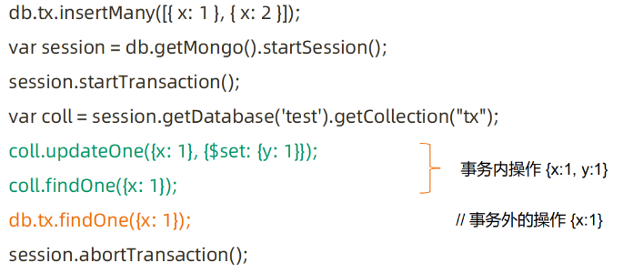

### 6、实验：可重复读 Repeatable Read

```bash
var session = db.getMongo().startSession();
session.startTransaction({
readConcern: {level: "snapshot"}, 
writeConcern: {w: "majority"}});
var coll = session.getDatabase('test').getCollection("tx");
coll.findOne({x: 1}); // 返回：{x: 1}
db.tx.updateOne({x: 1}, {$set: {y: 1}});
db.tx.findOne({x: 1}); // 返回：{x: 1, y: 1}
coll.findOne({x: 1}); // 返回：{x: 1}
session.abortTransaction();
```

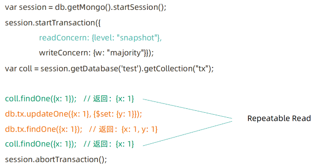

### 7、事务写机制

>MongoDB 的事务错误处理机制不同于关系数据库：
>● 当一个事务开始后，如果事务要修改的文档在事务外部被修改过，则事务修改
>这个文档时会触发 Abort 错误，因为此时的修改冲突了；
>● 这种情况下，只需要简单地重做事务就可以了；
>● 如果一个事务已经开始修改一个文档，在事务以外尝试修改同一个文档，则事
>务以外的修改会等待事务完成才能继续进行

### 8、实验：写冲突

```bash
继续使用上个实验的tx集合
开两个 mongo shell 均执行下述语句
var session = db.getMongo().startSession();
session.startTransaction({ readConcern: {level: "snapshot"}, 
writeConcern: {w: "majority"}});
var coll = session.getDatabase('test').getCollection("tx");
```

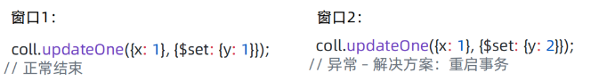

```bash
窗口1：第一个事务，正常提交
coll.updateOne({x: 1}, {$set: {y: 1}}); 
窗口2：另一个事务更新同一条数据，异常
coll.updateOne({x: 1}, {$set: {y: 2}}); 
窗口3：事务外更新，需等待
db.tx.updateOne({x: 1}, {$set: {y: 3}});
```

### 9、注意事项

```bash
• 可以实现和关系型数据库类似的事务场景
• 必须使用与 MongoDB 4.2 兼容的驱动；
• 事务默认必须在 60 秒（可调）内完成，否则将被取消；
• 涉及事务的分片不能使用仲裁节点；
• 事务会影响 chunk 迁移效率。正在迁移的 chunk也可能造成事务提交失败（重试即可）；
• 多文档事务中的读操作必须使用主节点读；
• readConcern 只应该在事务级别设置，不能设置在每次读写操作上。
• 必须是WT引擎才支持事务。
```