# TiDB介绍


## 一、数据库产品的发展

### 1、数据的定义和价值

#### 1.什么是数据

>数据是指对客观事件进行记录并可以鉴别的符号，是对客观事物的性质、状态以及相互关系等进行记载的物理符号或这些物理符号的组合。它是可识别的、抽象的符号。

#### 2.数据的种类

>它不仅指狭义上的数字，还可以是具有一定意义的文字、字母、数字符号的组合、图形、图像、视频、音频等，也是客观事物的属性、数量、位置及其相互关系的抽象表示。
>
>例如，“0、1、2…”、“阴、雨、下降、气温”、“学生的档案记录、货物的运输情况”等都是数据。数据经过加工后就成为信息。
>
>在计算机科学，数据是所有能输入计算机并被计算机程序处理的符号的介质的总称，是用于输入电子计算机进行处理，具有一定意义的数字、字母、符号和模拟量等的通称。计算机存储和处理的对象十分广泛，表示这些对象的数
>据也随之变得越来越复杂。

#### 3.数据的价值和意义

>- 识别对象行为，利用相关关系预测/推荐可能会发生什么行为？
>- 分析行为之间的关系，记录、监控、防止异常行为
>- 识别对象（人脸，声音，人体，图片）
>- 挖掘对象的情感等属性。
>- 解决信息不对称，信用体系
>- 发现不足、异常，并改善
>- 描述和*验证想法
>
>https://www.jianshu.com/p/c773e88bb127

### 2、数据的增长情况


>近年来，伴随着云计算、大数据、物联网、人工智能等信息技术的快速发展和传统产业数字化的转型，数据量呈现几何级增长，据IDC统计，全球数据总量2020年达到44个ZB，我国数据量将达到8060个EB，占全球数据总量的18%。
>
>据IDC统计，2020年有超过500亿的终端与设备联网，而有50%的物联网网络将面临网络带宽的限制，40%的数据需要在网络边缘分析、处理与储存。边缘计算市场规模将超万亿，成为与云计算平分秋色的新兴市场。而在国内市场方面，据CEDA预测，2020年 我国物联网市场规模有望达到18300亿元，年复合增速高达25%，我国边缘计算发展将在接下来的两年迎来高峰期。
>
>到2020年，平均下来，一个人每天会产生1.5G的数据，每辆车会产生4TB的数据，每架飞机会产生40TB的数据，每个小型的工厂会产生1PB数据。

### 3、数据库的迭代历程

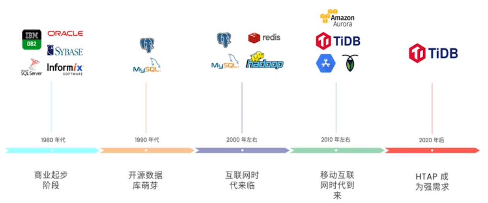

>自上世纪70年代，EF codd提出了关系型数据库模型开始，数据库已经发展了将近半个世纪。可以说是一个历史悠久的计算机学科，在这个半个世纪里，这个学科发生了很多变化，但也有一些共性的驱动在里面。我们尝试一起探讨下数据技术发展的内在驱动、以及展望趋势。

#### 里程碑一：关系型商业数据库

>上世纪80年代，也就是从提出关系型数据库模型后10多年，关系型数据库产品逐步完成了工程与产品实现，Oracle、IBMDB2、Sybase以及SQL Server和Informix第一批关系型商业数据库开始出现。

#### 里程碑二： 开源数据库萌芽

>90年代中后期，MySQL、PostgreSQL等开源数据库开始萌芽。

#### 里程碑三：开源数据库盛行、NoSQL、大数据生态来临

>上世纪末到本世纪初，IT与通信两门技术发生第一次碰撞，开启互联网时代，数据量开始爆发增长，快速发展的各类互联网公司，更加青睐MySQL、PostgreSQL这类开源数据库，同时也给这类开源数据库带来丰富的产品生态，比如基于开源数据库的各种分库分表方案产生。
>
>同期，2006年谷歌的三驾马车（GFS、Bigtable、Mapreduce）开启了大数据时代，涌现了Hadoop 、Hbase、Redis等NoSQL大数据生态。

#### 里程碑四：数据库技术百花齐放

>2010年后，IT技术与通信技术发生第二次碰撞，4G网络开启了移动互联网时代，在这个时代，产生了很多业务与场景创新，底层数据技术更是进入前所未有的快速通道。
>
>集成了分布式技术与关系模型的NewSQL数据库开始出现，代表产品有Spanner、TiDB 等。
>
>云计算与数据库、大数据发生融合；很多云原生数据库出现，云计算不仅给数据技术带来 新的变革，也给数据库厂商提供了更高效的服务交付、商业模式，各种DBaaS（Database-as-a-Service）产品涌现。

#### 里程碑五： HTAP的强需求

>2020年后，各行各业都逐步进入数字化时期，虽然从技术创新角度，会有越来越多的数据技术栈与产品将出现但这么多的技术栈也会大大增加使用成本，从用户需求的角度看，能不能将在线处理业务与分析业务进行整合，
>也就是我们经常说的HTAP(HybridTransactional/AnalyticalProcessing)作为一种统一的数据服务变成了一个强需求。

## 二、海量数据的机遇和挑战

### 1、海量数据带来的挑战

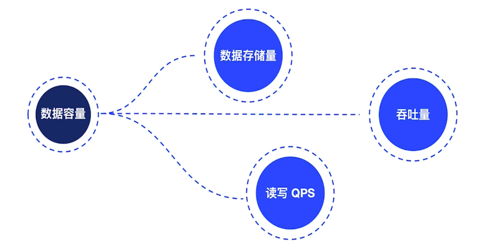

#### 1.业务的发展

>业务的发展，使数据容量持续爆发增长，数据容量不仅包括数据存储量，更重要的包括数据的吞吐量、读写QPS\TPS等。

#### 2.场景创新发展

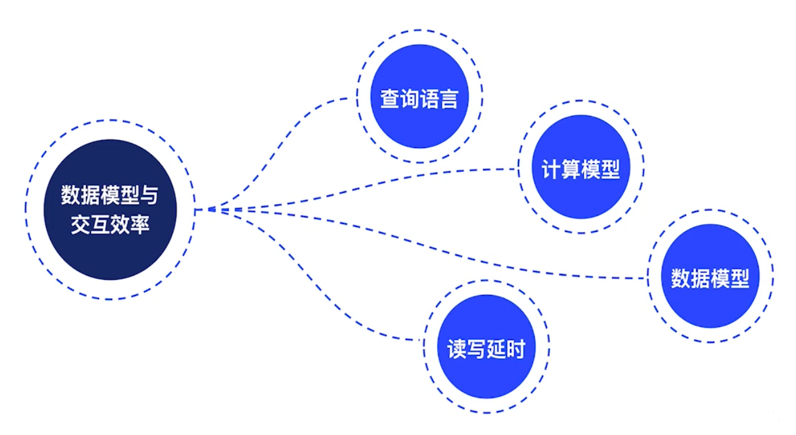

>场景创新发展，使得数据的交互效率与数据模型多样性，比如查询语言、计算模型、数据模型、读 写延时等。

#### 3.硬件与云计算发展

>硬件与云计算发展，带来了据架构的变迁上，比如读写分离、一体机、云原生等。

### 2、传统方案带来的痛点

#### 1.容量

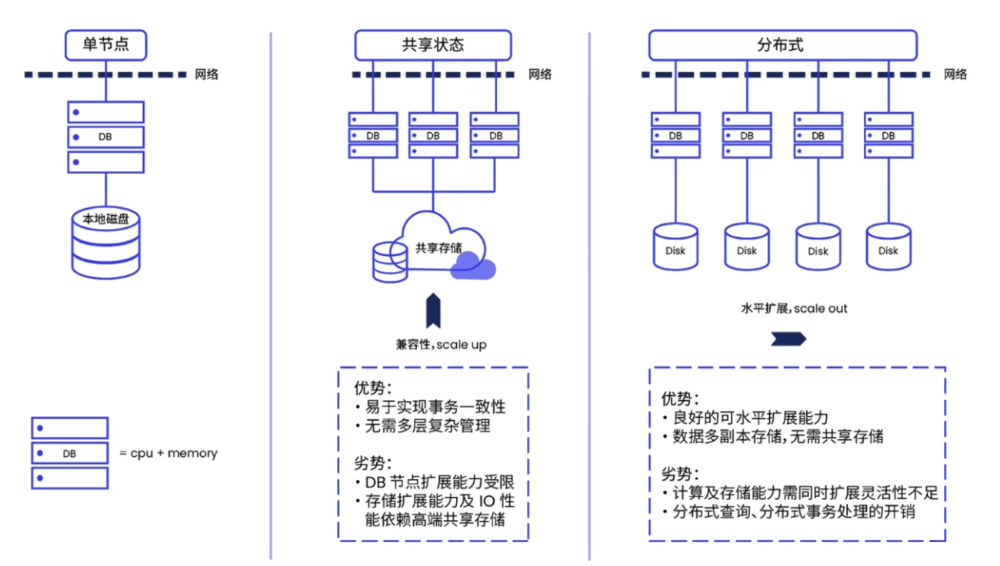

>单从数据容量的角度来看，数据库系统总是被动去适配业务数据量增长。在早期，业务数据量基本在几百GB时代，单节点本地磁盘是最高效的数据架构，单机关系型数据库是主流。
>
>随着数据量增加，人们可以通过加入更多CPU、更大内存、更快硬盘等升级硬件的方式来应对，也就是大家说的纵向扩展Scale up，包括引入网络存储（SAN）ShareDisk成了一种代表性的架构。
>
>但硬件的升级总是有上限，当数据量的增加速度远远超过了硬件升级速度，Scale up失效，只能通过分布式的（Share Nothing）架构来应对，也就是我们说的横向扩展Scale out。所以这个时期，分布式逐渐成为海量数据技术的代名词。

#### 2.多种数据存储处理需求

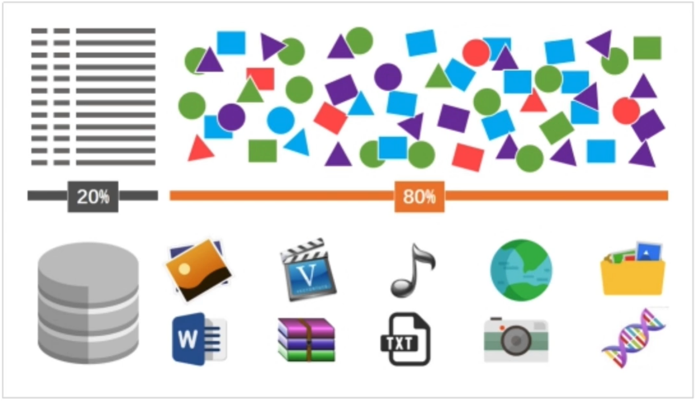

>早期，单机数据库查询使用标准SQL语言，支持事务，并绝大部分采用结构化的方式进行存储。2000年后，特别是伴随着移动互联网的发展，在很多场景下，结构化的存储方式慢慢显得力不从心，诸如Key-value、文本、图、时序数据、地理信息等非结构化数据的需求变得突出起来。于是就衍生出了NoSQL（Not Only SQL）数据库。
>
>伴随着NoSQL数据库的快速发展，又一个新的问题摆在我们面前。那就是大部分NoSQL数 据库对于事务无法支持。而事务对于OLTP场景是不可或缺的，也也就是为什么关系型数据库需求依然是当前的主流。
>
>于是，即要求支持事务（OLTP场景）又同时兼容多种数据模式的可扩展需求就自然提了出来。这就是NewSQL的由来。

#### 3.数据架构，融合还是细分？

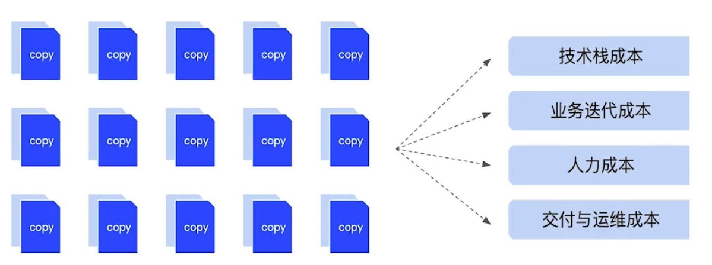

>场景创新催生了数据技术栈与产品的多样性。但同时，数据技术栈与产品多样性导致了数据副本无序扩大。以一个真实电商平台为例，一份商品订单数据在电商平台的整个业务链条里，存在30+份副本。而数据副本背后导致了巨大的技术栈成本、业务迭代时间成本、人力成本、交付与运维成本等。如何有效减少业务数据副本将是一个越来越重要的需求。

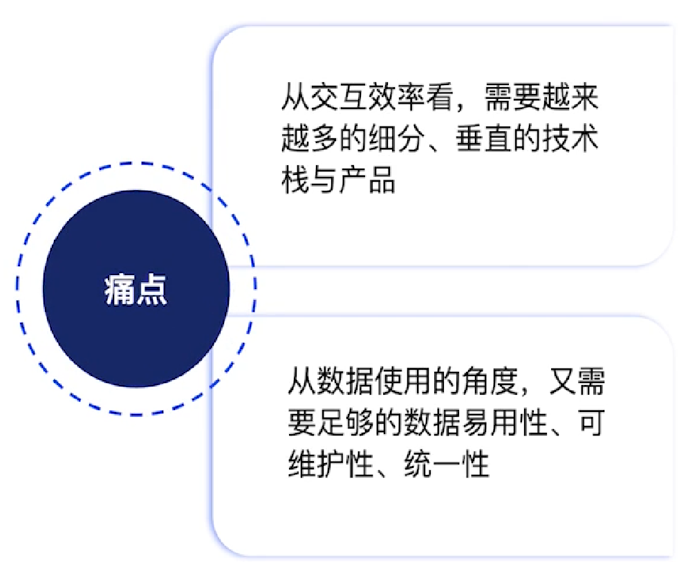

>一方面从交互效率看，需要越来越多的细分、垂直的技术栈与产品；另一方面，从数据使用的角度，又需要足够的数据易用性、可维护性、统一性。这两个真实的需求形成一个巨大的矛盾与痛点。企业数据化加速，业务创新加速，数据将会持续以指数级增长，如何解决这一个痛点，是未来数据技术很重要的一个课题，或许未来趋势将是数据技术的细分与数据服务的融合。

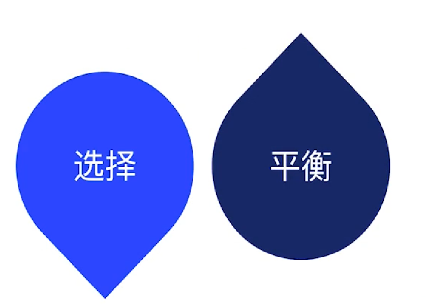

>总之，数据模型、数据结构、存储算法、复制协议、算子、计算模型、硬件构建了数据基础技术要素，而数据技术栈方向或者数据产品的本质是：应对不同业务场景，基于这些相对固定数据基础技术，进行数据架构Trade Off（选择与平衡）

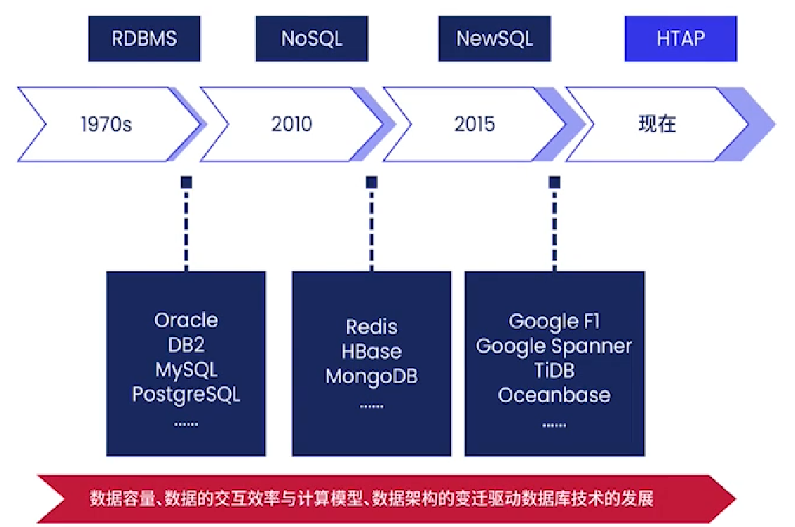

### 3、海量数据，给企业和个人带来的机遇

>预测当前机票在未来一段时间内的可能上涨还是下降
>
>推荐系统,从顾客关联到商品关联
>
>分析坐姿和行驶安全的关系，预测事故可能性，发出警示或者自动刹车
>
>汽车防盗系统，根据人体对座位的压力差异识别乘坐者的身份
>
>芝麻信用，金融风控
>
>手机GPS数据，向司机提供不同时段的最佳出行路线。城市计算
>
>只要是数据就可以拿来做：计算、对比，从而实现得到某个结果、参考、结论。

## 三、海量数据场景需要什么样的数据库

### 1、认识分布式技术

#### 1.摩尔定律

>1965 年高登·摩尔（Gordon Moore）提出了摩尔定律。核心观点是：集成电路上可以容纳的晶体管数目在大约每经过18个月便会增加一倍。
>
>换言之，处理器的性能每隔两年翻一倍，这就意味着，集中式系统的运算能力每隔一段时间能提升一倍。这里面隐含了另外一层意思：“如果你的系统需承载的计算量的增长速度大于摩尔定律的预测，集中式系统将无法承载你所需的计算量。” 这就是推动分布式系统发展的内因，另外，分布式系统的发展还有一个经济原因，用相对廉价机器的集合组成的分布式系统，除了可以获得超过CPU发展速度的性能外，并且具有更好的弹性，可以根据需要弹性增加或者减少机器的数量。
>
>那么，从2008 年后，数据与其背后的计算需求呈现了爆发增长，并且在可以预测的未来还会快速。基于此，分布式系统技术在工程界逐渐涌现了很多技术产品。

#### 2.什么是分布式系统

>分布式系统是一种其组件位于不同的联网计算机上的系统，然后通过互相传递消息来进行通信和协调。为了达到共同的目标，这些组件会相互作用。
>
>把需要进行大量计算的工程数据分割成小块，由多台计算机分别计算，然后将结果统一合并得出数据结论的科学。本质上就是进行数据存储与计算的“分治”。
>
>另外，假设每台机器出问题的概率是固定的，那么分布式系统里因为存在多台计算机，整体的故障率就会更高，为了解决分布式的高可用问题，就需要将数据进行副本冗余，分治和冗余讲究的都是分散化，最终形成一个完整的系统还需要将它们“协作”起来。获得分布式系统价值的同时，这个“再协作”的过程就是我们相比集中式系统要做的额外工作与成本。

#### 3.分布式系统代表产品

>2006 年，谷歌推出了GFS（Google FileSystem）、Google Bigtable、Google MapReduce三大组件。Google File System 解决了分布式文件系统问题，Google Bigtable 解决了分布式KV（Key-Value）存储的问题，Google MapReduce 解决了在分布式文件系统和分布式KV存储上面如何做分布式计算和分析的问题。
>
>谷歌三大件在业界诞生以后，很快的衍生了一个以分布式系统为基座的领域，并且针对非结构化、半结构化的海量数据处理系统，我们把他模糊称为NoSQL（Not OnlySQL），现在也有很多很好的商业公司基于NoSQL 发展，比如说文档数据（MongoDB）、缓存（Redis）等大家平常应用开发都会用到的NoSQL 系统。但这些只是分布式系统发展的上半场。稍后，我们会介绍分布式系统发展的下半场。

#### 4.分布式技术的主要挑战

>分布式系统的本质是分治与协助，这带来极大的系统复杂度，在技术层面挑战主要包括：
>1. 如何最大程度的实现分治
>2. 如何实现全局的一致性，包括序列化与全局时钟
>3. 如何进行故障与部分失效的容错
>4. 如何应对不可靠的网络与网络分区

#### 5.分布式系统里著名的CAP理论

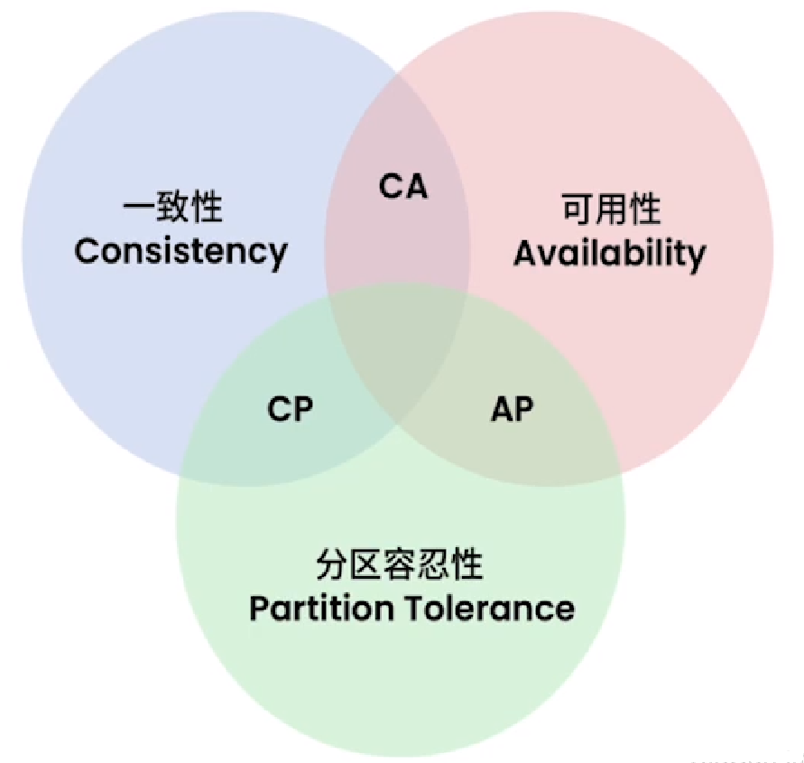

>2000 年初，计算机科学家埃里克·布鲁尔提出的一个定理。这个定理讲的是一个分布式系统最多只能同时满足一致性（Consistency）、可用性（Availability）和分区容错性（Partition tolerance）这三项中的两项。
>
>这就是臭名昭著的帽子理论：
>1. 一致性:所有节点在同一时间的数据完全一致。
>2. 可用性:服务在正常响应时间内一直可用。
>3. 分区容错性:指分布式系统在遇到某节点或网络分区故障的时候，仍然能够对外提供满足一致性或可用性的服务。
>
>按照这个定理，所有的分布式系统都会在这三点进行Trade Off（平衡与选择）。
>
>CAP理论在分布式存储系统中，最多只能实现上面的两点。而由于网络硬件肯定会出现延迟丢包等问题，所以分区容错性是我们必须需要实现的。所以我们只能在一致性和可用性之间进行权衡，没有NoSQL系统能同时保证这三点。对于web2.0网站来说，关系数据库的很多主要特性却往往无用武之地。
>
>数据库事务一致性需求:
>
>> 很多web实时系统并不要求严格的数据库事务，对读一致性的要求很低，有些场合对写一致性要求并不高。允许实现最终一致性。
>
>数据库的写实时性和读实时性需求:
>
>> 对关系数据库来说，插入一条数据之后立刻查询，是肯定可以读出来这条数据的，但是对于很多web应用来说，并不要求这么高的实时性，比方说发一条消息之后，过几秒乃至十几秒之后，我的订阅者才看到这条动态是完全可以接受的。

#### 6.关系模型和事务

>我们再聊一下关系型数据库，虽然现在各种模型的数据库越来越多，但同时，在传统的在线交易场景（OLTP)中，关系型模式仍然是标准，按照DB-Engines 的报告，2021 年，关系型数据库在整个数据库模型中权重上仍然占比72.8%。
>
>既然是关系型，就一定要具有事务，事务的本质是“并发控制的单元，是用户定义的一个操作序列。这些操作要么都做，要么都不做，是一个不可分割的工作单位”。说白了就是为了保证系统始终处于一个完整且正确的状态。它要具备大家熟知ACID 四个特性。
>
>总结一下，分布式系统通过扩展性应对了数据的容量、关系型模型仍然是市场需求最强数据模型，那有没有哪种数据库来同时解决这两个问题呢？

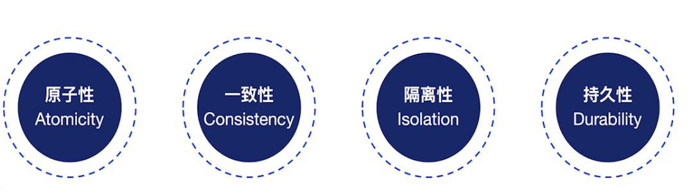

#### 7.NewSQL ：原生分布式关系型数据库


>NewSQL 是个概念，从实现路径上，主要是分布式系统+ SQL + 事务，也就是原生分布式关系型数据库。所以原生分布式关系型数据库，某种意义上讲是NewSQL 的代名词。
>
>那么这么强大的分布式关系型数据库是如何产生的呢？这个领域的代表产品又是哪个呢？

### 2、TiDB解决方案应该考虑的事情

>之前的章节我们讨论数据库、大数据的发展历史，也阐述了，数据技术发展内在驱动是：业务发展、场景创新、硬件与云计算发展。
>
>那么如果我们在当下重新设计一个数据库，我们主要的考量点是什么？哪些是这个数据库Must have功能，哪些又是Better have 能力呢？
>
>>弹性扩展
>>强一致高可用
>>标准SQL
>>事务ACID
>>兼容主流协议
>>云原生
>>HTAP

#### 1.弹性扩展

>Scale out 也就是我们经常听到的弹性横向扩展里面还包括两个关键点：
>
>>1. 从弹性的角度看，颗粒度越小越好，常见的颗粒度有Cluster、Database、Schema、表、分表或者分区表。那我们能不能设计一个比分区更小的颗粒度呢？
>>>1. 数据库写入是昂贵资源，我们一定要面向写入能力的线性扩展机制。
>

#### 2.强一致高可用

>1. 这里的强一致指的是CAP理论的一致性，也就是副本一致性，也就是每一份新增数据都会在多个物理节点保存，节点数量和网络延迟是正向关系，理论上保存的节点越多，写入延迟就越高，所以在分布式系统里，普遍采用了多数派强一致。最常见的是，强制写入两个节点。
>2. 这个强一致属性对于我们比较核心的业务，比如金融类场景，能做到更好的数据容灾。这里面还有两个概念：
>  a. RPO（Recovery Point Objective）即数据恢复点目标，主要指的是业务系统所能容忍的数据丢失量。
>     b. RTO（Recovery Time Objective）即恢复时间目标，主要指的是所能容忍的业务停止服务的最长时间，也就是 从灾难发生到业务系统恢复服务功能所需要的最短时间周期。
>3. 强一致与高可用这两个概念，等价过来，就是实现RPO=0，RTO 足够小，一般和网络环境相关，目前工程层面普遍在若干秒级。

#### 3.标准SQL事务ACID

>1. SQL 因为高度易用性，已经是数据交互语言的事实标准。
>2. 在很多场景下，尤其是线业务场景OLTP，完整事务仍然是必须项。

#### 4.云原生

>由于计算与存储的高度分离架构设计，使得云场景中基于资源的弹性设计成为可能

#### 5.HTAP

>1. 必须是基于解决数据容量的前提下，也就是在海量数据的OLTP 与OLAP 的数据服务；
>2. 行列混合，同时也具备更彻底的资源隔离；

#### 6.兼容主流生态与协议

>站在用户的角度，兼容主流生态与协议，可以大大降低使用门槛与成本。

### 3、数据库技术栈-常见基础因素有哪些？

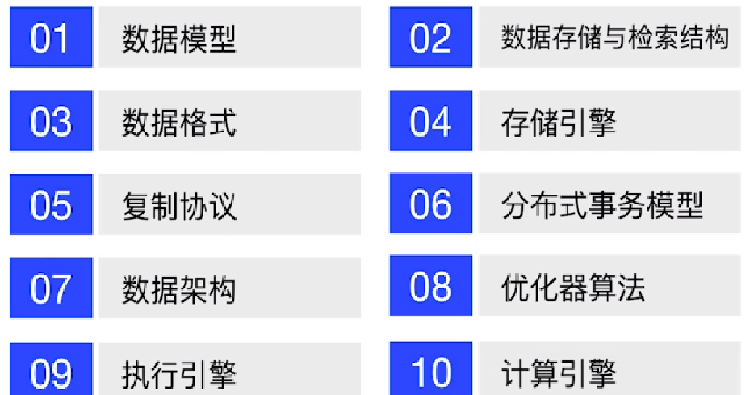

>同时我们在之前也提到，数据技术栈与架构的本质是，在相对固定的基础数据技术元素上进行各种选择、平衡与优化（trade off），结合上面我们讲到的数据架构设计目标，我们可以先笼统的去考虑下都需要哪些基础数据技术元素？

>1. 数据模型：包括关系模型、文档模型、Key-Value 模型等。
>2. 数据存储与检索结构：包括数据结构、索引结构，常见B-tree、LSM-tree 等。
>3. 数据格式（Data format）：数据在存储引擎的格式，一般分为关系型和非关系型。
>4. 存储引擎（Storage engine）：负责数据的存取和持久化存储，比如Innodb、Rockdb 等。
>5. 复制协议（Replication）：为了保证数据可用性，复制协议与算法，常见的Raft、Paxos 等。
>6. 分布式事务模型：是事务处理时的并发控制方法，以保证可串行化。常见模型有XA、TCC、Percolator 等。
>7. 数据架构（Data Architecture）：一般指多个计算引擎共享一份数据，或者每个计算引擎都有一份数据，常见有Share-Nothing、Share-Disk 等。
>8. 优化器算法（Optimizer）：根据数据分布、数据量和统计信息，生成成本最低的执行计划。
>9. 执行引擎（Execution Engine）：比如火山模型、向量化、大规模并行计算等。
>10. 计算引擎（Computer engine）：负责SQL 语句接口，解析生成执行计划并发送给存储引擎来执行，同时大部分计算引擎具有缓存数据的功能。

### 4、TiDB 需要应用到什么场景？

>海量数据高并发OLTP系统
>海量数据高性能Real-Time Insights &
>Experiences实时分析
>多源高吞吐汇总与实时计算
>高写入场景
>金融级别多数据中心多活
>云数据库（DBaaS）

### 5、TIDB如何实现高度分层？

#### 1.计算与存储分离

>提到数据架构，你一定经常听到“计算与存储分离”，那这背后的逻辑是什么呢？
>
>在前面的章节，我们提过数据技术驱动第三个内因是“硬件与云计算的发展”。
>
>让我们回到2000 年左右，当时的主流网络带宽只有百兆，那个时期主流数据库是单机架构（冯诺依曼架构）计算与存储紧密在一起，Google GFS（分布式文件系统）尝试用普通的x86 机器和普通硬盘搭建了大规模存储系统，但受限于网络带宽问题，所以将计算的代码移动到存储层，而不是将数据传输到计算节点。
>
>在后面，网络硬件发生了很大的发展，带宽迅速完成从百兆、千兆、到万兆进化，稳定性也在持续加强。延迟也在大大的降低，同时各种高效的压缩算法进一步减少了磁盘IO与网络IO。
>
>在这种背景下，存储和计算强耦合的方式，开始展现一些弊端：
>
>1. 计算与存储强绑定，意味着两种资源总有一个是浪费的。
>2. 我们在对服务器进行选型的过程中，开始纠结是计算型、还是存储型，大大增加复杂度和降低通用性。
>3. 在云计算场景下，弹性的颗粒度是机器，不能真正做到资源的弹性。
>
>到了云时代，基于高性能的网络的块存储（EBS）开始替换主机存储成为主流，计算和存储耦合架构更加不合理，存储和计算分离的架构开始进一步普及。

#### 2.TiDB 高度分层架构

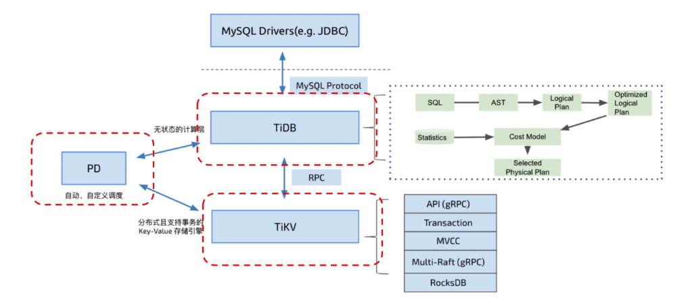

>TiDB 的弹性是整个架构设计的核心考量点，所以选择了更为未来的计算与存储分离的架构，从逻辑上看，主要分为三层

##### 1)TiDB-Server

>支持标准SQL的计算引擎TiDB-Server
>
>这里面有一个概念，大家可能会混淆，TiDB 是整个数据库的名称，同时TiDB 有一个兼容MySQL 的计算引擎TiDB-Server，兼容以MySQL 5.7 为主，在逐步兼容MySQL8.0。包括在TiDB Server 支持MySQL 的协议，语法，方言语法，DDL/DML，系统变量，内置功能，SQL Mode以及类型推导等等。

##### 2)TiKV

>分布式存储引擎TiKV
>
>TiDB Server 本身并不存储数据，只是进行计算，实际的数据存储在存储层，也就是TiKV

##### 3)Placement Driver

>负责元信息管理与调度的，调度引擎Placement Driver ，简称PD ，PD 主要有几个功能：
>
>>a. 集群的元信息管理模块，注意这里的元信息，指的是分片（Region）的数据分布、以及集群拓扑结构，不是指的数据库里的Schema信息
>>b. 分布式事务ID 的分配，可以简单理解为，全局唯一序列。
>>c. 调度中心，默认每个TiKV 节点会在一个周期内发送节点相关数据给PD，包括Region 数量、Leader 数量、最近周期内读写量等，PD 接受后，会进行计算，然后发出再平衡调度，比如将部分Region 从Region 数量较多节点调度到Region 较少的节点上。所以说，PD 是整个集群的大脑，为了保持全局高可用，PD也至少三个节点，通过Raft 进行三副本复制。

## 四、 TiDB体系结构--分布式存储架构TIKV设计

### 1、TiKV中数据如何进行组织存储

#### 1.传统B+Tree数据结构

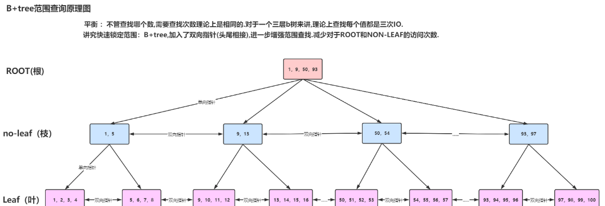

>首先，我们以键-值对（key-value）数据的索引开始，key-value类型并不是唯一可以索引的数据，但它非常简单随处可见，而且是其他更复杂索引的基础构件模块。
>
>数据结构，在传统的单机关系数据库里，最常见的索引结构是B-tree。但最近几年出现了一个很有吸引力的引擎是LSM-tree（LogStructuredMergeTree），如何选择？还是回到业务场景本身。在传统的OLTP系统里，写入是最昂贵的成本。
>
>B-tree索引必须至少写两次数据，一次是预写日志（WAL)，一次是写入树本身；我们需要通过索引加速一次特定查询，就需要创建一个B-tree索引。
>
>B-tree是一个严格平衡的数据结构，它的设计是对读友好，数据写入触发的B-tree的分裂与在平衡成本也非常高。也就是B-tree对写入相对不友好。
>
>传统的主从（Master-slave）架构里，不管你加多少从节点，集群的写入容量都没法扩展，集群的写入容量完全由主库的机器配置决定；扩展只能通过非常昂贵的集群拆分（分库概念）。

#### 2.TiKV LSM Ttree数据结构

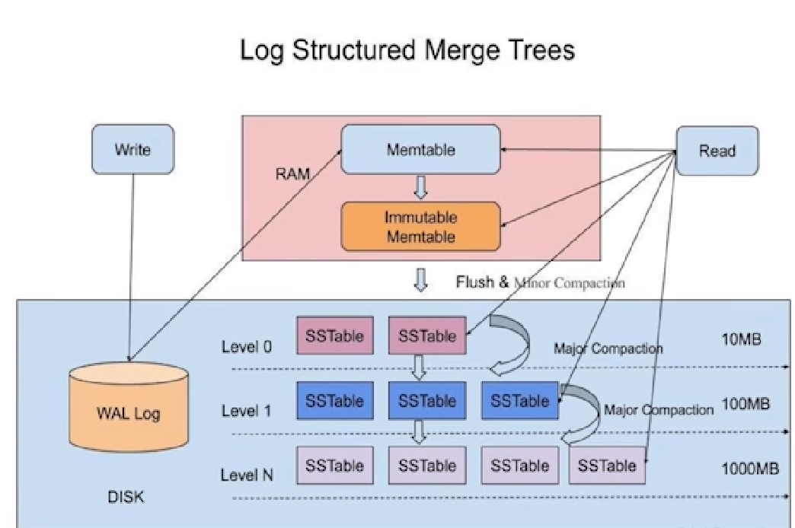

>之前我们说过，数据容量更体现在写入吞吐量，分布式系统面对的场景是写入越来越大，基于此，我们选择了LSM-tree结构，简单来说，它对写入采取了顺序写的方式，写入到一定阈值后，持久化成一个静态文件，随着写入的越来越大，生产的静态文件会被推到下一层进行再合并（Compaction）。本质上它是一个用空间置换写入延迟，用顺序写入替换随机写入。
>
>所以，TiKV单节点选择了基于LSM-tree的RocksDB引擎。RockDB是一款非常成熟的LSM-tree存储引擎，支持批量写入（Atomicbatchwrite）、无锁快照读（Snapshot）。

### 2、TiKV如何做到更细粒度弹性扩容(分片)

>数据分片是分布式数据库的关键设计,如果要是实现扩展，从底层技术看，就是做分片，分片最重 要的区别，是在于预先分片（静态），还是自动分片（动态），传统分库分表或者分区的方案都 是预先分片，比如提前创建100个分表，属于静态分片，这种分片只解决表容量的问题，没有解 决弹性的问题。所以，第一点，我们要优先使用自动分片算法。第二，分片总是需要一个维度和算法，比较常见的是:
>
>>哈希（hash）
>>范围（range）
>>列举（list）
>
>在TiKV系统里，采用了Range算法,类似“Where age>=30”，这种范围查询在OLTP业务是非常常见场景，在这个场景下，而Range分片可以更高效地扫描数据记录，而Hash分片由于数据被打散，扫描操作的I/O开销更大,Range分片可以简单实现自动完成分裂与合并,弹性优先，分片需要可以自由调度。

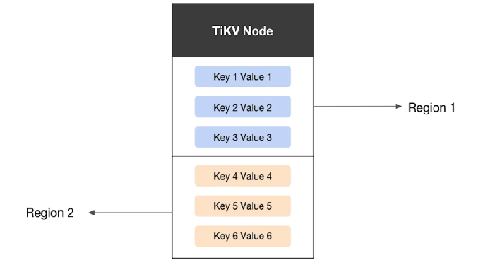

>一个非常重要的概念：Region，Region是理解后续一系列机制的基础。我们将TiKV看做一个巨大的有序的KVMap，我们通过range的方式，将整个Key-Value空间分成很多段，每一段是一系列连续的Key，我们将每一段叫做一个Region，并且我们会尽量保持每个Region中保存的数据不超过一定的大小(这个大小可以配置，目前默认是96MB)。每一个Region 都可以用StartKey到EndKey这样一个左闭右开区间来描述。

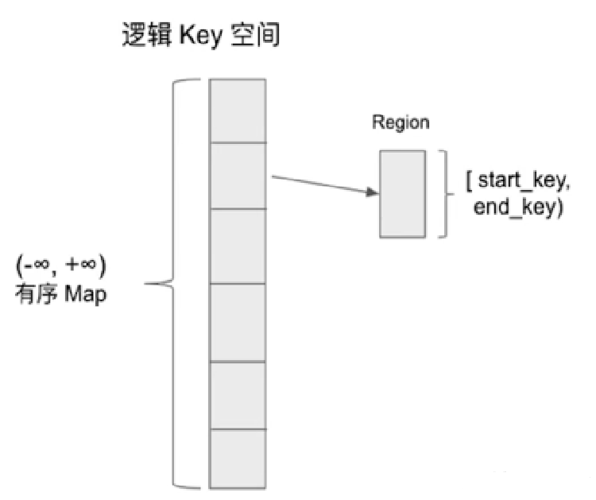


>当某个Region的大小超过一定限制（默认是144MB）后，TiKV会将它分裂为两个或者更多个Region，以保证各个Region的大小是大致接近的，这样更有利于PD进行调度决策。同样的，当 某个Region因为大量的删除请求导致Region的大小变得更小时，TiKV会将比较小的两个相邻Region合并为一个。
>
>同时为了保证上层客户端能够访问所需要的数据，我们的系统中也会有一个组件记录Region在节 点上面的分布情况，也就是通过任意一个Key就能查询到这个Key在哪个Region中，以及这个Region目前在哪个节点上。以Region为单位做数据的分散。

### 3、TiKV如何做到高并发读写

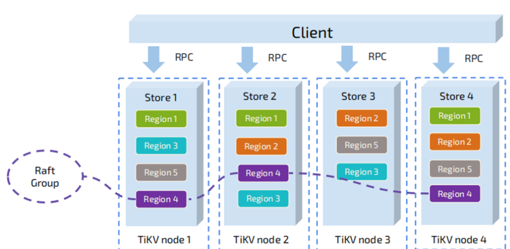

### 4、TIDB如何保证多副本最终一致性和副本高可用

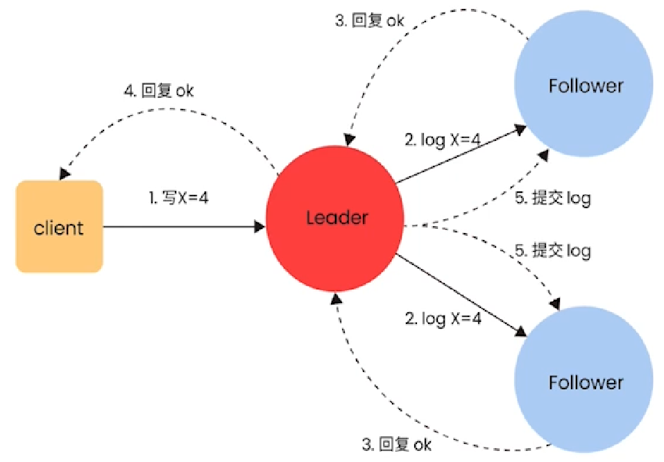

### 5、详解Raft协议原理

>Raft算法通过先选出leader节点、有序日志等方式，简化了流程、提高效率，并通过约束减少了不确定性的状态空间。相对Paxos逻辑更清晰，容易理解与工程化实现。

### 6、PD Cluster的功能

>1. 集群的信息（集群拓扑、集群状态、region信息）
>2. 协调、统一配置管理 --pd='IP:2379'

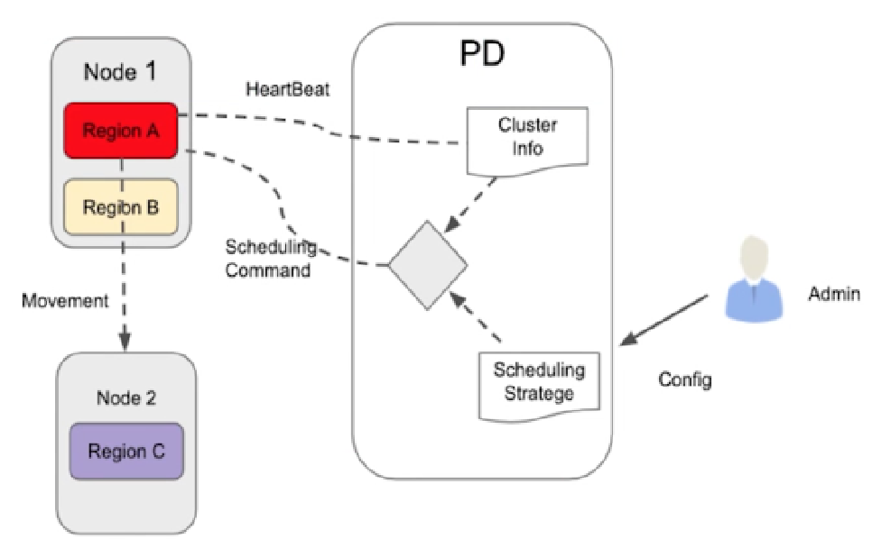

### 7、TiDB 分布式事务介绍

#### 1.TiDB 事务概览

>TiDB 支持分布式事务，提供乐观事务与悲观事务两种事务模型。TiDB 3.0.8 及以后版本，TiDB 默认采用悲观事务模型。
>
>常用的变量包括:
>
>>autocommit
>>tidb_disable_txn_auto_retry
>>tidb_retry_limit
>>tidb_txn_mode

#### 2.TiDB 事务常用语句

##### 1）开启事务

```mysql
BEGIN;
START TRANSACTION;
START TRANSACTION WITH CONSISTENT SNAPSHOT;
START TRANSACTION WITH CAUSAL CONSISTENCY ONLY;
```

**注意**

>TiDB和MySQL不同的是，TiDB在执行完上述语句后,即会获取当前数据库快照，而MySQL的BEGIN 和 STARTTRANSACTION 是在开启事务后的第一个从 InnoDB 读数据的 SELECT 语句（非 SELECT FOR UPDATE）后获取快照，START TRANSACTION WITH CONSISTENTSNAPSHOT 是语句执行时获取快照。因此，TiDB 中的BEGIN、START TRANSACTION 和 STARTTRANSACTION WITH CONSISTENT SNAPSHOT 都等效为 MySQL 中的 START TRANSACTION WITHCONSISTENT SNAPSHOT。

##### 2)提交和回滚事务

>COMMIT 语句用于提交 TiDB 在当前事务中进行的所有修改。
>ROLLBACK 语句用于回滚并撤销当前事务的所有修改。

##### 3)自动提交:

>为满足 MySQL 兼容性的要求，在默认情况下，TiDB将在执行语句后立即进行 autocommit（自动提交）。
>autocommit 是一个系统变量，可以基于 Session或 Global 进行修改。
>如下：
>SET autocommit = 0;
>SET GLOBAL autocommit = 0;

**举例：**

```mysql
mysql> CREATE TABLE t1 ( id INT NOT NULL PRIMARY KEY auto_increment, pad1 VARCHAR(100));
Query OK, 0 rows affected (0.09 sec)
mysql> SELECT @@autocommit;
+--------------+
| @@autocommit |
+--------------+
| 1 |
+--------------+
1 row in set (0.00 sec)
mysql> INSERT INTO t1 VALUES (1, 'test');
Query OK, 1 row affected (0.02 sec)
mysql> ROLLBACK;
Query OK, 0 rows affected (0.01 sec)
mysql> SELECT * FROM t1;
+----+------+
| id | pad1 |
+----+------+
| 1 | test |
+----+------+
1 row in set (0.00 sec)
```

>以上示例中，ROLLBACK 语句没产生任何效果。由于INSERT 语句是在自动提交的情况下执行的，等同于以下单语句事务：

```mysql
START TRANSACTION;
INSERT INTO t1 VALUES (1, 'test');
COMMIT;
```

>如果已显式地启动事务，则不适用自动提交。以下示例，ROLLBACK 语句成功撤回了 INSERT 语句：

```mysql
mysql> CREATE TABLE t2 (id INT NOT NULL PRIMARY KEY auto_increment, pad1 VARCHAR(100));
Query OK, 0 rows affected (0.10 sec)
mysql> SELECT @@autocommit;
+--------------+
| @@autocommit |
+--------------+
| 1            |
+--------------+
1 row in set (0.00 sec)
mysql> START TRANSACTION;
Query OK, 0 rows affected (0.00 sec)
mysql> INSERT INTO t2 VALUES (1, 'test');
Query OK, 1 row affected (0.02 sec)
mysql> ROLLBACK;
Query OK, 0 rows affected (0.00 sec)
mysql> SELECT * FROM t2;
Empty set (0.00 sec)
```

##### 4)显式事务和隐式事务

>有些语句是隐式提交的。例如，执行 [BEGIN|START TRANCATION] 语句时，TiDB 会隐式提交上一个事务，并开启一个新的事务以满足 MySQL 兼容性的需求。详情参见implicit commit。
>
>TiDB 可以显式地使用事务（通过 [BEGIN|START TRANSACTION]/COMMIT 语句定义事务的开始和结束）或者隐式地使用事务 (SET autocommit = 1)。
>
>在自动提交状态下，使用 [BEGIN|START TRANSACTION] 语句会显式地开启一个事务，同时也会禁用自动提交，使隐式事务变成显式事务。直到执行 COMMIT或 ROLLBACK 语句时才会恢复到此前默认的自动提交状态。
>
>对于 DDL 语句，会自动提交并且不能回滚。如果运行 DDL 的时候，正在一个事务的中间过程中，会先自动提交当前事务，再执行 DDL。

##### 5）惰性检查

>执行 DML 语句时，乐观事务默认不会检查主键约束或唯一约束，而是在 COMMIT 事务时进行这些检查。

```mysql
CREATE TABLE t1 (id INT NOT NULL PRIMARY KEY);
INSERT INTO t1 VALUES (1);
BEGIN OPTIMISTIC;
INSERT INTO t1 VALUES (1); -- MySQL 返回错误；TiDB 返回成功。
INSERT INTO t1 VALUES (2);
COMMIT; -- MySQL 提交成功；TiDB 返回错误，事务回滚。
SELECT * FROM t1; -- MySQL 返回 1 2；TiDB 返回 1。
```

>惰性检查优化通过批处理约束检查并减少网络通信来提升性能。
>
>可以通过设置:
>tidb_constraint_check_in_place = TRUE 禁用该行为。

**注意**

>本优化仅适用于乐观事务。
>本优化仅对普通的 INSERT 语句生效，对 INSERT IGNORE 和 INSERT ON DUPLICATE KEY UPDATE 不会生效。

##### 6)事务限制:

>由于底层存储引擎的限制，TiDB 要求单行不超过6MB。可以将一行的所有列根据类型转换为字节数并加和来估算单行大小。
>
>TiDB 同时支持乐观事务与悲观事务，其中乐观事务是悲观事务的基础。由于乐观事务是先将修改缓存在私有内存中，因此，TiDB 对于单个事务的容量做了限制。
>
>TiDB 中，单个事务的总大小默认不超过 100 MB，这个默认值可以通过配置文件中的配置项 txn-total-size-limit 进行修改，最大支持 10 GB。实际的单个事务大小限制还取决于服务器剩余可用内存的大小，执行事务时 TiDB 进程的内存消耗大约是事务大小的 6 倍以上。
>
>在 4.0 以前的版本，TiDB 限制了单个事务的键值对的总数量不超过 30 万条，从4.0 版本起 TiDB 取消了这项限制。

**注意**

>通常，用户会开启 TiDB Binlog 将数据向下游进行同步。某些场景下，用户会使用消息中间件来消费同步到下游的 binlog，例如 Kafka。
>
>以 Kafka 为例，Kafka 的单条消息处理能力的上限是 1 GB。因此，当把 txn-total-size-limit 设置为 1 GB 以上时，可能出现事务在 TiDB 中执行成功，但下游 Kafka 报错的情况。为避免这种情况出现，请用户根据最终消费者的限制来决定 txn-total-size-limit的实际大小。
>
>例如：下游使用了 Kafka，则 txn-total-size-limit 不应超过 1 GB。

### 8、TiDB 事务隔离级别

>事务隔离级别是数据库事务处理的基础，ACID 中的“I”，即 Isolation，指的就是事务的隔离性。
>
>SQL-92 标准定义了 4 种隔离级别：读未提交(READ UNCOMMITTED)、读已提交 (READ COMMITTED)、可重复读 (REPEATABLE READ)、串行化(SERIALIZABLE)。详见下表：

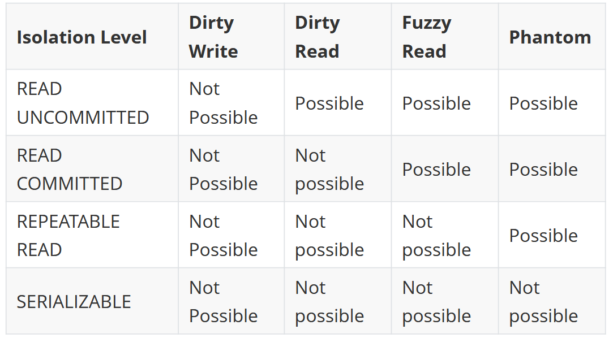

>TiDB 实现了快照隔离 (Snapshot Isolation,SI) 级别的一致性。为与 MySQL 保持一致，又称其为“可重复读”。该隔离级别不同于 ANSI 可重复读隔离级别和MySQL 可重复读隔离级别。

**注意**

>在 TiDB v3.0 中，事务的自动重试功能默认为禁用状态。不建议开启自动重试功能，因为可能导致事务隔离级别遭到破坏。更多关于事务自动重试的文档说明，请参考事务重试。
>
>从 TiDB v3.0.8 版本开始，新创建的 TiDB 集群会默认使用悲观事务模式，悲观事务中的当前读（forupdate 读）为不可重复读.
>
>当事务隔离级别为可重复读时，只能读到该事务启动时已经提交的其他事务修改的数据，未提交的数据或在事务启动后其他事务提交的数据是不可见的。对于本事务而言，事务语句可以看到之前的语句做出的修改。
>
>对于运行于不同节点的事务而言，不同事务启动和提交的顺序取决于从 PD 获取时间戳的顺序。处于可重复读隔离级别的事务不能并发的更新同一行，当事务提交时发现该行在该事务启动后，已经被另一个已提交的事务更新过，那么该事务会回滚。

### 9、TiDB 乐观事务模型

#### 1.乐观事务工作过程详解

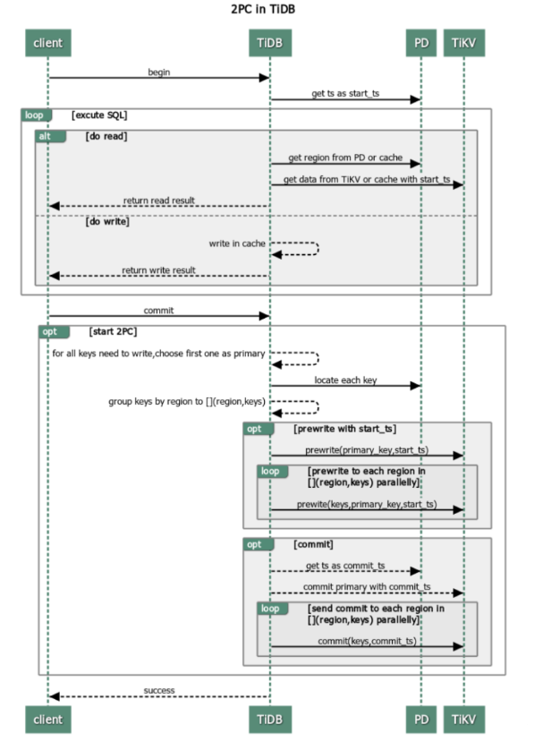

##### 1）客户端开始一个事务

>TiDB 从 PD 获取一个全局唯一递增的时间戳作为当前事务的唯一事务 ID，这里称为该事务的 start_ts。
>TiDB 实现了多版本并发控制 (MVCC)，因此 start_ts同时也作为该事务获取的数据库快照版本。该事务只能读到此 start_ts 版本可以读到的数据。

##### 2）客户端发起读请求

>TiDB 从 PD 获取数据路由信息，即数据具体存在哪个TiKV 节点上。
>TiDB 从 TiKV 获取 start_ts 版本下对应的数据。

##### 3）客户端发起写请求

>TiDB 校验写入数据是否符合约束（如数据类型是否正确、是否符合非空约束等）。校验通过的数据将存放在 TiDB中该事务的私有内存里。

##### 4）客户端发起 commit

##### 5）TiDB 开始两阶段提交，在保证事务原子性的前提下，进行数据持久化。

>TiDB 从当前要写入的数据中选择一个 Key 作为当前事务的 Primary Key。
>
>TiDB 从 PD 获取所有数据的写入路由信息，并将所有的Key 按照所有的路由进行分类。
>
>TiDB 并发地向所有涉及的 TiKV 发起 prewrite 请求。
>
>TiKV 收到 prewrite 数据后，检查数据版本信息是否存在冲突或已过期。符合条件的数据会被加锁。
>
>TiDB 收到所有 prewrite 响应且所有 prewrite 都成功。
>
>TiDB 向 PD 获取第二个全局唯一递增版本号，定义为本次事务的 commit_ts。
>
>TiDB 向 Primary Key 所在 TiKV 发起第二阶段提交。
>
>TiKV 收到 commit 操作后，检查数据合法性，清理prewrite 阶段留下的锁。

##### 6）TiDB 收到两阶段提交成功的信息。

##### 7）TiDB 向客户端返回事务提交成功的信息。

>TiDB 异步清理本次事务遗留的锁信息。

#### 2.优缺点分析

>通过分析 TiDB 中事务的处理流程，可以发现 TiDB 事务有如下优点：
>
>- 实现原理简单，易于理解。
>- 基于单实例事务实现了跨节点事务。
>- 锁管理实现了去中心化。
>
>但 TiDB 事务也存在以下缺点：
>
>- 两阶段提交使网络交互增多。
>- 需要一个中心化的分配时间戳服务。
>- 事务数据量过大时易导致内存暴涨。

#### 3.事务的重试

>使用乐观事务模型时，在高冲突率的场景中，事务容易发生写写冲突而导致提交失败。MySQL 使用悲观事务模型，在执行写入类型的 SQL 语句的过程中进行加锁并且在Repeatable Read 隔离级别下使用了当前读的机制，能够读取到最新的数据，所以提交时一般不会出现异常。为了降低应用改造难度，TiDB 提供了数据库内部自动重试机制.
>
>当事务提交时，如果发现写写冲突，TiDB 内部重新执行包含写操作的 SQL 语句。你可以通过设置tidb_disable_txn_auto_retry = OFF 开启自动重试，并通过 tidb_retry_limit 设置重试次数:
>
>```mysql
>
># 设置是否禁用自动重试，默认为 “on”，即不重试。
>tidb_disable_txn_auto_retry = OFF
>
># 控制重试次数，默认为 “10”。只有自动重试启用时该参数才会生效。
># 当 “tidb_retry_limit= 0” 时，也会禁用自动重试。
>tidb_retry_limit = 10
>
>可以修改当前 Session 或 Global 的值：
># Session 级别设置：
>
>SET tidb_disable_txn_auto_retry = OFF;
>SET tidb_retry_limit = 10;
>
># Global 级别设置：
>SET GLOBAL tidb_disable_txn_auto_retry = OFF;
>SET GLOBAL tidb_retry_limit = 10;
>```

#### 4.冲突检测

>作为一个分布式系统，TiDB 在内存中的冲突检测是在 TiKV 中进行，主要发生在 prewrite 阶段。因为TiDB 集群是一个分布式系统，TiDB 实例本身无状态，实例之间无法感知到彼此的存在，也就无法确认自己的写入与别的 TiDB 实例是否存在冲突，所以会在 TiKV 这一层检测具体的数据是否有冲突。

>具体配置如下：
>
>scheduler 内置一个内存锁机制，防止同时对一个Key 进行操作。
>
>每个 Key hash 到不同的 slot。（默认为2048000）
>scheduler-concurrency = 2048000
>当 Scheduler latch wait duration 的值特别高时(如下图)，说明大量时间消耗在等待锁的请求上。如果不存在底层写入慢的问题，基本上可以判断该段时间内冲突比较多。

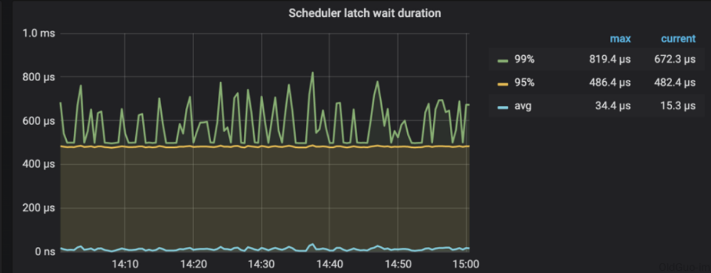

### 10、TiDB 悲观事务模型

#### 1.介绍

>为了使 TiDB 的使用方式更加贴近传统数据库，降低用户迁移的成本，TiDB 自 v3.0 版本开始在乐观事务模型的基础上支持了悲观事务模型。本文将介绍 TiDB 悲观事务的相关特性。
>
>自 v3.0.8 开始，新创建的 TiDB 集群默认使用悲观事务模型。但如果从 v3.0.7 版本及之前创建的集群升级到 >= v3.0.8 的版本，则不会改变默认的事务模型，即只有新创建的集群才会默认使用悲观事务模型。

#### 2.事务模式的修改方法

>可以使用 tidb_txn_mode 系统变量设置事务模式。执行以下命令，即可使整个集群中所有新创建session 执行的所有显示事务（即非 autocommit 的事务）进入悲观事务模式：
>
>SET GLOBAL tidb_txn_mode = 'pessimistic';
>
>除此之外，还可以执行以下 SQL 语句显式地开启悲观事务：
>
>BEGIN PESSIMISTIC;
>BEGIN /*T! PESSIMISTIC */;
>BEGIN PESSIMISTIC; 和 BEGIN OPTIMISTIC;
>
>BEGIN语句的优先级高于 tidb_txn_mode 系统变量。使用这两个语句开启的事务，会忽略系统变量，从而支持悲观、乐观事务混合使用。

#### 3.悲观事务模式的行为

>悲观事务的行为和 MySQL 基本一致:
>
>UPDATE、DELETE 或 INSERT 语句都会读取已提交的最新数据来执行，并对所修改的行加悲观锁。
>
>SELECT FOR UPDATE 语句会对已提交的最新的数据而非所修改的行加上悲观锁。
>
>悲观锁会在事务提交或回滚时释放。其他尝试修改这一行的写事务会被阻塞，等待悲观锁的释放。其他尝试读取这一行的事务不会被阻塞，因为 TiDB 采用多版本并发控制机制(MVCC)。
>
>如果多个事务尝试获取各自的锁，会出现死锁，并被检测器自动检测到。其中一个事务会被随机终止掉并返回兼容 MySQL 的错误码 1213。
>
>通过 innodb_lock_wait_timeout 变量，设置事务等锁的超时时间（默认值为 50，单位为秒）。等锁超时后返回兼容 MySQL 的错误码 1205。如果多个事务同时等待同一个锁释放，会大致按照事务 start ts 顺序获取锁。
>
>乐观事务和悲观事务可以共存，事务可以任意指定使用乐观模式或悲观模式来执行。
>
>支持 FOR UPDATE NOWAIT 语法，遇到锁时不会阻塞等锁，而是返回兼容 MySQL 的错误码 3572。
>
>如果 Point Get 和 Batch Point Get 算子没有读到数据，依然会对给定的主键或者唯一键加锁，阻塞其他事务对相同主键唯一键加锁或者进行写入操作。

#### 4. MySQL InnoDB 的差异

##### 1）不支持间隙锁

>有些 WHERE 子句中使用了 range，TiDB 在执行这类 DML 语句和 SELECT FOR UPDATE 语句时，不会阻塞 range 内并发的 DML 语句的执行。

```mysql
CREATE TABLE t1 (
  id INT NOT NULL PRIMARY KEY,
  pad1 VARCHAR(100)
);
INSERT INTO t1 (id) VALUES (1),(5),(10);
```

```mysql
BEGIN /*T! PESSIMISTIC */;
SELECT * FROM t1 WHERE id BETWEEN 1 AND 10 FOR UPDATE;
```

```mysql
BEGIN /*T! PESSIMISTIC */;
INSERT INTO t1 (id) VALUES (6); -- 仅MySQL 中出现阻塞。
UPDATE t1 SET pad1='new value' WHERE id= 5; -- MySQL 和 TiDB 处于等待阻塞状态。
```

>产生这一行为是因为 TiDB 当前不支持 gap locking（间隙锁）。

##### 2）不支持 SELECT LOCK IN SHARE MODE

>使用这个语句执行的时候，效果和没有加锁是一样的，不会阻塞其他事务的读写。

##### 3)DDL 可能会导致悲观事务提交失败

>MySQL 在执行 DDL 语句时，会被正在执行的事务阻塞住，而在 TiDB 中 DDL 操作会成功，造成悲观事务提交失败： ERROR 1105 (HY000): Information schema is changed. [try again later] 。
>
>TiDB事务执行过程中并发执行 TRUNCATE TABLE 语句，可能会导致事务报错 table doesn't exist 。

##### 4）快照可读性查看新增表

>START TRANSACTION WITH CONSISTENT SNAPSHOT 之后，MySQL 仍然可以读取到之后在其他事务创建的表，而 TiDB 不能。

##### 5）autocommit 事务优先采用乐观事务提交。

>使用悲观事务模型时，autocommit 事务首先尝试使用开销更小的乐观事务模式提交。如果发生了写冲突，重试时才会使用悲观事务提交。所以tidb_retry_limit = 0 时，autocommit 事务遇到写冲突仍会报 Write Conflict 错误。
>
>自动提交的 SELECT FOR UPDATE 语句不会等锁。

##### 6）对语句中 EMBEDDED SELECT 读到的相关数据不会加锁。

##### 7）垃圾回收 (GC) 不会影响到正在执行的事务，但悲观事务的执行时间仍有上限，默认为 1 小时，可通过 TiDB 配置文件 [performance] 类别下的max-txn-ttl 修改。

#### 5.隔离级别

>TiDB 在悲观事务模式下支持了 2 种隔离级别：

##### 1)默认可重复读

>默认使用与 MySQL 行为相同的可重复读隔离级别(Repeatable Read)。
>
>>注意：
>>在这种隔离级别下，DML 操作会基于已提交的最新数据来执行，行为与 MySQL 相同，但与TiDB 乐观事务不同，请参考与 MySQL 可重复读隔离级别的区别。

##### 2)可以设置成读已提交

>使用 SET TRANSACTION 语句可将隔离级别设置为读已提交隔离级别 (Read Committed)。

#### 6. Pipelined 加锁流程

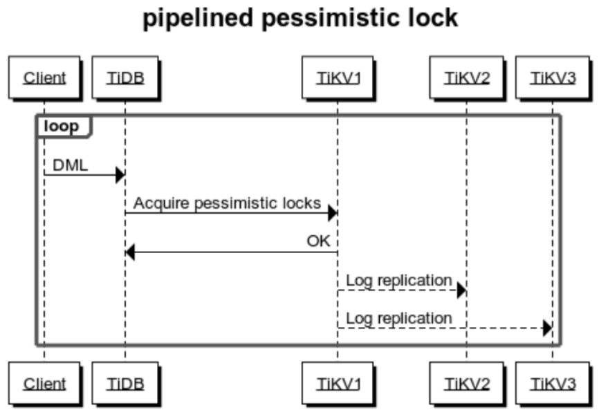

>加悲观锁需要向 TiKV 写入数据，要经过 Raft 提交并 apply 后才能返回，相比于乐观事务，不可避免的会增加部分延迟。为了降低加锁的开销，TiKV 实现了pipelined 加锁流程：
>
>>当数据满足加锁要求时，TiKV 立刻通知 TiDB 执行后面的请求，并异步写入悲观锁，从而降低大部分延迟，显著提升悲观事务的性能。
>>
>>但当 TiKV 出现网络隔离或者节点宕机时，悲观锁异步写入有可能失败，从而产生以下影响：
>>
>>>1. 无法阻塞修改相同数据的其他事务。如果业务逻辑依赖加锁或等锁机制，业务逻辑的正确性将受到影响。
>>>2. 有较低概率导致事务提交失败，但不会影响事务正确性。
>>
>>如果业务逻辑依赖加锁或等锁机制，或者即使在集群异常情况下也要尽可能保证事务提交的成功率，应关闭pipelined 加锁功能。
>>
>>该功能默认开启，可修改 TiKV 配置关闭：
>>
>>[pessimistic-txn]
>>pipelined = false
>>
>>若集群是 v4.0.9 及以上版本，也可通过在线修改 TiKV配置功能动态关闭该功能：
>>
>>set config tikv pessimistic-txn.pipelined='false';

### 11、TiKV的MVCC机制

>我们还有一个目标是实现完整事务，事务四大属性里有一个叫隔离性，描述的是“各个事务之间相互影响的程度，主要用于规定多个事务访问同一数据资源，各个事务对该数据资源访问的行为”，隔离性最常见的实现技术就是多版本并发控制(MVCC)，TiKV也不例外。设想这样的场景：两个客户端同时去修改一个Key的Value，如果没有数据的多版本控制，就需要对数据上锁，在分布式场景下，可能会带来性能以及死锁问题。TiKV的MVCC实现是通过在Key后面添加版本号来 实现，简单来说，有了MVCC之后，TiKV的Key排列如下：

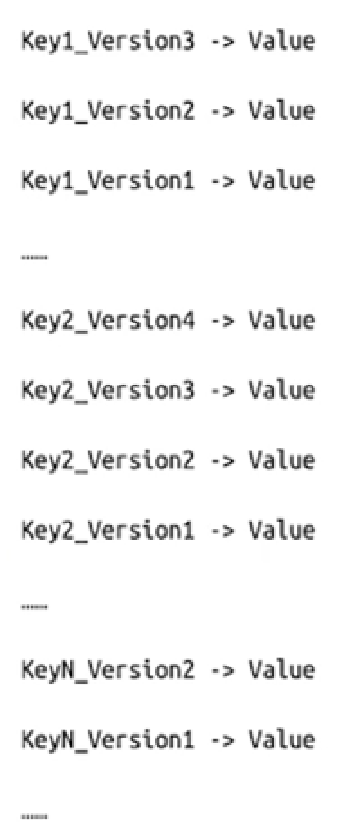

### 12、TiKV Cpoprocessor 计算下推模块

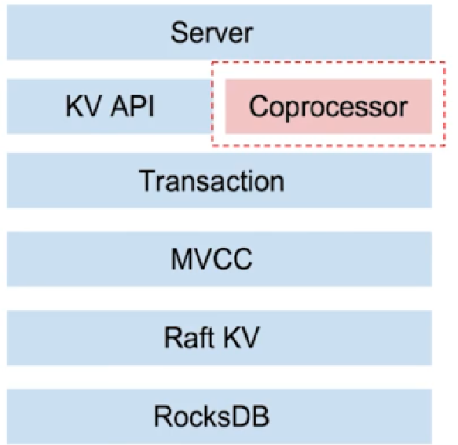

>在分布式架构下，一个非常通用的优化思路是，在数据层尽快的进行计算与预处理，比如在本地 节点完成数据过滤，部分聚合等，也就是最大程度下推机制。这种机制不仅减少了网络交互成本，还能充分利用分布式存储节点的并行技术能力，所以在每个储存节点需要有一个技术模块。

## 五、TiDB体系结构--分布式SQL引擎设计

### 1、如何在KV上实现逻辑表转换

>我们现在手里有一个全局有序的分布式Key-Value引擎，全局有序这一点重要，可以帮助我们解决不少问题。比如对于快速获取一行数据，我们只需要找到具体Key，我们就能利用TiKV提供的Seek方法快速定位到这一行数据所在位置，找到其他列数据。再比如对于扫描全表的需求，如果能够映射为一个Key的Range，从Start Key扫描到EndKey，那么就可以简单的通过这种方式获得全表数据。操作Index数据也是类似的思路。
>
>>基本思路:
>>
>>1. TiDB对每个表分配一个Table_ID，每一个索引都会分配一个Index_ID，每一行分配一个Row_ID （如果表有整数型的Primary Key，那么会用Primary Key的值当做Row ID）。
>>2. 我们可以简单把Table_ID/Index_ID+Row_ID看成Key-Value里的Key，Value可以看成所有列按照等位偏移进行连接。
>>3. 在查询过程，我们再通过等位偏移量对Value进行反解析，然后对应Schema的元信息，匹配列信息。

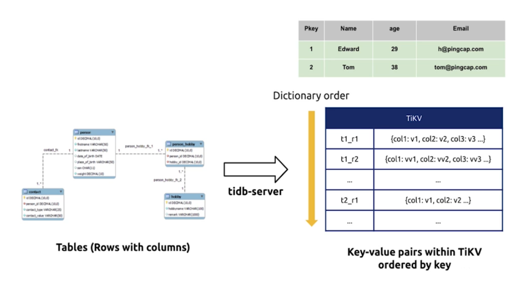

>在TiKV里，二级索引也是一个全局有序的KV map，可以简单理解它的key就是索引列信息，Values是原表的Primary key；然后再通过这个Primary key在原表的KV MAP进行扫描，找到 Values的信息。这个过程和B-tree回表的逻辑类似，可以理解我们看书过程，先查目录，通过查章节定位页数，再通过具体页数来找到内容。

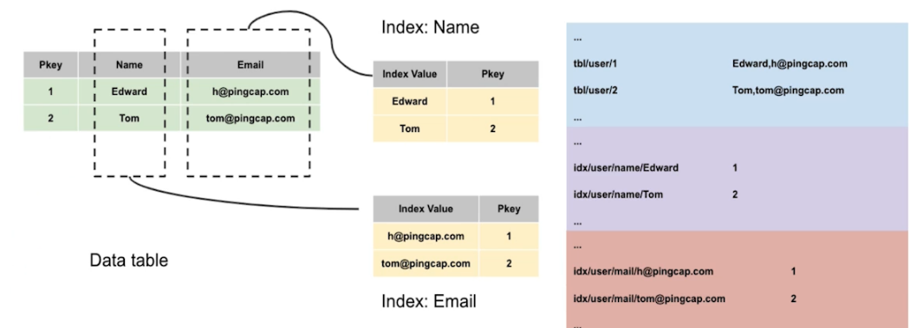

### 2、TiDB 的SQL如何处理

#### 1.SQL处理介绍

>SQL是一个非过程的声明式语言，只描述结果，不解读过程，所以一个SQL引擎很重要的一个模块就是优化器，它负责从很多执行计划中找到最优的执行计划。
>
>举个例子，我们要的结果是从天安门尽快到达颐和园，我们很多交通方式与路线，优化器就是根据各种交通方式的效率与路况的拥堵情况，来选择一个最快的出行方案。
>
>这里的各种交通方式可以理解为数据寻址或者数据计算的各种算子，比如 hash join、Index reader。路况可以理解为表、索引、列的数据分布统计信息。除了优化器外，我们看看，还有哪些是SQL引擎必须构建的部分。

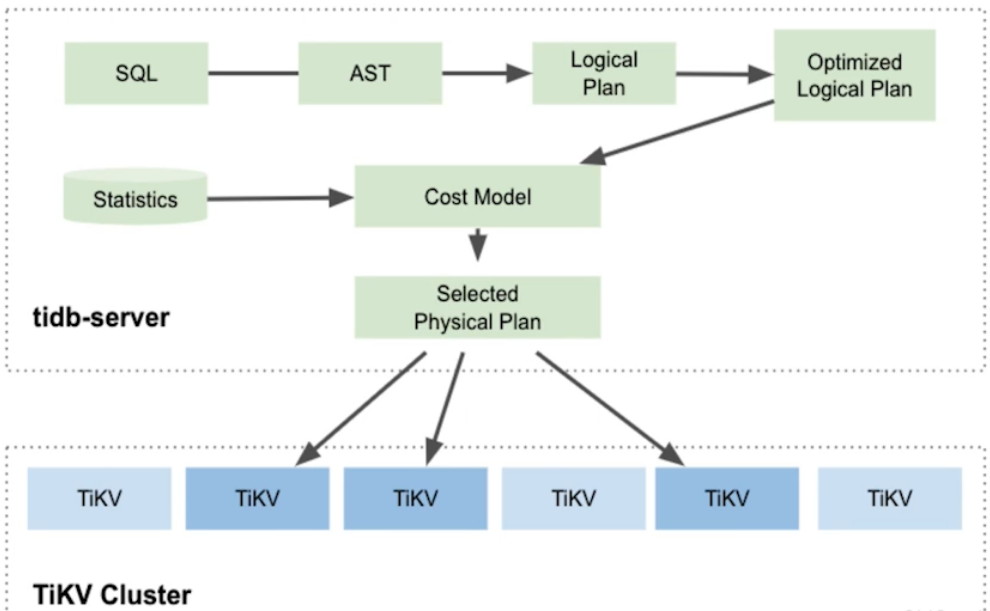

#### 2.SQL处理原理

>1. SQL语法解析、语意解析、协议解析。
>TiDB采取了兼容MySQL策略，这个模块是按照MySQL的语法进行解析。以及语义解析，包括访问表的权限和合理性。
>2. AST抽象语法树。
>AST主要将SQL从文本解析成结构化数据。
>3. SQL逻辑优化。
>各种SQL等价改写与优化，比如子查询改成表关联。各种不必要信息的裁剪，比如列裁剪、分区裁剪等。
>4. 优化器基于统计信息与成本模型的生产执行计划。
>这一步最为关键，也就上个例子说的找“最佳出行计划”的过程。这个也是SQL优化最关键的部分。
>5. 执行器执行
>执行引擎根据优化器定下的执行计划，进行数据寻址与计算。

#### 3.基于Cost优化器

>优化器如何找到最佳执行计划
>1. 首先需要知道我们有哪些算子，已经知道每个算子的优势与适应场景，可以简单理解为各种交通工具.
>2. 基于成本的模型，简单理解，CPU、内存、网络等资源需要一个等价公式。

### 3、TiDB SQL引擎有哪些关键优化

#### 1.执行器构建：最大程度的下推计算

>我们已经构建了一个分布式存储引擎TiKV，分布式的优势，就是最大程度地利用分布式多节点的存储与算力，所以在分布式SQL引擎，一个很重要的优化逻辑就是最大程度的让数据在分布式存储层完成过滤与计算。也就是我们说的最大下推策略（PushDown）。
>
>比如我们要在用户表里统计“90后”有多少人，用户表是按照很多个分片存储在各个存储节点里，那么我们就可以在每个存储节点并行，进行数据扫描与过滤数据，然后统计各自的“90后”数量，最后上报给上的SQL引擎，再进行一次简单的SUM就可以返回结果。

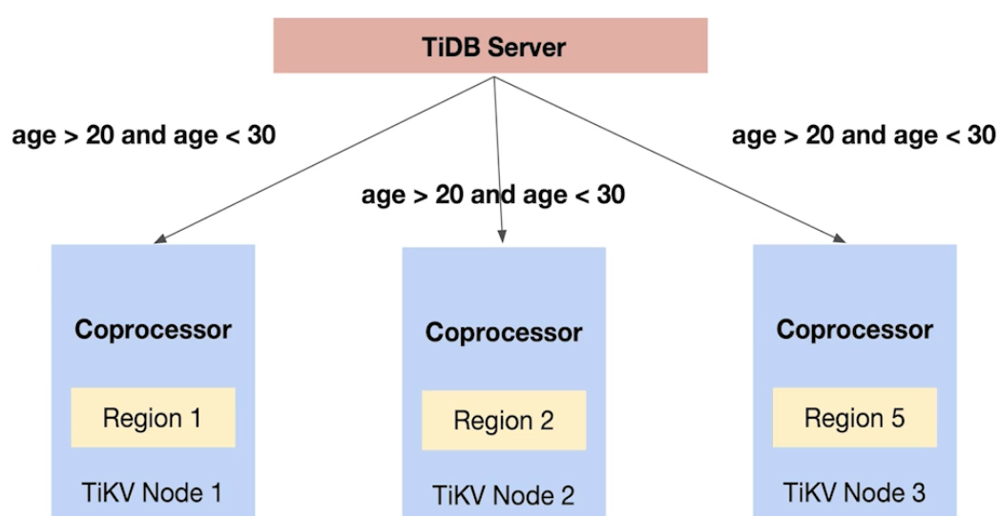

#### 2.关键算子分布式化

>比如Hash Join，在TiDB-Server的Hash Join不管是数据寻址，还是在内层进行分批匹配都可以并行与分批处理，这也就是，为什么在TiDB这种架构下，大表join的场景，比传统的MySQL要 快很多的原因。

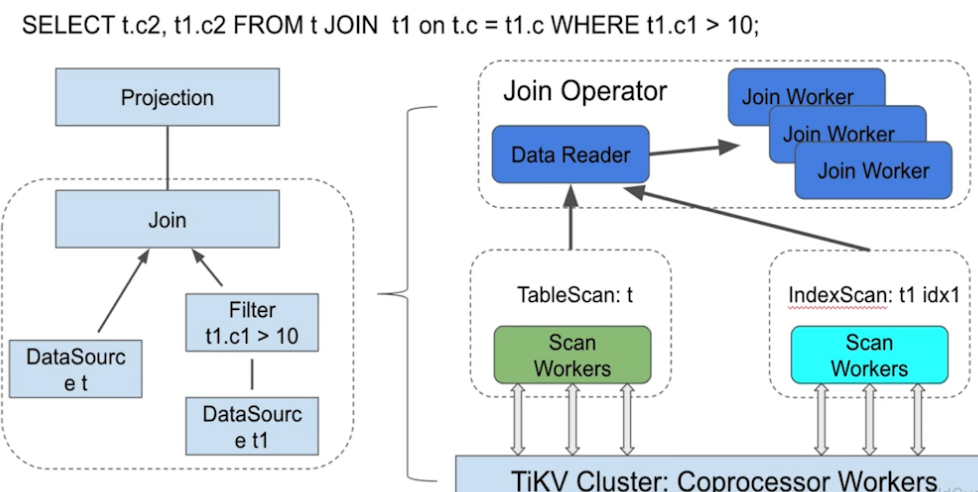

#### 3.如何构建一个Online DDL算法

>DDL是SQL很常见的操作，传统MySQL进行表变更，比如加字段，是需要对表的物理数据进行重组织，这种方式成本很高，效率很低。而分布式数据库面对是数据量更大的表，所以能否实现OnlineDDL，对业务快速上线迭代、数据库运维与都非常重要。

>TiDB Online DDL实现有两个关键点：
>
>1. 在TiDB里没有分表概念，所以不管多大的表，Schema（表结构）只存储一份，比如我们要在表上加字段，我们只需要在这个Schema进行操作，操作后的新数据按照新结构存储，老数据只有在需要变更的时候才重组织，所以整个DDL完成过程是非常快速的。
>2. 多个计算节点怎么保存Schema信息一致呢？TiDB-Server在线DDL是根据Google F1论文算法实现而来，在此论文中异步在线DDL的核心就是Multi schemaversions，它把DDL过程分成Public、Delete-only、Write-only等几个状态，每状态在多节点之间同步和一致，最终完成完整 的DDL。

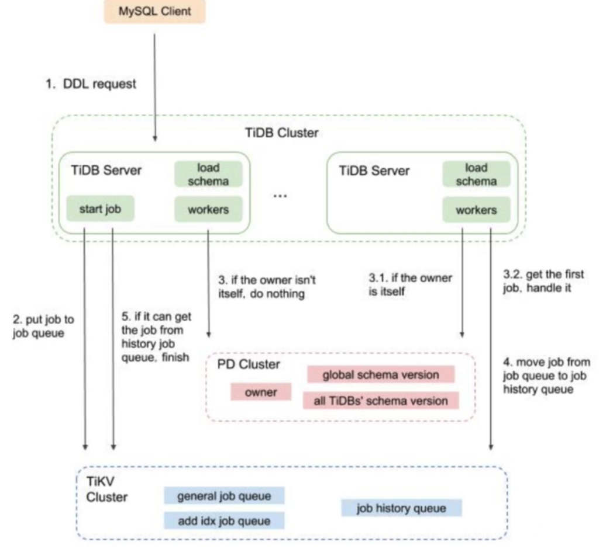


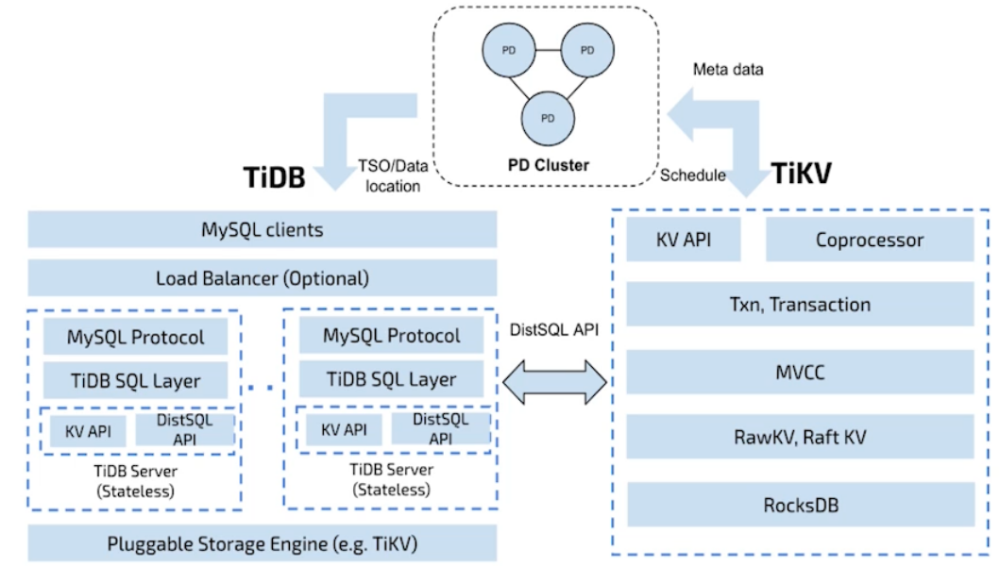

## 六、TiDB的发展如何适应实时需求的变化

### 1、HTAP 发展的必然性

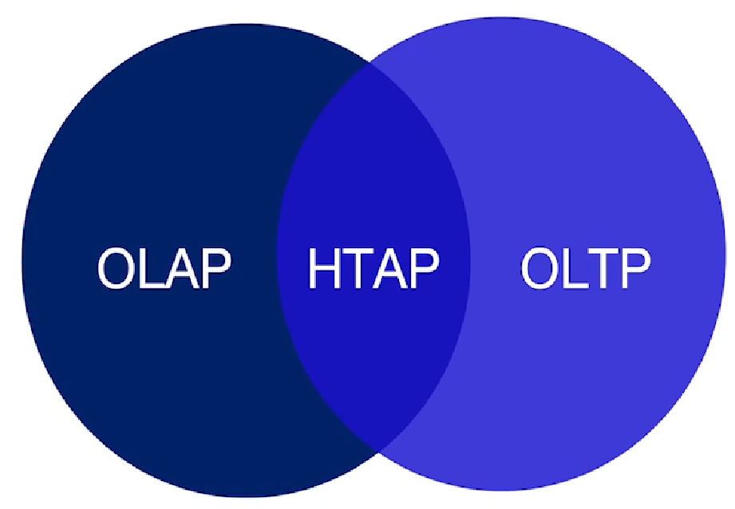

>2005年，Gartner提出了HTAP（Hybrid transactional/analytical processing，在线事务处理/在线分析处理数据库）这一概念，并在2014年，Gartner对HTAP数据库给出了明确的定义，HTAP数据库需要同时支持OLTP和OLAP场景。基于创新的计算存储框架，在同一份数据上保证事务的同时支持实时分析，省去了费时的ETL过程。

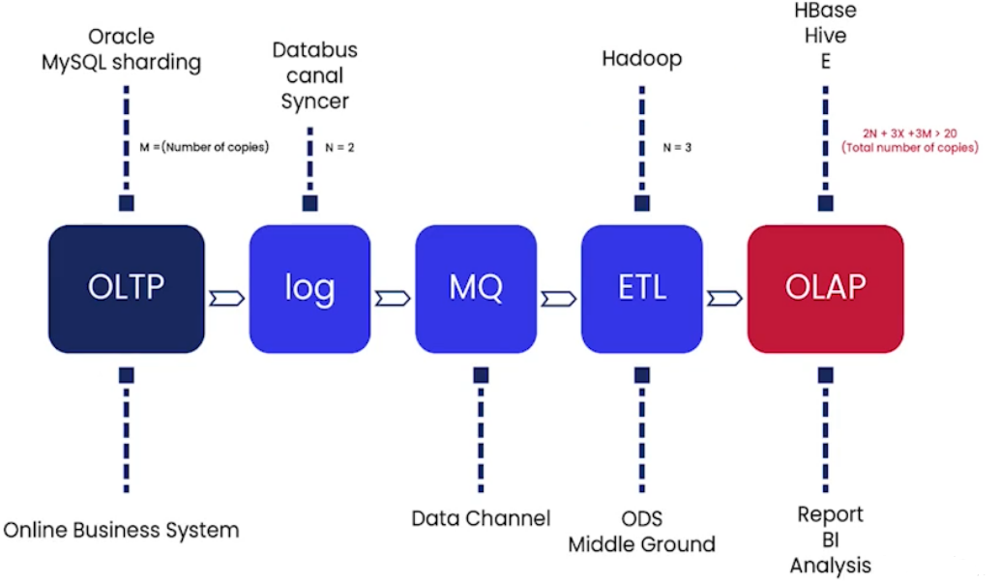

>分布式技术的发展逐步解决了数据容量爆炸的问题，而分布式关系型数据库同时满足了OLTP的需求，也解决了数据容量的问题，在此基础上，很多传统AP的技术可以在分布式架构上进行再融合。实现了更大数据容量的混合数据库（HTAP）。同时业务创新场景多样性，在使用层面模糊了OLTP/OLAP的划分，比如业财一体、后台运营、客服后台、大屏展现、用户画像、小报表系统等。从这个角度看，HTAP又是一个数据服务需求。这个数据服务需求核心诉求是数据服务的统一。

### 2、TiDB在数据中台的应用

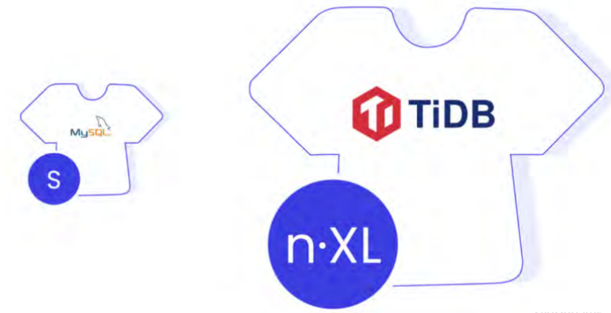

>前面我们说过，可以把TiDB比喻成一款大号的MySQL，最早TiDB是为了解决在线业务的分库分表问题。
>
>为了方便大家数据迁移，我们构建了一套从MySQL迁移、合库合表、同步Data migration解决方案。基于此方案，多套MySQL业务系统可以实时同步到一TiDBCluster上，这个TiDB Cluster类似大数据里的一个数据汇总层（ODS）。

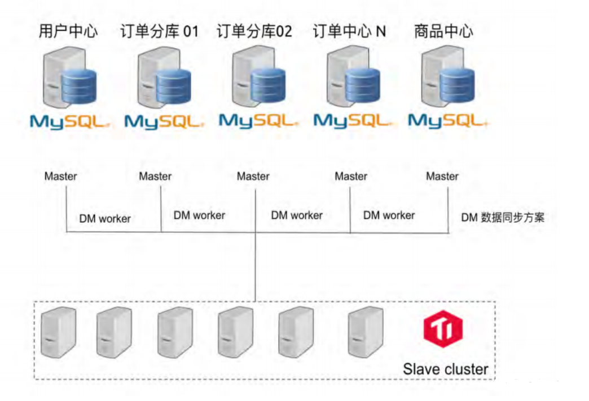

>为什么很多用户选择TiDB做为数据中台底座呢？在这个架构下，TiDB很多天然的特性被用户发现，包括：
>
>1. 海量存储允许多数据源汇聚，数据实时同步。
>2. 支持标准SQL，多表关联快速出结果。
>3. 透明多业务模块、支持分表聚合后可以任务维度查询。
>4. TiDB最大下推机制、以及并行hashjoin等算子，决定的TiDB在表关联上的优势。
>
>而这些特性很适合诸如后台运营系统、财务报表、大屏展现、用户画像等数据中台业务。

### 3、TiSpark引入Spark 加强计算能力

>TiDB虽然有上面优点，但TiDB-Server毕竟是一个面向OLTP的业务，对于那些OLAP中间结果过大的查询，还是会造成内存超度使用，甚至OOM的问题，所以为了满足用户的需求，我们借助了社区的力量，引入大数据Spark的生态，让Spark识别TiKV的数据格式、统计信息、索引，执行器，最终构建了一个跑在TiKV上的Spark计算引擎，TiSpark。进而实现了一个分布式的技术平台，在面对大批量数据的报表和重量级Ad-hoc提供了一个方案。

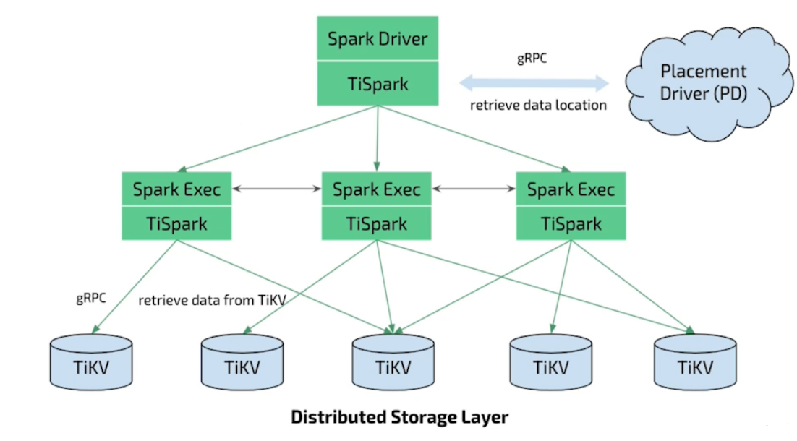

>但Spark只能提供低并发的重量级查询，在从应用场景，很多中小规模的轻量AP查询，也需要高并发、相对低延迟技术能力，在这种场景下，Spark的技术模型重，资源消耗高的缺点就会暴露。
>
>更重要的TiDB本身定位是一个OLTP系统，很多OLTP查询在这种架构下，是和TiSpark共用一套底层的存储系统（TiKV），OLTP与OLAP资源隔离很难通过软件层面彻底解决。

### 4、TiDB 引入列式副本TiFlash进行统一计算

>数据库资源隔离的角度看，依次是，数据库软件层、副本调度、容器、虚拟机、物理机，越接近 物理机隔离性越好，在传统的Master-Slave的架构下，我们经常听到读写分离这个说法，其实也是一个资源隔离的问题。既然隔离，就要有一个单独的副本进行AP查询。而列存天然对OLAP 查询类友好，所以我们选择将这个副本放到一个列式引擎上。
>
>而列式存储引擎，需要按照列为单位进行存储，每个列一个会成立一个单独的对象，这种引擎对批量写入友好，最大的挑战、在于实时更新，所以基于此，我们借鉴LSM思想，在列式引擎上引入了Delta tree的方式，最终实现了一个支持准实时更新的列式引擎，Tiflash。

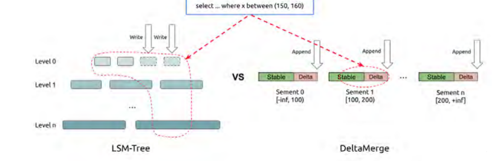

>下一步，就是怎么将这个副本同步到这个列式引擎上，最简单的方式就是使用Binlog这类数据库日志，但因为我们要强调数据库的实时性，所以我们采用了复制效率更底层更高效的raft。前面 我们提过原有TiKV默认三副本，采用的raft-base的复制方式，我们对raft进行了改造，将一个副本raft副本设置为只负责同步，没有投票权的角色，我们叫它Learner。这样设计的好处是既保障了RaftGroup的写入效率，又保障了列存副本的极低延迟的异步同步，同时还规避了复制组脑裂问题。

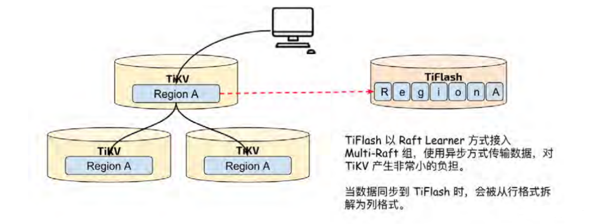

>对使用者来说，统一与易用是最朴素的需求，所以接下来的工作就是将在技术节 点上进行服务的统一，前面说过，我们已经构建了一个支持标准SQL的TiDB-Server，所以接下来的工作，就是将列存的信息暴露给TiDB-Server，设计新的统计信息规则CBO模型，最终让TiDB-Server的优化器可以通过新的Cost模型来自由选择数据寻址路径，形成一个包括行式存储与列式存储执行计划。
>
>比如下面的例子：
>
>```mysql
>SELECT AVG（s.price）FROM prodp,saless
>WHERE p.pid=s.pid
>AND p.batch_id=‘B1328’;
>```
>
>TiDB-Server会根据数据统计信息评估最终只需要计算sales表的price 列的平均值，就没有必要读取其他列的信息。同时batch_id这个列，在TiKV上有索引，所以，最优的方式在TiKV上通过索引过滤，过滤完的数据，再通过TiFlash的列存中进行读取和聚合。既节省了I/O又降低了传输的网络带宽。

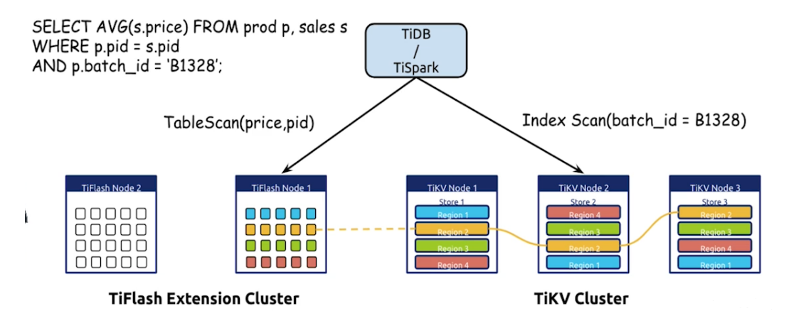

### 5、TiDB引入 Tiflash 实现MPP能力加强

>在OLAP里，经常会出现多个大表之间的关联。这里面有暴露两个新的问题：
>
>1. 我们前面说过分布式架构，一个很重要的优化，就是最大程度的下推算法（在分布式节点上的数据寻址的过程，尽快完成计算与过滤），那之前的架构，在Join是推不下去的，具体原因大家可以想想为什么。那么如何实现Join下推呢？
>2. 之前的架构，单一查询总是在某一个具体计算节点完成，如何实现计算节点在单一SQL的扩展呢？

>在大数据的技术历史上，大家应该听过MPP引擎，什么是MPP数据库？
>
>MPP(MassivelyParallel Processing)架构是将任务并行的分散到多个服务器和节点上，在每个节点上计算完成后，将各自部分的结果汇总在一起得到最终的结果。
>
>回答我们上面的问题，如果要让一个join在多个节点并行执行，那么需要将join的两个表的分片 在节点分布一致，如果不一致呢？需要通过网络的将分片临时拷贝一份进行计算，这个过程叫shuffle，所以MPP计算模型，本质是通过网络与存储成本来置换计算资源（Trade Off）。来解决大数据量的需要并行计算场景。比如大报表。
>
>所以，我们引入了MPP计算框架。如下图：

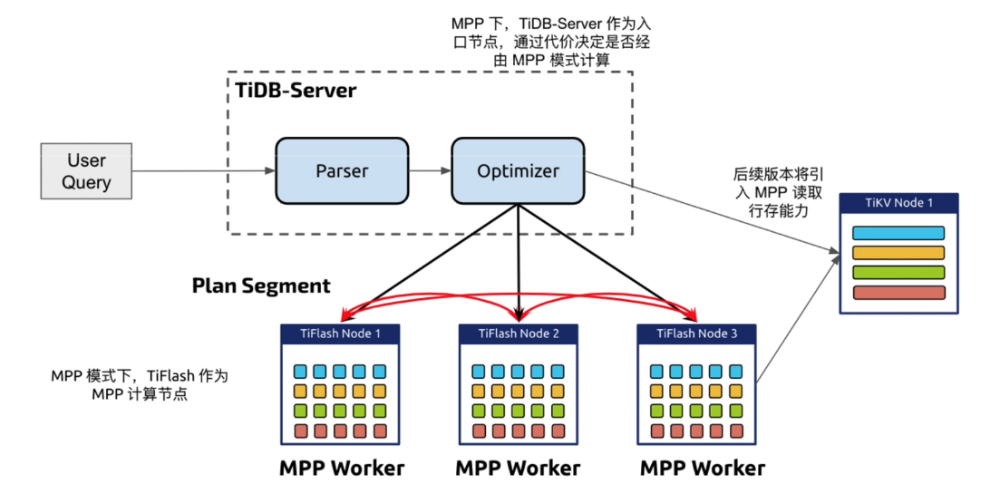

### 6、TIDB在HTAP目前发展程度

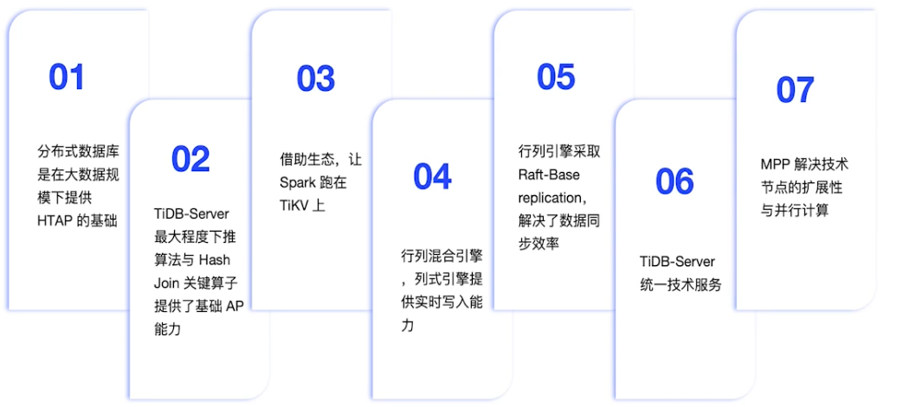

>TiDB HTAP之路已经完成了如下几步：
>
>1. 分布式数据库是在大数据规模下提供HTAP的基础。
>2. TiDB-Server最大程度下推算法与HashJoin关键算子提供了基础AP能力。
>3. 借助生态，让Spark跑在TiKV上。
>4. 行列混合引擎，列式引擎提供实时写入能力。
>5. 行列引擎采取Raft-Baserep lication，解决了数据同步效率。
>6. TiDB-Server听过了一个支持SQL，可以自动路由行列引擎，统一数据查询服务。
>7. MPP解决多表JOIN场景下的计算节点的扩展性与并行计算问题。

### 7、HTAP 下一步发展

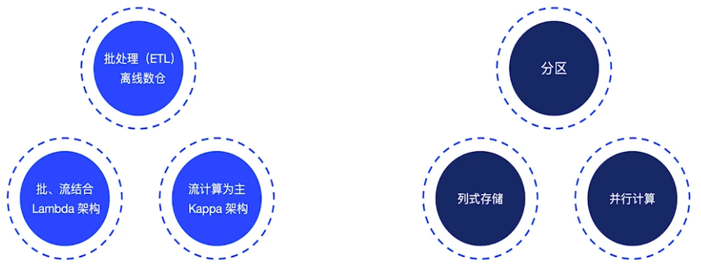

>过去10年，OLAP的场景基本上都基于数仓，而流计算的发展，将数仓架构分为几个阶段：
>
>1. 最早的批处理（ETL）的离线数仓。
>2. 批、流结合的Lambda架构。
>3. 流计算为主的Kappa架构。
>
>分布式技术的发展，解决了数据容量、吞吐量的扩展性，在此基础上，很多OLAP的技术又可以在更大数据量基础上与OLTP进行再融合，比如分区、列式存储、并行计算等。
>
>当这两个发展方向终究碰撞到了一起，流计算在复杂计算中的天然限制，可以在分布式HTAP里得到解决。而流计算的实时计算能力，为不同数据技术栈与产品提供了丰富多样数据连 通能力；流计算+基于分布式的HTAP产品，将形成了更有爆发力的HTAP数据服务。
>
>看到TiDB HTAP发展路径，我们会发现，这里面既有产品内嵌功能，又有生态的数据的连同。这是两条工程化的思路，接下来，HTAP会逐步转换成“数据服务统一”的代名词，这两条发展思路都会有不同的探索：
>
>1. 产品内嵌功能的迭代，由一些具体产品来完成HTAP。
>2. 整合多个技术栈与产品，并进行数据的连同。形成服务的HTAP。

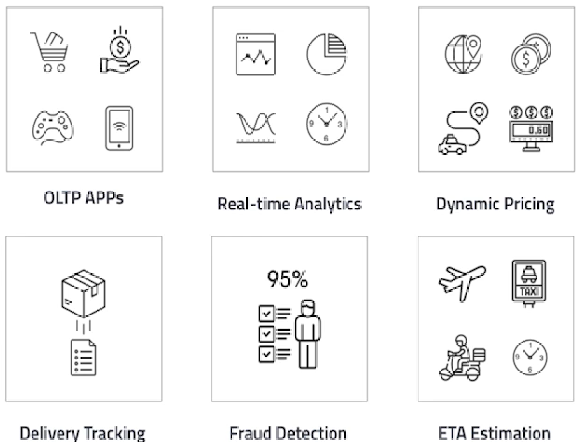

### 8、TiDB的主要应用场景

>在混合负载场景下，使用TiDB可以承载OLTP类业务，同时使用TiFlash加速实时报表，加速对分析业务的查询响应。从架构上来说，以往需要有不同的数据链路去维护不同数据引擎之间的数 据流转和存储，现在对用户而言只需要一个入口，一个APPServer，不同的业务类型可以不加区分地接入这个APPServer，APPServer向TiDB发送请求，TiDB将不同的业务向不同的引擎进行 分流和加速，整套技术架构栈变得非常简洁。

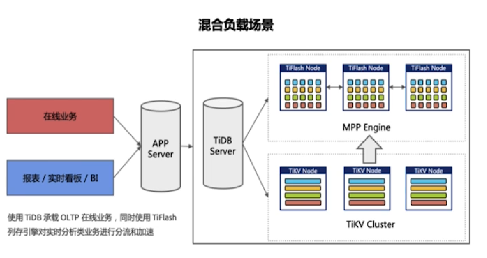

>TiDB本身是一个带有OLTP类属性的HTAP数据库，对于任何实时的删改增落地，TiDB是可以达到实时响应，整条数据链路可以实现秒级查询。TiDB本身的行列混合属性也意味数据落地 不论是明细数据的明细查询，还是对于数据的各种不同维度的实时聚合，都可以很好地响应。

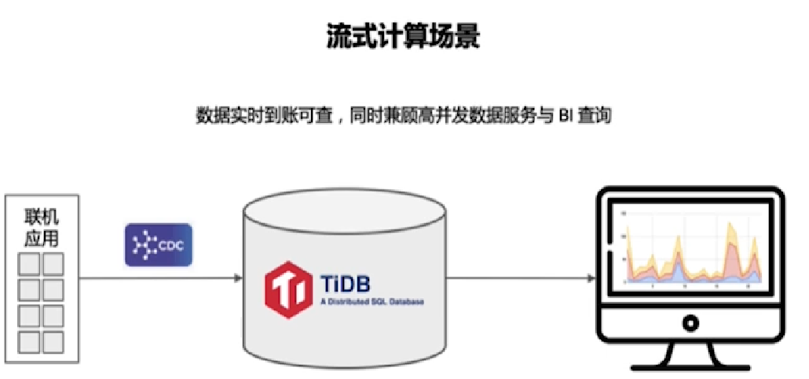

>在数据中枢场景中，假设前端有多个业务线，每个业务线都有自己不同的OLTP类数据库，例如财务、ERP、销售、仓储数据库，有Click Stream、有User Profile、也有产品库，还有用户登录和第三方不同的数据源，这些数据存放在各自的数据库中，可以通过CDC的方式或者通过Kafka实时集成到TiDB里面。
>
>这些从不同数据源、不同业务线整合过来的数据，可以放在数据中枢层。数据中枢层是相对于离线的数仓层来说的一个概念，首先他只存放一部分时间段内的数据，而数仓可能会放更久远的历史数据；数据中枢层更倾向于是存放温数据和热数据数据，可以提供实时的数据存取和查询服务。
>
>相对于大数据和离线数仓层而言，数据中枢可以直接对接数据应用端，作为一个既可以承接高并发访问，又能够以数据服务的形式来提供全量数据的存取，而离线数仓和数据湖更倾向于离线的方式，通常提供不太新鲜的数据来进行报表与BI类查询。
>
>当TiDB集成到整个数据平台当中，他充当了一个数据中枢的角色。即使数据平台中已经有了离线数据仓库层和Hadoop平台，仍然可以把TiDB放在业务层、Hadoop层，或者在数据仓库层之 间，作为提供一个实时数据存储和管理的平台，用来满足越来越多用户对于实时存取与实时分析的需求。

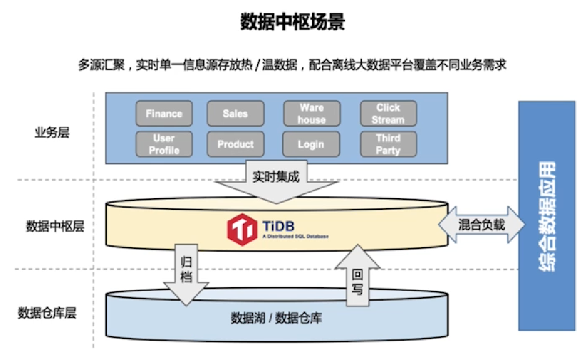

### 9、数据库选型

>对于一个线上的服务来说，要考虑以下几点:
>
>1. 稳定。
>对于任何一个线上服务来说，可以容忍交易稍微慢一点，但一定不可能容忍频繁宕机。稳定是第一要务，脱离了稳定，效率没有任何意义。
>2. 效率。
>在系统非常稳定的情况下，速度越快，就意味着用户体验越好。比如外卖下单，秒接单 的用户感受一定很好。如果30分之后才接单，用户会想到底是系统出了问题还是外卖小哥偷懒。
>3. 成本。
>当稳定有了，效率也有了，就要思考花的成本值不值？因为成本降下来才能赚到收益。
>4. 安全。
>安全是一个大家都绕不开的问题。但凡做交易，大家都担心自己的数据被泄露。

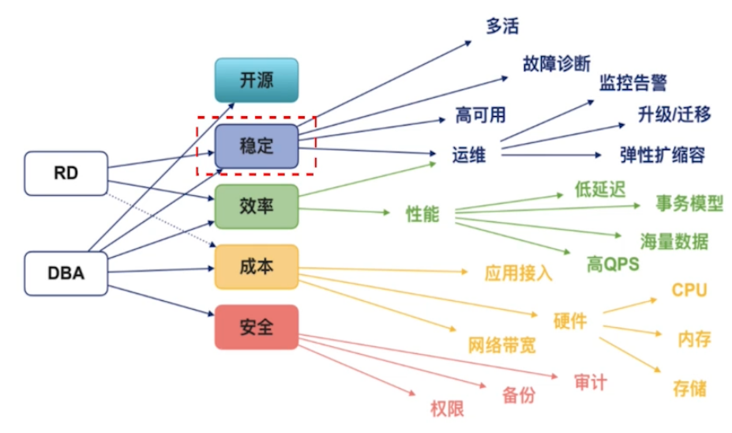

>所以在数据库上面，最关注的就是保稳定、提效率、降成本、保安全。除了这四项之外，还有就 是开源。在做技术选型时，我们希望这个数据库是个优秀活跃的开源产品。当我遇到一些问题有人能热心的帮助我解答疑问。另外当我想为产品做一些贡献的时候，是可以和这个社区一起迭代成长的。
