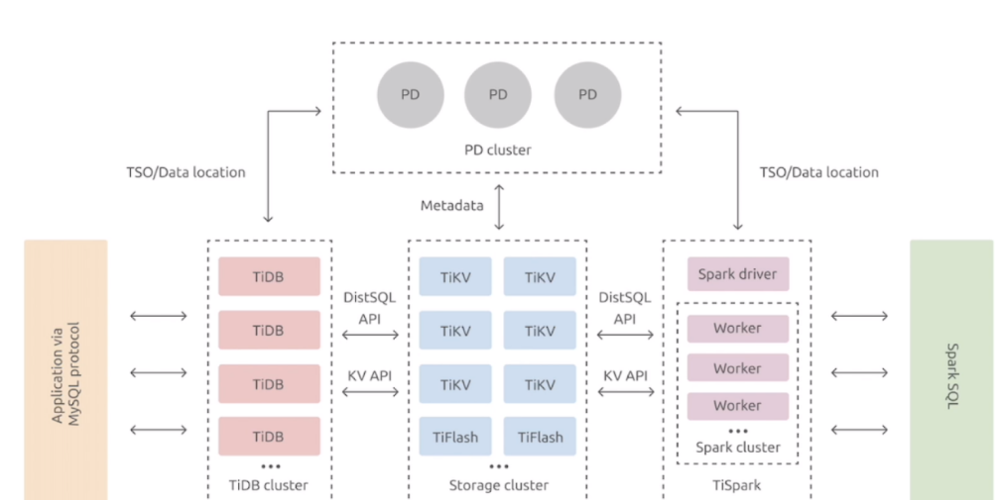
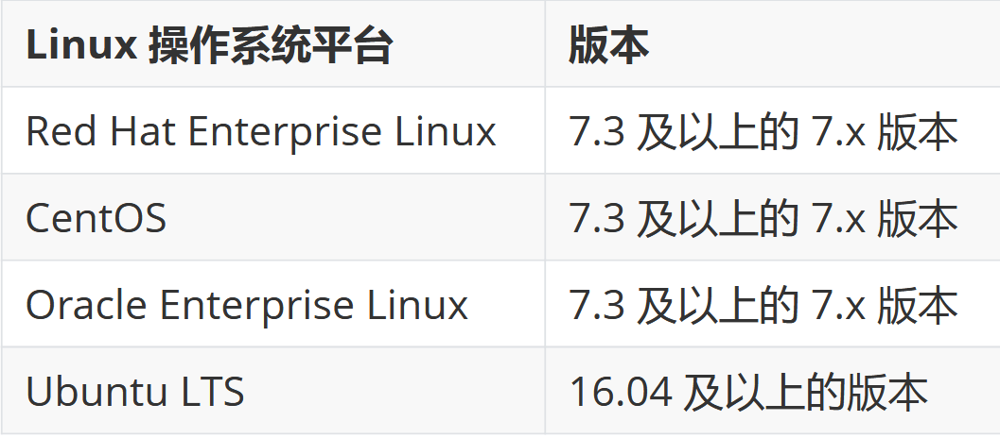

# TiDB物理机部署及管理

## 一、部署要求

### 1、硬件要求



#### 1.开发测试环境

| 组件    | 最低CPU核心数 | 最低内存大小（GB） | 本地存储         | 网络  | 最低实例数量        |
| ------- | ------------- | ------------------ | ---------------- | ----- | ------------------- |
| TiDB    | 8             | 16                 | 无特殊要求       | 2.5G+ | 1（可与PD同机器）   |
| PD      | 4             | 8                  | SAS，200GB+      | 2.5G+ | 1（可与TiDB同机器） |
| TiKV    | 8             | 32                 | SSD Nvme，200GB+ | 2.5G+ | 3                   |
| TiFlash | 32            | 64                 | SSD Nvme，200GB+ | 2.5G+ | 1                   |
| TiCDC   | 8             | 16                 | SAS，200GB+      | 2.5G+ | 1                   |

注意：

>- 验证测试环境中的 TiDB 和 PD 可以部署在同一台服务器上。
>- 如进行性能相关的测试，避免采用低性能存储和网络硬件配置，防止对测试结果的正确性产生干扰。
>- TiKV 的 SSD 盘推荐使用 NVME 接口以保证读写更快。
>- 如果仅验证功能，建议使用 TiDB 数据库快速上手指南进行单机功能测试。
>- TiDB 对于磁盘的使用以存放日志为主，因此在测试环境中对于磁盘类型和容量并无特殊要求。

#### 2.生产部署要求

| 组件    | 最低CPU核心数 | 最低内存大小（GB） | 本地存储       | 网络             | 最低实例数量 |
| ------- | ------------- | ------------------ | -------------- | ---------------- | ------------ |
| TiDB    | 16            | 32                 | SAS            | 10G+（两个以上） | 2            |
| PD      | 4             | 8                  | SSD Nvme       | 10G+（两个以上） | 3            |
| TiKV    | 16            | 32                 | SSD Nvme       | 10G+（两个以上） | 3            |
| TiFlash | 48            | 128                | SSD Nvme，多个 | 10G+（两个以上） | 2            |
| TiCDC   | 16            | 64                 | SSD Nvme       | 10G+（两个以上） | 2            |
| 监控    | 8             | 16                 | SAD            | 10G+（两个以上） | 1            |

注意：

>- 生产环境中的 TiDB 和 PD 可以部署和运行在同服务器上，如对性能和可靠性有更高的要求，应尽可能分开部署。
>- 生产环境强烈推荐使用更高的配置。
>- TiKV 硬盘大小配置建议 PCI-E SSD 不超过 2 TB，普通 SSD 不超过 1.5 TB。
>- TiFlash 支持多盘部署。
>- TiFlash 数据目录的第一块磁盘推荐用高性能 SSD来缓冲 TiKV 同步数据的实时写入，该盘性能应不低于 TiKV 所使用的磁盘，比如 PCI-E SSD。并且该磁盘容量建议不小于总容量的 10%，否则它可能成为这个节点的能承载的数据量的瓶颈。而其他磁盘可以根据需求部署多块普通 SSD，当然更好的 PCI-E SSD 硬盘会带来更好的性能。
>
>- TiFlash 推荐与 TiKV 部署在不同节点，如果条件所限必须将 TiFlash 与 TiKV 部署在相同节点，则需要适当增加 CPU 核数和内存，且尽量将TiFlash 与 TiKV 部署在不同的磁盘，以免互相干扰。
>- TiFlash 硬盘总容量大致为： 整个 TiKV 集群的需同步数据容量 / TiKV 副本数 * TiFlash 副本数 。例如整体 TiKV 的规划容量为 1 TB、TiKV 副本数为 3、TiFlash 副本数为 2，则 TiFlash 的推荐总容量为 1024 GB /3 * 2 。用户可以选择同步部分表数据而非全部，具体容量可以根据需要同步的表的数据量具体分析。
>- TiCDC 硬盘配置建议 200 GB+ PCIE-SSD。

### 2、系统需求



注意：

>- 目前尚不支持 Red Hat Enterprise Linux 8.0、CentOS 8 Stream 和 Oracle Enterprise Linux8.0，因为目前对这些平台的测试还在进行中。
>- 不计划支持 CentOS 8 Linux，因为 CentOS 的上游支持将于 2021 年 12 月 31 日终止。
>- TiDB 将不再支持 Ubuntu 16.04。强烈建议升级到 Ubuntu 18.04 或更高版本。

### 3、集群概述

>TiDB 作为开源分布式 NewSQL 数据库，其正常运行需要网络环境提供如下的网络端口配置要求，管理员可根据实际环境中 TiDB 组件部署的方案，在网络侧和主机侧开放相关端口：

| 组件              | 默认端口 | 说明                                               |
| ----------------- | -------- | -------------------------------------------------- |
| TiDB              | 4000     | 应用及 DBA 工具访问通信端口                        |
| TiDB              | 10080    | TiDB 状态信息上报通信端口                          |
| TiKV              | 20160    | TiKV 通信端口                                      |
| TiKV              | 20180    | TiKV 状态信息上报通信端口                          |
| PD                | 2379     | 提供 TiDB 和 PD 通信端口                           |
| PD                | 2380     | PD 集群节点间通信端口                              |
| TiFlash           | 9000     | TiFlash TCP 服务端口                               |
| TiFlash           | 8123     | TiFlash HTTP 服务端口                              |
| TiFlash           | 3930     | TiFlash RAFT 服务和 Coprocessor 服务端口           |
| TiFlash           | 20170    | TiFlash Proxy 服务端口                             |
| TiFlash           | 20292    | Prometheus 拉取 TiFlash Proxy metrics 端口         |
| TiFlash           | 8234     | Prometheus 拉取 TiFlash metrics 端口               |
| Pump              | 8250     | Pump 通信端口                                      |
| Drainer           | 8249     | Drainer 通信端口                                   |
| CDC               | 8300     | CDC 通信接口                                       |
| Prometheus        | 9090     | Prometheus 服务通信端口                            |
| Node_exporter     | 9100     | TiDB 集群每个节点的系统信息上报通信端口            |
| Blackbox_exporter | 9115     | Blackbox_exporter 通信端口，用于 TiDB 集群端口监控 |
| Grafana           | 3000     | Web 监控服务对外服务和客户端(浏览器)访问端口       |
| Alertmanager      | 9093     | 告警 web 服务端口                                  |
| Alertmanager      | 9094     | 告警通信端口                                       |

### 4、部署前系统标准化

注意：

>- CentOS 7 操作系统的默认配置适用于中等负载下运行的大多数服务。调整特定子系统的性能可能会对其他子系统产生负面影响。因此在调整系统之前，请备份所有用户数据和配置信息；
>- 请在测试环境下对所有修改做好充分测试后，再应用到生产环境中。

#### 1.开启CPU高性能模式

>cpufreq 是一个动态调整 CPU 频率的模块，可支持五种模式。为保证服务性能应选用 performance 模式，将 CPU 频率固定工作在其支持的最高运行频率上，不进行动态调节，操作命令为:
>
>```bash
>cpupower frequency-set --governor
>performance
>```

#### 2.开启NUMA

>可使用 numactl命令来绑定，具体用法请查询手册。

#### 3.关闭THP透明大页

```bash
echo never > /sys/kernel/mm/transparent_hugepage/enabled
echo never > /sys/kernel/mm/transparent_hugepage/defrag
```

#### 4.调整虚拟内存参数

>- dirty_ratio 百分比值。当脏的 page cache 总量达到系统内存总量的这一百分比后，系统将开始使用 pdflush 操作将脏的 page cache 写入磁盘。默认值为 20％，通常不需调整。对于高性能 SSD，比如
>  NVMe 设备来说，降低其值有利于提高内存回收时的效率。
>
>- dirty_background_ratio 百分比值。当脏的 page cache 总量达到系统内存总量的这一百分比后，系统开始在后台将脏的 page cache 写入磁盘。默认值为 10％，通常不需调整。对于高性能 SSD，比如 NVMe 设备来说，设置较低的值有利于提高内存回收时的效率。

#### 5.调整I/O 调度器

>调整I/O 调度器I/O 调度程序确定 I/O 操作何时在存储设备上运行以及持续多长时间。也称为 I/O 升降机。对于 SSD 设备，宜设置为 noop。

```bash
echo noop > /sys/block/${SSD_DEV_NAME}/queue/scheduler
```

#### 6.优化挂载参数

>noatime 读取文件时，将禁用对元数据的更新。它还启用了 nodiratime 行为，该行为会在读取目录时禁用对元数据的更新。
>
>```bash
>/dev/nvme0n1p1 on /data1 type ext4 (rw,noatime,nodelalloc,data=ordered)
>```

#### 7.网络及内核参数

```bash
echo "fs.file-max = 1000000">> /etc/sysctl.conf
echo "net.core.somaxconn = 32768">> /etc/sysctl.conf
echo "net.ipv4.tcp_tw_recycle = 0">>/etc/sysctl.conf
echo "net.ipv4.tcp_syncookies = 0">>/etc/sysctl.conf
echo "vm.overcommit_memory = 1">>/etc/sysctl.conf
sysctl -p

cat << EOF >>/etc/security/limits.conf
tidb soft nofile 1000000
tidb hard nofile 1000000
tidb soft stack 32768
tidb hard stack 32768
EOF
```

### 5、部署工具TiUP介绍

>TiUP 是 TiDB 4.0 版本引入的集群运维工具，TiUP cluster 是 TiUP 提供的使用 Golang 编写的集群管理组件，通过 TiUP cluster 组件就可以进行日常的运维工作，包括部署、启动、关闭、销毁、弹性扩缩容、升级 TiDB 集群，以及管理 TiDB 集群参数。
>目前 TiUP 可以支持部署 TiDB、TiFlash、TiDB Binlog、TiCDC，以及监控系统。

## 二、通过TIUP快速部署开发测试环境

### 1、适用场景

>利用本地 Mac 或者单机 Linux 环境快速部署 TiDB 集群。可以体验 TiDB 集群的基本架构，以及 TiDB、TiKV、PD、监控等基础组件的运行。适合开发测试使用。

### 2、基本结构介绍

>作为一个分布式系统，最基础的 TiDB 测试集群通常由 2 个 TiDB 实例、3 个 TiKV 实例、3 个 PD 实例和可选的 TiFlash 实例构成。通过 TiUP Playground，可以快速搭建出上述的一套基础测试集群。

### 3、使用 TiUP Playground 快速部署本地测试环境

#### 1.下载并安装 TiUP工具

```bash
wget https://tiup-mirrors.pingcap.com/install.sh
sh install.sh
source .bash_profile
```

#### 2.部署TiDB集群

```bash
tiup playground v5.2.1 --db 2 --pd 3 --kv 3 --monitor --host 10.0.0.128
```

#### 3.链接测试

```bash
mysql --host 127.0.0.1 --port 4000 -u root
```

>通过 http://IP:9090 访问 TiDB 的 Prometheus管理界面。
>
>通过 http://IP:2379/dashboard 访问 TiDB Dashboard 页面，默认用户名为 root，密码为空。

#### 4.卸载

>通过 ctrl + c 停掉进程

```bash
tiup clean --all
```

### 3、TiDB Cluster模拟生产部署实战

#### 1.节点规划

>

| 实例    | 个数 | IP                                    | 配置                  |
| ------- | ---- | ------------------------------------- | --------------------- |
| TiKV    | 3    | 10.0.0.20<br/>10.0.0.20<br/>10.0.0.20 | 避免端口和目录冲突    |
| TiDB    | 1    | 10.0.0.20                             | 默认端口 全局目录配置 |
| PD      | 1    | 10.0.0.20                             | 默认端口 全局目录配置 |
| TiFlash | 1    | 10.0.0.20                             | 默认端口 全局目录配置 |
| Monitor | 1    | 10.0.0.20                             | 默认端口 全局目录配置 |

#### 2.TiUP工具的下载安装

```bash
wget https://tiup-mirrors.pingcap.com/install.sh
sh install.sh
source .bash_profile
tiup cluster
tiup update --self && tiup update cluster
```

#### 3.TiUP 配置文件修改

```bash
# # Global variables are applied to all deployments and used as the default value of
# # the deployments if a specific
deployment value is missing.
global:
  user: "tidb"
  ssh_port: 22
  deploy_dir: "/data/tidb-deploy"
  data_dir: "/data/tidb-data"

# # Monitored variables are applied to all the machines.
monitored:
  node_exporter_port: 9100
  blackbox_exporter_port: 9115
 
server_configs:
  tidb:
    log.slow-threshold: 300
  tikv:
    readpool.storage.use-unified-pool: false
    readpool.coprocessor.use-unified-pool: true
 pd:
   replication.enable-placement-rules: true
   replication.location-labels: ["host"]
 tiflash:
   logger.level: "info"

pd_servers:
  - host: 10.0.0.20
tidb_servers:
  - host: 10.0.0.20
tikv_servers:
  - host: 10.0.0.20
    port: 20160
    status_port: 20180
    config:
      server.labels: { host: "logic-host-1"}
  - host: 10.0.0.20
    port: 20161
    status_port: 20181
    config:
      server.labels: { host: "logic-host-2"}
  - host: 10.0.0.20
    port: 20162
    status_port: 20182
    config:
      server.labels: { host: "logic-host-3"}
tiflash_servers:
  - host: 10.0.0.20
monitoring_servers:
  - host: 10.0.0.20
grafana_servers:
  - host: 10.0.0.20
```

#### 4.部署TiDB Cluster

##### 1)增大ssh服务连接数

>由于模拟多机部署，需要通过 root 用户调大sshd 服务的连接数限制

>修改 /etc/ssh/sshd_config 将 MaxSessions 调至20。
>重启 sshd 服务

##### 2）创建并启动集群

>按下面的配置模板，编辑配置文件，命名为 topo.yaml，其中：
>
>>user: "tidb"：表示通过 tidb 系统用户（部署会自动创建）来做集群的内部管理，默认使用 22 端口通过 ssh登录目标机器
>>
>>replication.enable-placement-rules：设置这个PD 参数来确保 TiFlash 正常运行
>>
>>host：设置为本部署主机的 IP

##### 3)执行集群部署命令

>tiup cluster deploy xiaowu-cluster v5.2.1 ./topo.yaml --user root -p

##### 4)启动集群

```bash
tiup cluster start xiaowu-cluster
```

##### 5)访问TiDB数据库，密码为空

```bash
mysql -h 10.0.0.20 -P 4000 -u root
```

##### 6)访问 TiDB 的 Grafana 监控

> 通过 http://{grafana-ip}:3000 访问集群Grafana 监控页面，默认用户名和密码均为 admin。

##### 7)访问 TiDB 的 Dashboard

>通过 http://{pd-ip}:2379/dashboard 访问集群TiDB Dashboard 监控页面，默认用户名为 root，密码为空。

##### 8)执行以下命令确认当前已经部署的集群列表

```bash
tiup cluster list
# 执行以下命令查看集群的拓扑结构和状态:
tiup cluster display xiaowu-cluster
```

# 在K8S的部署实战

>https://docs.pingcap.com/zh/tidb-in-kubernetes/stable/prerequisites/

### 

## 一、持久化存储类型配置

### 1、数据目录准备

```bash
mkfs.ext4 /dev/disk/by-id/scsi-0QEMU_QEMU_HARDDISK_drive-scsi2
mkdir /mnt/k8sdata
echo "/dev/disk/by-id/scsi-0QEMU_QEMU_HARDDISK_drive-scsi2 /mnt/k8sdata   ext4   defaults   0   0" >> /etc/fstab
systemctl daemon-reload && mount -a

```

### 2、local-volume-provisioner部署

#### 1.资源清单下载

```bash
https://github.com/rancher/local-path-provisioner/blob/master/deploy/local-path-storage.yaml
```

#### 2.修改后部署

```yaml
apiVersion: v1
kind: Namespace
metadata:
  name: local-path-storage
---
apiVersion: v1
kind: ServiceAccount
metadata:
  name: local-path-provisioner-service-account
  namespace: local-path-storage
---
apiVersion: rbac.authorization.k8s.io/v1
kind: Role
metadata:
  name: local-path-provisioner-role
  namespace: local-path-storage
rules:
  - apiGroups: [""]
    resources: ["pods"]
    verbs: ["get", "list", "watch", "create", "patch", "update", "delete"]
---
apiVersion: rbac.authorization.k8s.io/v1
kind: ClusterRole
metadata:
  name: local-path-provisioner-role
rules:
  - apiGroups: [""]
    resources: ["nodes", "persistentvolumeclaims", "configmaps", "pods", "pods/log"]
    verbs: ["get", "list", "watch"]
  - apiGroups: [""]
    resources: ["persistentvolumes"]
    verbs: ["get", "list", "watch", "create", "patch", "update", "delete"]
  - apiGroups: [""]
    resources: ["events"]
    verbs: ["create", "patch"]
  - apiGroups: ["storage.k8s.io"]
    resources: ["storageclasses"]
    verbs: ["get", "list", "watch"]
---
apiVersion: rbac.authorization.k8s.io/v1
kind: RoleBinding
metadata:
  name: local-path-provisioner-bind
  namespace: local-path-storage
roleRef:
  apiGroup: rbac.authorization.k8s.io
  kind: Role
  name: local-path-provisioner-role
subjects:
  - kind: ServiceAccount
    name: local-path-provisioner-service-account
    namespace: local-path-storage
---
apiVersion: rbac.authorization.k8s.io/v1
kind: ClusterRoleBinding
metadata:
  name: local-path-provisioner-bind
roleRef:
  apiGroup: rbac.authorization.k8s.io
  kind: ClusterRole
  name: local-path-provisioner-role
subjects:
  - kind: ServiceAccount
    name: local-path-provisioner-service-account
    namespace: local-path-storage
---
apiVersion: apps/v1
kind: Deployment
metadata:
  name: local-path-provisioner
  namespace: local-path-storage
spec:
  replicas: 1
  selector:
    matchLabels:
      app: local-path-provisioner
  template:
    metadata:
      labels:
        app: local-path-provisioner
    spec:
      serviceAccountName: local-path-provisioner-service-account
      containers:
        - name: local-path-provisioner
          image: rancher/local-path-provisioner:v0.0.32
          imagePullPolicy: IfNotPresent
          command:
            - local-path-provisioner
            - --debug
            - start
            - --config
            - /etc/config/config.json
          volumeMounts:
            - name: config-volume
              mountPath: /etc/config/
          env:
            - name: POD_NAMESPACE
              valueFrom:
                fieldRef:
                  fieldPath: metadata.namespace
            - name: CONFIG_MOUNT_PATH
              value: /etc/config/
      volumes:
        - name: config-volume
          configMap:
            name: local-path-config
---
apiVersion: storage.k8s.io/v1
kind: StorageClass
metadata:
  name: local-path
provisioner: rancher.io/local-path
volumeBindingMode: WaitForFirstConsumer
reclaimPolicy: Retain
---
kind: ConfigMap
apiVersion: v1
metadata:
  name: local-path-config
  namespace: local-path-storage
data:
  config.json: |-
    {
            "nodePathMap":[
            {
                    "node":"DEFAULT_PATH_FOR_NON_LISTED_NODES",
                    "paths":["/mnt/k8sdata"]
            }
            ]
    }
  setup: |-
    set -eu
    mkdir -m 0777 -p "$VOL_DIR"
  teardown: |-
    set -eu
    rm -rf "$VOL_DIR"
  helperPod.yaml: |-
    apiVersion: v1
    kind: Pod
    metadata:
      name: helper-pod
    spec:
      priorityClassName: system-node-critical
      tolerations:
        - key: node.kubernetes.io/disk-pressure
          operator: Exists
          effect: NoSchedule
      containers:
      - name: helper-pod
        image: busybox
        imagePullPolicy: IfNotPresent
```

## 二、部署TiDB Operator

### 1、创建CRD

```bash
kubectl create -f https://raw.githubusercontent.com/pingcap/tidb-operator/v1.6.3/manifests/crd.yaml
```

### 2、使用helm添加PingCAP仓库并获取最新版本values

```bash
helm repo add pingcap https://charts.pingcap.org/
helm search repo -l tidb-operator
helm inspect values pingcap/tidb-operator --version=v1.6.3 > values-tidb-operator.yaml
```

### 3、名称空间准备

```bash
kubectl create namespace tidb-admin
```

### 4、安装TiDB Operator

```bash
helm install --namespace tidb-admin tidb-operator pingcap/tidb-operator --version v1.6.3 --set timezone=Asia/Shanghai --set scheduler.kubeSchedulerImageName=registry.cn-hangzhou.aliyuncs.com/google_containers/kube-scheduler

# 查看刚才创建的pod
kubectl get pods --namespace tidb-admin -l app.kubernetes.io/instance=tidb-operator
```

## 三、配置TiDB集群

### 1、声明式资源清单获取

```bash
https://raw.githubusercontent.com/pingcap/tidb-operator/master/examples/advanced/tidb-cluster.yaml
https://raw.githubusercontent.com/pingcap/tidb-operator/master/examples/advanced/tidb-monitor.yaml
```

### 2、修改tidb-cluster.yaml

```yaml
apiVersion: pingcap.com/v1alpha1
kind: TidbCluster
metadata:
  name: tidb
spec:
  version: "v8.5.2"
  timezone: Asia/Shanghai
  configUpdateStrategy: RollingUpdate
  helper:
    image: alpine:3.16.0
  pvReclaimPolicy: Retain
  nodeSelector:
    node-role.kubernetes.io/worker: "true"
  enableDynamicConfiguration: true
  clusterDomain: s8030.gmbaifa.online
  pd:
    baseImage: pingcap/pd
    config: |
      [dashboard]
        internal-proxy = true
    replicas: 3
    maxFailoverCount: 0
    requests:
      cpu: "50m"
      memory: 50Mi
      storage: 20Gi
    configUpdateStrategy: RollingUpdate
    mountClusterClientSecret: true
    storageClassName: "local-path"
    topologySpreadConstraints:
      - maxSkew: 1
        topologyKey: kubernetes.io/hostname
  tidb:
    baseImage: pingcap/tidb
    config: |
      [performance]
        tcp-keep-alive = true
    replicas: 3
    maxFailoverCount: 0
    requests:
      cpu: "50m"
      memory: 50Mi
      storage: 10Gi
    service:
      type: NodePort
      externalTrafficPolicy: Local
      mysqlNodePort: 30020
      exposeStatus: true
      statusNodePort: 30040
    storageClassName: "local-path"
    topologySpreadConstraints:
      - maxSkew: 1
        topologyKey: kubernetes.io/hostname
  tikv:
    baseImage: pingcap/tikv
    config: |
      [log.file]
        max-days = 30
        max-backups = 30
    replicas: 3
    maxFailoverCount: 0
    requests:
      cpu: "50m"
      memory: 50Mi
      storage: 150Gi
    mountClusterClientSecret: true
    storageClassName: "local-path"
    topologySpreadConstraints:
      - maxSkew: 1
        topologyKey: kubernetes.io/hostname
```

### 3、安装TiDB 集群

```bash
kubectl create namespace tidb-cluster
kubectl -n tidb-cluster apply -f tidb-cluster.yaml
```

### 4、部署 TiDB 集群监控

>本次先不部署

```bash
kubectl -n tidb-cluster apply -f tidb-monitor.yaml
```

### 5、查看pod状态

```bash
root@k8s-master-01:~/test# kubectl get pod,svc,pvc -n tidb-cluster -o wide
NAME                                  READY   STATUS    RESTARTS      AGE   IP               NODE          NOMINATED NODE   READINESS GATES
pod/tidb-discovery-5486565669-jzp8m   1/1     Running   0             40m   10.200.44.230    k8s-node-02   <none>           <none>
pod/tidb-pd-0                         1/1     Running   0             40m   10.200.89.157    k8s-node-03   <none>           <none>
pod/tidb-pd-1                         1/1     Running   0             40m   10.200.154.211   k8s-node-01   <none>           <none>
pod/tidb-pd-2                         1/1     Running   1 (38m ago)   40m   10.200.44.232    k8s-node-02   <none>           <none>
pod/tidb-tidb-0                       2/2     Running   0             32m   10.200.89.160    k8s-node-03   <none>           <none>
pod/tidb-tidb-1                       2/2     Running   0             32m   10.200.44.235    k8s-node-02   <none>           <none>
pod/tidb-tidb-2                       2/2     Running   0             32m   10.200.154.214   k8s-node-01   <none>           <none>
pod/tidb-tikv-0                       1/1     Running   0             38m   10.200.89.159    k8s-node-03   <none>           <none>
pod/tidb-tikv-1                       1/1     Running   0             38m   10.200.44.234    k8s-node-02   <none>           <none>
pod/tidb-tikv-2                       1/1     Running   0             38m   10.200.154.213   k8s-node-01   <none>           <none>

NAME                     TYPE        CLUSTER-IP       EXTERNAL-IP   PORT(S)                          AGE   SELECTOR
service/tidb-discovery   ClusterIP   10.100.42.31     <none>        10261/TCP,10262/TCP              40m   app.kubernetes.io/component=discovery,app.kubernetes.io/instance=tidb,app.kubernetes.io/managed-by=tidb-operator,app.kubernetes.io/name=tidb-cluster
service/tidb-pd          ClusterIP   10.100.180.101   <none>        2379/TCP                         40m   app.kubernetes.io/component=pd,app.kubernetes.io/instance=tidb,app.kubernetes.io/managed-by=tidb-operator,app.kubernetes.io/name=tidb-cluster
service/tidb-pd-peer     ClusterIP   None             <none>        2380/TCP,2379/TCP                40m   app.kubernetes.io/component=pd,app.kubernetes.io/instance=tidb,app.kubernetes.io/managed-by=tidb-operator,app.kubernetes.io/name=tidb-cluster
service/tidb-tidb        NodePort    10.100.148.250   <none>        4000:30020/TCP,10080:30040/TCP   32m   app.kubernetes.io/component=tidb,app.kubernetes.io/instance=tidb,app.kubernetes.io/managed-by=tidb-operator,app.kubernetes.io/name=tidb-cluster
service/tidb-tidb-peer   ClusterIP   None             <none>        10080/TCP                        32m   app.kubernetes.io/component=tidb,app.kubernetes.io/instance=tidb,app.kubernetes.io/managed-by=tidb-operator,app.kubernetes.io/name=tidb-cluster
service/tidb-tikv-peer   ClusterIP   None             <none>        20160/TCP                        38m   app.kubernetes.io/component=tikv,app.kubernetes.io/instance=tidb,app.kubernetes.io/managed-by=tidb-operator,app.kubernetes.io/name=tidb-cluster

NAME                                     STATUS   VOLUME                                     CAPACITY   ACCESS MODES   STORAGECLASS   VOLUMEATTRIBUTESCLASS   AGE   VOLUMEMODE
persistentvolumeclaim/pd-tidb-pd-0       Bound    pvc-d7be886a-02c3-49aa-82ba-2889537964f4   20Gi       RWO            local-path     <unset>                 40m   Filesystem
persistentvolumeclaim/pd-tidb-pd-1       Bound    pvc-231d87c0-9f0d-42f8-bab8-cbb61370ab83   20Gi       RWO            local-path     <unset>                 40m   Filesystem
persistentvolumeclaim/pd-tidb-pd-2       Bound    pvc-11babf47-bace-42b6-9180-fb0f0fd08b98   20Gi       RWO            local-path     <unset>                 40m   Filesystem
persistentvolumeclaim/tikv-tidb-tikv-0   Bound    pvc-62d90ad2-8058-4b4e-84ec-8e865e9c84a0   150Gi      RWO            local-path     <unset>                 38m   Filesystem
persistentvolumeclaim/tikv-tidb-tikv-1   Bound    pvc-2c363b6c-2daa-43c0-95b2-af8b5b477b4d   150Gi      RWO            local-path     <unset>                 38m   Filesystem
persistentvolumeclaim/tikv-tidb-tikv-2   Bound    pvc-b7028287-36af-4482-a688-5bad4a4ab6a9   150Gi      RWO            local-path     <unset>                 38m   Filesystem

#等所有pod都处于Running状态就可以连接tidb集群了
```

### 6、连接测试

#### 1.mariadb客户端测试

```bash
yum install mariadb -y
mysql -h 127.0.0.1 -P 4000 -u root
```

#### 2.客户端工具连接


