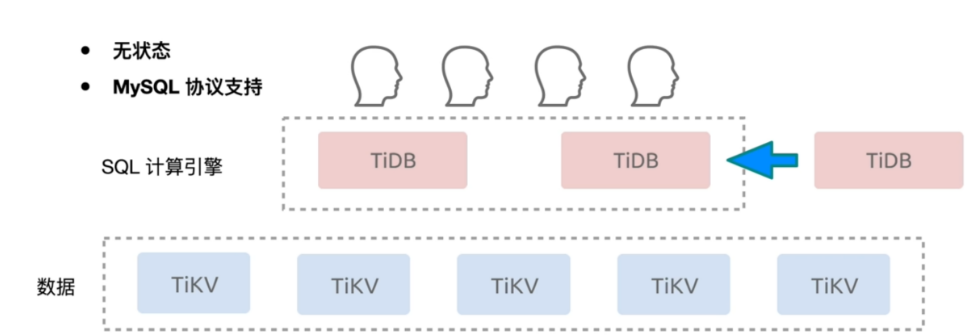
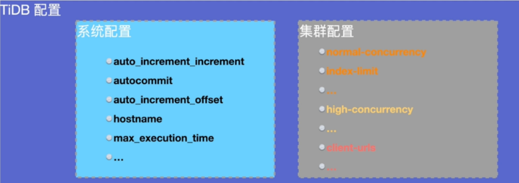
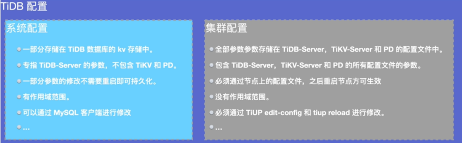
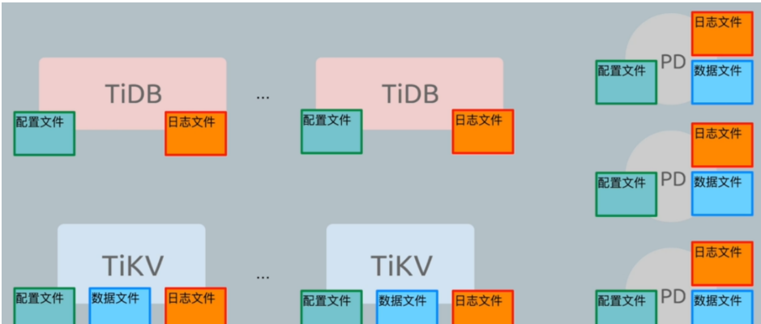
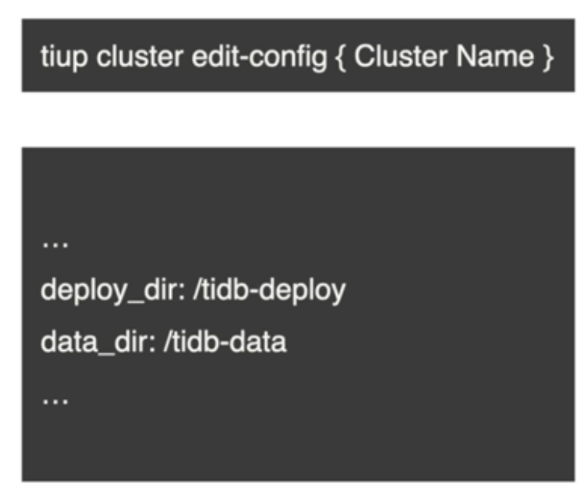
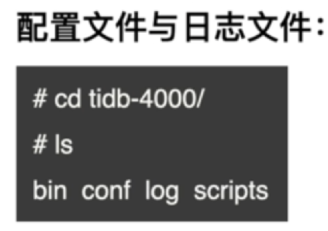
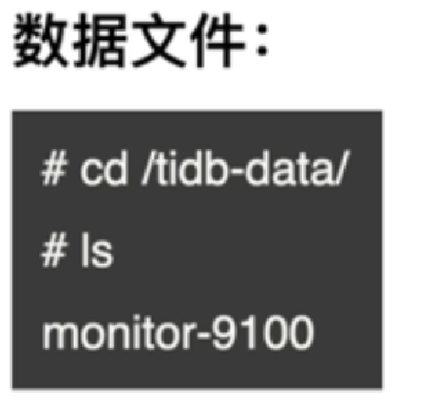
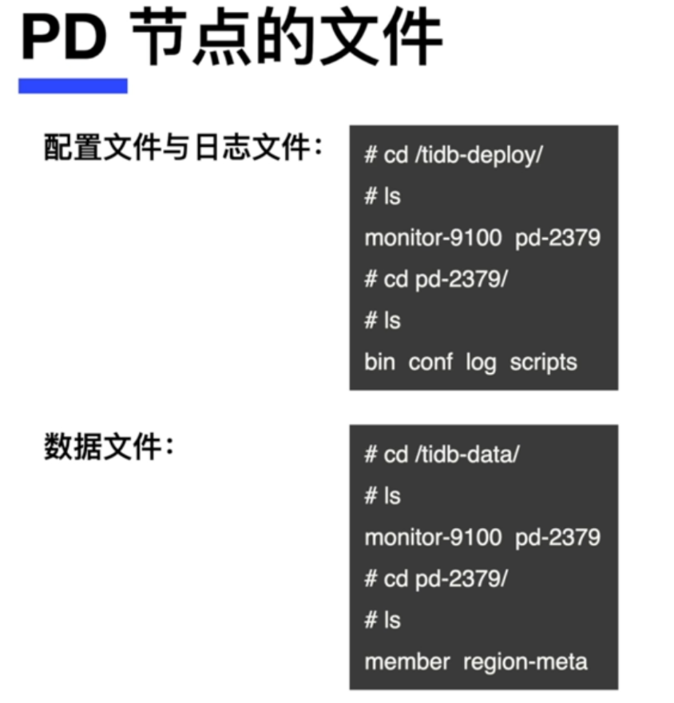
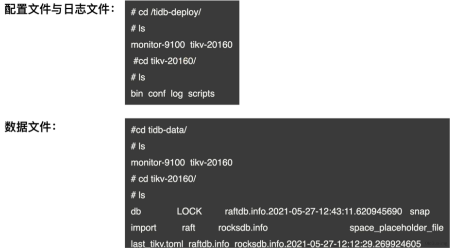

# 基础管理


## 一、连接管理和参数管理

### 1、连接管理

#### 1.连接服务介绍



#### 2.对于MySQL协议支持

>100% 兼容MySQL 5.7的协议
>支持MySQL 5.7 常用功能及语法

#### 3.语法支持和限制

>1.存储过程函数
>2.触发器
>3.外键
>4.一部分函数
>
>...

#### 4.使用MySQL命令行客户端连接

```bash
mysql --host IP --port PORT -uUSER -p
```

#### 5.使用GUI工具连接TiDB

>navicat
>workbench
>sqlyog
>...

### 2、日常参数配置

#### 1.TiDB的参数分类



>系统参数：TiDB Server相关配置，不包括PD和TiKV，参数持久化到TiKV中。可以在线生效。
>
>集群配置：集群相关组件的配置。保存到各个组件本地。需要重启指定节点生效。



#### 2.TiDB参数的作用范围

>global
>session

#### 3.TiDB 数据库参数修改及查询

```mysql
set global auto_increment_increment=10;
set auto_increment_increment=10;
show session variables like 'auto_increment_increment';
show global variables like 'auto_increment_increment';
```

#### 4.TiDB 集群参数修改及查询

```bash
# 开启编辑模式
tidb cluster edit-config ${cluster-name}

# 修改参数
server_configs:
  tidb: {}
  tikv:
    log-level: warning

# 重新加载配置
tidb cluster reload ${cluster-name} [-n <nodes>] [-R <roles>]

#查询
show config
```

## 二、用户和权限管理

### 

### 1、用户的管理

```mysql
create user xiaowu@'10.0.0.%' identified by '123';
drop user
alter user
```

### 2、权限和角色管理

```mysql
create role r_manager, r_staff;
drop role r_staff;
grant insert, update, delete on test.* to r_manager;
grant r_manager to 'baifa'@'172.16.6.212';
set role all;
```

### 

## 三、TiDB Cluster的文件和日志管理

### 



### 1、Tidb Cluster 配置文件介绍



### 2、TiDB Server节点的文件





### 3、PD节点的的文件介绍



### 4、TiKV 节点文件介绍


