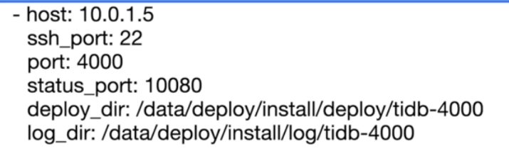
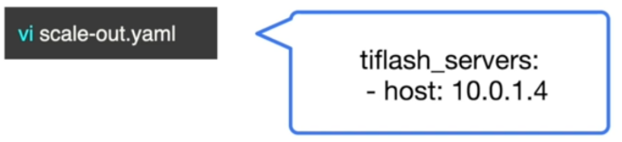

# 集群扩缩容

## 一、在线扩容/缩容：TiDB 、TiKV、PD

### 1、扩容

#### 1.编辑扩容文件



>vim scale.out.yaml
>
>```bash
>tikv_servers:
> - host: 172.16.6.157
>   ssh_port: 22
>   port: 20160
>   status_port: 20180
>   deploy_dir: /tidb-deploy/tikv-20160
>   data_dir: /tidb-data/tikv-20160
>   log_dir: /tidb-deploy/tikv-20160/log
>```

#### 2.运行扩容命令

```bash
tiup cluster scale-out xiaowu-cluster scale-out.yaml
```

#### 3.确认节点

```bash
tiup cluster display xiaowu-cluster
```

### 2、缩容

```bash
# 1. 查看节点ID
tiup clustger display xiaowu-cluster
# 2. 缩容
tiup cluster scale-in xiaowu-cluster --node NODE-IP:NODE-PORT
# 3. 检查集群
tiup cluster display xiaowu-cluster
```

## 二、在线扩容缩容：TiFlash

### 1、扩容

#### 1.确认当前版本是否支持Tiflash

#### 2.enable-placement-rules 参数开启

```bash
tiup ctl:<cluster-version> pd -u http://<pd_ip>:<pd_port> config set enable-placement-rules true
```

#### 3.编辑扩容文件



#### 4.运行扩容命令

```bash
tiup cluster scale-out xiaowu-cluster scale-out.yaml
```

#### 5.确认节点

```bash
tiup cluster display xiaowu-cluster
```

### 2、缩容

#### 1.根据TiFlash 剩余节点数据调整数据表的副本数

```mysql
alter table DB-NAME.TABLE-name set tiflash replica 0;
```

#### 2.确认表的副本确认被删除

```mysql
select * from information_schema.tiflash_replica where table_schema='DB_NAME' and TABLE_NAME='TABLE_NAME';
```

#### 3.查看节点ID信息

```bash
tiup cluster display xiaowu-cluster
```

#### 4.执行缩容操作

```bash
tiup cluster scale-in xiaowu-cluster --node NODE-IP:NODE-PORT
```

#### 5.检查集群状态

```bash
tiup cluster display xiaowu-cluster
```

## 三、集群重命名

```bash
tiup cluster rename xiaowu-cluster tidb-test;
```

## 四、删除集群数据、日志、重建集群

```bash
tiup cluster clean xiaowu-cluster --log
tiup cluster clean xiaowu-cluster --data
tiup cluster clean xiaowu-cluster --all
tiup cluster destroy xiaowu-cluster
```

## 五、时区管理

```mysql
set global time_zone='UTC'

time_zone='+8:00'
```


