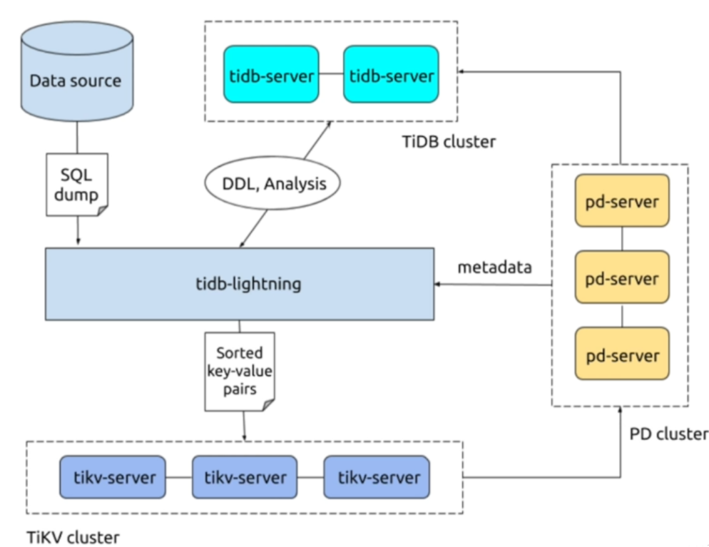
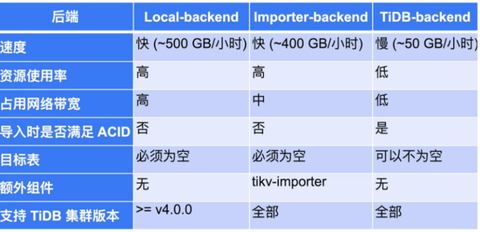

# 备份恢复实战

## 一、备份类型介绍

>冷备
>温备
>热备

## 二、备份方式介绍

>逻辑：
>    dumpling/lightning
>物理备份：
>    BR

## 三、BR备份实战

### 1、下载工具

```bash
wget https://download.pingcap.org/tidb-toolkit-v5.2.1-linux-amd64.tar.gz
```

### 2、BR的使用

#### 1.下载安装

```bash
tar xvf tidb-toolkit-v5.0.1-linux-amd64.tar.gz
cd tidb-toolkit-v5.0.1-linux-amd64/bin/
```

#### 2.注意事项

>在所有的 TiKV 节点创建文件夹 /tmp/backup,用来存储本节点的备份文件(SST文件) 并将文件夹的权限设置为可以读写｡ 首先登录到 TiKV 节点,之后执行:

```bash
mkdir /tmp/backup
chmod 777 /tmp/backup
```

#### 3.全备

```bash
./br backup full --pd "10.0.0.11:2379" --storage "local:///tmp/backup" --ratelimit 120 --log-file backupfull.log
```

**参数介绍**

>--pd"10.0.0.11:2379":连接TiDB数据库的PD节点,最好在PD节点上执行,即连接本节点｡
>--storage"local:///tmp/backup":备份文件存储在TiKV节点上的位置｡
>--ratelimit120:对于备份所用存储带宽限速,以免影响线上业务｡
>--log-filebackupfull.log:备份日志文件｡)

#### 4.单库备份

```bash
mkdir -p /tmp/worldbak
chmod 777 /tmp/worldbak

./br backup db --pd "10.0.0.11:2379" --db employees --storage "local:///tmp/worldbak" --ratelimit 120 --log-file backupdb.log

cd tidb-toolkit-v5.0.1-linux-amd64/bin/

./br restore db --pd "10.0.0.11:2379" --db "world" --storage "local:///tmp/worldbak" --log-file restoredb.log
```

#### 5.单标备份

```bash
mkdir /tmp/citybak
chmod 777 /tmp/citybak

./br backup table --pd "10.0.0.11:2379" --db world --table city --storage "local:///tmp/citybak" --ratelimit 120 --log-file backuptable.log
./br restore table --pd "10.0.0.11:2379" --db "world" --table "city" --storage "local:///tmp/citybak" --log-file restoretable.log
```

## 四、TiDB Dumpling工具实战

### 1、介绍

>逻辑导出工具，可以讲TiDB、MySQL数据导出为SQL或者CSV，用于逻辑备份或迁移。
>1. 支持多种数据形式：SQL、CSV
>2. 逻辑导出
>3. 只是表过滤和数据过滤筛选
>4. 支持导出到Amazon S3 云盘
>5. 针对TiDB做了优化

### 2、使用场景

>1、 适合数据量小的导出
>2、 异构平台迁移
>3、 导出效率要求不高的场景

### 3、应用实战

#### 1.安装

```bash
tiup install dumpling
或者：
tidb-toolkit 包含
```

#### 2.最小权限要求

```mysql
select
reload
lock tables
replication client
```

#### 3.单表导出应用

```bash
./dumpling -uroot -ptidb -P4000 -h 172.16.6.212 --filetype sql -t 8 -o /tmp/city -r 200000 -F 256MiB -T world.city
```

**参数介绍**

>-uroot :用户名为 root
>-P4000 : 端口号为4000
>-h 172.16.6.212 :主机 IP 为 172.16.6.212;
>-p : 密码
>--filetype sql :导出文件类型为 SQL 文件｡
>-t 8 :采用 8 线程同时导出｡
>-o /tmp/city :导出文件保存在 /tmp/city 中｡
>-r 200000 :每个导出文件最大容纳 200000 行数据｡
>-F 256MiB :每个导出文件最大 256 MiB｡

#### 4.单库导出使用

```bash
./dumpling -uroot -ptidb -P4000 -h 172.16.6.212 --filetype sql -t 8 -o /tmp/world -r 200000 -F 256MiB -B world
```

#### 5.导出数据的一致性保证

```bash
--consistency flush/snapshot/lock/none/auto

./dumpling --snapshot "2021-07-02 23:00:00"
```

## 五、TiDB Lightning 工具

### 1、介绍



>将dumpling导出的数据全量导入TiDB

>导入模式--》建立schema和表--》分割表--》读取SQL dump--》写入本地临时存储文件--》导入数据到TiKV集群--》校验与分析--》普通模式



### 2、实战

#### 1.工具配置使用

```bash
cd tidb-toolkit-v5.0.1-linux-amd64/bin/
vim tidb-lightning.toml
```

```bash
[lightning]
# 日志
level = "info"
file = "tidb-lightning.log"
[tikv-importer]
# 选择使用的 local 后端
backend = "local"
# 设置排序的键值对的临时存放地址，目标路径需要是一个
空目录
sorted-kv-dir = "/tmp"
[mydumper] # 源数据目录。
data-source-dir = "/tmp/world/"
[tidb]
# 目标集群的信息
host = "172.16.6.212"
port = 4000
user = "root"
# 表架构信息在从 TiDB 的“状态端口”获取。
status-port = 10080
# 集群 pd 的地址
pd-addr = "10.0.0.11:2379"

#!/bin/bash
nohup ./tidb-lightning -config tidb-lightning.toml > nohup.out &
```

#### 2.断点续传

```bash
# 断点续传参数配置
[checkpoint]
enable = true
# 断点的存储
driver = 'file'
# 断点续传的控制
--checkpoint-error-destroy : 让失败的表从同开始导入
--checkpoint-error-ignore : 清除出错状态，忽略错误继续导。
--checkpoint-remove : 清除断点，不断点续传
```

#### 3.数据过滤(4.0+)

```bash
[mydumper]
filter = ['a*.*','b*.*']
```

#### 4.TiDB lightning web管理

```bash
[lightning]
server-mode = true
status-addr = ':8289'
```


