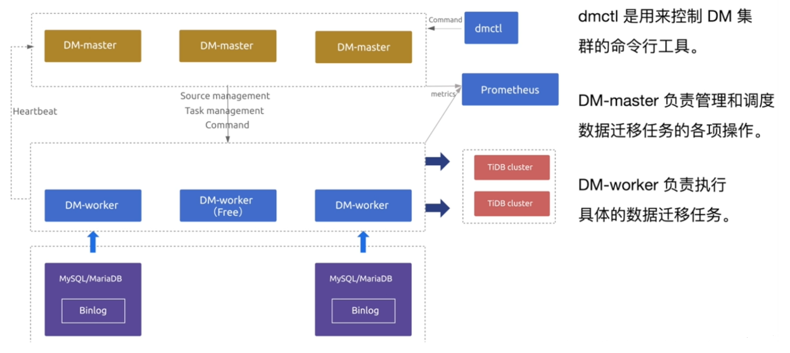
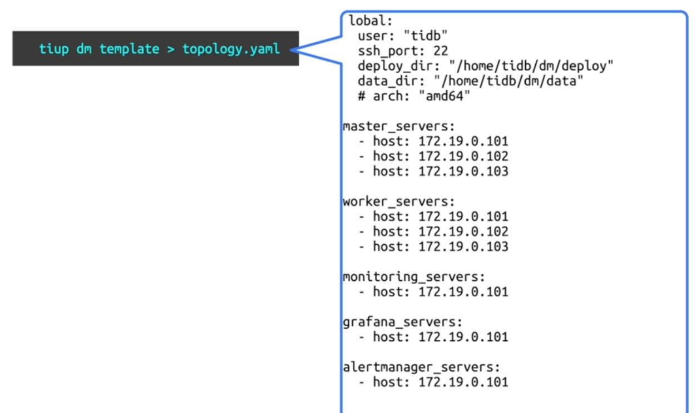
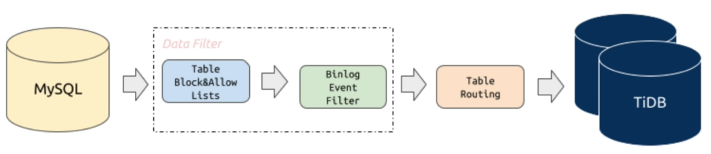

# DM工具实现数据迁移

## 一、介绍

>从兼容MySQL协议的数据源，将数据(异步)迁移到TiDB中。支持全量和增量数据传输。可以数据过滤，可以将源端的分库分表数据合并迁移。



## 二、安装基本配置



### 1、安装配置DM

```bash
tiup install dm
tiup update --self && tiup update dm
tiup dm template > topology.yaml
tiup list dm-master
```

### 2、启动DM

```bash
tiup dm deploy dm-test v5.0.0-nightly-20210531 ./topology.yaml --user root -p
tiup dm list
tiup dm start dm-test
tiup dm display dm-test
```

### 3、获取dmctl工具

```bash
tiup dmctl:v5.0.0-nightly-20210531
```

## 三、DM工具的同步任务管理



### 1、源端配置

#### 1.创建用户

#### 2.修改配置文件

>vim mysql-source-conf1.yaml

```yaml
source-id: "mysql-replica-01"
enable-gtid: true
from:
  host: "10.0.0.11"
  user: "root"
  password: "123"
  port: 3306

+++++
tiup dmctl -encrypt '123'
+++++
```

#### 3.加载源配置文件

```bash
tiup dmctl --master-addr=10.0.0.11:8261 operate-source create mysql-source-conf1.yaml
```

#### 4.查看数据源

```bash
tiup dmctl --master-addr=10.0.0.11:8261 get-config source mysql-replica-01
```

#### 5.查看数据源和DM-Worker对应关系

```bash
tiup dmctl --master-addr=10.0.0.11:8261 operate-source show
```

### 2、任务配置模版

>vim dm-task.yaml

```yaml
name: "dm-taskX"
task-mode: all
ignore-checking-items:
["auto_increment_ID"]
target-database:
  host: "172.16.6.212"
  port: 4000
  user: "root"
  password: "tidb"
mysql-instances:
- source-id: "mysql-replica-01"
  route-rules: ["instance-1-user-rule","sale-route-rule"]
  filter-rules: ["trace-filter-rule","user-filter-rule" , "store-filter-rule"]
  block-allow-list: "log-ignored"
  mydumper-config-name: "global"
  loader-config-name: "global"
  syncer-config-name: "global"
- source-id: "mysql-replica-02"
  route-rules: ["instance-2-user-rule","instance-2-store-rule","sale-route-rule"]
  filter-rules: ["trace-filter-rule","user-filter-rule" , "store-filter-rule"]
  block-allow-list: "log-ignored"
  mydumper-config-name: "global"
  loader-config-name: "global"
  syncer-config-name: "global"
# 所有实例的共有配置
routes:
    instance-1-user-rule:
        schema-pattern: "user"
        target-schema: "user_north"
    instance-2-user-rule:
        schema-pattern: "user"
        target-schema: "user_east"
    instance-2-store-rule:
        schema-pattern: "store"
        table-pattern: "store_sz"
        target-schema: "store"
        target-table: "store_suzhou"
    sale-route-rule:
        schema-pattern: "salesdb"
        target-schema: "salesdb"
filters:
    trace-filter-rule:
        schema-pattern: "user"
        table-pattern: "trace"
        events: ["truncate table", "drop table","delete"]
        action: Ignore
    user-filter-rule:
        schema-pattern: "user"
        events: ["drop database"]
        action: Ignore
    store-filter-rule:
        schema-pattern: "store"
        events: ["drop database", "truncate table", "drop table", "delete"] action:Ignore
block-allow-list:
	log-ignored:
		ignore-dbs: ["log"]
mydumpers:
	global:
		threads: 4
		chunk-filesize: 64
```

### 3、检查配置

```bash
tiup dmctl --master-addr=10.0.0.11:8261 check-task dm-task.yaml
```

### 4、开启迁移任务

```bash
tiup dmctl --master-addr=10.0.0.11:8261 start-task dm-task.yaml
```

### 5、查看任务状态

```bash
tiup dmctl --master-addr=10.0.0.11:8261 query-status dm-task.yaml
```

### 6、控制迁移任务

#### 1.暂停任务

```bash
tiup dmctl --master-addr=10.0.0.11:8261 pause-task dm-task.yaml
```

#### 2.恢复任务

```bash
tiup dmctl --master-addr=10.0.0.11:8261 resume-task dm-task.yaml
```

#### 3.停止任务

```bash
tiup dmctl --master-addr=10.0.0.11:8261 stop-task dm-task.yaml
```

### 7、扩容DM 节点

> vim dm-scale.yaml

```bash
worker_servers:
  - host: 10.0.0.11
```

```bash
tiup dm scale-out dm-test dm-scale.yaml -uroot -p
tiup dm display dm-test
```

