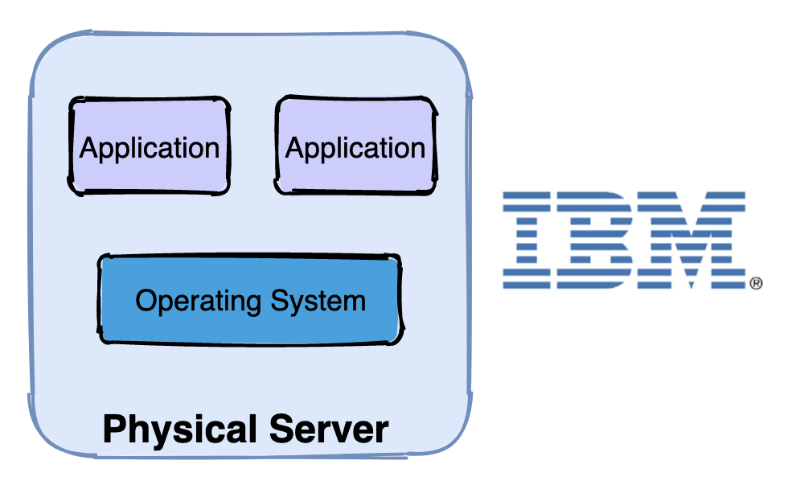
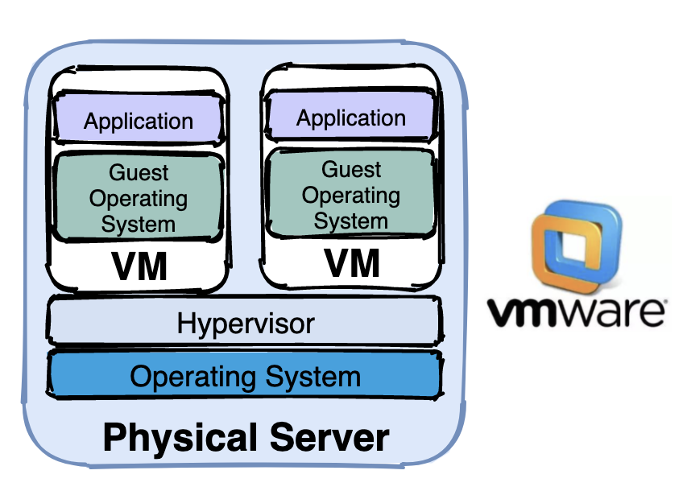
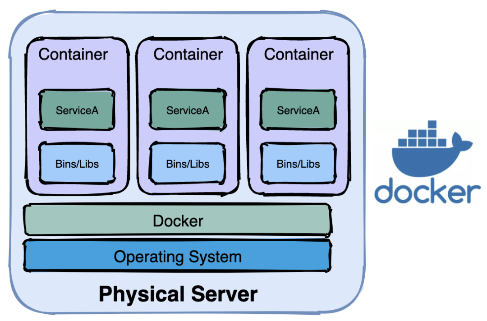
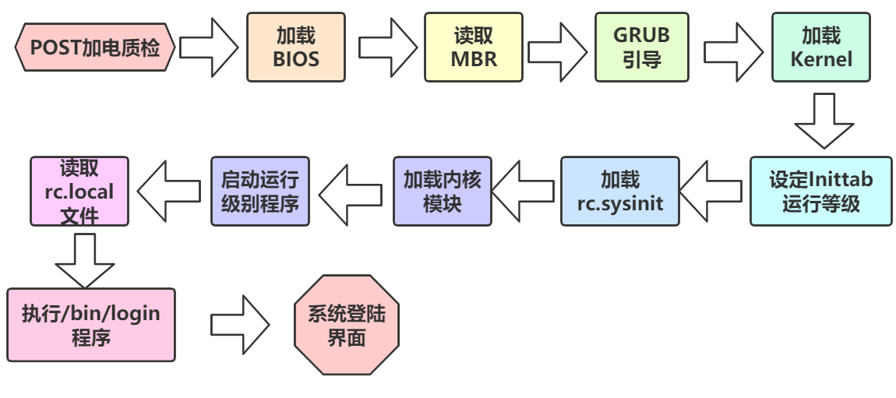

# docker的介绍

## 一、什么是容器？

```bash
	容器就是在隔离的环境运行的一个进程，如果进程停止，容器就会退出。隔离的环境拥有自己的系统文件，ip地址，主机名等
```

## 二、容器化的由来

> 虚拟化技术已经走过了三个时代，没有容器化技术的演进就不会有 Docker 技术的诞生。


### 1、物理机时代

>多个应用程序可能会跑在一台机器上。



### 2、虚拟机时代

> 一台物理机器安装多个虚拟机（VM），一个虚拟机跑多个程序。




### 3、容器化时代

> 一台物理机或者虚拟机安装多个容器实例（container），一个容器跑多个程序。



### 4、容器化的优势

>容器化解决了软件开发过程中一个令人非常头疼的问题，用一段对话描述：

>测试人员：你这个功能有问题。
>开发人员：我本地是好的啊。

>   开发人员编写代码，在自己本地环境测试完成后，将代码部署到测试或生产环境中，经常会遇到各种各样的问题。明明本地完美运行的代码为什么部署后出现很多 bug，原因有很多：不同的操作系统、不同的依赖库等，总结一句话就是因为本地环境和远程环境不一致。

> ​    容器化技术正好解决了这一关键问题，它将软件程序和运行的基础环境分开。开发人员编码完成后将程序打包到一个容器镜像中，镜像中详细列出了所依赖的环境，在不同的容器中运行标准化的镜像，从根本上解决了环境不一致的问题。

## 三、什么是Docker？

> ​    Docker是一个开源项目，诞生于2013年初，最初是dotCloud公司内部的一个业余项目。
>
> ​    它基于Google公司推出的Go语言实现。项目后来加入了Linux基金会，遵从了Apache2.0协议，项目代码在GitHub上进行维护。
>
> ​    Docker自开源后受到广泛的关注和讨论，以至于dotCloud公司后来都改名为DockerInc。Redhat已经在其RHEL6.5中集中支持Docker；Google也在其PaaS产品中广泛应用。
>
> ​    Docker项目的目标是实现轻量级的操作系统虚拟化解决方案。Docker的基础是Linux容器（LXC）等技术。在LXC的基础上Docker进行了进一步的封装，让用户不需要去关心容器的管理，使得操作更为简便。
>
> ​    用户操作Docker的容器就像操作一个快速轻量级的虚拟机一样简单。Docker可以让开发者打包他们的应用以及依赖包到一个轻量级、可移植的容器中，然后发布到任何流行的Linux机器上，也可以实现虚拟化。
>
> ​    容器是完全使用沙箱机制，相互之间不会有任何接口（类似iPhone的app）,更重要的是容器性能开销极低。

## 四、为什么要使用Docker？

### 1、Docker容器虚拟化的好处

> ​    在云时代，开发者创建的应用必须要能很方便地在网络上传播，也就是说应用必须脱离底层物理硬件的限制；
>
> ​    同时必须满足“任何时间任何地点”可获取可使用的特点。
>
> ​    因此，开发者们需要一种新型的创建分布式应用程序的方式，快速分发部署，而这正是Docker所能够提供的最大优势。
>
> ​    Docker提供了一种更为聪明的方式，通过容器来打包应用、解耦应用和运行平台。
>
> ​    这意味着迁移的时候，只需要在新的服务器上启动需要的容器就可以了，无论新旧服务器是否是同一类别的平台。
>
> ​    这无疑帮助我们节约了大量的宝贵时间，并降低部署过程出现问题的风险。


### 2、Docker在开发和运维中的优势

> ​    对于开发和运维人员来说，最梦寐以求的效果可能就是一次创建和配置，之后可以在任意地方、任意时间让应用正常运行，而Docker恰恰可以实现这一中级目标。具体来说，在开发和运维过程中，Docker具有以下几个方面的优势：

#### 1.更快的交付和部署：

> ​    使用Docker，开发人员可以使用镜像来快速构建一套标准的开发环境；开发完之后，测试和运维人员可以直接使用完全相同的环境来部署代码。只要是开发测试过的代码，就可以确保在生产环境无缝运行。Docker可以快速创建和删除容器，实现快速迭代，节约开发、测试及部署的时间。

#### 2.更高效的利用资源：

> ​    运行Docker容器不需要额外的虚拟化管理程序的支持，Docker是内核级的虚拟化，可以实现更高的性能，同时对资源的额外需求很低，与传统的虚拟机方式相比，Docker的性能要提高1~2个数量级。

#### 3.更轻松的迁移和扩展：

> ​    Docker容器几乎可以在任意的平台上运行，包括物理机、虚拟机、公有云、私有云、个人电脑等等，同时支持主流的操作系统发行版本。这种兼容性能让用户可以在不同的平台之间轻松的迁移应用。

#### 4.更轻松的管理和更新：

> ​    使用Dockerfile，只需要小小的配置修改，就可以替代以往大量的更新工作。所有的修改都以增量的方式被分发和更新，从而实现自动化并且高效的容器管理。

#### 5.解决异构环境


## 五、Docker容器与传统虚拟化的区别

> ​    Docker以及其他容器技术，都属于操作系统虚拟化范畴，操作系统细腻化最大的特点就是不需要额外的supervisor支持。Docker虚拟化方式之所以有众多优势，跟操作系统虚拟化技术自身的设计和实现分不开。
> ​    传统方式是在硬件层面实现虚拟化，需要有额外的虚拟机管理应用和虚拟机操作系统层。Docker容器时在操作系统层面实现虚拟化，直接复用本地主机的操作系统，因此更加轻量级。


### 1、区别

```bash
虚拟机: 硬件cpu支持(vt虚拟化),模拟计算硬件,走正常的开机启动
```



```bash
2、容器: 不需要走开机启动流程，不需要硬件cpu的支持,共用宿主机内核去启动容器的第一个进程。

3、容器优势: 启动快,性能高,损耗少,轻量级

     100个虚拟机运行100个服务需要10台物理机

     100个容器运行100个服务需要大约6台物理机
```


### 2、Docker的优势

```bash
	作为一种轻量级的虚拟化方式，Docker在运行应用上跟传统的虚拟机的方式相比具有如下显著优势：
	
1、Docker容器启动很快，启动和停止可以实现秒级，相比传统的虚拟机方式（分钟级）要快速很多。

2、Docker容器对系统资源需求很少，一台主机上可以同时运行数千个Docker容器。

3、Docker通过类似git设计理念的操作来方便用户获取、分发和更新应用镜像，存储复用，增量更新。

4、Docker通过Dockerfile支持灵活的自动化创建和部署机制，可以提高工作效率，并标准化流程。
```


## 六、Docker的核心概念

Docker中有三个核心概念：镜像、容器和仓库。因此，准确把握这三大概念对于掌握Docker技术尤为重要。

### 1、镜像（Image）

```bash
Docker镜像（Image），就相当于是一个root文件系统。比如官方镜像ubuntu:16.04就包含了完整的一套Ubuntu16.04最小系统的root文件系统。
```


### 2、容器（Container）

```bash
镜像（Image）和容器（Container）的关系，就像是面向对象程序设计中的类和实例一样，镜像是静态的定义，容器是镜像运行时的实体。容器可以被创建、启动、停止、删除、暂停等
```


### 3、仓库（Repository）

```bash
用来保存镜像的仓库。当我们构建好自己的镜像之后，需要存放在仓库中，当我们需要启动一个镜像时，可以在仓库中下载下来。
```

