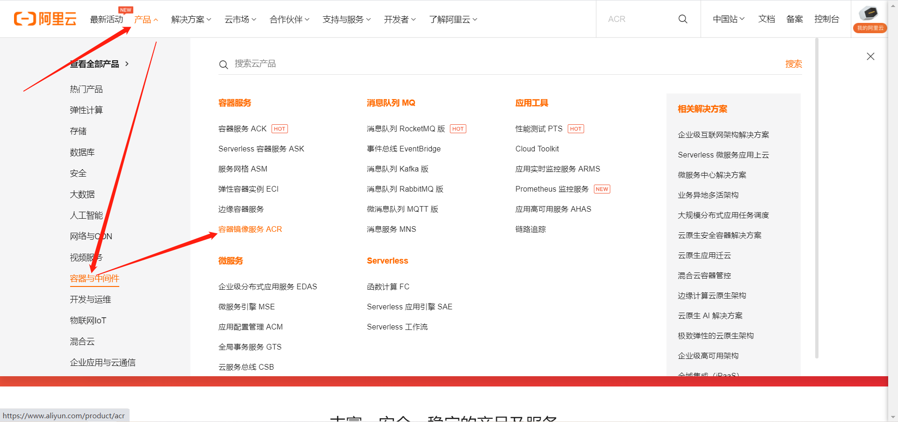
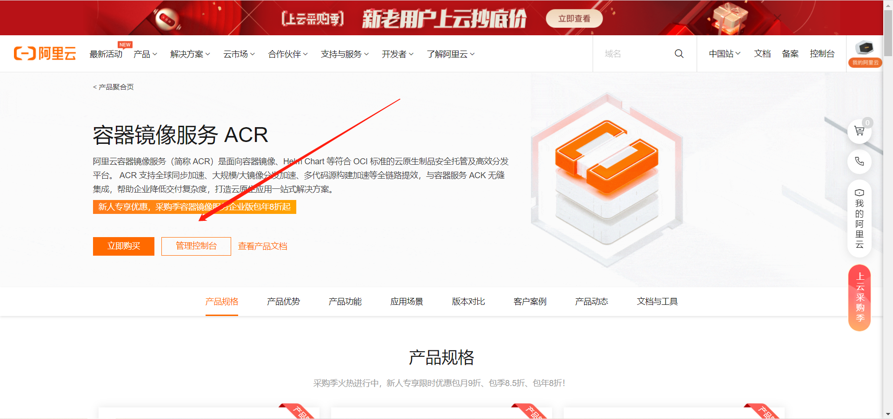

# docker的安装

## 一、如果之前安装过docker，卸载

```bash
yum remove docker docker-common docker-selinux docker-engine -y
```


## 二、更新yum源

```bash
curl -o /etc/yum.repos.d/CentOS-Base.repo https://repo.huaweicloud.com/repository/conf/CentOS-7-reg.repo
yum install -y https://repo.huaweicloud.com/epel/epel-release-latest-7.noarch.rpm

sed -i "s/#baseurl/baseurl/g" /etc/yum.repos.d/epel.repo
sed -i "s/metalink/#metalink/g" /etc/yum.repos.d/epel.repo
sed -i "s@https\?://download.fedoraproject.org/pub@https://repo.huaweicloud.com@g" /etc/yum.repos.d/epel.repo

yum clean all
yum makecache
```


## 三、如果是新安装的系统，可以更新操作系统和内核

```bash
yum update -y
```


## 四、添加docker-ce yum源

```bash
wget -O /etc/yum.repos.d/docker-ce.repo https://repo.huaweicloud.com/docker-ce/linux/centos/docker-ce.repo

# 清除rpm包及header
yum clean all

# 重新缓存远端服务器rpm包信息
yum makecache
```


## 五、添加阿里云镜像加速器







```bash
mkdir -p /etc/docker
tee /etc/docker/daemon.json <<-'EOF'
{
  "registry-mirrors": ["https://qi3pe2qe.mirror.aliyuncs.com"]
}
EOF
systemctl daemon-reload
```


## 六、安装Docker

```bash
yum install docker-ce -y

yum install docker-compose -y
```


## 七、启动并设置开机自启

```bash
[root@docker01 ~]# systemctl start docker
[root@docker01 ~]# systemctl enable docker

```


## 八、检查docker是否启动成功

```bash
[root@docker01 ~]# docker info
[root@docker01 ~]# docker version
```