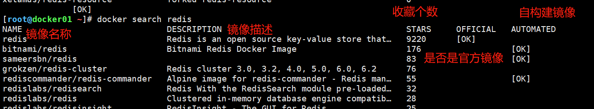
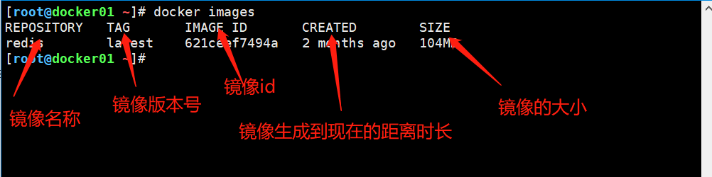

# docker镜像命令

## 一、常用镜像仓库

```bash
官方仓库：hub.docker.com
自己的私有仓库：Harbor
阿里云私有仓库：registry.cn-hangzhou.aliyuncs.com
```


## 二、docker镜像常用命令

```bash
1、docker search [镜像名称]  		  		 #搜索镜像, 优先选官方,stars数量多

2、docker pull [镜像名称]    				 #拉取镜像(下载镜像)，注意版本

3、docker push [镜像标签]    				 #推送镜像(上传镜像)

4、docker load < [包名称]    				  #将包导入镜像
   例子: docker load  -i  docker_nginx.tar.gz

5、docker save [镜像名称|镜像ID] > [包名称]    #将包导出镜像导出镜像
   例子:docker save centos:7 -o docker_centos7.tar.gz

6、docker image  ls   						#查看镜像列表

7、docker rmi [镜像名称或者镜像ID]   		 #删除镜像

8、docker tag [镜像ID]  镜像标签      		   #给镜像打标签
```


## 三、docker镜像命令使用及进阶

### 1、搜索镜像search

```bash
格式
	docker search [镜像名称]
	
#参数
	-f 筛选

#搜索收藏大于等于600
[root@docker01 ~]# docker search mysql -f stars=600

#搜索官方镜像
[root@docker01 ~]# docker search -f is-official=true mysql

```




### 2、拉取镜像pull

```bash
格式
	docker pull [镜像名称]
```

```bash
实例
[root@docker01 ~]# docker pull redis
Using default tag: latest
latest: Pulling from library/redis

#镜像层：
a076a628af6f: Pull complete 
f40dd07fe7be: Pull complete 
ce21c8a3dbee: Pull complete 
ee99c35818f8: Pull complete 
56b9a72e68ff: Pull complete 
3f703e7f380f: Pull complete 

#镜像ID号，全球唯一
Digest: sha256:0f97c1c9daf5b69b93390ccbe8d3e2971617ec4801fd0882c72bf7cad3a13494

#镜像下载状态
Status: Downloaded newer image for redis:latest

#镜像的全称（镜像的tag）
docker.io/library/redis:latest
```


### 3、查看当前镜像列表images

```bash
# 格式
	docker images 或者 docker image ls
	
# 参数
	-q : 只显示镜像ID
    [root@docker01 ~]# docker images -q
    621ceef7494a

```




### 4、获取镜像详细信息inspect

```bash
# 格式
	docker inspect [镜像名称或镜像ＩＤ]

# 参数
-f : 格式化输出
[root@Centos7 ~]# docker inspect -f '{{.Id}}' 621ceef7494a
sha256:621ceef7494adfcbe0e523593639f6625795cc0dc91a750629367a8c7b3ccebb
[root@Centos7 ~]# docker inspect -f '{{.ContainerConfig.Hostname}}' redis
16535cfaf84a
```


### 5、登录镜像仓库login

```bash
# 格式
	docker login 
	注： 默认情况下，docker login登录的是官方仓库，如果登录其他镜像仓库则需要指定镜像仓库的URL连接。

# 参数
--username|-u : 指定用户名
--password|-p : 指定密码

[root@docker01 ~]# docker login -u 1426115933
Password: 
WARNING! Your password will be stored unencrypted in /root/.docker/config.json.
Configure a credential helper to remove this warning. See
https://docs.docker.com/engine/reference/commandline/login/#credentials-store
Login Succeeded

[root@docker01 ~]# docker login --username=武宜帅 registry.cn-hangzhou.aliyuncs.com
Password: 
WARNING! Your password will be stored unencrypted in /root/.docker/config.json.
Configure a credential helper to remove this warning. See
https://docs.docker.com/engine/reference/commandline/login/#credentials-store

Login Succeeded


[root@docker01 ~]# cat .docker/config.json 
{
	"auths": {
		"https://index.docker.io/v1/": {
			"auth": "MTQyNjExNTkzMzpXdTE1NTg4MTk4OTA5LjA="
		},
		"registry.cn-hangzhou.aliyuncs.com": {
			"auth": "5q2m5a6c5biFOld1MTU1ODgxOTg5MDkuMA=="
		}
	}
}[root@docker01 ~]# 


```


### 6、镜像标签tag

```bash
# 镜像标签的构成
docker.io/library/redis:latest
docker.io  : 镜像仓库的URL
library    ：镜像仓库命名空间
redis	   : 镜像名称
latest	   : 镜像版本号

# 打标签
	# 格式
		docker tag [镜像ID]  镜像标签
		
# 实例

[root@docker01 ~]# docker tag 621ceef7494a registry.cn-hangzhou.aliyuncs.com/wxyuan/test/redis:v1
[root@docker01 ~]# docker images -a
REPOSITORY                                            TAG       IMAGE ID       CREATED        SIZE
redis                                                 latest    621ceef7494a   2 months ago   104MB
registry.cn-hangzhou.aliyuncs.com/wxyuan/test/redis   v1        621ceef7494a   2 months ago   104MB

```


### 7、镜像上传push

```bash
# 格式
	docker push [镜像标签]

# 注：要想上传镜像，首先得登录镜像仓库,其次设置对应镜像仓库的tag

[root@docker01 ~]# docker push registry.cn-hangzhou.aliyuncs.com/wxyuan/test/redis:v1 
The push refers to repository [registry.cn-hangzhou.aliyuncs.com/wxyuan/test/redis]
3480f9cdd491: Pushed 
a24a292d0184: Pushed 
f927192cc30c: Pushed 
1450b8f0019c: Pushed 
8e14cb7841fa: Pushed 
cb42413394c4: Pushed 
v1: digest: sha256:7ef832c720188ac7898dbd8d1e237b0738e94f94fc7e981cb7b8efe84555e892 size: 1572

```


### 8、镜像删除 rmi

```bash
# 格式
	docker rmi [镜像名称或者镜像ID]
# 实例
	[root@docker01 ~]# docker rmi redis
    Untagged: redis:latest
    Untagged: redis@sha256:0f97c1c9daf5b69b93390ccbe8d3e2971617ec4801fd0882c72bf7cad3a13494
# 参数
	-f  : 强制删除
	
# 实例
	[root@docker01 ~]# docker rmi -f 621ceef7494a
```


### 9、清空镜像image prune

```bash
docker image prune命令用于删除未使用的映像。 如果指定了-a，还将删除任何容器未引用的所有映像。
# 格式
	docker image prune
	
 # 参数
 -a : 删除所有镜像

# 实例
[root@docker01 ~]# docker image prune 
WARNING! This will remove all dangling images.
Are you sure you want to continue? [y/N] y
Total reclaimed space: 0B

docker rmi -f $( docker images -q )


oot@docker01 ~]# docker image prune -a
WARNING! This will remove all images without at least one container associated to them.
Are you sure you want to continue? [y/N] y
Deleted Images:
untagged: nginx:latest
untagged: nginx@sha256:10b8cc432d56da8b61b070f4c7d2543a9ed17c2b23010b43af434fd40e2ca4aa
deleted: sha256:f6d0b4767a6c466c178bf718f99bea0d3742b26679081e52dbf8e0c7c4c42d74
deleted: sha256:4dfe71c4470c5920135f00af483556b09911b72547113512d36dc29bfc5f7445
deleted: sha256:3c90a0917c79b758d74b7040f62d17a7680cd14077f734330b1994a2985283b8
deleted: sha256:a1c538085c6f891424160d8db120ea093d4dda393e94cd4713e3fff3c82299b5
deleted: sha256:a3ee2510dcf02c980d7aff635909612006fd1662084d6225e52e769b984abeb5
untagged: redis:latest
untagged: redis@sha256:0f97c1c9daf5b69b93390ccbe8d3e2971617ec4801fd0882c72bf7cad3a13494
deleted: sha256:621ceef7494adfcbe0e523593639f6625795cc0dc91a750629367a8c7b3ccebb
deleted: sha256:de66cfbf4712b8ba9ef292e08ef7487be26d9d21b350548e400ae351405d820e
deleted: sha256:79b2381e35429e8fc04d31b3445f069c22d288bf5c4cba7b7c10004ff78ae201
deleted: sha256:1d047d19be363b00139990d4d7f392dabdb0809dbc9d0fbe67c1f15b8caed27a
deleted: sha256:8c41f4e708c37059df28ae1cabc200a6db2fee45bd3a2cadcf70f2765bb68730
deleted: sha256:b51317bef36fe1900be48402c8a41fcd9cdb6b8950c10209f764473cb8323371
deleted: sha256:cb42413394c4059335228c137fe884ff3ab8946a014014309676c25e3ac86864

Total reclaimed space: 168MB


```


### 10、查看镜像构建历史 history

```bash
# 格式
	docker history [镜像ID或镜像名称]
# 实例


[root@docker01 ~]# docker pull alpine
Using default tag: latest
latest: Pulling from library/alpine
596ba82af5aa: Pull complete 
Digest: sha256:d9a7354e3845ea8466bb00b22224d9116b183e594527fb5b6c3d30bc01a20378
Status: Downloaded newer image for alpine:latest
docker.io/library/alpine:latest
[root@docker01 ~]# docker history alpine:latest 
IMAGE          CREATED        CREATED BY                                      SIZE      COMMENT
7731472c3f2a   2 months ago   /bin/sh -c #(nop)  CMD ["/bin/sh"]              0B        
<missing>      2 months ago   /bin/sh -c #(nop) ADD file:edbe213ae0c825a5b…   5.61MB   
```


### 11、保存容器为镜像commit

```bash
# 保存正在运行的容器直接为镜像
# 格式：
	docker commit [容器ID|容器名称] 保存名称:版本
	
# 参数
	-a 镜像作者
	-p 提交期间暂停容器
	-m 容器说明

# 实例
    [root@docker01 ~]# docker ps
    CONTAINER ID   IMAGE     COMMAND                  CREATED         STATUS         PORTS                   NAMES
    ebb852aefe0a   nginx     "/docker-entrypoint.…"   3 minutes ago   Up 3 minutes   0.0.0.0:49153->80/tcp   wizardly_shamir
    [root@docker01 ~]# docker commit -a "xiaowu" -m "小武的容器" -p ebb852aefe0a test:v1
    sha256:a9297902755a4ede3ce38c2717515626c678b6deae50206071a0a29ebcd208a9
    [root@docker01 ~]# docker images
    REPOSITORY   TAG       IMAGE ID       CREATED         SIZE
    test         v1        a9297902755a   4 seconds ago   133MB
    alpine       latest    7731472c3f2a   2 months ago    5.61MB
    nginx        latest    f6d0b4767a6c   2 months ago    133MB

```


### 12、保存容器为镜像包（export/import）

```bash
# export保存正在运行的容器为镜像包
## 保存容器为镜像
	docker export [容器的ID] > [包名称]
	
# 实例
	[root@docker01 ~]# docker ps
CONTAINER ID   IMAGE     COMMAND                  CREATED         STATUS         PORTS                   NAMES
ebb852aefe0a   nginx     "/docker-entrypoint.…"   6 minutes ago   Up 6 minutes   0.0.0.0:49153->80/tcp   wizardly_shamir
[root@docker01 ~]# docker export ebb852aefe0a > nginx:v1.tar
[root@docker01 ~]# ll
-rw-r--r--  1 root root 135403008 Mar 18 21:05 nginx:v1.tar
```

```bash
# import 将镜像包解为镜像
## docker import [包名称] [自定义镜像名称]
	# 实例
	[root@docker01 ~]# docker import nginx\:v1.tar  nginx:v2
    sha256:59bde51898fa443281782320b194d5e139c37ece32528843bb26d444800265ab
    [root@docker01 ~]# docker images
    REPOSITORY   TAG       IMAGE ID       CREATED          SIZE
    nginx        v2        59bde51898fa   10 seconds ago   131MB
    test         v1        a9297902755a   6 minutes ago    133MB
    alpine       latest    7731472c3f2a   2 months ago     5.61MB
    nginx        latest    f6d0b4767a6c   2 months ago     133MB

```


### 13、保存镜像为镜像包（save/load）

```bash
# save保存镜像为镜像包
# 保存镜像的格式：
	docker save [镜像名称|镜像ID] > [包名称]
# 实例
	[root@docker01 ~]# docker images
    REPOSITORY   TAG       IMAGE ID       CREATED              SIZE
    nginx        v2        59bde51898fa   About a minute ago   131MB
    test         v1        a9297902755a   8 minutes ago        133MB
    alpine       latest    7731472c3f2a   2 months ago         5.61MB
    nginx        latest    f6d0b4767a6c   2 months ago         133MB
    [root@docker01 ~]# docker save alpine > alpine.tar
    [root@docker01 ~]# ll
    -rw-r--r--  1 root root   5889024 Mar 18 21:10 alpine.tar
    -rw-r--r--  1 root root 135403008 Mar 18 21:05 nginx:v1.tar

```

```bash
# load 将镜像包导入为镜像
	docker load < [包名称]


# 实例
	[root@docker01 ~]# ll
    -rw-r--r--  1 root root   5889024 Mar 18 21:10 alpine.tar
    -rw-------. 1 root root      1718 Nov 17 20:34 anaconda-ks.cfg
    -rw-r--r--  1 root root 135403008 Mar 18 21:05 nginx:v1.tar
    [root@docker01 ~]# docker load < alpine.tar 
    Loaded image: alpine:latest
    [root@docker01 ~]# docker images
    REPOSITORY   TAG       IMAGE ID       CREATED          SIZE
    nginx        v2        59bde51898fa   5 minutes ago    131MB
    test         v1        a9297902755a   12 minutes ago   133MB
    alpine       latest    7731472c3f2a   2 months ago     5.61MB
    nginx        latest    f6d0b4767a6c   2 months ago     133MB
# 注：save/load保存镜像无法自定义镜像名称，save保存镜像时如果使用ID保存则load导入镜像无名称，使用名称导入时才有名称。
```


**以上三种保存镜像的区别**

```bash
1、export保存的镜像体积要小于save(save保存更完全，export保存会丢掉一些不必要的数据)
2、export可以重命名镜像名称而save则不行
3、save可以同时保存多个镜像而export则不行
```


