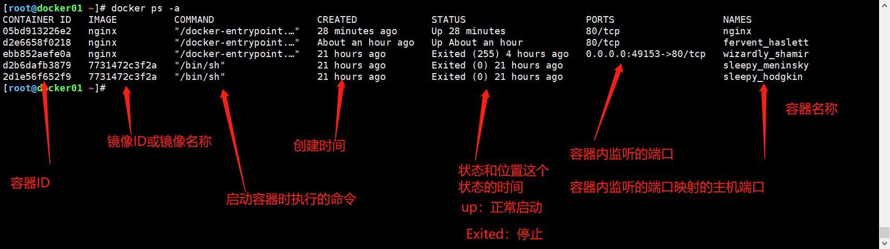

# docker容器命令


## 一、容器介绍

```bash
1、容器就是对外提供服务的一个实例。
2、容器启动的必要条件：容器内至少有一个进程运行在前台
```


## 二、容器命令

```bash
1、docker ps查看容器列表
2、docker run创建容器
```


## 三、容器命令的使用及进阶

### 1、docker ps查看容器列表

```bash
# 格式	
	docker ps [参数]
	
# 默认
	docker ps 		# 查看正在运行的容器列表

# 参数
	-a : 查看系统中所有的容器。
	-q : 仅显示容器的ID
	
# 实例
```




### 2、docker run创建容器

```bash
# 格式
	docker run [参数] [镜像名称] [运行容器的启动命令]
```

**参数**

#### 1）-d 守护进程方式运行

```bash
# 格式
	docker run -d [镜像名称] [cmd]
	
# 实例
	docker run -d nginx
```


#### 2）--name指定容器名称

```bash
# 格式
	docker run -d --name [容器名称] [镜像的名称] [cmd]
	
# 实例
	docker run -d --name nginx nginx
```


#### 3）-p指定端口映射

```bash
# 格式
	docker run -d -p 宿主机IP:宿主主机端口:容器内端口 [镜像的名称] [cmd]
	不使用宿主机IP默认本机全网段端口开放
# 实例
	端口映射
	docker run -d -p 80:80 nginx
	docker run -d -p 10.0.0.210:81:80 nginx
	
	端口范围映射
	docker run -d -p 81-89:81-89 nginx
	
	使用UDP协议做端口映射
	docker run -d -p 90:80/udp nginx
	
	使用UDP协议做端口随机映射
	docker run -d -p ::80/udp nginx
	
	随机端口映射
	docker run -d -p ::80 nginx
```


#### 4）-P随机端口映射

```bash
# 格式
	docker run -d -P [镜像名称] [cmd]
	
# 实例
	docker run -d -P nginx
```


#### 5）-it以交互式方式打开一个伪终端

```bash
-i		#以交互式运行容器
-d		#创建一个为终端

# 格式
	docker run -it [镜像名称] [cmd]
	
# 实例
	以交互式方式打开一个伪终端
	docker run -it nginx bash
	以交互式方式打开一个终端在后台运行
	docker run -dit centos
```


#### 6）-v 给容器挂载数据卷

```bash
# 格式
	docker run -v 宿主主机绝对目录:容器内目录  [镜像名称] [cmd]

	在宿主机创建一个固定名字的目录,来持久化容器的目录下的数据
	docker run -v 宿主主机绝对目录:容器内目录  [镜像名称] [cmd]
	
# 实例
	docker run -dit -v /root/test:/root centos7
	docker run -dit -v /root/test1:/root centos7
	
```


#### 7）--rm容器生命周期结束立即删除

```bash
# 格式
	docker run --rm [镜像名称] [cmd]
	
# 实例
	docker run -d --rm nginx
```


#### 8）-e在容器中创建一个环境变量

```bash
#格式
	docker run -e 环境变量 -d [镜像名称] [cmd]
	
# 实例
	[root@docker01 ~]# docker run -it -e NAME=abc centos:7
    [root@5288ff59ea57 /]# printenv
    NAME=abc
```


#### 9）--link连上一个容器，实现网络互通

```bash
# 格式
	docker run --link 被连接的容器的名称:连接别名 [镜像名称] [cmd]
	
# 实例
	[root@docker01 ~]# docker run -it --link dc1dab96297a:nginx centos
    [root@6044ef9f8bbe /]# ping nginx
    64 bytes from nginx (172.17.0.5): icmp_seq=1 ttl=64 time=0.158 ms
```


#### 10）-h设置容器主机名

```bash
# 格式
	docker run -h "主机名"  [镜像名称] [cmd]
	
# 实例
	[root@docker01 ~]# docker run -it -h "xiaowu" nginx bash
root@xiaowu:/#
```


**补充**

```bash
容器想要放在后台一直运行的化,那么容器的初始命令,必须夯住(前台运行),否则容器就会退出.

前台运行
nginx -g 'daemon off;'
/usr/sbin/php-fpm --nodaemonize
/usr/sbin/sshd -D
```


### 3、docker create创建容器不启动

```bash
docker create [参数] [镜像名称] [运行容器的启动命令]
#参数
大部分参数与docker run相同

区别：
1、无-d参数
```

```bash
# docker run和docker create运行流程
1、检查本地是否用指定镜像，如果没有则去对应的仓库下载镜像
2、启动容器，如果指定了命令则使用指定的命令，如果没有则使用默认的命令
3、返回容器ID
```


### 4、start/stop启停容器

```bash
# 启动（该容器必须是系统已经存在的容器）
	docker start [容器的ID|名称]
	
# 停止
	docker stop [容器的ID|名称]

```


### 5、docker rm删除容器

```bash
# 格式
	docker rm [容器名称|ID]

# 参数
	-f : 强制删除
	docker rm -f [容器名称|ID]

# 清空容器
	正在运行的不会删除
	docker rm $(docker ps -a -q)
	正在运行的也会被删除
	docker rm -f $(docker ps -a -q)
```


### 6、docker inspect查看容器信息

```bash
# 格式
	docker inspect [容器名称|ID]

#查看容器运行状态
	#格式
	docker inspect -f '{{信息名称}}' [容器名称|ID]

	#实例
	docker inspect -f '{{.State.Running}}' nginx
```


### 7、docker cp复制命令

```bash
#宿主机文件复制到容器内
	docker cp [宿主主机文件路径]  容器ID:容器内路径

2、复制到容器外
	docker cp 容器ID:容器内路径 [宿主主机文件路径]
```


### 8、docker exec/attach进入容器

```bash
1. exec : 进入正在运行的容器(分配一个新终端)（官方推荐）
	docker exec [参数] [容器的名称|ID] [cmd]
	#实例
		docker exec -it nginx bash

2. attach : 进入正在运行的容器(使用相同的终端)
	docker attach [容器ID|名称]
	
	直接离开会关掉容器
	偷偷离开的快捷键ctrl +p,ctrl +q
```


### 9、其他进入容器的方法

```bash
3、nsenter : 建立一个管道连接上容器主ID
	nsenter --target $( docker inspect -f {{.State.Pid}} [容器名|ID]) --mount --uts --ipc --net --pid

4、ssh : 通过ssh连接  (麻烦不推荐)
```

### 10、保存容器为镜像commit

```bash
# 保存正在运行的容器直接为镜像
# 格式：
	docker commit [容器ID|容器名称] 保存名称:版本
	
# 参数
	-a 镜像作者
	-p 提交期间暂停容器
	-m 容器说明

# 实例
    [root@docker01 ~]# docker ps
    CONTAINER ID   IMAGE     COMMAND                  CREATED         STATUS         PORTS                   NAMES
    ebb852aefe0a   nginx     "/docker-entrypoint.…"   3 minutes ago   Up 3 minutes   0.0.0.0:49153->80/tcp   wizardly_shamir
    [root@docker01 ~]# docker commit -a "xiaowu" -m "小武的容器" -p ebb852aefe0a test:v1
    sha256:a9297902755a4ede3ce38c2717515626c678b6deae50206071a0a29ebcd208a9
    [root@docker01 ~]# docker images
    REPOSITORY   TAG       IMAGE ID       CREATED         SIZE
    test         v1        a9297902755a   4 seconds ago   133MB
    alpine       latest    7731472c3f2a   2 months ago    5.61MB
    nginx        latest    f6d0b4767a6c   2 months ago    133MB

```


### 11、保存容器为镜像包（export/import）

```bash
# export保存正在运行的容器为镜像包
## 保存容器为镜像
	docker export [容器的ID] > [包名称]
	
# 实例
	[root@docker01 ~]# docker ps
CONTAINER ID   IMAGE     COMMAND                  CREATED         STATUS         PORTS                   NAMES
ebb852aefe0a   nginx     "/docker-entrypoint.…"   6 minutes ago   Up 6 minutes   0.0.0.0:49153->80/tcp   wizardly_shamir
[root@docker01 ~]# docker export ebb852aefe0a > nginx:v1.tar
[root@docker01 ~]# ll
-rw-r--r--  1 root root 135403008 Mar 18 21:05 nginx:v1.tar
```

```bash
# import 将镜像包解为镜像
## docker import [包名称] [自定义镜像名称]
	# 实例
	[root@docker01 ~]# docker import nginx\:v1.tar  nginx:v2
    sha256:59bde51898fa443281782320b194d5e139c37ece32528843bb26d444800265ab
    [root@docker01 ~]# docker images
    REPOSITORY   TAG       IMAGE ID       CREATED          SIZE
    nginx        v2        59bde51898fa   10 seconds ago   131MB
    test         v1        a9297902755a   6 minutes ago    133MB
    alpine       latest    7731472c3f2a   2 months ago     5.61MB
    nginx        latest    f6d0b4767a6c   2 months ago     133MB

```

