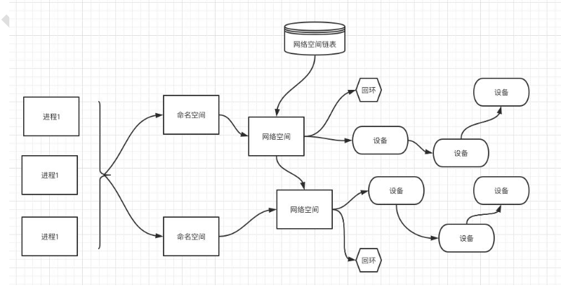
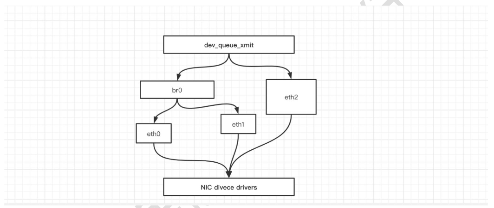
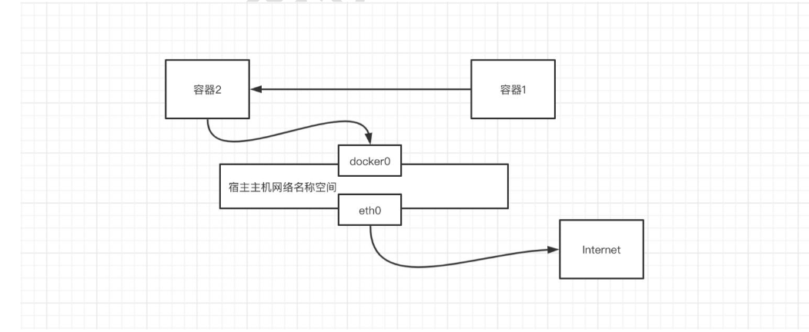
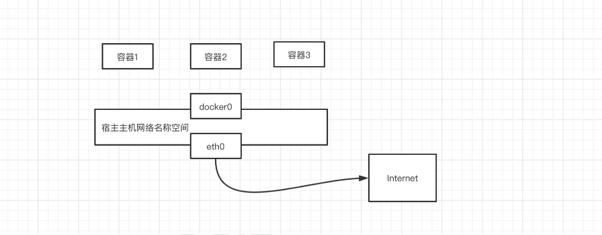
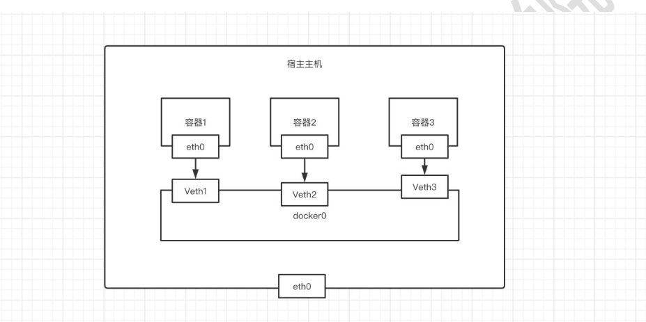

# docker网络

## 一、网络基础

其中Docker使用到的与Linux网络有关的技术分别有：网络名称空间、Veth、Iptables、网桥、路由

### 1、网络名称空间

```bash
	1、为了支持网络协议栈的多个实例，Linux在网络协议栈中引入了网络名称空间(NetworkNamespace)，这些独立的协议栈被隔离到不同的命名空间中。处于不同的命名空间的网络协议栈是完全隔离的，彼此之间无法进行网络通信，就好像两个“平行宇宙”。通过这种对网络资源的隔离，就能在一个宿主机上虚拟多个不同的网络环境，而Docker正是利用这种网络名称空间的特性，实现了不同容器之间的网络隔离。在Linux的网络命名空间内可以有自己独立的Iptables来转发、NAT及IP包过滤等功能。
	2、Linux的网络协议栈是十分复杂的，为了支持独立的协议栈，相关的这些全局变量都必须修改为协议栈私有。最好的办法就是让这些全局变量成为一个NetNamespace变量的成员，然后为了协议栈的函数调用加入一个Namespace参数。这就是Linux网络名称空间的核心。所以的网络设备都只能属于一个网络名称空间。当然，通常的物理网络设备只能关联到root这个命名空间中。虚拟网络设备则可以被创建并关联到一个给定的命名空间中，而且可以在这些名称空间之间移动。
```




### 2、Veth设备

```bash
	引入Veth设备对是为了在不同的网络名称空间之间进行通信，利用它可以直接将两个网络名称空间链接起来。由于要连接的两个网络命名空间，所以Veth设备是成对出现的，很像一对以太网卡，并且中间有一根直连的网线。既然是一对网卡，那么我们将其中一端称为另一端的peer。在Veth设备的一端发送数据时，它会将数据直接发送到另一端，并触发另一端的接收操作。
```


### 3、使用Veth设备对

#### 1）创建一个两个命名空间

```bash
#创建test01命名空间
[root@Centos7 ~]# ip netns add test01
#创建test02命名空间
[root@Centos7 ~]# ip netns add test02
#查看命令空间
[root@Centos7 ~]# ip netns list
test02
test01
```


#### 2）创建Veth设备对

```bash
[root@Centos7 ~]# ip link add veth01 type veth peer name veth02
#查看
[root@Centos7 ~]# ip link show
4: veth02@veth01: <BROADCAST,MULTICAST,M-DOWN> mtu 1500 qdisc noop state DOWN mode DEFAULT group default qlen 1000
    link/ether a2:af:63:df:f2:d9 brd ff:ff:ff:ff:ff:ff
5: veth01@veth02: <BROADCAST,MULTICAST,M-DOWN> mtu 1500 qdisc noop state DOWN mode DEFAULT group default qlen 1000
    link/ether 7a:d6:8b:90:f1:ce brd ff:ff:ff:ff:ff:ff
```

生成了两个veth设备，互为对方的peer。


#### 3）绑定命名空间

```bash
[root@Centos7 ~]# ip link set veth01 netns test01
[root@Centos7 ~]# ip link set veth02 netns test02
[root@Centos7 ~]# ip link show | grep veth
[root@Centos7 ~]#
```

已经查看不到veth01和veth02，当我们进入test01命名空间之后，就可以查看到veth01

```bash
[root@Centos7 ~]# ip netns exec test01 bash
[root@Centos7 ~]# ip a
1: lo: <LOOPBACK> mtu 65536 qdisc noop state DOWN group default qlen 1000
    link/loopback 00:00:00:00:00:00 brd 00:00:00:00:00:00
5: veth01@if4: <BROADCAST,MULTICAST> mtu 1500 qdisc noop state DOWN group default qlen 1000
    link/ether 7a:d6:8b:90:f1:ce brd ff:ff:ff:ff:ff:ff link-netnsid 1
[root@Centos7 ~]#exit
exit


[root@Centos7 ~]# ip netns exec test02 bash
[root@Centos7 ~]# ip a
1: lo: <LOOPBACK> mtu 65536 qdisc noop state DOWN group default qlen 1000
    link/loopback 00:00:00:00:00:00 brd 00:00:00:00:00:00
4: veth02@if5: <BROADCAST,MULTICAST> mtu 1500 qdisc noop state DOWN group default qlen 1000
    link/ether a2:af:63:df:f2:d9 brd ff:ff:ff:ff:ff:ff link-netnsid 0
[root@Centos7 ~]#

```


#### 4）将Veth分配ip

```bash

[root@Centos7 ~]# ip netns exec test01 ip addr add 172.16.0.111/20 dev veth01
[root@Centos7 ~]# ip netns exec test01 ip link set dev veth01 up

[root@Centos7 ~]# ip netns exec test02 ip addr add 172.16.0.112/20 dev veth02
[root@Centos7 ~]# ip netns exec test02 ip link set dev veth02 up

#查看
[root@Centos7 ~]# ip netns exec test01 ip a
1: lo: <LOOPBACK> mtu 65536 qdisc noop state DOWN group default qlen 1000
    link/loopback 00:00:00:00:00:00 brd 00:00:00:00:00:00
5: veth01@if4: <BROADCAST,MULTICAST,UP,LOWER_UP> mtu 1500 qdisc noqueue state UP group default qlen 1000
    link/ether 7a:d6:8b:90:f1:ce brd ff:ff:ff:ff:ff:ff link-netnsid 1
    inet 172.16.0.111/20 scope global veth01
       valid_lft forever preferred_lft forever
    inet6 fe80::78d6:8bff:fe90:f1ce/64 scope link
       valid_lft forever preferred_lft forever
[root@Centos7 ~]# ip netns exec test02 ip a
1: lo: <LOOPBACK> mtu 65536 qdisc noop state DOWN group default qlen 1000
    link/loopback 00:00:00:00:00:00 brd 00:00:00:00:00:00
4: veth02@if5: <BROADCAST,MULTICAST,UP,LOWER_UP> mtu 1500 qdisc noqueue state UP group default qlen 1000
    link/ether a2:af:63:df:f2:d9 brd ff:ff:ff:ff:ff:ff link-netnsid 0
    inet 172.16.0.112/20 scope global veth02
       valid_lft forever preferred_lft forever
    inet6 fe80::a0af:63ff:fedf:f2d9/64 scope link
       valid_lft forever preferred_lft forever


[root@Centos7 ~]# ip netns exec test01 ethtool -S veth01
NIC statistics:
     peer_ifindex: 4
[root@Centos7 ~]# ip netns exec test02 ethtool -S veth02
NIC statistics:
     peer_ifindex: 5


[root@Centos7 ~]# ip netns exec test01 bash
[root@Centos7 ~]# ping 172.16.0.112
PING 172.16.0.112 (172.16.0.112) 56(84) bytes of data.
64 bytes from 172.16.0.112: icmp_seq=1 ttl=64 time=0.066 ms
64 bytes from 172.16.0.112: icmp_seq=2 ttl=64 time=0.021 ms

```

#### 5）测试网络是否畅通

```bash
[root@Centos7 ~]# ip netns exec test01 bash
[root@Centos7 ~]# ping 172.16.0.112
PING 172.16.0.112 (172.16.0.112) 56(84) bytes of data.
64 bytes from 172.16.0.112: icmp_seq=1 ttl=64 time=0.066 ms
64 bytes from 172.16.0.112: icmp_seq=2 ttl=64 time=0.021 ms

[root@Centos7 ~]# exit
exit
[root@Centos7 ~]# ip netns exec test02 bash
[root@Centos7 ~]# ping 172.16.0.111
PING 172.16.0.111 (172.16.0.111) 56(84) bytes of data.
64 bytes from 172.16.0.111: icmp_seq=1 ttl=64 time=0.014 ms
64 bytes from 172.16.0.111: icmp_seq=2 ttl=64 time=0.022 ms
```


### 4、网桥

```bash
	Linux可以支持多个不同的网络，它们之间能够相互通信，就需要一个网桥。网桥是二层的虚拟网络设备，它是把若干个网络接口“连接”起来，从而报文能够互相转发。网桥能够解析收发的报文，读取目标MAC地址的信息，和自己记录的MAC表结合，来决定报文的转发目标网口。
	网桥设备br0绑定了eth0、eth1。对于网络协议的上层来说，只看得到br0。因为桥接是在数据链路层实现的，上层不需要关心桥接的细节，于是协议上层需要发送的报文被送到br0，网桥设备的处理代码判断报文该被转发到eth0还是eth1，或者两者皆转发。反过来，从eth0或从eth1接收到的报文被提交给网桥的处理代码，在这里会判断报文应该被转发、丢弃还是提交到协议枝上层。而有时eth1也可能会作为报文的源地址或目的地址直接参与报文的发送与接收，从而绕过网桥。
```




### 5、iptables

```bash
	我们知道，Linux络协议非常高效，同时比较复杂如果我们希望在数据的处理过程中对关心的数据进行一些操作该怎么做呢？Linux提供了一套机制来为用户实现自定义的数据包处理过程。
	在Linux网络协议棋中有一组回调函数挂接点，通过这些挂接点挂接的钩子函数可以在Linux网络棋处理数据包的过程中对数据包进行些操作，例如过滤、修改、丢弃等整个挂接点技术叫作Netfilterlptables
	Netfilter负责在内核中执行各种挂接的规则，运行在内核模式中：而lptables是在用户模式下运行的进程，负责协助维护内核中Netfilter的各种规则表通过者的配合来实现整个Linux网络协议战中灵活的数据包处理机制。
```


### 6、总结

| 设备              | 作用                                                         |
| ----------------- | ------------------------------------------------------------ |
| network namespace | 主要提供了关于网络资源的隔离，包括网络设备、IPv4和IPv6协议栈、IP路由表、防火墙、/proc/net目录、/sys/class/net目录、端口（socket）等。 |
| linux Bridge      | 功能相当于物理交换机，为连在其上的设备（容器）转发数据帧。如docker0网桥。 |
| iptables          | 主要为容器提供NAT以及容器网络安全。                          |
| vethpair          | 两个虚拟网卡组成的数据通道。在Docker中，用于连接Docker容器和LinuxBridge。一端在容器中作为eth0网卡，另一端在LinuxBridge中作为网桥的一个端口。 |


## 二、Docker网络模式

````bash
	Docker使用Linux桥接的方式，在宿主机虚拟一个Docker容器网桥(docker0)，Docker启动一个容器时会根据Docker网桥的网段分配给容器一个IP地址，称为Container-IP，同时Docker网桥是每个容器的默认网关。因为在同一宿主机内的容器都接入同一个网桥，这样容器之间就能够通过容器的Container-IP直接通信。
	Docker网桥是宿主机虚拟出来的，并不是真实存在的网络设备，外部网络是无法寻址到的，这也意味着外部网络无法通过直接Container-IP访问到容器。如果容器希望外部访问能够访问到，可以通过映射容器端口到宿主主机（端口映射），即dockerrun创建容器时候通过-p或-P参数来启用，访问容器的时候就通过[宿主机IP]:[容器端口]访问容器。
````

| Docker网络模型 | 配置                        | 说明                                                         |
| -------------- | --------------------------- | ------------------------------------------------------------ |
| host模式       | --network=host              | 容器和宿主机共享Networknamespace，网络性能最高               |
| containe模式   | --network=container：容器ID | 容器和另外一个容器共享Networknamespace。kubernetes中的pod就是多个容器共享一个Networknamespace。 |
| none模式       | --network=none              | 容器有独立的Networknamespace，但并没有对其进行任何网络设置，如分配vethpair和网桥连接，配置IP等 |
| bridge模式     | --network=bridge            | 当Docker进程启动时，会在主机上创建一个名为docker0的虚拟网桥，此主机上启动的Docker容器会连接到这个虚拟网桥上。虚拟网桥的工作方式和物理交换机类似，这样主机上的所有容器就通过交换机连在了一个二层网络中。（默认为该模式） |

### 1、HOST模式

```bash
	如果启动容器的时候使用host模式，那么这个容器将不会获得一个独立的NetworkNamespace，而是和宿主机共用一个NetworkNamespace。容器将不会虚拟出自己的网卡，配置自己的IP等，而是使用宿主机的IP和端口。但是，容器的其他方面，如文件系统、进程列表等还是和宿主机隔离的。
	使用host模式的容器可以直接使用宿主机的IP地址与外界通信，容器内部的服务端口也可以使用宿主机的端口，不需要进行NAT，host最大的优势就是网络性能比较好，但是dockerhost上已经使用的端口就不能再用了，网络的隔离性不好。
```


### 2、Containe模式

```bash
	这个模式指定新创建的容器和已经存在的一个容器共享一个NetworkNamespace，而不是和宿主机共享。新创建的容器不会创建自己的网卡，配置自己的IP，而是和一个指定的容器共享IP、端口范围等。同样，两个容器除了网络方面，其他的如文件系统、进程列表等还是隔离的。两个容器的进程可以通过lo网卡设备通信。
```




### 3、none模式

```bash
	使用none模式，Docker容器拥有自己的NetworkNamespace，但是，并不为Docker容器进行任何网络配置。也就是说，这个Docker容器没有网卡、IP、路由等信息。需要我们自己为Docker容器添加网卡、配置IP等。
	这种网络模式下容器只有lo回环网络，没有其他网卡。none模式可以在容器创建时通过--network=none来指定。这种类型的网络没有办法联网，封闭的网络能很好的保证容器的安全性。
```




### 4、bridge模式

```bash
	当Docker进程启动时，会在主机上创建一个名为docker0的虚拟网桥，此主机上启动的Docker容器会连接到这个虚拟网桥上。虚拟网桥的工作方式和物理交换机类似，这样主机上的所有容器就通过交换机连在了一个二层网络中
	从docker0子网中分配一个IP给容器使用，并设置docker0的IP地址为容器的默认网关。在主机上创建一对虚拟网卡vethpair设备，Docker将vethpair设备的一端放在新创建的容器中，并命名为eth0（容器的网卡），另一端放在主机中，以vethxxx这样类似的名字命名，并将这个网络设备加入到docker0网桥中。可以通过brctlshow命令查看。
	bridge模式是docker的默认网络模式，不写--net参数，就是bridge模式。使用dockerrun-p时，docker实际是在iptables做了DNAT规则，实现端口转发功能。可以使用iptables-tnat-vnL查看。
```



### 5、docker网桥相关命令

```bash
#格式
	docker network [cmd]
	
1.查看网桥
	docker network ls

2.创建网桥
	docker network create [网桥名称]

3.查看网桥信息
	docker network inspect [网桥的名称|ID]
	
4.添加一个容器网络到网桥中
	docker network connect [网络名称] [容器名称]
	
5.断开容器与这个网桥的连接
	docker network disconnect [网络名称] [容器名称]
	
6.删除一个网桥
	docker network rm [网桥名称]
	
7.清除所有网桥（清除了默认的三个网桥之外的和正在使用的）
	docker network prune
```


