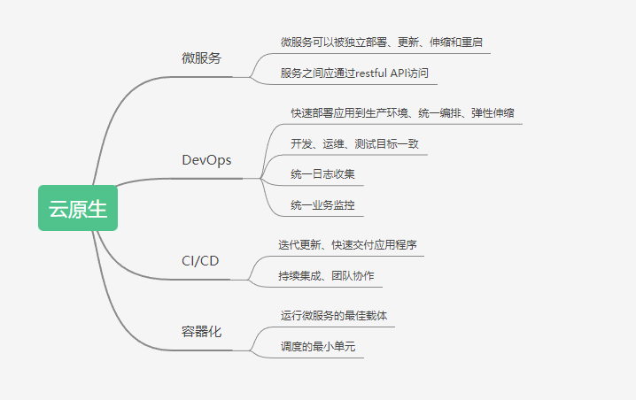
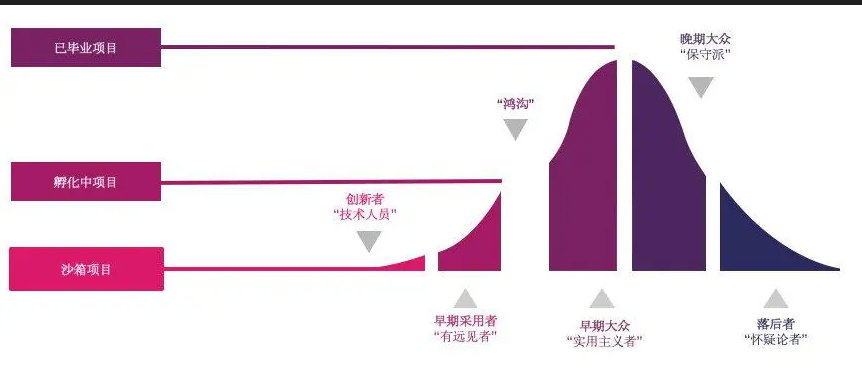

# 云原生介绍

## 一、简史

> 2004年开始，Google已在内部大规模的使用容器技术
>
> 2008年，Google将Cgroups合并进入Linux内核
>
> 2013年，Docker项目正式发布
>
> 2014年，Kubernetes项目正式发布
>
> 2015年，由Google，Redhat和微软等大型云计算厂商以及一些开源公司共同牵头成立了CNCF（Cloud Native Computing Foundation）云原生计算基金会
>
> 2017年，CNCF达到170个成员和14个基金项目
>
> 2018年，CNCF成立三周年有195个成员，19个基金会项目和11个孵化项目

## 二、什么是云原生？

> https://github.com/cncf/toc/blob/main/DEFINITION.md#%E4%B8%AD%E6

>​    云原生技术有利于各组织在公有云、私有云和混合云等新型动态环境中，构建和运行可弹性扩展的应用。云原生的代表技术包括容器、服务网格、微服务、不可变基础设施和声明式API。
>
>​    这些技术能够构建容错性好、易于管理和便于观察的松耦合系统。结合可靠的自动化手段，云原生技术使工程师能够轻松地对系统作出频繁和可预测的重大变更。
>
>​    云原生计算基金会（CNCF）致力于培育和维护一个厂商中立的开源生态系统，来推广云原生技术。我们通过将最前沿的模式民主化，让这些创新为大众所用。

## 三、云原生技术栈

> 容器技术：以docker为代表的容器运行技术
>
> 服务网格：比如：Service Mesh等
>
> 微服务：微服务体系中，一个项目是由多个松耦合且可独立部署的较小组件或服务组成
>
> 不可变基础设施：不可变基础设施可以理解为一个应用运行所需要的基本运行需求，不可变最基本的就是指运行服务的服务器在完成部署后，就不在进行更改，比如：镜像等。
>
> 声明式API: 描述应用程序的运行状态，并且由系统来决定如何来创建这个环境，例如声明一个pod，会有K8s执行创建并维持副本。

## 四、云原生特征

> 符合12因素应用，12因素应用程序是一种构建应用程序的方法
>
> 面向微服务架构
>
> 自服务敏捷架构
>
> 基于API的协作
>
> 抗脆弱性

### 12因素应用

> 1、基准代码：一份基准代码，多份部署（用同一个代码库进行版本控制，并可进行多次部署）。
>
> 2、依赖：显式的声明和隔离相互之间的依赖
>
> 3、配置：在环境中存储配置
>
> 4、后端服务：把后端服务当做一种附加资源
>
> 5、构建、发布、运行：对程序执行构建或打包，并严格分离构建和运行。
>
> 6、进程：以一个或多个无状态进程运行应用
>
> 7、端口绑定：通过端口绑定提供服务
>
> 8、并发：通过进程模型进行扩展
>
> 9、易处理：快速的启动，优雅的终止，最大程度上保持健壮性
>
> 10、开发环境与线上环境等价：尽可能的保持开发、预发布、线上环境相同
>
> 11、日志：将所有运行中进程和后端服务的输出流按照时间顺序统一收集、存储和展示
>
> 12、管理进程：一次性管理进程（数据备份等）应该和正常的常驻进程使用同样的运行环境

## 五、云原生景观图

> https://landscape.cncf.io/

## 六、云原生项目分类

