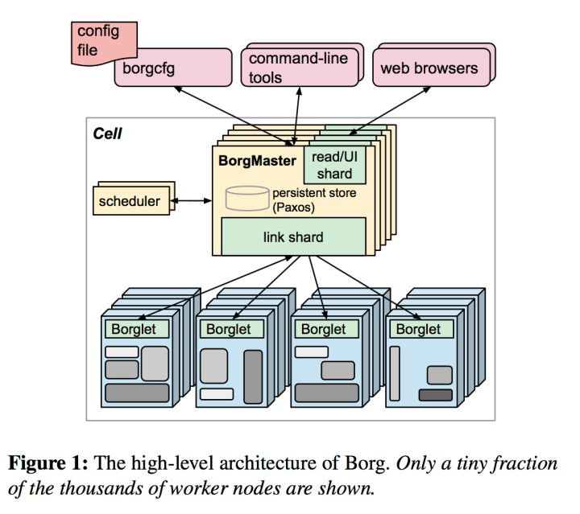
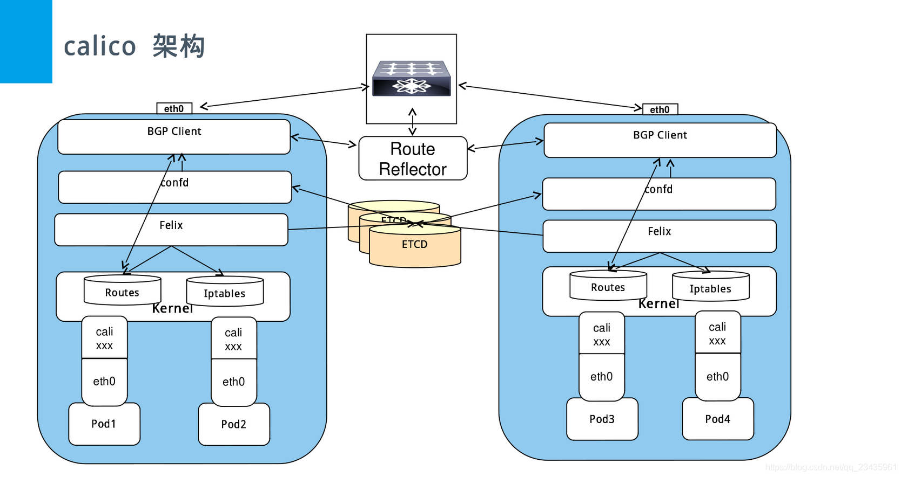
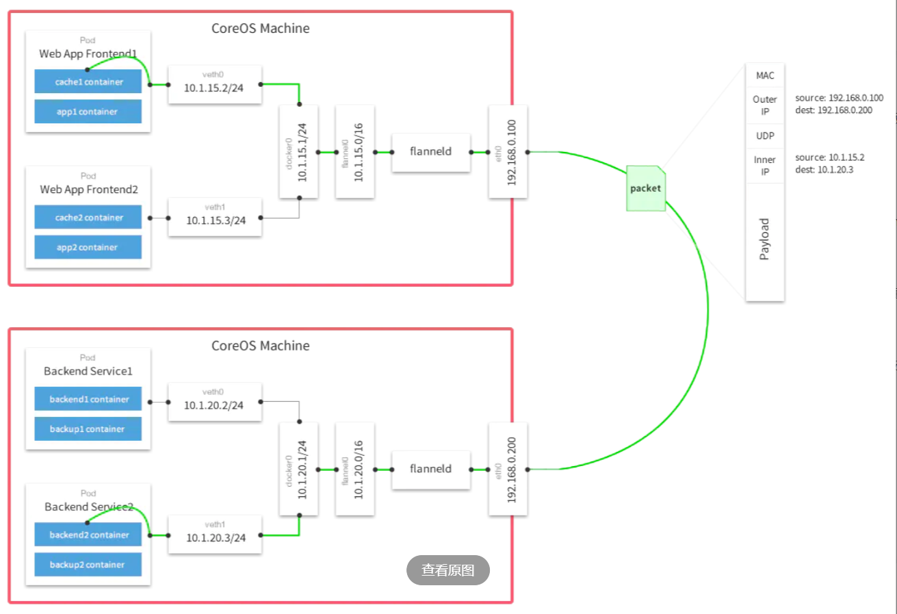
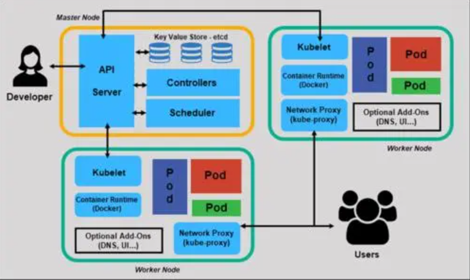
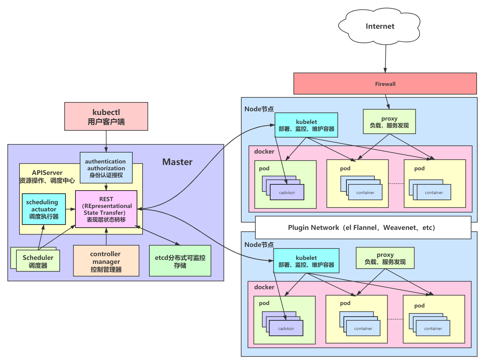
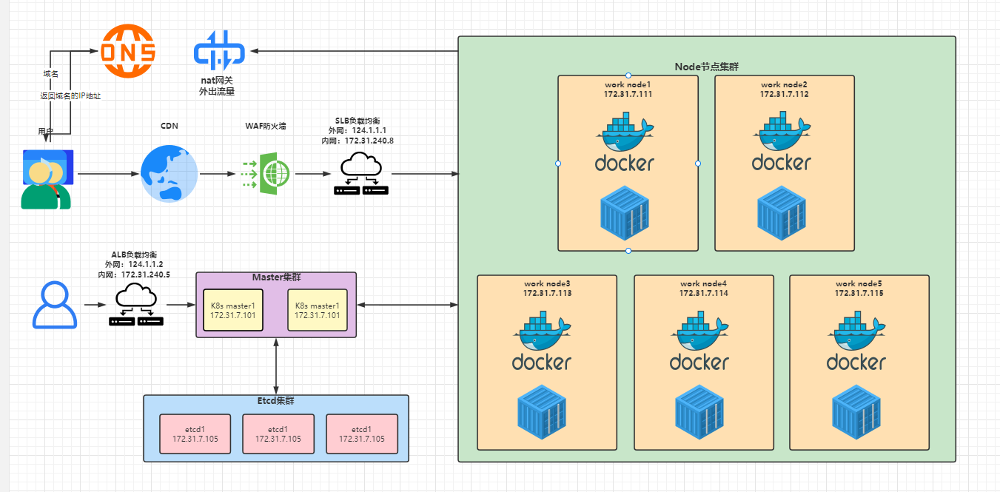

# k8s简介

> ​    Kubernetes是一个可移植的、可扩展的开源平台，用于管理容器化的工作负载和服务，可促进声明式配置和自动化。Kubernetes拥有一个庞大且快速增长的生态系统。Kubernetes的服务、支持和工具广泛可用。


## 一、什么是k8s？

### 1、kubernetes的由来

>​    Kubernetes是一个全新的基于容器技术的分布式领先方案。简称：K8S。它是Google开源的容器集群管理系统，它的设计灵感来自于Google内部的一个叫作Borg的容器管理系统。继承了Google十余年的容器集群使用经验。它为容器化的应用提供了部署运行、资源调度、服务发现和动态伸缩等一些列完整的功能，极大地提高了大规模容器集群管理的便捷性。
>
>​    Kubernetes最初源于谷歌内部的Borg，Borg是谷歌内部的大规模集群管理系统，负责对谷歌内部很多核心服务的调度和管理,Borg的目的是让用户能够不必操心资源管理的问题，让他们专注于自己的核心业务，并且做到跨多个数据中心的资源利用率最大化
>
>​    Borg主要由BorgMaster、Borglet、borgcfg和Scheduler组成



> 官网：https://kubernetes.io/zh-cn/
>
> github：https://github.com/kubernetes/kubernetes

### 2、k8s的功能

>​    kubernetes是一个完备的分布式系统支撑平台。具有完备的集群管理能力，多扩多层次的安全防护和准入机制、多租户应用支撑能力、透明的服务注册和发现机制、內建智能负载均衡器、强大的故障发现和自我修复能力、服务滚动升级和在线扩容能力、可扩展的资源自动调度机制以及多粒度的资源配额管理能力。

### 3、k8s的集群管理

>    在集群管理方面，Kubernetes将集群中的机器划分为一个Master节点和一群工作节点Node，其中，在Master节点运行着集群管理相关的一组进程kube-apiserver、kube-controller-manager和kube-scheduler，这些进程实现了整个集群的资源管理、Pod调度、弹性伸缩、安全控制、系统监控和纠错等管理能力，并且都是全自动完成的。Node作为集群中的工作节点，运行真正的应用程序，在Node上Kubernetes管理的最小运行单元是Pod。Node上运行着Kubernetes的kubelet、kube-proxy服务进程，这些服务进程负责Pod的创建、启动、监控、重启、销毁以及实现软件模式的负载均衡器。

### 4、k8s解决的问题

>​    在Kubernetes集群中，它解决了传统IT系统中服务扩容和升级的两大难题。如果今天的软件并不是特别复杂并且需要承载的峰值流量不是特别多，那么后端项目的部署其实也只需要在虚拟机上安装一些简单的依赖，将需要部署的项目编译后运行就可以了。但是随着软件变得越来越复杂，一个完整的后端服务不再是单体服务，而是由多个职责和功能不同的服务组成，服务之间复杂的拓扑关系以及单机已经无法满足的性能需求使得软件的部署和运维工作变得非常复杂，这也就使得部署和运维大型集群变成了非常迫切的需求。
>​	Kubernetes的出现不仅主宰了容器编排的市场，更改变了过去的运维方式，不仅将开发与运维之间边界变得更加模糊，而且让DevOps这一角色变得更加清晰，每一个软件工程师都可以通过Kubernetes来定义服务之间的拓扑关系、线上的节点个数、资源使用量并且能够快速实现水平扩容、蓝绿部署等在过去复杂的运维操作。

## 二、架构

>    Kubernetes遵循非常传统的客户端服务端架构，客户端通过RESTful接口或者直接使用kubectl与Kubernetes集群进行通信，这两者在实际上并没有太多的区别，后者也只是对Kubernetes提供的RESTfulAPI进行封装并提供出来。每一个Kubernetes集群都由一组Master节点和一系列的Worker节点组成，其中Master节点主要负责存储集群的状态并为Kubernetes对象分配和调度资源.


### 1、Master

> ​    它主要负责接收客户端的请求，安排容器的执行并且运行控制循环，将集群的状态向目标状态进行迁移，Master节点内部由三个组件构成:

#### 1.kube-apiserver

##### 1)介绍

> https://kubernetes.io/zh/docs/reference/command-line-tools-reference/kube-apiserver/

> ​	负责处理来自用户的请求，其主要作用就是对外提供RESTful的接口，包括用于查看集群状态的读请求以及改变集群状态的写请求，也是唯一一个与etcd集群通信的组件。
>
> ​    Kubernetes API server 提供了k8s各类资源对象的增删改查及watch等HTTP Rest接口，这些对象包括pods、services、replicationcontrollers等，API Server为REST操作提供服务，并为集群的共享状态提供前端，所有其他组件都通过该前端进行交互。
>
> RESTful API:
>    是REST风格的网络接口，REST描述的是在网络中client和server的一种交互形式

>REST:
>    是一种软件架构风格，或者说是一种规范，其强调HTTP应当以资源为中心，并且规范了URI的风格,规范了HTTP请求动作(GET/PUT/POST/DELETE/HEAD/OPTIONS)的使用,具有对应的语义。
>
>https://github.com/Arachni/arachni/wiki/REST-API

>该端口默认值为6443，可通过启动参数“--secure-port”的值来修改默认值,不建议改。
>默认IP地址为非本地（Non-Localhost）网络端口，通过启动参数“--bind-address”设置该值,不建议改。
>该端口用于接收客户端、dashboard等外部HTTPS请求。
>用于基于Tocken文件或客户端证书及HTTP Base的认证。
>用于基于策略的授权

##### 2）功能

>验证权限：多用户，多角色
>
>验证操作
>
>执行操作
>
>返回数据


##### 3）kubernetes API测试

> curl --cacert /etc/kubernetes/ssl/ca.pem -H "Authorization: Bearer ${TOKEN} https://127.0.0.1:6443
> curl 127.0.0.1:6443/ #返回所有的API列表
> curl 127.0.0.1:6443/apis #分组API
> curl 127.0.0.1:6443/api/v1 #带具体版本号的API
> curl 127.0.0.1:6443/version #API版本信息
> curl 127.0.0.1:6443/healthz/etcd #与etcd的心跳监测
> curl 127.0.0.1:6443/apis/autoscaling/v1 #API的详细信息
> curl 127.0.0.1:6443/metrics #指标数据

##### 4）API版本

>Alpha: 预览版，可能包含bug或错误，后期版本会修复且有可能不兼容之前的版本，不建议使用
>
>Beta：测试版，如storage.k8s.io/v1beta1,该版本可能存在不稳定或者潜在的bug，不建议生产使用
>
>v1：稳定版，如apps/v1,经过验证的stable版本，可以在生产使用

#### 2.Scheduler

##### 1)介绍

> https://kubernetes.io/zh/docs/reference/command-line-tools-reference/kube-scheduler/

> ​    Kubernetes 调度器是一个控制面进程，负责将 Pods 指派到节点上。
>
> ​    调度器其实为Kubernetes中运行的Pod选择部署的Worker节点，它会根据用户的需要选择最能满足请求的节点来运行Pod，它会在每次需要调度Pod时执行。

##### 2）调度过程简述

>​    通过调度算法为待调度Pod列表的每个Pod从可用Node列表中选择一个最适合的Node，并将信息写入etcd中。
>
>​    node节点上的kubelet通过API Server监听到kubernetes Scheduler产生的Pod绑定信息，然后获取对应的Pod清单，下载Image，并启动容器。

>1、声明我要创建pod
>
>2、过滤掉资源不足的节点
>
>3、在剩余可用的节点中进行删选
>
>4、选中节点
>
>5、选中结果写入etcd

>1.先排除不符合条件的节点
>2.在剩余的可用选出一个最符合条件的节点

##### 3）调度策略

>LeastRequestedPriority: 优先从备选节点列表中选择资源消耗最小的节点（CPU+内存）。
>CalculateNodeLabelPriority: 优先选择含有指定Label的节点。
>BalancedResourceAllocation: 优先从备选节点列表中选择各项资源使用率最均衡的节点。

#### 3.kube-controller-manager

##### 1) 简介

> https://kubernetes.io/zh/docs/reference/command-line-tools-reference/kube-controller-manager/

> ​    管理器运行了一系列的控制器进程，这些进程会按照用户的期望状态在后台不断地调节整个集群中的对象，当服务的状态发生了改变，控制器就会发现这个改变并且开始向目标状态迁移。
>
> ​     Controller Manager还包括一些子控制器(副本控制器、节点控制器、命名空间控制器和服务账号控制器等)，控制器作为集群内部的管理控制中心，负责集群内的Node、Pod副本、服务端点（Endpoint）、命名空间（Namespace）、服务账号（ServiceAccount）、资源定额（ResourceQuota）的管理，当某个Node意外宕机时，Controller Manager会及时发现并执行自动化修复流程，确保集群中的pod副本始终处于预期的工作状态。

##### 2）node驱逐策略：pod高可用

>controller-manager控制器每间隔5秒检查一次节点的状态。
>如果controller-manager控制器没有收到自节点的心跳，则将该node节点被标记为不可达。
>controller-manager将在标记为无法访问之前等待40秒。
>如果该node节点被标记为无法访问后5分钟还没有恢复，controller-manager会删除当前node节点的所有pod并在其它可用节点重建这些pod。

##### 3）pod高可用机制参数

> node monitor period: 节点监视周期
> node monitor grace period: 节点监视器宽限期
> pod eviction timeout: pod驱逐超时时间

### 2、Node节点

> Node节点实现相对简单一点，主要是由kubelet和kube-proxy两部分组成：

#### 1.kubelet

##### 1)介绍

>https://kubernetes.io/zh/docs/reference/command-line-tools-reference/kubelet/

> ​    kubelet是一个节点上的主要服务，它周期性地从APIServer接受新的或者修改的Pod规范并且保证节点上的Pod和其中容器的正常运行，还会保证节点会向目标状态迁移，该节点仍然会向Master节点发送宿主机的健康状况。

##### 2）功能

>向master汇报node节点的状态信息
>接受指令并在Pod中创建容器
>准备Pod所需的数据卷
>返回pod的运行状态
>在node节点执行容器健康检查

#### 2.kube-proxy

##### 1) 介绍

> https://kubernetes.io/zh/docs/reference/command-line-tools-reference/kube-proxy/

> ​    kube-proxy负责宿主机的子网管理，同时也能将服务暴露给外部，其原理就是在多个隔离的网络中把请求转发给正确的Pod或者容器。
>
> ​    Kubernetes 网络代理运行在 node 上，它反映了 node 上 Kubernetes API中定义的服务，并可以通过一组后端进行简单的 TCP、UDP 和 SCTP 流转发或者在一组后端进行循环 TCP、UDP 和 SCTP 转发，用户必须使用 apiserver API 创建一个服务来配置代理，其实就是kube-proxy通过在主机上维护网络规则并执行连接转发来实现Kubernetes服务访问。
>
> ​    kube-proxy 运行在每个节点上，监听 API Server 中服务对象的变化，再通过管理 IPtables或者IPVS规则 来实现网络的转发。

>Kube-Proxy 不同的版本可支持三种工作模式：
>    UserSpace：k8s v1.1之前使用,k8s 1.2及以后就已经淘汰
>    IPtables : k8s 1.1版本开始支持，1.2开始为默认
>    IPVS: k8s 1.9引入到1.11为正式版本，需要安装ipvsadm、ipset 工具包和加载 ip_vs 内核模块

>​    IPVS 相对 IPtables 效率会更高一些，使用 IPVS 模式需要在运行 Kube-Proxy 的节点上安装ipvsadm、ipset 工具包和加载 ip_vs 内核模块，当 Kube-Proxy 以 IPVS 代理模式启动时，Kube-Proxy 将验证节点上是否安装了 IPVS 模块，如果未安装，则 Kube-Proxy 将回退到IPtables 代理模式。

>​    使用IPVS模式，Kube-Proxy会监视Kubernetes Service对象和Endpoints，调用宿主机内核Netlink接口以相应地创建IPVS规则并定期Kubernetes Service对象 Endpoints对象同步IPVS规则，以确保IPVS状态与期望一致，访问服务时，流量将被重定向到其中一个后端 Pod,IPVS使用哈希表作为底层数据结构并在内核空间中工作，这意味着IPVS可以更快地重定向流量，并且在同步代理规则时具有更好的性能，此外，IPVS 为负载均衡算法提供了更多选项，例如：rr (轮询调度)、lc (最小连接数)、dh (目标哈希)、sh (源哈希)、sed (最短期望延迟)、nq(不排队调度)等。
>
>

##### 2）使用IPVS

> https://kubernetes.io/zh/docs/reference/config-api/kube-proxy-config.v1alpha1/#ClientConnectionConfiguration

```yaml
# cat /var/lib/kube-proxy/kube-proxy-config.yaml
kind: KubeProxyConfiguration
apiVersion: kubeproxy.config.k8s.io/v1alpha1
bindAddress: 172.31.7.111
clientConnection:
  kubeconfig: "/etc/kubernetes/kube-proxy.kubeconfig"
clusterCIDR: "10.100.0.0/16"
conntrack:
  maxPerCore: 32768
  min: 131072
  tcpCloseWaitTimeout: 1h0m0s
  tcpEstablishedTimeout: 24h0m0s
healthzBindAddress: 172.31.7.111:10256
hostnameOverride: "172.31.7.111"
metricsBindAddress: 172.31.7.111:10249
mode: "ipvs" #指定使用ipvs及调度算法
ipvs:
  scheduler: sh
```

**开启会话保持**

```yaml
# cat nginx-service.yaml
kind: Service
apiVersion: v1
metadata:
  labels:
    app: magedu-nginx-service-label
  name: magedu-nginx-service
  namespace: magedu
spec:
  type: NodePort
ports:
- name: http
  port: 80
  protocol: TCP
  targetPort: 80
  nodePort: 30004
selector:
  app: nginx
sessionAffinity: ClientIP
sessionAffinityConfig:
  clientIP:
    timeoutSeconds: 1800
```


### 3、集群之外

#### 1.kubectl

> https://kubernetes.io/zh/docs/reference/kubectl/kubectl/

> 是一个通过命令行对kubernetes集群进行管理的客户端工具

#### 2.etcd

**虽然etcd不是k8s组件，但是他是最重要的**

> https://kubernetes.io/zh/docs/tasks/administer-cluster/configure-upgrade-etcd/

>​    etcd 是CoreOS公司开发目前是Kubernetes默认使用的key-value数据存储系统，用于保存kubernetes的所有集群数据，etcd支持分布式集群功能，生产环境使用时需要为etcd数据提供定期备份机制

>官网：https://etcd.io/
>
>github：https://github.com/etcd-io/etcd

#### 3.DNS

>   DNS组件历史版本有skydns、kube-dns和coredns三个，k8s 1.3版本之前使用skydns，之后的版本到1.17及之间的版本使用
>kube-dns，目前主要使用coredns，DNS组件用于解析k8s集群中service name所对应得到IP地址。

>https://kubernetes.io/zh/docs/tasks/administer-cluster/dns-custom-nameservers/

>DNS负责为整个集群提供DNS服务，从而实现服务之间的访问。
>coredns   go语言编写，最新，最精简，性能最好
>
>    ​    https://github.com/coredns/coredns
>    ​    https://coredns.io
>
>kube-dns: 到1.18版本就开始不流行使用了
>sky-dns

#### 4.Dashboard

> https://kubernetes.io/zh/docs/tasks/access-application-cluster/web-ui-dashboard/

>​    Dashboard是基于网页的Kubernetes用户界面，可以使用Dashboard获取运行在集群中的应用的概览信息，也可以创建或者修改Kubernetes资源（如 Deployment，Job，DaemonSet 等等），也可以对Deployment实现弹性伸缩、发起滚动升级、重启 Pod 或者使用向导创建新的应用

#### 5.网络

##### 1）calico

> 官网：https://www.projectcalico.org/
>     Calico是一个纯三层的网络解决方案，为容器提供多node间的访问通信，calico将每一个node节点都当做为一个路由器(router)，各节点通过BGP(Border Gateway Protocol) 边界网关协议学习并在node节点生成路由规则，从而将不同node节点上的pod连接起来进行通信。

###### ①架构




- `Felix`：calico的核心组件，运行在每个节点上。主要的功能有:接口管理、路由规则、ACL规则和状态报告

>​    `接口管理`：Felix为内核编写一些接口信息，以便让内核能正确的处理主机endpoint的流量。特别是主机之间的ARP请求和处理ip转发。
​    `路由规则`：Felix负责主机之间路由信息写到linux内核的FIB（Forwarding Information Base）转发信息库，保证数据包可以在主机之间相互转发。
​    `ACL规则`：Felix负责将ACL策略写入到linux内核中，保证主机endpoint的为有效流量不能绕过calico的安全措施。
​    `状态报告`：Felix负责提供关于网络健康状况的数据。特别是，它报告配置主机时出现的错误和问题。这些数据被写入etcd，使其对网络的其他组件和操作人员可见。

- `Etcd`：保证数据一致性的数据库，存储集群中节点的所有路由信息。为保证数据的可靠和容错建议至少三个以上etcd节点。

- `Orchestrator plugin`：协调器插件负责允许kubernetes或OpenStack等原生云平台方便管理Calico，可以通过各自的API来配置Calico网络实现无缝集成。如kubernetes的cni网络插件。

- `Bird`：BGP客户端，Calico在每个节点上的都会部署一个BGP客户端，它的作用是将Felix的路由信息读入内核，并通过BGP协议在集群中分发。当Felix将路由插入到Linux内核FIB中时，BGP客户端将获取这些路由并将它们分发到部署中的其他节点。这可以确保在部署时有效地路由流量。

- `BGP Router Reflector`：大型网络仅仅使用 BGP client 形成 mesh 全网互联的方案就会导致规模限制，所有节点需要 N^2 个连接，为了解决这个规模问题，可以采用 `BGP 的 Router Reflector` 的方法，使所有 BGP Client 仅与特定 RR 节点互联并做路由同步，从而大大减少连接数。

- `Calicoctl`： calico 命令行管理工具。

###### ②网络模式

- `BGP 边界网关协议（Border Gateway Protocol, BGP）`：是互联网上一个核心的去中心化自治路由协议。BGP不使用传统的内部网关协议（IGP）的指标。

> ​    `Route Reflector 模式（RR）（路由反射）`：Calico 维护的网络在默认是（Node-to-Node Mesh）全互联模式，Calico集群中的节点之间都会相互建立连接，用于路由交换。但是随着集群规模的扩大，mesh模式将形成一个巨大服务网格，连接数成倍增加。这时就需要使用 Route Reflector（路由器反射）模式解决这个问题。

- `IPIP模式`：把 IP 层封装到 IP 层的一个 tunnel。作用其实基本上就相当于一个基于IP层的网桥！一般来说，普通的网桥是基于mac层的，根本不需 IP，而这个 ipip 则是通过两端的路由做一个 tunnel，把两个本来不通的网络通过点对点连接起来。

###### ③BGP 概述

​    `BGP（border gateway protocol）是外部路由协议（边界网关路由协议）`，用来在AS之间传递路由信息是一种增强的距离矢量路由协议（应用场景），基本功能是在自治系统间自动交换无环路的路由信息，通过交换带有自治系统号序列属性的路径可达信息，来构造自治系统的拓扑图，从而消除路由环路并实施用户配置的路由策略。

   （边界网关协议(BGP)，提供自治系统之间无环路的路由信息交换（无环路保证主要通过其AS-PATH实现），BGP是基于策略的路由协议，其策略通过丰富的路径属性(attributes)进行控制。BGP工作在应用层，在传输层采用可靠的TCP作为传输协议（BGP传输路由的邻居关系建立在可靠的TCP会话的基础之上）。在路径传输方式上，BGP类似于距离矢量路由协议。而BGP路由的好坏不是基于距离（多数路由协议选路都是基于带宽的），它的选路基于丰富的路径属性，而这些属性在路由传输时携带，所以我们可以把BGP称为路径矢量路由协议。如果把自治系统浓缩成一个路由器来看待，BGP作为路径矢量路由协议这一特征便不难理解了。除此以外，BGP又具备很多链路状态（LS）路由协议的特征，比如触发式的增量更新机制，宣告路由时携带掩码等。）

> ​    实际上，Calico 项目提供的 `BGP` 网络解决方案，与 `Flannel` 的 `host-gw` 模式几乎一样。也就是说，Calico也是基于路由表实现容器数据包转发，但不同于Flannel使用flanneld进程来维护路由信息的做法，而Calico项目使用BGP协议来自动维护整个集群的路由信息。

###### ④BGP两种模式

**全互联模式(node-to-node mesh)**

​    `全互联模式` 每一个BGP Speaker都需要和其他BGP Speaker建立BGP连接，这样BGP连接总数就是N^2，如果数量过大会消耗大量连接。如果集群数量超过100台官方不建议使用此种模式。

**路由反射模式Router Reflection（RR）**

​    `RR模式` 中会指定一个或多个BGP Speaker为RouterReflection，它与网络中其他Speaker建立连接，每个Speaker只要与Router Reflection建立BGP就可以获得全网的路由信息。在calico中可以通过`Global Peer`实现RR模式。

###### ⑤Calico BGP 概述


**BGP 是怎么工作的？**

>    这个也是跨节点之间的通信，与flannel类似，其实这张图相比于flannel，通过一个路由器来路由，flannel.1 就相比于vxlan模式去掉，所以会发现这里是没有网桥存在，完全就是通过路由来实现，这个数据包也是先从veth设备对另一口发出，到达宿主机上的cali开头的虚拟网卡上，到达这一头也就到达了宿主机上的网络协议栈，另外就是当创建一个pod时帮你先起一个infra containers的容器，调用calico的二进制帮你去配置容器的网络，然后会根据路由表决定这个数据包到底发送到哪里去，可以从ip route看到路由表信息，这里显示是目的cni分配的子网络和目的宿主机的网络，当进行跨主机通信的时候之间转发到下一跳地址走宿主机的eth0网卡出去，也就是一个直接的静态路由，这个下一跳就跟host-gw的形式一样，和host-gw最大的区别是calico使用BGP路由交换，而host-gw是使用自己的路由交换，BGP这个方案比较成熟，在大型网络中用的也比较多，所以要比flannel的方式好，而这些路由信息都是由BGP client传输。

###### ⑥优劣势

优势

- 没有封包和解包过程，完全基于两端宿主机的路由表进行转发
- 可以配合使用 `Network Policy` 做 pod 和 pod 之前的访问控制

劣势

- 要求宿主机处于同一个2层网络下，也就是连在一台交换机上
- 路由的数目与容器数目相同，非常容易超过路由器、三层交换、甚至node的处理能力，从而限制了整个网络的扩张。(可以使用大规模方式解决)
- 每个node上会设置大量（海量)的iptables规则、路由，运维、排障难度大。
- 原理决定了它不可能支持VPC，容器只能从calico设置的网段中获取ip。


##### 2）flannel

> 介绍：
>
>    官网：https://coreos.com/flannel/docs/latest/
>    文档：https://coreos.com/flannel/docs/latest/kubernetes.html
>    由CoreOS开源的针对k8s的网络服务，其目的为解决k8s集群中各主机上的pod相互通信的问题，其借助于etcd维护网络IP地址分配，并为每一个node服务器分配一个不同的IP地址段。

> Flannel 网络模型 (后端)，Flannel目前有三种方式实现 UDP/VXLAN/host-gw:
>
>    UDP：早期版本的Flannel使用UDP封装完成报文的跨越主机转发，其安全性及性能略有不足。
>    VXLAN：Linux 内核在在2012年底的v3.7.0之后加入了VXLAN协议支持，因此新版本的Flannel也有UDP转换为VXLAN，VXLAN本质上是一种tunnel（隧道）协议，用来基于3层网络实现虚拟的2层网络，目前flannel 的网络模型已经是基于VXLAN的叠加(覆盖)网络，目前推荐使用vxlan作为其网络模型。
>    Host-gw：也就是Host GateWay，通过在node节点上创建到达各目标容器地址的路由表而完成报文的转发，因此这种方式要求各node节点本身必须处于同一个局域网(二层网络)中，因此不适用于网络变动频繁或比较大型的网络环境，但是其性能较好。


>功能：
	   让集群中的不同节点主机创建的Docker容器都具有全集群唯一的虚拟IP地址。但在默认的Docker配置中，每个Node的Docker服务会分别负责所在节点容器的IP分配。Node内部得容器之间可以相互访问,但是跨主机(Node)网络相互间是不能通信。Flannel设计目的就是为集群中所有节点重新规划IP地址的使用规则，从而使得不同节点上的容器能够获得"同属一个内网"且"不重复的"IP地址，并让属于不同节点上的容器能够直接通过内网IP通信。

>原理：
	   Flannel 使用etcd存储配置数据和子网分配信息。flannel 启动之后，后台进程首先检索配置和正在使用的子网列表，然后选择一个可用的子网，然后尝试去注册它。etcd也存储这个每个主机对应的ip。flannel 使用etcd的watch机制监视/coreos.com/network/subnets下面所有元素的变化信息，并且根据它来维护一个路由表。为了提高性能，flannel优化了Universal TAP/TUN设备，对TUN和UDP之间的ip分片做了代理。

>工作流程：
	    1、数据从源容器中发出后，经由所在主机的docker0虚拟网卡转发到flannel0虚拟网卡，这是个P2P的虚拟网卡，flanneld服务监听在网卡的另外一端。
        2、Flannel通过Etcd服务维护了一张节点间的路由表，该张表里保存了各个节点主机的子网网段信息。
	    3、源主机的flanneld服务将原本的数据内容UDP封装后根据自己的路由表投递给目的节点的flanneld服务，数据到达以后被解包，然后直接进入目的节点的flannel0虚拟网卡，然后被转发到目的主机的docker0虚拟网卡，最后就像本机容器通信一样的由docker0路由到达目标容器。




##### 3）如何选择集群的网络方案

1、需要细粒度网络访问控制？

​    这个flannel是不支持的，calico支持，所以做多租户网络方面的控制ACL，那么要选择 calico。

2、追求网络性能？

​    选择 `flannel host-gw` 模式 和 `calico BGP` 模式。

3、服务器之前是否可以跑BGP协议？

​    很多的公有云是不支持跑BGP协议，那么使用calico的BGP模式自然是不行的。

4、集群规模多大？

​    如果规模不大，100以下节点可以使用flannel，优点是维护比较简单。

5、是否有维护能力？

​    calico的路由表很多，而且走BGP协议，一旦出现问题排查起来也比较困难，上百台的，路由表去排查也是很麻烦，这个具体需求需要根据自己的情况而定。


### 4、架构图






#### **核心组件介绍**

**Master节点**

| 组件名称                         | 作用                                                         |
| -------------------------------- | ------------------------------------------------------------ |
| apiserver（资源操作调度中心）    | 提供了资源操作的唯一入口，并提供认证、授权、访问控制、API注册和发现等机制； |
| etcd（数据存储）                 | 保存了整个集群的状态；                                       |
| schedule（资源调度器）           | 负责资源的调度，按照预定的调度策略将Pod调度到相应的机器上；  |
| controller manager（控制管理器） | 负责维护集群的状态，比如故障检测、自动扩展、滚动更新等；     |


**Node节点**

| 组件名称                           | 作用                                                         |
| ---------------------------------- | ------------------------------------------------------------ |
| kubelet（部署、监控、维护容器）    | 负责维护容器的生命周期，同时也负责Volume（CVI）和网络（CNI）的管理； |
| kube-proxy（负载、网络、服务发现） | 负责为Service提供cluster内部的服务发现和负载均衡；           |


**其他组件**

| 组件名称              | 作用                         |
| --------------------- | ---------------------------- |
| flannerl              | 提供了集群间的网络           |
| kube-dns              | 负责为整个集群提供DNS服务    |
| lngress Controller    | 为服务提供外网入口           |
| Heapster              | 提供资源监控                 |
| Dashboard             | 提供GUI                      |
| Federation            | 提供跨可用区的集群           |
| Fluentd-elasticsearch | 提供集群日志采集、存储与查询 |
| rancher               | k8s管理工具                  |


#### 4）命令运行过程

```bash
1、kubectl发送了一个部署nginx的任务
2、进入Master节点，进行安全认证，
3、认证通过后，APIserver接受指令
4、将部署的命令数据记录到etcd中
5、APIserver再读取etcd中的命令数据
6、APIserver找到scheduler（调度器），说要部署nginx
7、scheduler（调度器）找APIserver调取工作节点数据。
8、APIserver调取etcd中存储的数据，并将数据发给scheduler。
9、scheduler通过计算，比较找到适合部署nginx的最佳节点是node1，发送给APIserver。
10、APIserver将要部署在node1的计划存储到etcd中。
11、APIserver读取etcd中的部署计划，通知node1节点的kubelet部署容器
12、kubelet根据指令部署nginx容器，kube-proxy为nginx容器创建网桥
13、容器网桥部署完成后，kubelet通知APIserver部署工作完成。
14、APIserver将部署状态存储到etcd当中，同时通知controller manager(控制器）有新活了
15、controller manager向APIserver要需要监控容器的数据
16、APIserver找etcd读取相应数据，同时通知kubelet要源源不断发送监控的数据
17、APIserver将kubelet发送来的数据存储到etcd当中
18、APIserver将etcd的数据返回给controller manager
19、controller manager根据数据计算判断容器是否存在或健康
```


## 四、k8s高可用公有云集群




## 五、kubernetes带来的变革

### 1、对于开发人员

```bash
	由于公司业务多，开发环境、测试环境、预生产环境和生产环境都是隔离的，而且除了生产环境，为了节省成本，其他环境可能是没有日志收集的，在没有用k8s的时候，查看线下测试的日志，需要开发或者测试人员，找到对应的机器，在找到对应的容器，然后才能查看日志，在用了k8s之后，开发和测试可以直接在k8s的dashboard到对应的namespace，即可定位到业务的容器，然后可以直接通过控制台查看到对应的日志，大大降低了操作时间。
	
	把应用部署到k8s之后，代码的发布、回滚，以及蓝绿发布、金丝雀发布等都变得特别简单，不仅加快了业务代码迭代的速度，而且全程无需人工干预。目前我们使用jenkins、gitrunner进行发版或者回滚等，从开发环境到测试环境，到生产环境，完全遵守一次构建，多集群、多环境部署，通过不同的启动参数、不同的环境变量、不同的配置文件实现区分不同的环境。目前已经实现Python、Java、PHP、NodeJS、Go、.NETCore、Python等多种语言的一键式发版、一键式回滚，大大提高了开发人员的开发效率。
	
	在使用服务网格后，开发人员在开发应用的过程中，不用再关心代码的网络部分，这些功能都被服务网格实现，让开发人员可以只关心代码逻辑部分，即可实现网络部分的功能，比如：断流、分流、路由、负载均衡、限速和触发故障等功能。
	
	测试过程中，可能同时多套环境，当然也会需要再创建一套测试环境，之前测试环境的创建，需要找运维或者自行手工搭建。在迁移至k8s集群后，只需要在jenkins上点点鼠标即可在k8s集群上创建一套新的测试环境。
```


### 2、对于运维人员

```bash
	如果你是一名运维人员，可能经常因为一些重复、繁琐的工作感觉厌倦。比如：这个需要一套新的测试环境，那个需要一套新的测试环境，之前可能需要装系统、装依赖环境、开通权限等等。而如今，可以直接用镜像直接部署一套新的测试环境，甚至全程无需自己干预，开发人员通过jenkins或者自动化运维平台即可一键式创建，大大降低了运维成本
	
	一开始，公司业务故障，可能是因为基础环境不一致、依赖不一致、端口冲突等等问题，现在实现Docker镜像部署，k8s编排，所有的依赖、基础都是一样的，并且环境的自动化扩容、健康检查、容灾、恢复都是全自动的，大大减少了因为这类基础问题引发的故障。也有可能公司业务是由于服务器宕机、网络等问题，造成服务不可用，此类情况均需要运维人员及时去修复，而如今，可能在你收到告警信息的时候，k8s已经帮你恢复了
	
	在没有使用k8s时，业务应用的扩容和缩容，都需要人工去处理，从采购服务器、上架、到部署依赖环境，不仅需要大量的人力物力，而且非常容易在中间过程出现问题，又要花费大量的时间去查找问题。成功上架后，还需要在前端反代端添加或该服务器，而如今，可以利用k8s的弹性计算，一键式进行扩容和缩容，不仅大大提高了运维效率，而且还节省了不少的服务器资源，提高了资源利用率。
	
	对于反代配置方面，比如可能你并不会，或者对nginx的配置规则并不熟悉，一些高级的功能你也不会实现，而如今，利用k8s的ingress即可简单的实现那些复杂的逻辑。并且也不会在遇到nginx少加一个斜杠和多加一个斜杠的问题。
	
	对于负载均衡方面，之前负载均衡可能是Nginx、LVS、HAProxy、F5等，云上可能是云服务商提供的不在均衡机制。每次添加删除节点时，都需要手动去配置前端负载均衡，手动去匹配后端节点，而如今，使用k8s内部的service可以动态发现实现自动管理节点，并且支持自动扩容缩容。之前遇到高峰流量时，经常服务器性能不够，需要临时加服务器面对高峰流量，而如今对于高性能k8s集群加上serverless，基本实现无需管理，自动扩容。
	
	对于高可用方面，k8s天生的高可用功能，彻底释放了双手，无需再去创建各类高可用工具、检测检查脚本。k8s支持进程接口级别的健康检查，如发现接口超时或者返回值不正确，会自动处理该问题。
	
	对于中间件搭建方面，根据定义好的资源文件，可以实现秒级搭建各类中间件高可用集群，并且支持一键式扩缩容，如Redis、RabbitMQ、Zookeeper等，并且大大减少了出错的概率。
	
	对于应用端口方面，传统行业中，一个服务器可能跑了很多进程，每个进程都有一个端口，需要人为的去配置端口，并且还需要考虑端口冲突的问题，如果有防火墙的话，还需要配置防火墙，在k8s中，端口统一管理，统一配置，每个应用的端口都可设置成一样的，之后通过service进行负载均衡，大大降低了端口管理的复杂度和端口冲突
	
	无论是对于开发人员、测试人员还是运维人员，k8s的诞生，不仅减少了工作的复杂性，还减少了各种成本。上述带来的变革只是其中比较小的一部分，更多优点只有用了才能体会到。
```


## 六、kubernetes带来的挑战

```bash
	首先是对于k8s的学习本身就是很难的，概念太多，无从入手，可能学习了一个月也无法入门，甚至连集群也搭建不出来，使人望而却步。并且k8s对运维的技术能力要求比较高，已经不仅仅局限于传统运维，有时候你可能要修改业务代码等。并且需要掌握的知识也需要很多，你可能需要掌握公司所有使用到的代码，比如代码是如何进行编译的、如何正确发布、如何修改代码配置文件等，这对于运维人员，也是一种挑战。Kubernetes之所以被叫做k8s，业界有两种说法，通俗的说法是k和s之间有8个字母，另一种比较说法是k8s集群至少需要搭建8遍才能搭建成功。当然，在实际使用时，可能不止8遍。k8s的诞生，把运维从传统转变到了DevOps方向，需要面临的问题会更多，需要面临的新技术也有很多，但是当你掌握到了k8s的核心使用，就会受益终身。
```
