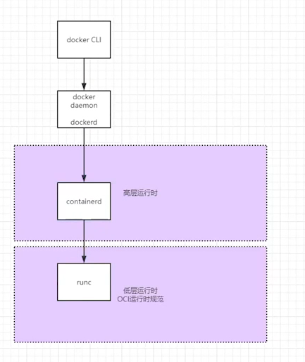
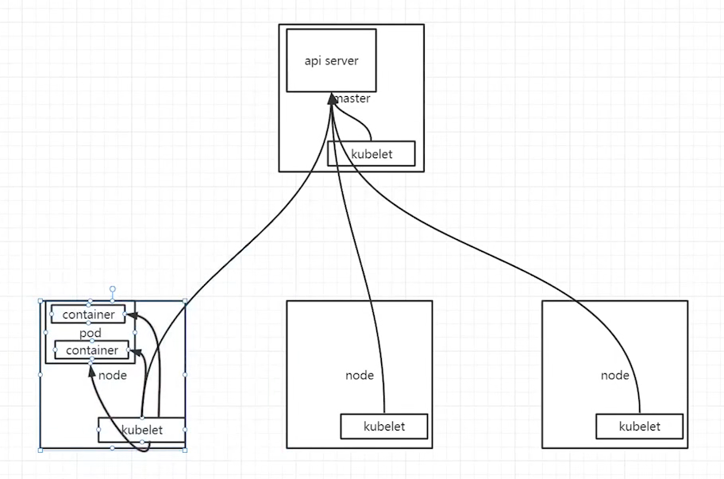
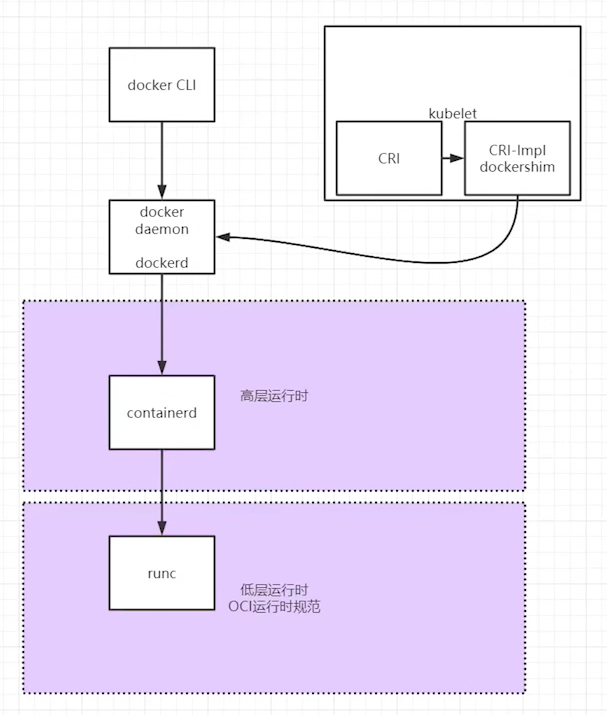
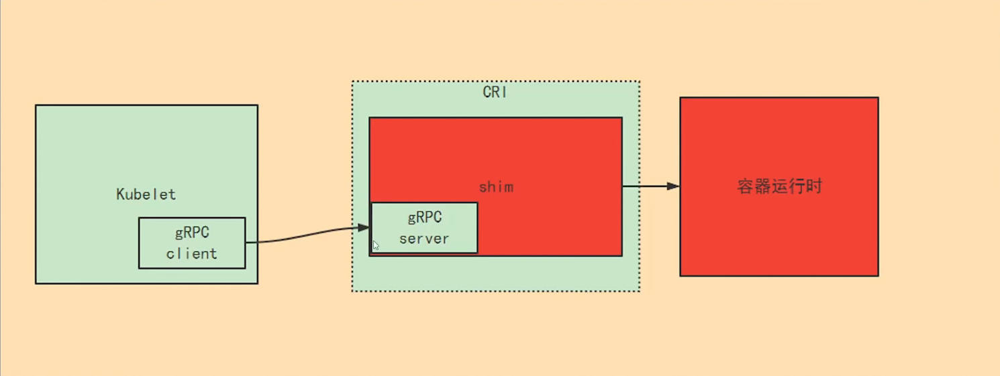
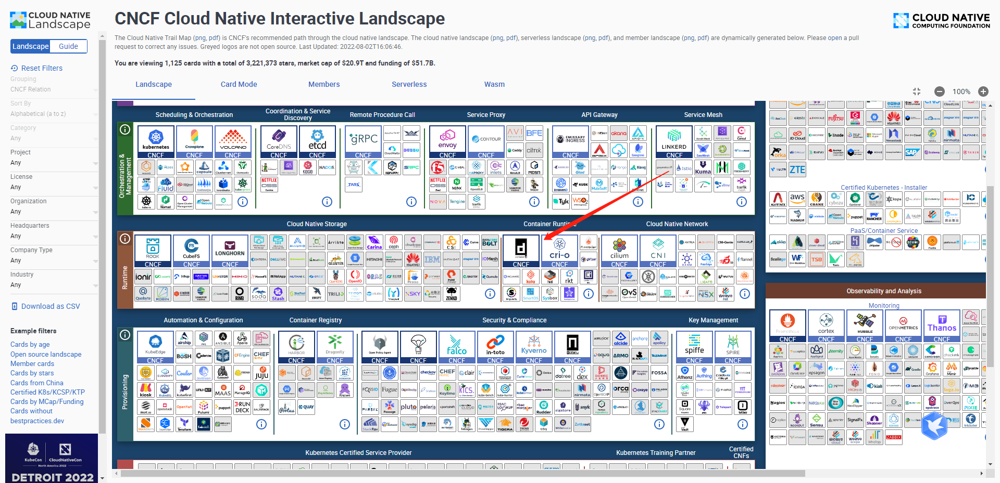
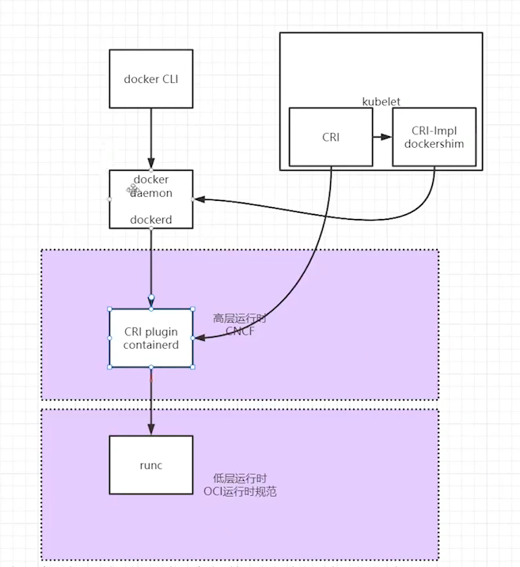

# k8s抛弃docker后，二者将何去何从？

## 一、k8s的渣男语录

>https://kubernetes.io/zh-cn/blog/2022/04/07/upcoming-changes-in-kubernetes-1-24/

> https://github.com/kubernetes/kubernetes/blob/master/CHANGELOG/CHANGELOG-1.20.md#deprecation

> Docker support in the kubelet is now deprecated and will be removed in a future release
>
> kubelet中的Docker支持现在已被弃用，并将在未来的版本中删除

>The kubelet uses a module called "dockershim" which implements CRI support for Docker and it has seen maintenance issues in the Kubernetes community
>
>kubelet使用了一个名为“dockershim”的模块，该模块实现了的CRI接口从而兼容了docker，该模块目前在Kubernetes社区中发现了维护问题

>We encourage you to evaluate moving to a container runtime that is a full-fledged implementation of CRI (v1alpha1 or v1 compliant) as they become available.
>
>我们鼓励你评估并更换一个可用且完整实现CRI（符合v1alpha1或者v1）接口的容器运行时

## 二、为什么要抛弃docker

### 1、回顾docker

https://docs.docker.com/get-started/overview/

#### 1.介绍

> Docker基于内核namespace做了资源隔离、通过control group做了资源控制，从而实现隔离进程的虚拟环境。
>
> 不同内核和namespace他们的网络是独立管理的，包括他们的用户、存储都是独立管理的。

#### 2.为什么需要cgroup

> 一台机器的cpu、内存等资源的总量是不便、一个namespace占用资源的多少需要得到控制。否则，一个namespace崩溃从而导致整个机器崩溃，cgroup主要就是进行资源管理。最终实现了环境独立、隔离进程的虚拟环境。 

#### 3.C：docker CLI

> docker client
>
> Docker 客户端（docker）是用户与docker交互的主要方式。例如使用命令docker run，客户端会将这些命令发送到dockerd，从而执行他们。

#### 4.S：dockerd

> docker daemon
>
> Docker 守护进程（dockerd）倾听Docker API请求并管理Docker对象，例如：镜像、容器、网络、卷。守护进程还可以与其他守护进程通信以管理Docker服务

### 2、container runtime（容器运行时）

> 容器运行时分为高层容器运行时和低层容器运行时

#### 1.高层容器运行时

> 主要工作：拉取、解压镜像

#### 2.低层容器运行时

> 需要满足OCI运行时规范：
>
> ​    OCI运行时规范定义了容器配置、运行时和生命周期标准。主要负责读取配置信息和启动容器的进程
>
> ​    OCI运行时规范指定了运行时和生命周期管理规范，生命周期定义了容器创建、删除和启动三个过程，同时需要额外支持两个命令：state、kill

### 3、runC

> runC是OCI运行时的规范的规范实现，即为规范的底层运行时。
>
> ​    通过runC可以对容器生命周期进行管理
>
> ​    但是注意：其不能支持镜像管理功能

### 4、Containerd

>containerd为高层运行时，主要负责拉取和解压镜像。
>
>但是，上传、制作镜像并不是containerd负责

### 5、捋一下他们的关系

### 6、kubelet

> ​    kubelet是一个节点上的主要服务，它周期性地从APIServer接受新的或者修改的Pod规范并且保证节点上的Pod和其中容器的正常运行，还会保证节点会向目标状态迁移，该节点仍然会向Master节点发送宿主机的健康状况。

### 7、CRI

> k8s从1.5版本开始引入CRI规范
>
> 由于kubelet的任务是管理其所在节点的工作负载，需要有镜像管理和运行容器的能力，因此只有高层运行时才适合接入CRI
>
> CRI与容器运行时之间需要一个接口层，称之为shim，即shim为CRI接口的实现，shim分为RuntimService和ImageServices
>
> ​    RuntimService负责pod和容器生命周期管理
>
> ​    ImageService负责仓库拉取、查看、移除镜像
>
> Docker运行时的CRI被称为dockershim于1.6被内置为kubelet默认启动

> 官方说dockershim维护出了问题，不想维护了

## 三、解决方案

### 1、工作原理

> gRPC就理解为RuntimeService和ImageService

### 2、找一个高层运行时

https://landscape.cncf.io/

> - 说起containerd不得不谈dockerd
>
>   docker本来是一个单体引擎，然后被拆分为三个部分分别为：runc、containerd和dockerd
>
>   - runC为底层容器运行时捐给了OCI；
>   - containerd为高层运行时捐给了CNCF；
>   - dockerd作为docker公司维护的运行时

>https://containerd.io/

## 四、总结

### 1、要不要学docker？

>要，最起码做镜像需要用到docker

### 2、以前的镜像能用吗？

> 可以，只要镜像符合oci规范，都可以用

