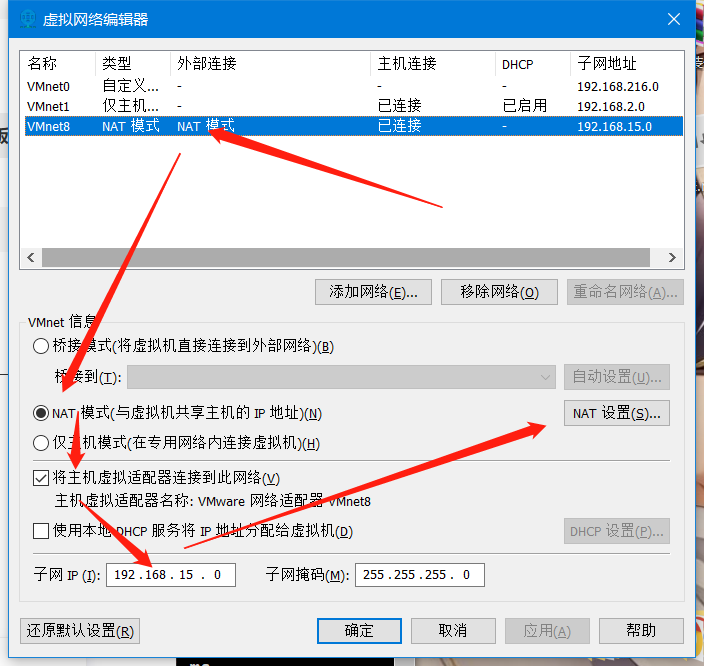
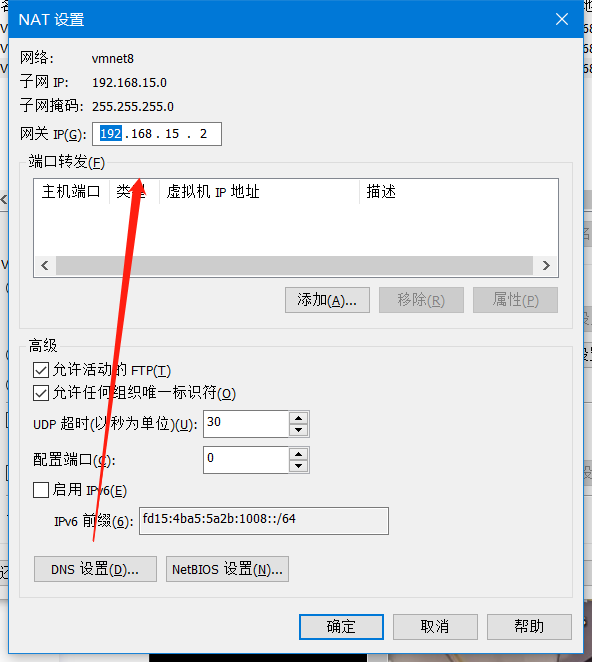
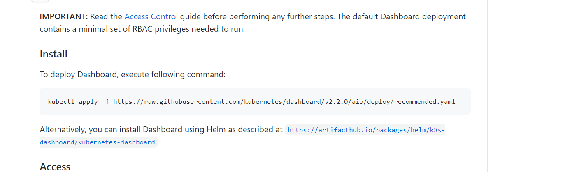
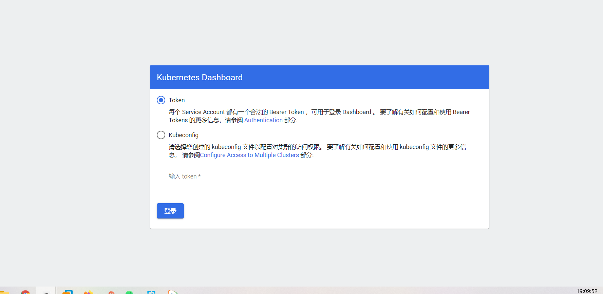

# 二进制安装kubernets


## 一、简介

```bash
	Kubernetes有两种方式，第一种是二进制的方式，可定制但是部署复杂容易出错；第二种是kubeadm工具安装，部署简单，不可定制化。本次我们部署二进制安装.
	服务器配置至少是2G2核的。如果不是则可以在集群初始化后面增加 --ignore-preflight-errors=NumCPU
	k8s和docker之间的关系？
	k8s是一个容器化管理平台，docker是一个容器，
```


## 二、部署规划

### 1、版本规划

| 软件            | 版本                                            |
| --------------- | ----------------------------------------------- |
| Centos          | 7.5版本及以上                                   |
| Docker          | 19.03及以上                                     |
| Kubernetse      | V1.19.1及以上                                   |
| Flanner         | V0.13.0及以上                                   |
| Kernel-lm       | kernel-lt-4.4.245-1.el7.elrepo.x86_64.rpm及以上 |
| Kernel-lm-devel | kernel-lt-devel-4.4.245-1.el7.elrepo.x86_64.rpm |

### 2、节点规划

| Hostname | Ip            |
| -------- | ------------- |
| k8s-m-01 | 192.168.15.51 |
| k8s-m-02 | 192.168.15.52 |
| k8s-m-03 | 192.168.15.53 |
| k8s-n-01 | 192.168.15.54 |
| k8s-n-02 | 192.168.15.55 |

## 三、修改网络及（五台主机）

### 1、修改虚拟网络编辑器





### 2、克隆主机

```bash
略
```


**内网eth1也要不同IP否则三台机器IP冲突。修改完成后重启网卡，ping baidu.com 查看网络是否畅通**


## 四、修改主机名及解析(五台节点)

### 1、修改主机名

```bash
hostnamectl set-hostname k8s-m-01
hostnamectl set-hostname k8s-m-02
hostnamectl set-hostname k8s-m-03
hostnamectl set-hostname k8s-n-01
hostnamectl set-hostname k8s-n-02
```


### 2、添加host解析

```bash
vim /etc/hosts
192.168.15.51  k8s-m-01 m1
192.168.15.52  k8s-m-02 m2
192.168.15.53  k8s-m-03 m3
192.168.15.54  k8s-n-01 n1
192.168.15.55  k8s-n-02 n2
```


### 3、添加DNS解析

```bash
 vim /etc/resolv.conf
# Generated by NetworkManager
nameserver 223.5.5.5
nameserver 114.114.114.114

```


## 五、系统优化(五个节点全做)

### 1、关闭selinux

```bash
# 永久关闭
sed -i 's#enforcing#disabled#g' /etc/selinux/config

#临时关闭
setenforce 0
```


### 2、关闭防火墙

```bash
systemctl disable --now firewalld
```


### 3、关闭swap分区

```bash
# 关闭swap分区
swapoff -a 

# kubelet忽略swap
echo 'KUBELET_EXTRA_ARGS="--fail-swap-on=false"' > /etc/sysconfig/kubelet

# 注释swap分区
vim /etc/fstab
```


### 4、做免密登录(m01节点做)

```bash
[root@k8s-m-01 ~]# rm -rf /root/.ssh
[root@k8s-m-01 ~]# ssh-keygen		交互式直接全部回车
[root@k8s-m-01 ~]# cd /root/.ssh/
[root@k8s-m-01 ~/.ssh]# mv id_rsa.pub authorized_keys
[root@k8s-m-01 ~/.ssh]# scp  -r  /root/.ssh  192.168.15.51:/root
[root@k8s-m-01 ~/.ssh]# scp  -r  /root/.ssh  192.168.15.52:/root
[root@k8s-m-01 ~/.ssh]# scp  -r  /root/.ssh  192.168.15.53:/root
[root@k8s-m-01 ~/.ssh]# scp  -r  /root/.ssh  192.168.15.54:/root
[root@k8s-m-01 ~/.ssh]# scp  -r  /root/.ssh  192.168.15.55:/root
```


### 5、同步集群时间

```bash
echo '#Timing synchronization time' >>/var/spool/cron/root	#给定时任务加上注释
echo '0 */1 * * * /usr/sbin/ntpdate ntp1.aliyun.com &>/dev/null' >>/var/spool/cron/root		#设置定时任务
crontab -l	#检查结果
```


### 6、更新yum源

````bash
rm -rf /etc/yum.repos.d/*

curl -o /etc/yum.repos.d/CentOS-Base.repo https://repo.huaweicloud.com/repository/conf/CentOS-7-reg.repo

yum install -y https://repo.huaweicloud.com/epel/epel-release-latest-7.noarch.rpm

sed -i "s/#baseurl/baseurl/g" /etc/yum.repos.d/epel.repo
sed -i "s/metalink/#metalink/g" /etc/yum.repos.d/epel.repo
sed -i "s@https\?://download.fedoraproject.org/pub@https://repo.huaweicloud.com@g" /etc/yum.repos.d/epel.repo

yum clean all
yum makecache
````


### 7、更新系统软件(排除内核)

```bash
yum update -y --exclud=kernel*
```


### 8、安装基础常用软件

```bash
yum install wget expect vim net-tools ntp bash-completion ipvsadm ipset jq iptables conntrack sysstat libseccomp -y
```


### 9、更新系统内核（docker 对系统内核要求比较高，最好使用4.4+）

**主节点操作**

```bash
[root@k8s-m-01 ~]# wget https://elrepo.org/linux/kernel/el7/x86_64/RPMS/kernel-lt-5.4.107-1.el7.elrepo.x86_64.rpm

[root@k8s-m-01 ~]# wget https://elrepo.org/linux/kernel/el7/x86_64/RPMS/kernel-lt-devel-5.4.107-1.el7.elrepo.x86_64.rpm

[root@k8s-m-01 ~]# for i in m1 m2 m3 n1 n2 ; do scp kernel-lt-* $i:/opt; done
```


**五个节点操作**

```bash
#安装
yum localinstall -y /opt/kernel-lt*

#调到默认启动
grub2-set-default 0 && grub2-mkconfig -o /etc/grub2.cfg 

#查看当前默认启动的内核
grubby --default-kernel

#重启系统
reboot
```


### 10、安装IPVS

#### 1）yum安装

```bash
yum install -y conntrack-tools ipvsadm ipset conntrack libseccomp 
```


#### 2）加载IPVS模块

```bash
cat > /etc/sysconfig/modules/ipvs.modules <<EOF 
#!/bin/bash 
ipvs_modules="ip_vs ip_vs_lc ip_vs_wlc ip_vs_rr ip_vs_wrr ip_vs_lblc ip_vs_lblcr ip_vs_dh ip_vs_sh ip_vs_fo ip_vs_nq ip_vs_sed ip_vs_ftp nf_conntrack" 

for kernel_module in \${ipvs_modules}; do 
	/sbin/modinfo -F filename \${kernel_module} > /dev/null 2>&1 
	if [ $? -eq 0 ]; then 
		/sbin/modprobe \${kernel_module} 
	fi 
done 
EOF

chmod 755 /etc/sysconfig/modules/ipvs.modules && bash /etc/sysconfig/modules/ipvs.modules && lsmod | grep ip_vs
```


### 11、修改内核启动参数优化

```bash
cat > /etc/sysctl.d/k8s.conf << EOF
net.ipv4.ip_forward = 1
net.bridge.bridge-nf-call-iptables = 1
net.bridge.bridge-nf-call-ip6tables = 1
fs.may_detach_mounts = 1
vm.overcommit_memory=1
vm.panic_on_oom=0
fs.inotify.max_user_watches=89100
fs.file-max=52706963
fs.nr_open=52706963
net.ipv4.tcp_keepalive_time = 600
net.ipv4.tcp.keepaliv.probes = 3
net.ipv4.tcp_keepalive_intvl = 15
net.ipv4.tcp.max_tw_buckets = 36000
net.ipv4.tcp_tw_reuse = 1
net.ipv4.tcp.max_orphans = 327680
net.ipv4.tcp_orphan_retries = 3
net.ipv4.tcp_syncookies = 1
net.ipv4.tcp_max_syn_backlog = 16384
net.ipv4.ip_conntrack_max = 65536
net.ipv4.tcp_max_syn_backlog = 16384
net.ipv4.top_timestamps = 0
net.core.somaxconn = 16384
EOF

# 立即生效
sysctl --system
```


### 12、安装docker(五台节点都要做)

#### 1）卸载之前的docker

```bash
yum remove docker docker-common docker-selinux docker-engine -y
```


#### 2）安装docker所需安装包

```bash
yum install -y yum-utils device-mapper-persistent-data lvm2
```


#### 3）安装docker yum源

```bash
wget -O /etc/yum.repos.d/docker-ce.repo https://repo.huaweicloud.com/docker-ce/linux/centos/docker-ce.repo
```


#### 4）安装docker

```bash
yum install docker-ce -y
```

**不成功多执行几次**


#### 5）启动并设置开机自启

```bash
systemctl enable --now docker.service
```


## 六、集群证书（只在m01节点操作）

```bash
	kubernetes组件众多，这些组件之间通过HTTP/GRPC相互通信，以协同完成集群中应用的部署和管理工作。尤其是master节点，更是掌握着整个集群的操作。其安全就变得尤为重要了，在目前世面上最安全的，使用最广泛的就是数字证书。kubernetes正是使用这种认证方式。
```


### 1、安装cfssl证书生成工具

```bash
	本次我们使用cfssl证书生成工具，这是一款把预先的证书机构、使用期等时间写在json文件里面会更加高效和自动化。cfssl采用go语言编写，是一个开源的证书管理工具，cfssljson用来从cfssl程序获取json输出，并将证书，密钥，csr和bundle写入文件中。
```

```bash
# 安装证书生成工具
wget https://pkg.cfssl.org/R1.2/cfssl_linux-amd64
wget https://pkg.cfssl.org/R1.2/cfssljson_linux-amd64

# 设置执行权限
chmod +x cfssljson_linux-amd64
chmod +x cfssl_linux-amd64

# 移动到/usr/local/bin
mv cfssljson_linux-amd64 cfssljson
mv cfssl_linux-amd64 cfssl
mv cfssljson cfssl /usr/local/bin
```


### 2、创建集群根证书

```bash
	从整个架构来看，集群环境中最重要的部分就是etcd和APIserver。所以集群当中的证书都是针对etcd和apiserver来设置的。
	所谓根证书，是CA认证中心与用户建立信任关系的基础，用户的数字证书必须有一个受信任的根证书，用户的数字证书才是有效的。从技术上讲，证书其实包含三部分，用户的信息，用户的公钥，以及证书签名。CA负责数字证书的批审、发放、归档、撤销等功能，CA颁发的数字证书拥有CA的数字签名，所以除了CA自身，其他机构无法不被察觉的改动。
```


```bash
mkdir -p /opt/cert/ca

cat > /opt/cert/ca/ca-config.json <<EOF
{
  "signing": {
    "default": {
      "expiry": "8760h"
    },
    "profiles": {
      "kubernetes": {
        "usages": [
          "signing",
          "key encipherment",
          "server auth",
          "client auth"
        ],
           "expiry": "8760h"
      }
    }
  }
}
EOF


#证书详解
1.default是默认策略，指定证书默认有效期是1年
2.profiles是定义使用场景，这里只是kubernetes，其实可以定义多个场景，分别指定不同的过期时间,使用场景等参数,后续签名证书时使用某个profile;
3.signing:表示该证书可用于签名其它证书,生成的ca.pem证书
4.serverauth:表示client可以用该CA对server提供的证书进行校验;
5.clientauth:表示server可以用该CA对client提供的证书进行验证。
```


### 3、创建根CA证书签名请求文件

```bash
cat > /opt/cert/ca/ca-csr.json << EOF
{
  "CN": "kubernetes",
  "key": {
    "algo": "rsa",
    "size": 2048
  },
  "names":[{
    "C": "CN",
    "ST": "ShangHai",
    "L": "ShangHai"
  }]
}
EOF
```

**证书详解**

| 证书项 | 解释     |
| ------ | -------- |
| C      | 国家     |
| ST     | 省       |
| L      | 城市     |
| O      | 组织     |
| OU     | 组织别名 |


### 4、生成根证书

```bash
[root@k8s-m-01 ~]# cd /opt/cert/ca
[root@k8s-m-01 /opt/cert/ca]# cfssl gencert -initca ca-csr.json | cfssljson -bare ca -
2021/03/26 17:34:55 [INFO] generating a new CA key and certificate from CSR
2021/03/26 17:34:55 [INFO] generate received request
2021/03/26 17:34:55 [INFO] received CSR
2021/03/26 17:34:55 [INFO] generating key: rsa-2048
2021/03/26 17:34:56 [INFO] encoded CSR
2021/03/26 17:34:56 [INFO] signed certificate with serial number 661764636777400005196465272245416169967628201792
[root@k8s-m-01 /opt/cert/ca]# ll
total 20
-rw-r--r-- 1 root root  285 Mar 26 17:34 ca-config.json
-rw-r--r-- 1 root root  960 Mar 26 17:34 ca.csr
-rw-r--r-- 1 root root  153 Mar 26 17:34 ca-csr.json
-rw------- 1 root root 1675 Mar 26 17:34 ca-key.pem
-rw-r--r-- 1 root root 1281 Mar 26 17:34 ca.pem
```


**参数详解**

| 参数项   | 解释                          |
| -------- | ----------------------------- |
| gencert  | 生成新的key（密钥）和签名证书 |
| --initca | 初始化一个新CA证书            |


## 七、部署ETCD集群

```bash
	Etcd是基于Raft的分布式key-value存储系统，由CoreOS团队开发，常用于服务发现，共享配置，以及并发控制（如leader选举，分布式锁等等）。Kubernetes使用Etcd进行状态和数据存储!
```


### 2、节点规划

```bash
192.168.15.51 etcd-01
192.168.15.52 etcd-01
192.168.15.53 etcd-01
```


### 3、创建ETCD集群证书

```bash
mkdir -p /opt/cert/etcd
cd /opt/cert/etcd

cat > etcd-csr.json << EOF
{
    "CN": "etcd",
    "hosts": [
        "127.0.0.1",
        "192.168.15.51",
        "192.168.15.52",
        "192.168.15.53",
        "192.168.15.54",
        "192.168.15.55",
        "192.168.15.56"
    ],
    "key": {
        "algo": "rsa",
        "size": 2048
    },
    "names": [
        {
          "C": "CN",
          "ST": "ShangHai",
          "L": "ShangHai"
        }
    ]
}
EOF
```


### 4、生成ETCD证书

````bash
[root@k8s-m-01 /opt/cert/etcd]# cfssl gencert -ca=../ca/ca.pem -ca-key=../ca/ca-key.pem -config=../ca/ca-config.json -profile=kubernetes etcd-csr.json | cfssljson -bare etcd

2021/03/26 17:38:57 [INFO] generate received request
2021/03/26 17:38:57 [INFO] received CSR
2021/03/26 17:38:57 [INFO] generating key: rsa-2048
2021/03/26 17:38:58 [INFO] encoded CSR
2021/03/26 17:38:58 [INFO] signed certificate with serial number 179909685000914921289186132666286329014949215773
2021/03/26 17:38:58 [WARNING] This certificate lacks a "hosts" field. This makes it unsuitable for
websites. For more information see the Baseline Requirements for the Issuance and Management
of Publicly-Trusted Certificates, v.1.1.6, from the CA/Browser Forum (https://cabforum.org);
specifically, section 10.2.3 ("Information Requirements").


[root@k8s-m-01 /opt/cert/etcd]# ll
total 16
-rw-r--r-- 1 root root 1050 Mar 27 19:51 etcd.csr
-rw-r--r-- 1 root root  394 Mar 27 19:51 etcd-csr.json
-rw------- 1 root root 1679 Mar 27 19:51 etcd-key.pem
-rw-r--r-- 1 root root 1379 Mar 27 19:51 etcd.pem

````

**参数详解**

| 参数项   | 解释                                                         |
| -------- | ------------------------------------------------------------ |
| gencert  | 生成新的key（密钥）和签名证书                                |
| -initca  | 初始化一个新的ca                                             |
| -ca-key  | 指明ca的证书                                                 |
| -config  | 指明ca的私钥文件                                             |
| -profile | 指明请求证书的json文件                                       |
| -ca      | 与config中的profile对应，是指根据config中的profile段来生成证书的相关信息 |


### 5、分发证书

```bash
[root@k8s-m-01 /opt/cert/etcd]# for ip in m1 m2 m3;do
    ssh root@${ip} "mkdir -pv /etc/etcd/ssl"
    scp ../ca/ca*.pem  root@${ip}:/etc/etcd/ssl
    scp ./etcd*.pem  root@${ip}:/etc/etcd/ssl
  done


mkdir: created directory ‘/etc/etcd’
mkdir: created directory ‘/etc/etcd/ssl’
ca-key.pem                                                  100% 1675     7.2KB/s   00:00
ca.pem                                                      100% 1281    11.1KB/s   00:00
etcd-key.pem                                                100% 1679    13.1KB/s   00:00
etcd.pem                                                    100% 1379   414.6KB/s   00:00
mkdir: created directory ‘/etc/etcd’
mkdir: created directory ‘/etc/etcd/ssl’
ca-key.pem                                                  100% 1675   942.9KB/s   00:00
ca.pem                                                      100% 1281     1.6MB/s   00:00
etcd-key.pem                                                100% 1679     1.7MB/s   00:00
etcd.pem                                                    100% 1379     1.2MB/s   00:00
mkdir: created directory ‘/etc/etcd’
mkdir: created directory ‘/etc/etcd/ssl’
ca-key.pem                                                  100% 1675     1.9MB/s   00:00
ca.pem                                                      100% 1281     1.4MB/s   00:00
etcd-key.pem                                                100% 1679     1.4MB/s   00:00
etcd.pem                                                    100% 1379     1.7MB/s   00:00

##确认
[root@k8s-m-01 /opt/cert/etcd]# for ip in m1 m2 m3;do
 ssh root@${ip} "ls -l /etc/etcd/ssl";
 done
total 16
-rw------- 1 root root 1675 Mar 27 20:01 ca-key.pem
-rw-r--r-- 1 root root 1281 Mar 27 20:01 ca.pem
-rw------- 1 root root 1679 Mar 27 20:01 etcd-key.pem
-rw-r--r-- 1 root root 1379 Mar 27 20:01 etcd.pem
total 16
-rw------- 1 root root 1675 Mar 27 20:01 ca-key.pem
-rw-r--r-- 1 root root 1281 Mar 27 20:01 ca.pem
-rw------- 1 root root 1679 Mar 27 20:01 etcd-key.pem
-rw-r--r-- 1 root root 1379 Mar 27 20:01 etcd.pem
total 16
-rw------- 1 root root 1675 Mar 27 20:01 ca-key.pem
-rw-r--r-- 1 root root 1281 Mar 27 20:01 ca.pem
-rw------- 1 root root 1679 Mar 27 20:01 etcd-key.pem
-rw-r--r-- 1 root root 1379 Mar 27 20:01 etcd.pem
```


### 6、部署ETCD

```bash
[root@k8s-m-01 /opt/cert/etcd]# cd

# 下载ETCD安装包
wget https://mirrors.huaweicloud.com/etcd/v3.3.24/etcd-v3.3.24-linux-amd64.tar.gz

# 解压
[root@k8s-m-01 ~]# tar xf etcd-v3.3.24-linux-amd64.tar.gz

# 分发至其他节点
for i in m1 m2 m3
do
	scp ./etcd-v3.3.24-linux-amd64/etcd* root@$i:/usr/local/bin/
done

#确认
[root@k8s-m-01 /opt/cert/etcd]# for ip in m1 m2 m3;do
ssh root@${ip} "etcd --version";
done

[root@k8s-m-01 /opt/etcd-v3.3.24-linux-amd64]# etcd --version
etcd Version: 3.3.24
Git SHA: bdd57848d
Go Version: go1.12.17
Go OS/Arch: linux/amd64
```


### 7、注册ETCD服务（三台master节点运行）

```bash
# 在三台master节点上执行
mkdir -pv /etc/kubernetes/conf/etcd

#设置环境变量
ETCD_NAME=`hostname`
INTERNAL_IP=`hostname -i`
INITIAL_CLUSTER=k8s-m-01=https://192.168.15.51:2380,k8s-m-02=https://192.168.15.52:2380,k8s-m-03=https://192.168.15.53:2380

#加入systemd管理
cat << EOF | sudo tee /usr/lib/systemd/system/etcd.service
[Unit]
Description=etcd
Documentation=https://github.com/coreos

[Service]
ExecStart=/usr/local/bin/etcd \\
  --name ${ETCD_NAME} \\
  --cert-file=/etc/etcd/ssl/etcd.pem \\
  --key-file=/etc/etcd/ssl/etcd-key.pem \\
  --peer-cert-file=/etc/etcd/ssl/etcd.pem \\
  --peer-key-file=/etc/etcd/ssl/etcd-key.pem \\
  --trusted-ca-file=/etc/etcd/ssl/ca.pem \\
  --peer-trusted-ca-file=/etc/etcd/ssl/ca.pem \\
  --peer-client-cert-auth \\
  --client-cert-auth \\
  --initial-advertise-peer-urls https://${INTERNAL_IP}:2380 \\
  --listen-peer-urls https://${INTERNAL_IP}:2380 \\
  --listen-client-urls https://${INTERNAL_IP}:2379,https://127.0.0.1:2379 \\
  --advertise-client-urls https://${INTERNAL_IP}:2379 \\
  --initial-cluster-token etcd-cluster \\
  --initial-cluster ${INITIAL_CLUSTER} \\
  --initial-cluster-state new \\
  --data-dir=/var/lib/etcd
Restart=on-failure
RestartSec=5

[Install]
WantedBy=multi-user.target
EOF

# 启动ETCD服务
systemctl enable --now etcd
```


**配置项详解**

| 配置选项                    | 选项操作                                   |
| --------------------------- | ------------------------------------------ |
| name                        | 节点名称                                   |
| data-dir                    | 指定节点的数据存储目录                     |
| listen-peer-urls            | 与集群其它成员之间的通信地址               |
| listen-client-urls          | 监听本地端口，对外提供服务的地址           |
| initial-advertise-peer-urls | 通告给集群其它节点，本地的对等URL地址      |
| advertise-client-urls       | 客户端URL，用于通告集群的其余部分信息      |
| initial-cluster             | 集群中的所有信息节点                       |
| initial-cluster-token       | 集群的token，整个集群中保持一致            |
| initial-cluster-state       | 初始化集群状态，默认为new                  |
| --cert-file                 | 客户端与服务器之间TLS证书文件的路径        |
| --key-file                  | 客户端与服务器之间TLS密钥文件的路径        |
| --peer-cert-file            | 对等服务器TLS证书文件的路径                |
| --peer-key-file             | 对等服务器TLS密钥文件的路径                |
| --trusted-ca-file           | 签名client证书的CA证书，用于验证client证书 |
| --peer-trusted-ca-file      | 签名对等服务器证书的CA证书                 |
| --trusted-ca-file           | 签名client证书的CA证书，用于验证client证书 |
| --peer-trusted-ca-file      | 签名对等服务器证书的CA证书。               |

**测试etcd服务**

```bash
# 第一种方式
ETCDCTL_API=3 etcdctl \
--cacert=/etc/etcd/ssl/etcd.pem \
--cert=/etc/etcd/ssl/etcd.pem \
--key=/etc/etcd/ssl/etcd-key.pem \
--endpoints="https://192.168.15.51:2379,https://192.168.15.52:2379,https://192.168.15.53:2379" \
endpoint status --write-out='table'

# 第二种方式
ETCDCTL_API=3 etcdctl \
--cacert=/etc/etcd/ssl/etcd.pem \
--cert=/etc/etcd/ssl/etcd.pem \
--key=/etc/etcd/ssl/etcd-key.pem \
--endpoints="https://192.168.15.51:2379,https://192.168.15.52:2379,https://192.168.15.53:2379" \
member list --write-out='table'
```


## 八、部署集群master节点

### 1、master节点规划

| 主机     | IP            |
| -------- | ------------- |
| k8s-m-01 | 192.168.15.51 |
| k8s-m-02 | 192.168.15.52 |
| k8s-m-03 | 192.168.15.53 |

**kube-apiserver、控制器、调度器、flannel、etcd、kubelet、kube-proxy、DNS**

### 2、创建集群证书（m01操作）

**Master节点是集群当中最为重要的一部分，组件众多，部署也最为复杂**

#### 1）创建集群CA证书

```bash
[root@k8s-m-01 ~]# mkdir /opt/cert/k8s
[root@k8s-m-01 ~]# cd /opt/cert/k8s
[root@k8s-m-01 /opt/cert/k8s]# pwd
/opt/cert/k8s
[root@k8s-m-01 /opt/cert/k8s]# cat > ca-config.json << EOF
 {
   "signing": {
     "default": {
       "expiry": "87600h"
     },
     "profiles": {
       "kubernetes": {
          "expiry": "87600h",
          "usages": [
             "signing",
             "key encipherment",
             "server auth",
             "client auth"
         ]
       }
     }
   }
 }
 EOF
```


#### 2）创建集群根CA证书签名请求文件

```bash
[root@k8s-m-01 /opt/cert/k8s]# cat > ca-csr.json << EOF
{
    "CN": "kubernetes",
    "key": {
        "algo": "rsa",
        "size": 2048
    },
    "names": [
        {
            "C": "CN",
            "L": "ShangHai",
            "ST": "ShangHai"
        }
    ]
}
EOF

[root@k8s-m-01 /opt/cert/k8s]# ll
total 8
-rw-r--r-- 1 root root 294 Mar 29 16:11 ca-config.json
-rw-r--r-- 1 root root 214 Mar 29 16:11 ca-csr.json
```


#### 3）生成根证书

```bash
[root@k8s-m-01 /opt/cert/k8s]# cfssl gencert -initca ca-csr.json | cfssljson -bare ca -

2021/03/29 16:11:42 [INFO] generating a new CA key and certificate from CSR
2021/03/29 16:11:42 [INFO] generate received request
2021/03/29 16:11:42 [INFO] received CSR
2021/03/29 16:11:42 [INFO] generating key: rsa-2048
2021/03/29 16:11:42 [INFO] encoded CSR
2021/03/29 16:11:42 [INFO] signed certificate with serial number 10002506757284876520896739820564095986050233319
[root@k8s-m-01 /opt/cert/k8s]# ll
total 20
-rw-r--r-- 1 root root  294 Mar 29 16:11 ca-config.json
-rw-r--r-- 1 root root  960 Mar 29 16:11 ca.csr
-rw-r--r-- 1 root root  214 Mar 29 16:11 ca-csr.json
-rw------- 1 root root 1679 Mar 29 16:11 ca-key.pem
-rw-r--r-- 1 root root 1281 Mar 29 16:11 ca.pem
[root@k8s-m-01 /opt/cert/k8s]#
```


### 3、创建集群普通证书（m01操作）

**创建集群各个组件之间的证书**

#### 1）签发kube-apiserver的证书

##### ①配置kube-apiserver证书签名配置

```bash
[root@k8s-m-01 /opt/cert/k8s]# cd /opt/cert/k8s
[root@k8s-m-01 /opt/cert/k8s]# ll
total 20
-rw-r--r-- 1 root root  294 Mar 29 16:11 ca-config.json
-rw-r--r-- 1 root root  960 Mar 29 16:11 ca.csr
-rw-r--r-- 1 root root  214 Mar 29 16:11 ca-csr.json
-rw------- 1 root root 1679 Mar 29 16:11 ca-key.pem
-rw-r--r-- 1 root root 1281 Mar 29 16:11 ca.pem
[root@k8s-m-01 /opt/cert/k8s]# cat > server-csr.json << EOF
{
    "CN": "kubernetes",
    "hosts": [
        "127.0.0.1",
        "192.168.15.51",
        "192.168.15.52",
        "192.168.15.53",
        "192.168.15.54",
        "192.168.15.55",
        "192.168.15.56",
        "10.96.0.1",
        "kubernetes",
        "kubernetes.default",
        "kubernetes.default.svc",
        "kubernetes.default.svc.cluster",
        "kubernetes.default.svc.cluster.local"
    ],
    "key": {
        "algo": "rsa",
        "size": 2048
    },
    "names": [
        {
            "C": "CN",
            "L": "ShangHai",
            "ST": "ShangHai"
        }
    ]
}
EOF
[root@k8s-m-01 /opt/cert/k8s]#
```

**host：localhost地址+master部署节点的ip地址+etcd节点的部署地址+负载均衡指定的VIP（172.16.0.55）+service段的第一个合法地址（10.96.0.1）+k8s默认指定的一些地址**


##### ②生成证书

```bash
[root@k8s-m-01 /opt/cert/k8s]# cfssl gencert -ca=ca.pem -ca-key=ca-key.pem -config=ca-config.json -profile=kubernetes server-csr.json | cfssljson -bare server

2021/03/29 16:27:40 [INFO] generate received request
2021/03/29 16:27:40 [INFO] received CSR
2021/03/29 16:27:40 [INFO] generating key: rsa-2048
2021/03/29 16:27:40 [INFO] encoded CSR
2021/03/29 16:27:40 [INFO] signed certificate with serial number 594635262484388270488732386274206296879751686987
2021/03/29 16:27:40 [WARNING] This certificate lacks a "hosts" field. This makes it unsuitable for
websites. For more information see the Baseline Requirements for the Issuance and Management
of Publicly-Trusted Certificates, v.1.1.6, from the CA/Browser Forum (https://cabforum.org);
specifically, section 10.2.3 ("Information Requirements").

[root@k8s-m-01 /opt/cert/k8s]# ll
total 36
-rw-r--r-- 1 root root  294 Mar 29 16:11 ca-config.json
-rw-r--r-- 1 root root  960 Mar 29 16:11 ca.csr
-rw-r--r-- 1 root root  214 Mar 29 16:11 ca-csr.json
-rw------- 1 root root 1679 Mar 29 16:11 ca-key.pem
-rw-r--r-- 1 root root 1281 Mar 29 16:11 ca.pem
-rw-r--r-- 1 root root 1245 Mar 29 16:27 server.csr
-rw-r--r-- 1 root root  603 Mar 29 16:22 server-csr.json
-rw------- 1 root root 1679 Mar 29 16:27 server-key.pem
-rw-r--r-- 1 root root 1574 Mar 29 16:27 server.pem
[root@k8s-m-01 /opt/cert/k8s]#
```


#### 2）签发kube-controller-manager证书

##### ①配置kube-controller-manager证书签名配置

```bash
[root@k8s-m-01 /opt/cert/k8s]#cat > kube-controller-manager-csr.json << EOF
{
    "CN": "system:kube-controller-manager",
    "hosts": [
        "127.0.0.1",
        "192.168.15.51",
        "192.168.15.52",
        "192.168.15.53",
        "192.168.15.54",
        "192.168.15.55",
        "192.168.15.56"
    ],
    "key": {
        "algo": "rsa",
        "size": 2048
    },
    "names": [
        {
            "C": "CN",
            "L": "ShangHai",
            "ST": "ShangHai",
            "O": "system:kube-controller-manager",
            "OU": "System"
        }
    ]
}
EOF
[root@k8s-m-01 /opt/cert/k8s]#
```


##### ②生成证书

```bash
[root@k8s-m-01 /opt/cert/k8s]# cfssl gencert -ca=ca.pem -ca-key=ca-key.pem -config=ca-config.json -profile=kubernetes kube-controller-manager-csr.json | cfssljson -bare kube-controller-manager
2021/03/29 16:39:58 [INFO] generate received request
2021/03/29 16:39:58 [INFO] received CSR
2021/03/29 16:39:58 [INFO] generating key: rsa-2048
2021/03/29 16:39:59 [INFO] encoded CSR
2021/03/29 16:39:59 [INFO] signed certificate with serial number 254237608083320571518569437270245246647088038454
2021/03/29 16:39:59 [WARNING] This certificate lacks a "hosts" field. This makes it unsuitable for
websites. For more information see the Baseline Requirements for the Issuance and Management
of Publicly-Trusted Certificates, v.1.1.6, from the CA/Browser Forum (https://cabforum.org);
specifically, section 10.2.3 ("Information Requirements").
[root@k8s-m-01 /opt/cert/k8s]#
```


#### 3）签发kube-scheduler的证书

##### ①配置kube-scheduler签名配置

```bash
[root@k8s-m-01 /opt/cert/k8s]# cat > kube-scheduler-csr.json << EOF
{
    "CN": "system:kube-scheduler",
    "hosts": [
        "127.0.0.1",
        "192.168.15.51",
        "192.168.15.52",
        "192.168.15.53",
        "192.168.15.54",
        "192.168.15.55",
        "192.168.15.56"
    ],
    "key": {
        "algo": "rsa",
        "size": 2048
    },
    "names": [
        {
            "C": "CN",
            "L": "ShangHai",
            "ST": "ShangHai",
            "O": "system:kube-scheduler",
            "OU": "System"
        }
    ]
}
EOF
[root@k8s-m-01 /opt/cert/k8s]# 
```


##### ②创建证书

```bash
[root@k8s-m-01 /opt/cert/k8s]# cfssl gencert -ca=ca.pem -ca-key=ca-key.pem -config=ca-config.json -profile=kubernetes kube-scheduler-csr.json | cfssljson -bare kube-scheduler

2021/03/29 16:44:40 [INFO] generate received request
2021/03/29 16:44:40 [INFO] received CSR
2021/03/29 16:44:40 [INFO] generating key: rsa-2048
2021/03/29 16:44:40 [INFO] encoded CSR
2021/03/29 16:44:40 [INFO] signed certificate with serial number 561161531056155006136925085600132698005329368546
2021/03/29 16:44:40 [WARNING] This certificate lacks a "hosts" field. This makes it unsuitable for
websites. For more information see the Baseline Requirements for the Issuance and Management
of Publicly-Trusted Certificates, v.1.1.6, from the CA/Browser Forum (https://cabforum.org);
specifically, section 10.2.3 ("Information Requirements").
[root@k8s-m-01 /opt/cert/k8s]#
```


#### 4）签发kube-proxy证书

##### ①配置kube-proxy证书签名配置

```bash
[root@k8s-m-01 /opt/cert/k8s]# cat > kube-proxy-csr.json << EOF
{
    "CN":"system:kube-proxy",
    "hosts":[],
    "key":{
        "algo":"rsa",
        "size":2048
    },
    "names":[
        {
            "C":"CN",
            "L":"ShangHai",
            "ST":"ShangHai",
            "O":"system:kube-proxy",
            "OU":"System"
        }
    ]
}
EOF
[root@k8s-m-01 /opt/cert/k8s]# 
```


##### ⑤生成证书

```bash
[root@k8s-m-01 /opt/cert/k8s]# cfssl gencert -ca=ca.pem -ca-key=ca-key.pem -config=ca-config.json -profile=kubernetes kube-proxy-csr.json | cfssljson -bare kube-proxy

2021/03/29 16:48:07 [INFO] generate received request
2021/03/29 16:48:07 [INFO] received CSR
2021/03/29 16:48:07 [INFO] generating key: rsa-2048
2021/03/29 16:48:07 [INFO] encoded CSR
2021/03/29 16:48:07 [INFO] signed certificate with serial number 628839766074761184666611184242052371676337534573
2021/03/29 16:48:07 [WARNING] This certificate lacks a "hosts" field. This makes it unsuitable for
websites. For more information see the Baseline Requirements for the Issuance and Management
of Publicly-Trusted Certificates, v.1.1.6, from the CA/Browser Forum (https://cabforum.org);
specifically, section 10.2.3 ("Information Requirements").
[root@k8s-m-01 /opt/cert/k8s]#

```


#### 5）签发管理员用户证书

**为了能让集群客户端工具安全的访问集群，所以要为集群客户端创建证书，使其具有所有的集群权限**

##### ①配置管理员证书签名配置

```bash
[root@k8s-m-01 /opt/cert/k8s]# cat > admin-csr.json << EOF
{
    "CN":"admin",
    "key":{
        "algo":"rsa",
        "size":2048
    },
    "names":[
        {
            "C":"CN",
            "L":"ShangHai",
            "ST":"ShangHai",
            "O":"system:masters",
            "OU":"System"
        }
    ]
}
EOF
[root@k8s-m-01 /opt/cert/k8s]# 
```


##### ②生成证书

````bash
[root@k8s-m-01 /opt/cert/k8s]# cfssl gencert -ca=ca.pem -ca-key=ca-key.pem -config=ca-config.json -profile=kubernetes admin-csr.json | cfssljson -bare admin

2021/03/29 16:54:30 [INFO] generate received request
2021/03/29 16:54:30 [INFO] received CSR
2021/03/29 16:54:30 [INFO] generating key: rsa-2048
2021/03/29 16:54:30 [INFO] encoded CSR
2021/03/29 16:54:30 [INFO] signed certificate with serial number 555634311668718390095800345504595209009739201051
2021/03/29 16:54:30 [WARNING] This certificate lacks a "hosts" field. This makes it unsuitable for
websites. For more information see the Baseline Requirements for the Issuance and Management
of Publicly-Trusted Certificates, v.1.1.6, from the CA/Browser Forum (https://cabforum.org);
specifically, section 10.2.3 ("Information Requirements").
[root@k8s-m-01 /opt/cert/k8s]#
````


#### 6）颁发证书（m01操作）

**Master节点所需证书：ca、kube-apiserver、kube-controller-manager、kube-scheduler、用户证书、Etcd证书**

```bash
[root@k8s-m-01 /opt/cert/k8s]# mkdir -pv /etc/kubernetes/ssl
[root@k8s-m-01 /opt/cert/k8s]# cp -p ./{ca*pem,server*pem,kube-controller-manager*pem,kube-scheduler*.pem,kube-proxy*pem,admin*.pem} /etc/kubernetes/ssl

[root@k8s-m-01 /opt/cert/k8s]# for i in m1 m2 m3;do
ssh root@$i "mkdir -pv /etc/kubernetes/ssl"
scp /etc/kubernetes/ssl/* root@$i:/etc/kubernetes/ssl
done
```


### 4、Master节点准备二进制组件

#### 1）下载二进制组件

```bash
## 方法一
[root@k8s-m-01 /opt/data]# wget https://dl.k8s.io/v1.18.8/kubernetes-server-linux-amd64.tar.gz

## 方法二
[root@k8s-m-01 /opt/data]# docker run -it  registry.cn-hangzhou.aliyuncs.com/k8sos/k8s:v1.18.8.1 bash

开个新窗口
 [root@k8s-m-01 /opt/data]# docker cp c023a1597b2a:/kubernetes-server-linux-amd64.tar.gz ./
```


#### 2）分发组件

```bash
[root@k8s-m-01 /opt/data]# tar -xf kubernetes-server-linux-amd64.tar.gz
[root@k8s-m-01 /opt/data]# cd kubernetes/server/bin
[root@k8s-m-01 /opt/data]# for i in m1 m2 m3 ;do  scp kube-apiserver kube-controller-manager kube-proxy kubectl kubelet kube-scheduler root@$i:/usr/local/bin; done
```


### 5、创建集群配置文件（m01操作）

**在kubernetes中，我们需要创建一个配置文件，用来配置集群、用户、命名空间及身份认证等信息**

**参数详解**

```bash
1.--certificate-authority：验证相关组件证书的根证书。
2.--client-certificate、--client-key：刚生成的kube-controller-manager证书和私钥，连接kube-apiserver时使用。
3.--embed-certs=true：将ca.pem和kube-controller-manager证书内容嵌入到生成的kubectl.kubeconfig文件中(不加时，写入的是证书文件路径)。
```


#### 1）创建kube-controller-manager.kubeconfig集群配置文件

```bash
export KUBE_APISERVER="https://192.168.15.56:8443"

# 设置集群参数
kubectl config set-cluster kubernetes \
  --certificate-authority=/etc/kubernetes/ssl/ca.pem \
  --embed-certs=true \
  --server=${KUBE_APISERVER} \
  --kubeconfig=kube-controller-manager.kubeconfig

# 设置客户端认证参数
kubectl config set-credentials "kube-controller-manager" \
  --client-certificate=/etc/kubernetes/ssl/kube-controller-manager.pem \
  --client-key=/etc/kubernetes/ssl/kube-controller-manager-key.pem \
  --embed-certs=true \
  --kubeconfig=kube-controller-manager.kubeconfig

# 设置上下文参数（在上下文参数中将集群参数和用户参数关联起来）
kubectl config set-context default \
  --cluster=kubernetes \
  --user="kube-controller-manager" \
  --kubeconfig=kube-controller-manager.kubeconfig

# 配置默认上下文
kubectl config use-context default --kubeconfig=kube-controller-manager.kubeconfig
```


#### 2）创建kube-scheduler.kubeconfig集群配置文件

````bash
export KUBE_APISERVER="https://192.168.15.56:8443"

# 设置集群参数
kubectl config set-cluster kubernetes \
  --certificate-authority=/etc/kubernetes/ssl/ca.pem \
  --embed-certs=true \
  --server=${KUBE_APISERVER} \
  --kubeconfig=kube-scheduler.kubeconfig

# 设置客户端认证参数
kubectl config set-credentials "kube-scheduler" \
  --client-certificate=/etc/kubernetes/ssl/kube-scheduler.pem \
  --client-key=/etc/kubernetes/ssl/kube-scheduler-key.pem \
  --embed-certs=true \
  --kubeconfig=kube-scheduler.kubeconfig

# 设置上下文参数（在上下文参数中将集群参数和用户参数关联起来）
kubectl config set-context default \
  --cluster=kubernetes \
  --user="kube-scheduler" \
  --kubeconfig=kube-scheduler.kubeconfig

# 配置默认上下文
kubectl config use-context default --kubeconfig=kube-scheduler.kubeconfig
````


#### 3）创建kube-proxy.kubeconfig集群配置文件

```bash
export KUBE_APISERVER="https://192.168.15.56:8443"

# 设置集群参数
kubectl config set-cluster kubernetes \
  --certificate-authority=/etc/kubernetes/ssl/ca.pem \
  --embed-certs=true \
  --server=${KUBE_APISERVER} \
  --kubeconfig=kube-proxy.kubeconfig

# 设置客户端认证参数
kubectl config set-credentials "kube-proxy" \
  --client-certificate=/etc/kubernetes/ssl/kube-proxy.pem \
  --client-key=/etc/kubernetes/ssl/kube-proxy-key.pem \
  --embed-certs=true \
  --kubeconfig=kube-proxy.kubeconfig

# 设置上下文参数（在上下文参数中将集群参数和用户参数关联起来）
kubectl config set-context default \
  --cluster=kubernetes \
  --user="kube-proxy" \
  --kubeconfig=kube-proxy.kubeconfig

# 配置默认上下文
kubectl config use-context default --kubeconfig=kube-proxy.kubeconfig
```


#### 4）创建超级管理员集群配置文件

```bash
export KUBE_APISERVER="https://192.168.15.56:8443"

# 设置集群参数
kubectl config set-cluster kubernetes \
  --certificate-authority=/etc/kubernetes/ssl/ca.pem \
  --embed-certs=true \
  --server=${KUBE_APISERVER} \
  --kubeconfig=admin.kubeconfig

# 设置客户端认证参数
kubectl config set-credentials "admin" \
  --client-certificate=/etc/kubernetes/ssl/admin.pem \
  --client-key=/etc/kubernetes/ssl/admin-key.pem \
  --embed-certs=true \
  --kubeconfig=admin.kubeconfig

# 设置上下文参数（在上下文参数中将集群参数和用户参数关联起来）
kubectl config set-context default \
  --cluster=kubernetes \
  --user="admin" \
  --kubeconfig=admin.kubeconfig

# 配置默认上下文
kubectl config use-context default --kubeconfig=admin.kubeconfig
```


#### 5）颁发集群配置文件

```bash
[root@k8s-m-01 /opt/cert/k8s]# for i in m1 m2 m3; do
ssh root@$i  "mkdir -pv /etc/kubernetes/cfg"
scp ./*.kubeconfig root@$i:/etc/kubernetes/cfg
done

#查看
[root@k8s-m-01 /opt/cert/k8s]# ll /etc/kubernetes/cfg/
total 32
-rw------- 1 root root 6107 Mar 29 18:02 admin.kubeconfig
-rw------- 1 root root 6319 Mar 29 18:02 kube-controller-manager.kubeconfig
-rw------- 1 root root 6137 Mar 29 18:02 kube-proxy.kubeconfig
-rw------- 1 root root 6269 Mar 29 18:02 kube-scheduler.kubeconfig
```


### 6、创建集群token（m01操作）

**token：身份令牌，用来作为身份验证**

```bash
# 只需要创建一次
# 必须要用自己机器创建的Token
TLS_BOOTSTRAPPING_TOKEN=`head -c 16 /dev/urandom | od -An -t x | tr -d ' '`

cat > token.csv << EOF
${TLS_BOOTSTRAPPING_TOKEN},kubelet-bootstrap,10001,"system:kubelet-bootstrap"
EOF

# 分发集群token，用于集群TLS认证
[root@k8s-m-01 /opt/cert/k8s]# for i in m1 m2 m3;do
scp token.csv root@$i:/etc/kubernetes/cfg/
done
```


### 7、各个组件部署

#### 1）安装kube-apiserver（所有master节点执行）

##### ①创建配置文件

```bash
[root@k8s-m-01 ~]# KUBE_APISERVER_IP=`hostname -i`

[root@k8s-m-01 ~]# cat > /etc/kubernetes/cfg/kube-apiserver.conf << EOF
KUBE_APISERVER_OPTS="--logtostderr=false \\
--v=2 \\
--log-dir=/var/log/kubernetes \\
--advertise-address=${KUBE_APISERVER_IP} \\
--default-not-ready-toleration-seconds=360 \\
--default-unreachable-toleration-seconds=360 \\
--max-mutating-requests-inflight=2000 \\
--max-requests-inflight=4000 \\
--default-watch-cache-size=200 \\
--delete-collection-workers=2 \\
--bind-address=0.0.0.0 \\
--secure-port=6443 \\
--allow-privileged=true \\
--service-cluster-ip-range=10.96.0.0/16 \\
--service-node-port-range=30000-52767 \\
--enable-admission-plugins=NamespaceLifecycle,LimitRanger,ServiceAccount,ResourceQuota,NodeRestriction \\
--authorization-mode=RBAC,Node \\
--enable-bootstrap-token-auth=true \\
--token-auth-file=/etc/kubernetes/cfg/token.csv \\
--kubelet-client-certificate=/etc/kubernetes/ssl/server.pem \\
--kubelet-client-key=/etc/kubernetes/ssl/server-key.pem \\
--tls-cert-file=/etc/kubernetes/ssl/server.pem  \\
--tls-private-key-file=/etc/kubernetes/ssl/server-key.pem \\
--client-ca-file=/etc/kubernetes/ssl/ca.pem \\
--service-account-key-file=/etc/kubernetes/ssl/ca-key.pem \\
--audit-log-maxage=30 \\
--audit-log-maxbackup=3 \\
--audit-log-maxsize=100 \\
--audit-log-path=/var/log/kubernetes/k8s-audit.log \\
--etcd-servers=https://192.168.15.51:2379,https://192.168.15.52:2379,https://192.168.15.53:2379 \\
--etcd-cafile=/etc/etcd/ssl/ca.pem \\
--etcd-certfile=/etc/etcd/ssl/etcd.pem \\
--etcd-keyfile=/etc/etcd/ssl/etcd-key.pem"
EOF
```


**参数详解**

| 配置项                                   | 说明                                                         |
| ---------------------------------------- | ------------------------------------------------------------ |
| --logtostderr=false                      | 输出日志到文件中，不输出到标准错误控制台                     |
| --v=2                                    | 指定输出日志的级别                                           |
| --advertise-address                      | 向集群成员通知apiserver消息的IP地址                          |
| --etcd-servers                           | 连接的etcd服务器列表                                         |
| --etcd-cafile                            | 用于etcd通信的SSLCA文件                                      |
| --etcd-certfile                          | 用于etcd通信的的SSL证书文件                                  |
| --etcd-keyfile                           | 用于etcd通信的SSL密钥文件                                    |
| --service-cluster-ip-range               | Service网络地址分配                                          |
| --bind-address                           | 监听--seure-port的IP地址，如果为空，则将使用所有接口（0.0.0.0） |
| --secure-port=6443                       | 用于监听具有认证授权功能的HTTPS协议的端口，默认值是6443      |
| --allow-privileged                       | 是否启用授权功能                                             |
| --service-node-port-range                | Service使用的端口范围                                        |
| --default-not-ready-toleration-seconds   | 表示notReady状态的容忍度秒数                                 |
| --default-unreachable-toleration-seconds | 表示unreachable状态的容忍度秒数                              |
| --max-mutating-requests-inflight=2000    | 在给定时间内进行中可变请求的最大数量，0值表示没有限制（默认值200） |
| --default-watch-cache-size=200           | 默认监视缓存大小，0表示对于没有设置默认监视大小的资源，将禁用监视缓存 |
| --delete-collection-workers=2            | 用于DeleteCollection调用的工作者数量，这被用于加速namespace的清理(默认值1) |
| --enable-admission-plugins               | 资源限制的相关配置                                           |
| --authorization-mode                     | 在安全端口上进行权限验证的插件的顺序列表，以逗号分隔的列表。 |


##### ②加入systemd管理

```bash
[root@k8s-m-01 ~]# cat > /usr/lib/systemd/system/kube-apiserver.service << EOF
[Unit]
Description=Kubernetes API Server
Documentation=https://github.com/kubernetes/kubernetes
After=network.target

[Service]
EnvironmentFile=/etc/kubernetes/cfg/kube-apiserver.conf
ExecStart=/usr/local/bin/kube-apiserver \$KUBE_APISERVER_OPTS
Restart=on-failure
RestartSec=10
Type=notify
LimitNOFILE=65536

[Install]
WantedBy=multi-user.target
EOF

#刷新
[root@k8s-m-01 ~]# systemctl daemon-reload
[root@k8s-m-01 ~]# systemctl enable --now kube-apiserver.service
```


#### 2）对kube-apiserver做高可用（所有master节点操作）

##### ①安装高可用软件

```bash
# keeplived + haproxy
[root@k8s-m-01 ~]# yum install -y keepalived haproxy
```


##### ②修改keepalived配置文件

>统一操作

```bash
mv /etc/keepalived/keepalived.conf /etc/keepalived/keepalived.conf_bak

cd /etc/keepalived

KUBE_APISERVER_IP=`hostname -i`

cat > /etc/keepalived/keepalived.conf <<EOF
! Configuration File for keepalived
global_defs {
    router_id LVS_DEVEL
}
vrrp_script chk_kubernetes {
    script "/etc/keepalived/check_kubernetes.sh"
    interval 2
    weight -5
    fall 3
    rise 2
}
vrrp_instance VI_1 {
    state MASTER
    interface eth0
    mcast_src_ip ${KUBE_APISERVER_IP}
    virtual_router_id 51
    priority 100
    advert_int 2
    authentication {
        auth_type PASS
        auth_pass K8SHA_KA_AUTH
    }
    virtual_ipaddress {
        192.168.15.56
    }
}
EOF
```


**不同节点配置不同，需要单独更改**

>m01 无需改动


> m02

```bash
sed -i 's#state MASTER#state BACKUP#g' /etc/keepalived/keepalived.conf
sed -i 's#192.168.15.51#192.168.15.52#g' /etc/keepalived/keepalived.conf
sed -i 's#priority 100#priority 90#g' /etc/keepalived/keepalived.conf
```


> m03

```bash
sed -i 's#state MASTER#state BACKUP#g' /etc/keepalived/keepalived.conf
sed -i 's#192.168.15.51#192.168.15.53#g' /etc/keepalived/keepalived.conf
sed -i 's#priority 100#priority 80#g' /etc/keepalived/keepalived.conf
```


##### ③设置监控检查脚本（三个节点操作）

```bash
cat > /etc/keepalived/check_kubernetes.sh <<EOF
#!/bin/bash

function chech_kubernetes() {
	for ((i=0;i<5;i++));do
		apiserver_pid_id=$(pgrep kube-apiserver)
		if [[ ! -z $apiserver_pid_id ]];then
			return
		else
			sleep 2
		fi
		apiserver_pid_id=0
	done
}

# 1:running 0:stopped
check_kubernetes
if [[ $apiserver_pid_id -eq 0 ]];then
	/usr/bin/systemctl stop keepalived
	exit 1
else
	exit 0
fi
EOF

chmod +x /etc/keepalived/check_kubernetes.sh
```


##### ④修改haproxy配置文件

**负载均衡软件**

```bash
cat > /etc/haproxy/haproxy.cfg <<EOF
global
  maxconn  2000
  ulimit-n  16384
  log  127.0.0.1 local0 err
  stats timeout 30s

defaults
  log global
  mode  http
  option  httplog
  timeout connect 5000
  timeout client  50000
  timeout server  50000
  timeout http-request 15s
  timeout http-keep-alive 15s

frontend monitor-in
  bind *:33305
  mode http
  option httplog
  monitor-uri /monitor

listen stats
  bind    *:8006
  mode    http
  stats   enable
  stats   hide-version
  stats   uri       /stats
  stats   refresh   30s
  stats   realm     Haproxy\ Statistics
  stats   auth      admin:admin

frontend k8s-master
  bind 0.0.0.0:8443
  bind 127.0.0.1:8443
  mode tcp
  option tcplog
  tcp-request inspect-delay 5s
  default_backend k8s-master

backend k8s-master
  mode tcp
  option tcplog
  option tcp-check
  balance roundrobin
  default-server inter 10s downinter 5s rise 2 fall 2 slowstart 60s maxconn 250 maxqueue 256 weight 100
  server k8s-m-01    192.168.15.51:6443  check inter 2000 fall 2 rise 2 weight 100
  server k8s-m-02    192.168.15.52:6443  check inter 2000 fall 2 rise 2 weight 100
  server k8s-m-03    192.168.15.53:6443  check inter 2000 fall 2 rise 2 weight 100
EOF
```


##### ⑤启动keepalive、haproxy

```bash
systemctl enable --now keepalived
systemctl enable --now haproxy.service
```


#### 3）部署TLS bootstrapping（m01操作）

**说明**

```bash
	TLS bootstrapping是用来简化管理员配置kubelet与apiserver双向加密通信的配置步骤的一种机制。当集群开启了TLS认证后，每个节点的kubelet组件都要使用由apiserver使用的CA签发的有效证书才能与apiserver通讯，此时如果有很多个节点都需要单独签署证书那将变得非常繁琐且极易出错，导致集群不稳。
	TLSbootstrapping功能就是让node节点上的kubelet组件先使用一个预定的低权限用户连接到apiserver，然后向apiserver申请证书，由apiserver动态签署颁发到Node节点，实现证书签署自动化。
	apiserver 动态签署颁发到Node节点，实现证书签署自动化
```


##### ①创建集群配置文件

**--token要是用先前配置好的**

```bash
[root@k8s-m-01 /etc/keepalived]# cd /opt/cert/k8s/

export KUBE_APISERVER="https://192.168.15.56:8443"

# 设置集群参数
kubectl config set-cluster kubernetes \
  --certificate-authority=/etc/kubernetes/ssl/ca.pem \
  --embed-certs=true \
  --server=${KUBE_APISERVER} \
  --kubeconfig=kubelet-bootstrap.kubeconfig

# 设置客户端认证参数,此处token必须用上叙token.csv中的token
kubectl config set-credentials "kubelet-bootstrap" \
  --token=a2774241a913f90c77a53b502420d7f7 \
  --kubeconfig=kubelet-bootstrap.kubeconfig

# 设置上下文参数（在上下文参数中将集群参数和用户参数关联起来）
kubectl config set-context default \
  --cluster=kubernetes \
  --user="kubelet-bootstrap" \
  --kubeconfig=kubelet-bootstrap.kubeconfig

# 配置默认上下文
kubectl config use-context default --kubeconfig=kubelet-bootstrap.kubeconfig
```


##### ②颁发证书

```bash
# 颁发集群配置文件
[root@k8s-m-01 /opt/cert/k8s]# for i in m1 m2 m3; do
scp kubelet-bootstrap.kubeconfig root@$i:/etc/kubernetes/cfg/
done
```


##### ③创建TLS低权限用户

```bash
# 创建一个低权限用户
[root@k8s-m-01 /opt/cert/k8s]# kubectl create clusterrolebinding kubelet-bootstrap \
--clusterrole=system:node-bootstrapper \
--user=kubelet-bootstrap
```


#### 4）部署contorller-manager（所有master节点）

##### ①创建配置文件

```bash
cat > /etc/kubernetes/cfg/kube-controller-manager.conf << EOF
KUBE_CONTROLLER_MANAGER_OPTS="--logtostderr=false \\
--v=2 \\
--log-dir=/var/log/kubernetes \\
--leader-elect=true \\
--cluster-name=kubernetes \\
--bind-address=127.0.0.1 \\
--allocate-node-cidrs=true \\
--cluster-cidr=10.244.0.0/12 \\
--service-cluster-ip-range=10.96.0.0/16 \\
--cluster-signing-cert-file=/etc/kubernetes/ssl/ca.pem \\
--cluster-signing-key-file=/etc/kubernetes/ssl/ca-key.pem  \\
--root-ca-file=/etc/kubernetes/ssl/ca.pem \\
--service-account-private-key-file=/etc/kubernetes/ssl/ca-key.pem \\
--kubeconfig=/etc/kubernetes/cfg/kube-controller-manager.kubeconfig \\
--tls-cert-file=/etc/kubernetes/ssl/kube-controller-manager.pem \\
--tls-private-key-file=/etc/kubernetes/ssl/kube-controller-manager-key.pem \\
--experimental-cluster-signing-duration=87600h0m0s \\
--controllers=*,bootstrapsigner,tokencleaner \\
--use-service-account-credentials=true \\
--node-monitor-grace-period=10s \\
--horizontal-pod-autoscaler-use-rest-clients=true"
EOF
```


##### ②加入systemd管理

```bash
cat > /usr/lib/systemd/system/kube-controller-manager.service << EOF
[Unit]
Description=Kubernetes Controller Manager
Documentation=https://github.com/kubernetes/kubernetes
After=network.target

[Service]
EnvironmentFile=/etc/kubernetes/cfg/kube-controller-manager.conf
ExecStart=/usr/local/bin/kube-controller-manager \$KUBE_CONTROLLER_MANAGER_OPTS
Restart=on-failure
RestartSec=5

[Install]
WantedBy=multi-user.target
EOF

# 重新加载
systemctl daemon-reload
```


##### ③启动

```bash
systemctl daemon-reload 
systemctl enable --now kube-controller-manager.service 
```


#### 5）部署kube-scheduler（所有master节点）

##### ①创建配置文件

```bash
cat > /etc/kubernetes/cfg/kube-scheduler.conf << EOF
KUBE_SCHEDULER_OPTS="--logtostderr=false \\
--v=2 \\
--log-dir=/var/log/kubernetes \\
--kubeconfig=/etc/kubernetes/cfg/kube-scheduler.kubeconfig \\
--leader-elect=true \\
--master=http://127.0.0.1:8080 \\
--bind-address=127.0.0.1 "
EOF
```


##### ②加入systemd管理

```bash
cat > /usr/lib/systemd/system/kube-scheduler.service << EOF
[Unit]
Description=Kubernetes Scheduler
Documentation=https://github.com/kubernetes/kubernetes
After=network.target

[Service]
EnvironmentFile=/etc/kubernetes/cfg/kube-scheduler.conf
ExecStart=/usr/local/bin/kube-scheduler \$KUBE_SCHEDULER_OPTS
Restart=on-failure
RestartSec=5

[Install]
WantedBy=multi-user.target
EOF
```


##### ③启动

```bash
systemctl daemon-reload 
systemctl enable --now kube-scheduler.service 
```


#### 6）查看集群状态

```bash
[root@k8s-m-01 /opt/cert/k8s]# kubectl get cs
NAME                 STATUS    MESSAGE             ERROR
scheduler            Healthy   ok                  
controller-manager   Healthy   ok                  
etcd-2               Healthy   {"health":"true"}   
etcd-1               Healthy   {"health":"true"}   
etcd-0               Healthy   {"health":"true"}  
```


#### 7）部署kubelet服务（所有master节点）

##### ①创建配置文件

```bash
KUBE_HOSTNAME=`hostname`

cat > /etc/kubernetes/cfg/kubelet.conf << EOF
KUBELET_OPTS="--logtostderr=false \\
--v=2 \\
--log-dir=/var/log/kubernetes \\
--hostname-override=${KUBE_HOSTNAME} \\
--container-runtime=docker \\
--kubeconfig=/etc/kubernetes/cfg/kubelet.kubeconfig \\
--bootstrap-kubeconfig=/etc/kubernetes/cfg/kubelet-bootstrap.kubeconfig \\
--config=/etc/kubernetes/cfg/kubelet-config.yml \\
--cert-dir=/etc/kubernetes/ssl \\
--image-pull-progress-deadline=15m \\
--pod-infra-container-image=registry.cn-hangzhou.aliyuncs.com/k8sos/pause:3.2"
EOF
```


##### ②创建kubelet-config.yaml

```bash
KUBE_HOSTNAME_IP=`hostname -i`

cat > /etc/kubernetes/cfg/kubelet-config.yml << EOF
kind: KubeletConfiguration
apiVersion: kubelet.config.k8s.io/v1beta1
address: ${KUBE_HOSTNAME_IP}
port: 10250
readOnlyPort: 10255
cgroupDriver: cgroupfs
clusterDNS:
- 10.96.0.2
clusterDomain: cluster.local
failSwapOn: false
authentication:
  anonymous:
    enabled: false
  webhook:
    cacheTTL: 2m0s
    enabled: true
  x509:
    clientCAFile: /etc/kubernetes/ssl/ca.pem
authorization:
  mode: Webhook
  webhook:
    cacheAuthorizedTTL: 5m0s
    cacheUnauthorizedTTL: 30s
evictionHard:
  imagefs.available: 15%
  memory.available: 100Mi
  nodefs.available: 10%
  nodefs.inodesFree: 5%
maxOpenFiles: 1000000
maxPods: 110
EOF
```


##### ③加入systemd管理

```bash
cat > /usr/lib/systemd/system/kubelet.service << EOF
[Unit]
Description=Kubernetes Kubelet
After=docker.service

[Service]
EnvironmentFile=/etc/kubernetes/cfg/kubelet.conf
ExecStart=/usr/local/bin/kubelet \$KUBELET_OPTS
Restart=on-failure
RestartSec=10
LimitNOFILE=65536

[Install]
WantedBy=multi-user.target
EOF
```


##### ④启动

```bash
systemctl daemon-reload 
systemctl enable --now kubelet.service 
```


#### 8）部署kube-proxy（所有master节点）

##### ①创建配置文件

```bash
cat > /etc/kubernetes/cfg/kube-proxy.conf << EOF
KUBE_PROXY_OPTS="--logtostderr=false \\
--v=2 \\
--log-dir=/var/log/kubernetes \\
--config=/etc/kubernetes/cfg/kube-proxy-config.yml"
EOF
```


##### ②创建kube-proxy-config.yml

```bash
KUBE_HOSTNAME_IP=`hostname -i`
HOSTNAME=`hostname`

cat > /etc/kubernetes/cfg/kube-proxy-config.yml << EOF
kind: KubeProxyConfiguration
apiVersion: kubeproxy.config.k8s.io/v1alpha1
bindAddress: ${KUBE_HOSTNAME_IP}
healthzBindAddress: ${KUBE_HOSTNAME_IP}:10256
metricsBindAddress: ${KUBE_HOSTNAME_IP}:10249
clientConnection:
  burst: 200
  kubeconfig: /etc/kubernetes/cfg/kube-proxy.kubeconfig
  qps: 100
hostnameOverride: ${HOSTNAME}
clusterCIDR: 10.96.0.0/16
enableProfiling: true
mode: "ipvs"
kubeProxyIPTablesConfiguration:
  masqueradeAll: false
kubeProxyIPVSConfiguration:
  scheduler: rr
  excludeCIDRs: []
EOF
```


##### ③加入systemd管理

```bash
cat > /usr/lib/systemd/system/kube-proxy.service << EOF
[Unit]
Description=Kubernetes Proxy
After=network.target

[Service]
EnvironmentFile=/etc/kubernetes/cfg/kube-proxy.conf
ExecStart=/usr/local/bin/kube-proxy \$KUBE_PROXY_OPTS
Restart=on-failure
RestartSec=10
LimitNOFILE=65536

[Install]
WantedBy=multi-user.target
EOF
```


##### ④启动

```bash
systemctl daemon-reload 
systemctl enable --now kube-proxy.service
```


#### 9）加入集群节点

##### ①查看集群节点加入请求

```bash
# 只需要在一台节点上执行即可
[root@k8s-m-01 /opt/cert/k8s]# kubectl get csr
NAME                                                   AGE    SIGNERNAME                                    REQUESTOR           CONDITION
node-csr-5AWYEWZ0DkF4DzHTOP00M2_Ne6on7XMwvryxbwsh90M   6m3s   kubernetes.io/kube-apiserver-client-kubelet   kubelet-bootstrap   Pending
node-csr-8_Rjm9D7z-04h400v_8RDHHCW3UGILeSRhxx-KkIWNI   6m3s   kubernetes.io/kube-apiserver-client-kubelet   kubelet-bootstrap   Pending
node-csr-wlHMJiNAkMuPsQPoD6dan8QF4AIlm-x_hVYJt9DukIg   6m2s   kubernetes.io/kube-apiserver-client-kubelet   kubelet-bootstrap   Pending
```


##### ②批准加入

```bash
# 只需要在一台节点上执行即可
[root@k8s-m-01 /opt/cert/k8s]# kubectl certificate approve `kubectl get csr | grep "Pending" | awk '{print $1}'`
certificatesigningrequest.certificates.k8s.io/node-csr-5AWYEWZ0DkF4DzHTOP00M2_Ne6on7XMwvryxbwsh90M approved
certificatesigningrequest.certificates.k8s.io/node-csr-8_Rjm9D7z-04h400v_8RDHHCW3UGILeSRhxx-KkIWNI approved
certificatesigningrequest.certificates.k8s.io/node-csr-wlHMJiNAkMuPsQPoD6dan8QF4AIlm-x_hVYJt9DukIg approved
[root@k8s-m-01 /opt/cert/k8s]# kubectl get nodes
NAME       STATUS   ROLES    AGE   VERSION
k8s-m-01   Ready    <none>   13s   v1.18.8
k8s-m-02   Ready    <none>   12s   v1.18.8
k8s-m-03   Ready    <none>   12s   v1.18.8
```


#### 10）安装网络插件

**本次选择使用flannel网络插件**

##### ①下载flannel安装包并安装

```bash
# 只需要在一台节点上执行即可
cd /opt/data
wget https://github.com/coreos/flannel/releases/download/v0.13.1-rc1/flannel-v0.13.1-rc1-linux-amd64.tar.gz
tar -xf flannel-v0.13.1-rc1-linux-amd64.tar.gz

for i in m1 m2 m3;do
scp flanneld mk-docker-opts.sh root@$i:/usr/local/bin/
done
```


##### ②将flannel配置写入集群数据库

```bash
# 只需要在一台节点上执行即可
etcdctl \
--ca-file=/etc/etcd/ssl/ca.pem \
--cert-file=/etc/etcd/ssl/etcd.pem \
--key-file=/etc/etcd/ssl/etcd-key.pem \
--endpoints="https://192.168.15.51:2379,https://192.168.15.52:2379,https://192.168.15.53:2379" \
mk /coreos.com/network/config '{"Network":"10.244.0.0/12", "SubnetLen": 21, "Backend": {"Type": "vxlan", "DirectRouting": true}}'
```


##### ③加入systemd管理

```bash
# 需要在三台机器运行
cat > /usr/lib/systemd/system/flanneld.service << EOF
[Unit]
Description=Flanneld address
After=network.target
After=network-online.target
Wants=network-online.target
After=etcd.service
Before=docker.service

[Service]
Type=notify
ExecStart=/usr/local/bin/flanneld \\
  -etcd-cafile=/etc/etcd/ssl/ca.pem \\
  -etcd-certfile=/etc/etcd/ssl/etcd.pem \\
  -etcd-keyfile=/etc/etcd/ssl/etcd-key.pem \\
  -etcd-endpoints=https://192.168.15.51:2379,https://192.168.15.52:2379,https://192.168.15.53:2379 \\
  -etcd-prefix=/coreos.com/network \\
  -ip-masq
ExecStartPost=/usr/local/bin/mk-docker-opts.sh -k DOCKER_NETWORK_OPTIONS -d /run/flannel/subnet.env
Restart=always
RestartSec=5
StartLimitInterval=0
[Install]
WantedBy=multi-user.target
RequiredBy=docker.service
EOF
```


##### ④修改docker启动文件

```bash
# 让flannel接管docker网络
# 需要在三台机器运行
sed -i '/ExecStart/s/\(.*\)/#\1/' /usr/lib/systemd/system/docker.service
sed -i '/ExecReload/a ExecStart=/usr/bin/dockerd $DOCKER_NETWORK_OPTIONS -H fd:// --containerd=/run/containerd/containerd.sock' /usr/lib/systemd/system/docker.service
sed -i '/ExecReload/a EnvironmentFile=-/run/flannel/subnet.env' /usr/lib/systemd/system/docker.service
```


##### ⑤启动

```bash
# 需要在三台机器运行
systemctl daemon-reload
systemctl enable --now flanneld.service
systemctl restart docker
```


##### ⑥验证集群网络

```bash
# 集群节点互ping对方的flannel网络
```


#### 11）安装集群DNS

```bash
# 只需要在一台节点上执行即可
# 下载DNS安装配置文件包
[root@k8s-m-01 ~]# wget https://github.com/coredns/deployment/archive/refs/heads/master.zip
[root@k8s-m-01 ~]# unzip deployment-master.zip
[root@k8s-m-01 ~]# cd deployment-master/kubernetes

# 执行部署命令
[root@k8s-m-01 ~/deployment-master/kubernetes]# ./deploy.sh -i 10.96.0.2 -s | kubectl apply -f -

# 验证集群DNS
[root@k8s-m-01 ~/deployment-master/kubernetes]# kubectl get pods -n kube-system
NAME                      READY   STATUS    RESTARTS   AGE
coredns-6ff445f54-m28gw   1/1     Running   0          48s
```


#### 12）验证集群

```bash
# 绑定一下超管用户（只需要在一台服务器上执行即可）
[root@k8s-m-01 ~/deployment-master/kubernetes]# kubectl create clusterrolebinding cluster-system-anonymous --clusterrole=cluster-admin --user=kubernetes
clusterrolebinding.rbac.authorization.k8s.io/cluster-system-anonymous created

# 验证集群DNS和集群网络成功
[root@k8s-m-01 ~/deployment-master/kubernetes]# kubectl run test -it --rm --image=busybox:1.28.3
If you don't see a command prompt, try pressing enter.
/ # nslookup kubernetes
Server:    10.96.0.2
Address 1: 10.96.0.2 kube-dns.kube-system.svc.cluster.local

Name:      kubernetes
Address 1: 10.96.0.1 kubernetes.default.svc.cluster.local
```


## 九、Node节点安装

​	**Node节点主要负责提供应用运行环境，其最主要的组件就是kube-proxy和kubelet。接下来我们就在集群当中部署Node节点。**

>node需要部署哪些组件？
>
>​	kubelet、kube-proxy、flannel


### 1、集群规划

```bash
192.168.15.54  k8s-n-01 n1
192.168.15.55  k8s-n-02 n2
```


### 2、免密登录

```bash
略
```


### 3、m01分发软件包

```bash
[root@k8s-m-01 ~]# cd /opt/data/

[root@k8s-m-01 /opt/data]# for i in n1 n2;do
scp flanneld mk-docker-opts.sh kubernetes/server/bin/kubelet kubernetes/server/bin/kube-proxy root@$i:/usr/local/bin;done
```


### 4、分发证书

```bash
[root@k8s-m-01 /opt/data]# for i in n1 n2; do ssh root@$i "mkdir -pv /etc/kubernetes/ssl"; scp -pr /etc/kubernetes/ssl/{ca*.pem,admin*pem,kube-proxy*pem} root@$i:/etc/kubernetes/ssl; done
```


### 5、分发配置文件

```bash
# flanneld、etcd的证书、docker.service

# 分发ETCD证书
[root@k8s-m-01 /opt/data]# cd /etc/etcd/ssl/
[root@k8s-m-01 /etc/etcd/ssl]# for i in n1 n2 ;do ssh root@$i "mkdir -pv /etc/etcd/ssl"; scp./*  root@$i:/etc/etcd/ssl; done

#分发flannel和docker的启动脚本
[root@k8s-m-01 /etc/etcd/ssl]# for i in n1 n2;do scp /usr/lib/systemd/system/docker.service root@$i:/usr/lib/systemd/system/docker.service; scp /usr/lib/systemd/system/flanneld.service root@$i:/usr/lib/systemd/system/flanneld.service; done
```


### 6、部署kubelet

#### 1）m01分发配置文件

```bash
[root@k8s-m-01 ~]# for i in n1 n2 ;do
    ssh root@$i "mkdir -pv  /etc/kubernetes/cfg";
    scp /etc/kubernetes/cfg/kubelet.conf root@$i:/etc/kubernetes/cfg/kubelet.conf;
    scp /etc/kubernetes/cfg/kubelet-config.yml root@$i:/etc/kubernetes/cfg/kubelet-config.yml;
    scp /usr/lib/systemd/system/kubelet.service root@$i:/usr/lib/systemd/system/kubelet.service;
    scp /etc/kubernetes/cfg/kubelet.kubeconfig root@$i:/etc/kubernetes/cfg/kubelet.kubeconfig;
    scp /etc/kubernetes/cfg/kubelet-bootstrap.kubeconfig root@$i:/etc/kubernetes/cfg/kubelet-bootstrap.kubeconfig;
    scp /etc/kubernetes/cfg/token.csv root@$i:/etc/kubernetes/cfg/token.csv;
done

```


#### 2）修改

**因为是直接从m01拷贝过来的配置文件，所有要修改配置文件内容**

```bash
# 修改配置文件kubelet-config.yml和kubelet.conf
```


#### 3）启动kubelet

```bash
[root@k8s-n-02 /etc/kubernetes/cfg]# systemctl enable --now kubelet.service
Created symlink from /etc/systemd/system/multi-user.target.wants/kubelet.service to /usr/lib/systemd/system/kubelet.service.
```


### 7、部署kube-proxy

#### 1）m01分发配置文件

```bash
[root@k8s-m-01 ~]# for i in n1 n2 ; do 
    scp /etc/kubernetes/cfg/kube-proxy.conf root@$i:/etc/kubernetes/cfg/kube-proxy.conf;  
    scp /etc/kubernetes/cfg/kube-proxy-config.yml root@$i:/etc/kubernetes/cfg/kube-proxy-config.yml ;  
    scp /usr/lib/systemd/system/kube-proxy.service root@$i:/usr/lib/systemd/system/kube-proxy.service;  
    scp /etc/kubernetes/cfg/kube-proxy.kubeconfig root@$i:/etc/kubernetes/cfg/kube-proxy.kubeconfig;
    done
```


#### 2）修改

```bash
# 修改kube-proxy-config.yml中IP和主机名
```


#### 3）启动

```bash
# 启动
[root@k8s-n-02 ~]# systemctl enable --now kube-proxy.service 
```


### 8、加入集群

#### 1）查看集群状态

```bash
[root@k8s-m-01 ~]# kubectl get cs
NAME                 STATUS    MESSAGE             ERROR
scheduler            Healthy   ok
controller-manager   Healthy   ok
etcd-2               Healthy   {"health":"true"}
etcd-0               Healthy   {"health":"true"}
etcd-1               Healthy   {"health":"true"
```


#### 2）查看加入集群请求

```bash
[root@k8s-m-01 ~]# kubectl get csr
NAME                                                   AGE   SIGNERNAME                                    REQUESTOR           CONDITION
node-csr-4_UFaJOBTN1e_UHxH4uUG23TRxV0iC9Y3R4HChCfn9w   11m   kubernetes.io/kube-apiserver-client-kubelet   kubelet-bootstrap   Pending
node-csr-O6lrJ_C6xASbA9SzlCy9S2fpHACc_4WElKWyHBZ95Mg   11m   kubernetes.io/kube-apiserver-client-kubelet   kubelet-bootstrap   Pending

```


#### 3）批准加入

```bash
[root@k8s-m-01 ~]#  kubectl certificate approve `kubectl get csr | grep "Pending" | awk '{print $1}'`
certificatesigningrequest.certificates.k8s.io/node-csr-4_UFaJOBTN1e_UHxH4uUG23TRxV0iC9Y3R4HChCfn9w approved
certificatesigningrequest.certificates.k8s.io/node-csr-O6lrJ_C6xASbA9SzlCy9S2fpHACc_4WElKWyHBZ95Mg approved
```


#### 4）查看加入状态

```bash
[root@k8s-m-01 ~]# kubectl get csr
NAME                                                   AGE   SIGNERNAME                                    REQUESTOR           CONDITION
node-csr-4_UFaJOBTN1e_UHxH4uUG23TRxV0iC9Y3R4HChCfn9w   13m   kubernetes.io/kube-apiserver-client-kubelet   kubelet-bootstrap   Approved,Issued
node-csr-O6lrJ_C6xASbA9SzlCy9S2fpHACc_4WElKWyHBZ95Mg   13m   kubernetes.io/kube-apiserver-client-kubelet   kubelet-bootstrap   Approved,Issued
```


#### 5）查看加入节点

```bash
[root@k8s-m-01 ~]# kubectl get nodes
NAME       STATUS   ROLES    AGE     VERSION
k8s-m-01   Ready    <none>   21h     v1.18.8
k8s-m-02   Ready    <none>   21h     v1.18.8
k8s-m-03   Ready    <none>   21h     v1.18.8
k8s-n-01   Ready    <none>   2m21s   v1.18.8
k8s-n-02   Ready    <none>   2m20s   v1.18.8
```


#### 6）设置集群角色

```bash
[root@k8s-m-01 ~]# kubectl label nodes k8s-m-01 node-role.kubernetes.io/master=k8s-m-01

node/k8s-m-01 labeled
[root@k8s-m-01 ~]#  kubectl label nodes k8s-m-02 node-role.kubernetes.io/master=k8s-m-02

node/k8s-m-02 labeled
[root@k8s-m-01 ~]# kubectl label nodes k8s-m-03 node-role.kubernetes.io/master=k8s-m-03

node/k8s-m-03 labeled
[root@k8s-m-01 ~]# kubectl label nodes k8s-n-01 node-role.kubernetes.io/node=k8s-n-01

node/k8s-n-01 labeled
[root@k8s-m-01 ~]# kubectl label nodes k8s-n-02 node-role.kubernetes.io/node=k8s-n-02

node/k8s-n-02 labeled
[root@k8s-m-01 ~]# kubectl get nodes
NAME       STATUS   ROLES    AGE     VERSION
k8s-m-01   Ready    master   21h     v1.18.8
k8s-m-02   Ready    master   21h     v1.18.8
k8s-m-03   Ready    master   21h     v1.18.8
k8s-n-01   Ready    node     3m46s   v1.18.8
k8s-n-02   Ready    node     3m45s   v1.18.8
[root@k8s-m-01 ~]#
```


### 9、安装集群图形化界面

#### 1）下载yaml

```bash
https://github.com/kubernetes/dashboard

 wget https://raw.githubusercontent.com/kubernetes/dashboard/v2.2.0/aio/deploy/recommended.yaml
```



#### 2）安装

```bash
[root@k8s-m-01 ~]# kubectl apply -f recommended.yaml 
namespace/kubernetes-dashboard created
serviceaccount/kubernetes-dashboard created
service/kubernetes-dashboard created
secret/kubernetes-dashboard-certs created
secret/kubernetes-dashboard-csrf created
secret/kubernetes-dashboard-key-holder created
configmap/kubernetes-dashboard-settings created
role.rbac.authorization.k8s.io/kubernetes-dashboard created
clusterrole.rbac.authorization.k8s.io/kubernetes-dashboard created
rolebinding.rbac.authorization.k8s.io/kubernetes-dashboard created
clusterrolebinding.rbac.authorization.k8s.io/kubernetes-dashboard created
deployment.apps/kubernetes-dashboard created
service/dashboard-metrics-scraper created
deployment.apps/dashboard-metrics-scraper created
```


#### 3）指定端口映射

```bash
# 开一个端口，用于访问
[root@k8s-m-01 ~]# kubectl edit svc -n kubernetes-dashboard kubernetes-dashboard
 修改： type: ClusterIP   =>  type: NodePort

##如果报错根据报错重新执行yaml文件
	kubectl replace -f /tmp/kubectl-edit-ptlrv.yaml

# 查看修改后得端口
[root@k8s-m-01 ~]# kubectl get svc -n kubernetes-dashboard
NAME                        TYPE        CLUSTER-IP      EXTERNAL-IP   PORT(S)         AGE
dashboard-metrics-scraper   ClusterIP   10.96.17.143    <none>        8000/TCP        6m6s
kubernetes-dashboard        NodePort    10.96.161.179   <none>        443:44121/TCP   6m8s
```


#### 4）访问

```bash
https://192.168.15.51:44121/
```




#### 5）创建token文件

```bash
[root@k8s-m-01 ~]# vim token.yaml
apiVersion: v1
kind: ServiceAccount
metadata:
  name: admin-user
  namespace: kube-system
---
apiVersion: rbac.authorization.k8s.io/v1
kind: ClusterRoleBinding
metadata:
  name: admin-user
  annotations:
    rbac.authorization.kubernetes.io/autoupdate: "true"
roleRef:
  apiGroup: rbac.authorization.k8s.io
  kind: ClusterRole
  name: cluster-admin
subjects:
- kind: ServiceAccount
  name: admin-user
  namespace: kube-system
```


#### 6）部署token到集群

```bash
[root@k8s-m-01 ~]# kubectl apply -f token.yaml 
serviceaccount/admin-user created
clusterrolebinding.rbac.authorization.k8s.io/admin-user created
```


#### 7）获取token

```bash
[root@k8s-m-01 ~]# kubectl -n kube-system describe secret $(kubectl -n kube-system get secret | grep admin-user | awk '{print $1}') | grep token: | awk '{print $2}'
```


### 10、tab键优化（主节点执行）

```bash
yum install -y bash-completion
source /usr/share/bash-completion/bash_completion
source <(kubectl completion bash)
echo "source <(kubectl completion bash)" >> ~/.bashrc
```

