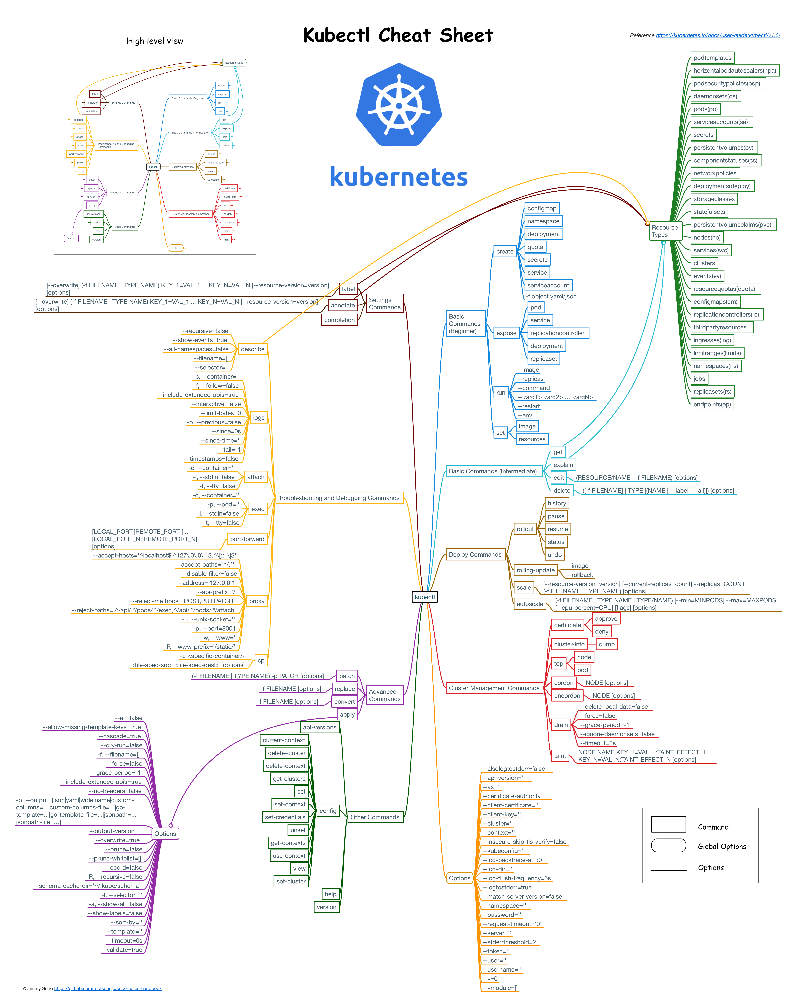
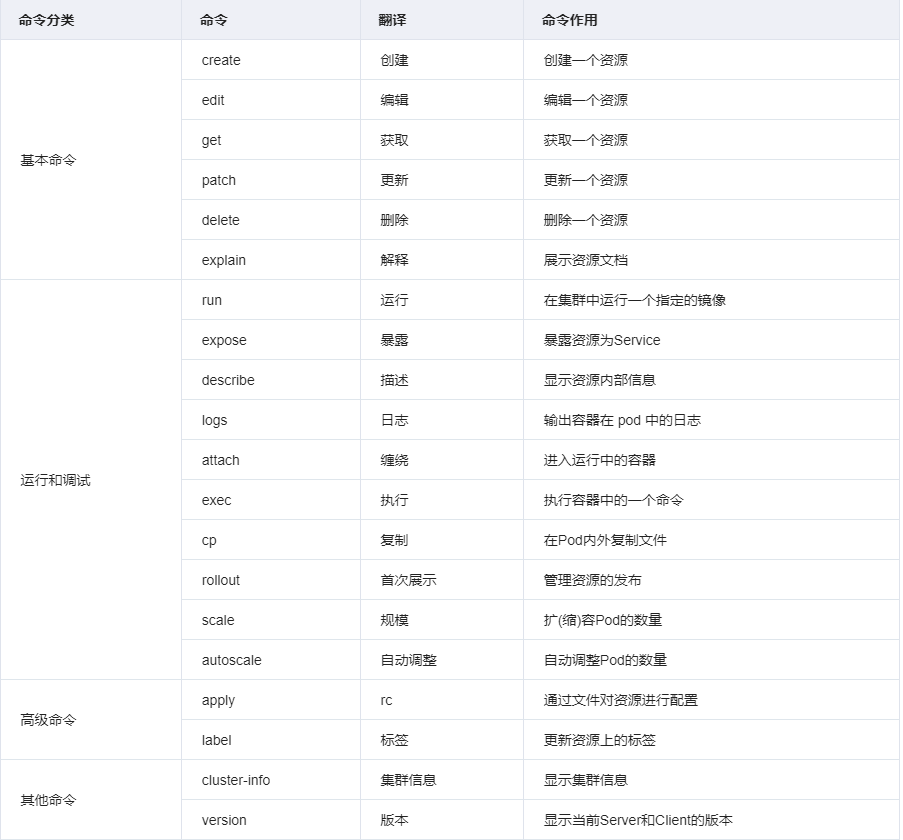
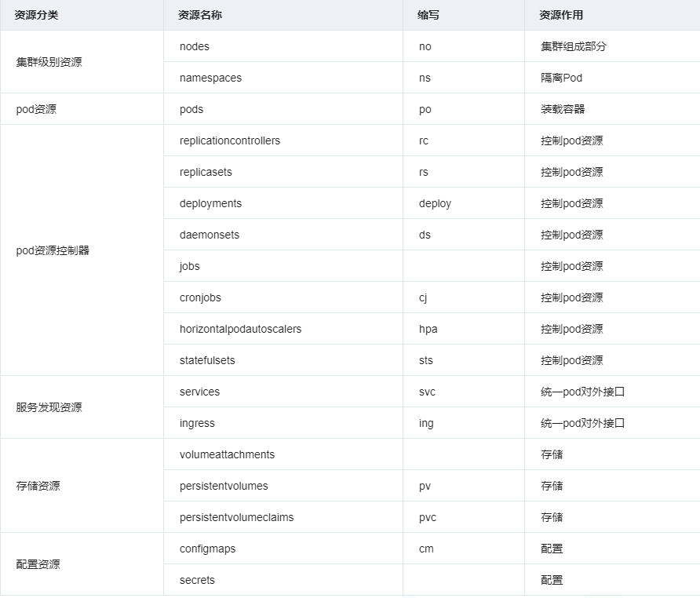

# kubectl常用命令详解




## 一、语法格式

```bash
kubectl [command] [TYPE] [NAME] [flags]

	command：子命令、用于操作kubernetes集群资源对象的命令，例如create、delete、describe、get、apply等
	
	TYPE：资源对象类型，区分大小写，能以单数形式，复数形式或简写形式表示。以下三种是等价的
		 kubectl get pod pod1
         kubectl get pods pod1
         kubectl get po pod1
         
	NAME：资源对象的名称，区分大小写。如果不指定名称，则系统返回属于TYPE的全部对象的列表，例如kubectl get pods将返回所有Pod的列表
	
	flags：kubectl子命令的可选参数。
		-s或 --server ：指定APIserver的地址和端口
		--kubeconfig ：使用kubeconfig配置文件路径。默认为~/.kube/config
		
		-n或 --namespace：命令执行的目标名称空间。
```

### 1、command命令分类




### 2、type资源类型




### 3、**get命令的输出格式**

| 输出格式          | 格式说明                                |
| ----------------- | --------------------------------------- |
| -o wide           | 以出文本格式显示资源的附加信息          |
| -o name           | 仅打印资源名称                          |
| -o yaml           | 以yaml格式化输出API对象信息             |
| -o json           | 以JSON格式化输出API对象信息             |
| -o jsonpath       | 以自定义JSONPath模板格式输出API对象信息 |
| -o go-template    | 以自定义的Go模板格式输出API对象信息     |
| -o custom-columns | 自定义要输出的字段                      |


## 二、使用例子

### 1、查看类

```bash
# 获取节点和服务版本信息
kubectl get nodes 

# 获取节点和服务版本信息，并查看附加信息 
kubectl get nodes -o wide 

# 获取pod信息，默认是default名称空间 
kubectl get pod

# 获取pod信息，默认是default名称空间，并查看附加信息【如：pod的IP及在哪个节点运行】 
kubectl get pod -o wide

# 获取指定名称空间的pod 
kubectl get pod -n kube-system

# 获取指定名称空间中的指定pod 
kubectl get pod -n kube-system podName

# 获取所有名称空间的pod 
kubectl get pod -A

# 查看pod的详细信息，以yaml格式或json格式显示
kubectl get pods -o yaml
kubectl get pods -o json 

# 查看pod的标签信息
kubectl get pod -A --show-labels 

# 根据Selector（label query）来查询pod 
kubectl get pod -A --selector="k8s-app=kube-dns" 

# 查看运行pod的环境变量
kubectl exec podName env 

# 查看指定pod的日志 
kubectl logs -f --tail 500 -n kube-system kube-apiserver-k8s-master 

# 查看所有名称空间的service信息
kubectl get svc -A 

# 查看指定名称空间的service信息 
kubectl get svc -n kube-system 

# 查看componentstatuses信息
kubectl get cs 

# 查看所有configmaps信息
kubectl get cm -A

# 查看所有serviceaccounts信息
kubectl get sa -A 

# 查看所有daemonsets信息 
kubectl get ds -A 

# 查看所有deployments信息 
kubectl get deploy -A 

# 查看所有replicasets信息
kubectl get rs -A 

# 查看所有statefulsets信息
kubectl get sts -A 

# 查看所有jobs信息 
kubectl get jobs -A 

# 查看所有ingresses信息
kubectl get ing -A 

# 查看有哪些名称空间 
kubectl get ns 

# 查看pod的描述信息
kubectl describe pod podName 
kubectl describe pod -n kube-system kube-apiserver-k8s-master 

# 查看指定名称空间中指定deploy的描述信息
kubectl describe deploy -n kube-system coredns 

# 查看node或pod的资源使用情况 # 需要heapster 或metrics-server支持 
kubectl top node
kubectl top pod 

# 查看集群信息
kubectl cluster-info
kubectl cluster-info dump 

# 查看各组件信息【172.16.1.110为master机器】
kubectl -s https://172.16.1.110:6443 get componentstatuses
```


### 2、操作类

```bash
# 创建资源 
kubectl create -f xxx.yaml

# 应用资源 
kubectl apply -f xxx.yaml

# 应用资源，该目录下的所有 .yaml, .yml, 或 .json 文件都会被使用
kubectl apply -f 

# 创建test名称空间 
kubectl create namespace test 

# 删除资源
kubectl delete -f xxx.yaml
kubectl delete -f 

# 删除指定的pod
kubectl delete pod podName 

# 删除指定名称空间的指定pod 
kubectl delete pod -n test podName 

# 删除其他资源 
kubectl delete svc svcName 
kubectl delete deploy deployName 
kubectl delete ns nsName 

# 强制删除 
kubectl delete pod podName -n nsName --grace-period=0 --force 
kubectl delete pod podName -n nsName --grace-period=1
kubectl delete pod podName -n nsName --now 

# 编辑资源
kubectl edit pod podName
```


### 3、进阶操作

```bash
# kubectl exec：进入pod启动的容器 
kubectl exec -it podName -n nsName /bin/sh #进入pod中第一个容器 
kubectl exec -it podName -c container2 -n nsName /bin/sh #进入pod中第二个容器 
# kubectl label：添加label值 
kubectl label nodes k8s-node01 zone=north #为指定节点添加标签 
kubectl label nodes k8s-node01 zone- #为指定节点删除标签 
kubectl label pod podName -n nsName role-name=test #为指定pod添加标签
kubectl label pod podName -n nsName role-name=dev --overwrite #修改lable标签值
kubectl label pod podName -n nsName role-name- #删除lable标签

# kubectl滚动升级；
kubectl apply -f myapp-deployment-v2.yaml #通过配置文件滚动升级
kubectl set image deploy/myapp-deployment myapp="registry.cn-beijing.aliyuncs.com/google_registry/myapp:v3" #通过命令滚动升级 
kubectl rollout undo deploy/myapp-deployment 或者 kubectl rollout undo deploy myapp-deployment #pod回滚到前一个版本
kubectl rollout undo deploy/myapp-deployment --to-revision=2 #回滚到指定历史版本 

# kubectl scale：动态伸缩
kubectl scale deploy myapp-deployment --replicas=5 # 动态伸缩
kubectl scale --replicas=8 -f myapp-deployment-v2.yaml #动态伸缩【根据资源类型和名称伸缩，其他配置
```

