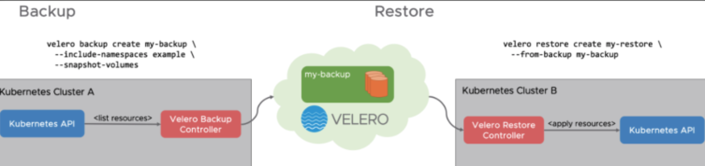
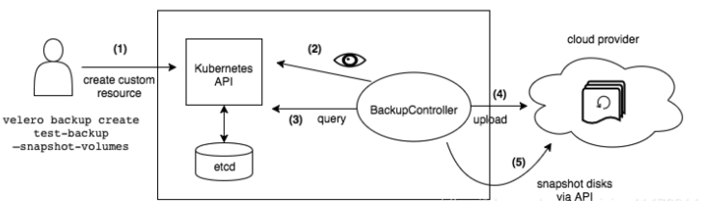
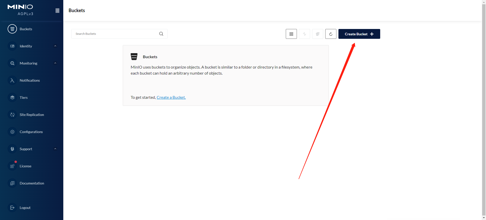
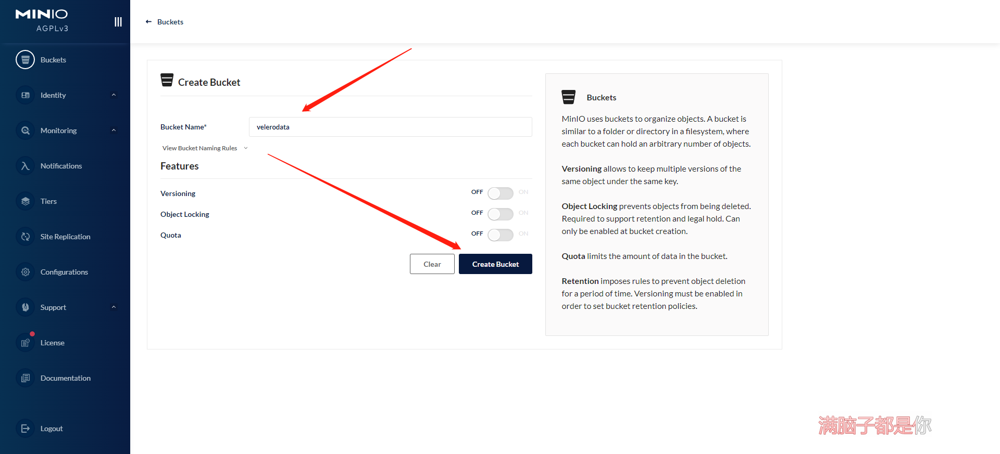
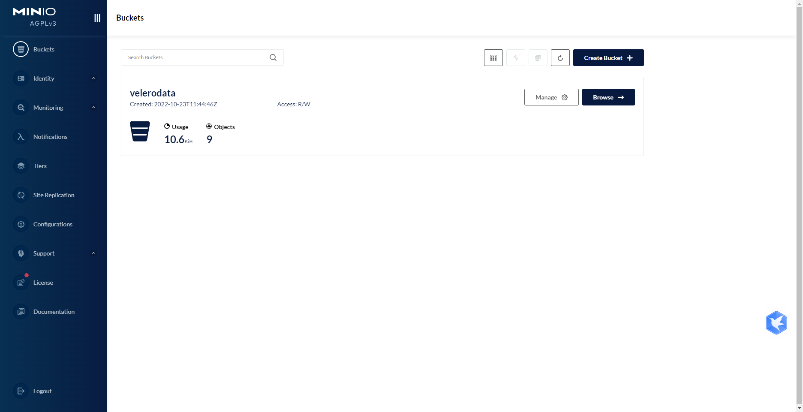

# Velero备份、恢复、迁移Kubernetes集群

## 一、Velero简介

>   Velero 地址：https://github.com/vmware-tanzu/velero Velero属于VMWare开源的Kubernetes集群备份、恢复、迁移工具. 
>
>   可以提供Kubernetes 备份功能,在Kubernetes集群出现问题之后,能够快速的恢复. 
>
>   并且也提供了集群迁移功能,可以将Kubernetes资源迁移到其他集群. 
>
>   Velero 将备份的信息在[对象存储](https://cloud.tencent.com/product/cos?from=10680)中,默认情况下可以使用 AWS、Azure、GCP 的对象存储. 
>
>   对于K8s集群数据的备份和恢复，以及复制当前集群数据到其他集群等都非常方便。可以在两个集群间克隆应用和命名空间，来创建一个临时性的开发环境。
>
>  本案例中使用mino自建存储

## 二、什么是Velero

>    Velero 是一个云原生的灾难恢复和迁移工具，它本身也是开源的, 采用 Go 语言编写，可以安全的备份、恢复和迁移Kubernetes集群资源和持久卷。
>
>    Velero 是西班牙语，意思是帆船，非常符合 Kubernetes 社区的命名风格。Velero 的开发公司 Heptio，之前已被 VMware 收购，其创始人2014就职于Google，当时被认为是 Kubernetes 核心成员。 Velero 是一种云原生的Kubernetes优化方法，支持标准的K8S集群，既可以是私有云平台也可以是公有云。除了灾备之外它还能做资源移转，支持把[容器](https://cloud.tencent.com/product/tke?from=10680)应用从一个集群迁移到另一个集群。 Heptio Velero ( 以前的名字为 ARK) 是一款用于 Kubernetes 集群资源和持久存储卷（PV）的备份、迁移以及灾难恢复等的开源工具。
>
>    使用velero可以对集群进行备份和恢复，降低集群DR造成的影响。velero的基本原理就是将集群的[数据备份](https://cloud.tencent.com/solution/backup?from=10680)到对象存储中，在恢复的时候将数据从对象存储中拉取下来。可以从官方文档查看可接收的对象存储，本地存储可以使用Minio。下面演示使用velero将k8s集群备份和恢复。

## 三、Velero工作流程

### 1、流程图

**迁移**



**备份**



### 2、备份过程

>1 . 本地 Velero 客户端发送备份指令。 
>
>2 . Kubernetes 集群内就会创建一个 Backup 对象。 
>
>3 . BackupController 监测 Backup 对象并开始备份过程。 
>
>4 . BackupController 会向 API Server 查询相关数据。 
>
>5 . BackupController 将查询到的数据备份到远端的对象存储。

### 3、特性

>Velero 目前包含以下特性：
>
>- 支持 Kubernetes 集群数据备份和恢复
>- 支持复制当前 Kubernetes 集群的资源到其它 Kubernetes 集群
>- 支持复制生产环境到开发以及测试环境

### 4、组件

>Velero 组件一共分两部分，分别是服务端和客户端。
>
>- 服务端：运行在 Kubernetes 的集群中
>- 客户端：是一些运行在本地的命令行的工具，需要已配置好 kubectl 及集群 kubeconfig 的机器上

### 5、支持的备份存储

>- AWS S3 以及兼容 S3 的存储，比如：Minio
>- Azure BloB 存储
>- Google Cloud 存储
>- Aliyun OSS 存储

### 6、与etcd的区别

>与 Etcd 备份相比，直接备份 Etcd 是将集群的全部资源备份起来。而 Velero 就是可以对 Kubernetes 集群内对象级别进行备份。除了对 Kubernetes 集群进行整体备份外，Velero 还可以通过对 Type、Namespace、Label 等对象进行分类备份或者恢复。

**备份过程中创建的对象是不会备份的**

### 7、使用场景

```bash
灾备场景: 提供备份恢复k8s集群的能力
迁移场景: 提供拷贝集群资源到其他集群的能力(复制同步开发、测试、生产环境的集群)
```


## 四、harbor部署minio并创建bucket

### 1、创建存储目录

```bash
mkdir -p /data/minio
```

### 2、编辑docker-compose

> minio.yaml

```yaml
version: '3'

networks:
  minio:
    driver: bridge

services:
  minio:
    image: 'minio/minio:latest'
    ports:
      - '9000:9000'
      - '9999:9999'
    restart: always
    environment:
      - MINIO_ROOT_USER=admin
      - MINIO_ROOT_PASSWORD=12345678
    volumes:
      - /data/minio/data:/data
    command: 'minio server /data --console-address "0.0.0.0:9999"
    networks:
      - minio
```

### 3、运行

```bash
root@k8s-harbor1:~/docker-compose.yaml.d# docker-compose -f minio.yaml up -d
[+] Running 1/1
 ⠿ Container docker-composeyamld-minio-1  Started                                                                                                                                             0.6s
root@k8s-harbor1:~/docker-compose.yaml.d# docker logs -f docker-composeyamld-minio-1
Formatting 1st pool, 1 set(s), 1 drives per set.
WARNING: Host local has more than 0 drives of set. A host failure will result in data becoming unavailable.
MinIO Object Storage Server
Copyright: 2015-2022 MinIO, Inc.
License: GNU AGPLv3 <https://www.gnu.org/licenses/agpl-3.0.html>
Version: RELEASE.2022-10-21T22-37-48Z (go1.19.2 linux/amd64)

Status:         1 Online, 0 Offline.
API: http://172.18.0.2:9000  http://127.0.0.1:9000
Console: http://0.0.0.0:9999

Documentation: https://min.io/docs/minio/linux/index.html
```

### 4、访问并创建bucket

> http://172.31.7.104:9999/





## 五、master01部署Velero

> 需要在有kubectl的机器上部署为了方便，我们就在master01上部署

>**服务端：目标Kubernetes集群** 
>
>**客户端: 本地的命令行的工具,需要配合kubernetes认证使用.**

### 1、项目地址

>https://github.com/vmware-tanzu/velero

### 2、部署velero

```bash
cd /usr/local/src/
wget https://github.com/vmware-tanzu/velero/releases/download/v1.9.2/velero-v1.9.2-linux-amd64.tar.gz
tar xf velero-v1.9.2-linux-amd64.tar.gz
cp velero-v1.9.2-linux-amd64/velero /usr/local/bin/
velero  --help
```

### 3、配置认证环境

#### 1.创建工作目录

```bash
 mkdir  /data/velero -p
 cd /data/velero
```

#### 2.创建认证文件

```bash
vim velero-auth.txt
[default]
aws_access_key_id = admin
aws_secret_access_key = 12345678
```

#### 3.创建授权文件

```bash
vim awsuser-csr.json
{
  "CN": "awsuser",
  "hosts": [],
  "key": {
    "algo": "rsa",
    "size": 2048
  },
  "names": [
    {
      "C": "CN",
      "ST": "ShangHai",
      "L": "ShangHai",
      "O": "k8s",
      "OU": "System"
    }
  ]
}
```

#### 4.准备证书签发环境

```bash
apt install golang-cfssl -y
wget https://github.com/cloudflare/cfssl/releases/download/v1.6.3/cfssl_1.6.3_linux_amd64
wget https://github.com/cloudflare/cfssl/releases/download/v1.6.3/cfssljson_1.6.3_linux_amd64
wget https://github.com/cloudflare/cfssl/releases/download/v1.6.3/cfssl-certinfo_1.6.3_linux_amd64
mv cfssl-certinfo_1.6.3_linux_amd64 cfssl-certinfo
mv cfssl_1.6.3_linux_amd64 cfssl
mv cfssljson_1.6.3_linux_amd64 cfssljson
cp cfssl-certinfo cfssl cfssljson /usr/local/bin/
chmod  a+x /usr/local/bin/cfssl* 
```

#### 5.证书签发

```bash
root@k8s-master1:/data/velero# /usr/local/bin/cfssl gencert -ca=/etc/kubernetes/ssl/ca.pem -ca-key=/etc/kubernetes/ssl/ca-key.pem -config=/etc/kubeasz/clusters/k8s-cluster1/ssl/ca-config.json -profile=kubernetes ./awsuser-csr.json | cfssljson -bare awsuser
2022/10/23 20:39:44 [INFO] generate received request
2022/10/23 20:39:44 [INFO] received CSR
2022/10/23 20:39:44 [INFO] generating key: rsa-2048
2022/10/23 20:39:44 [INFO] encoded CSR
2022/10/23 20:39:44 [INFO] signed certificate with serial number 326668328547422989503413107971957556478247237221
2022/10/23 20:39:44 [WARNING] This certificate lacks a "hosts" field. This makes it unsuitable for
websites. For more information see the Baseline Requirements for the Issuance and Management
of Publicly-Trusted Certificates, v.1.1.6, from the CA/Browser Forum (https://cabforum.org);
specifically, section 10.2.3 ("Information Requirements").

# 验证
root@k8s-master1:/data/velero# ll
total 31068
drwxr-xr-x 2 root root     4096 10月 23 20:39 ./
drwxr-xr-x 3 root root     4096 10月 23 20:23 ../
-rw-r--r-- 1 root root     1001 10月 23 20:39 awsuser.csr
-rw-r--r-- 1 root root      222 10月 23 20:28 awsuser-csr.json
-rw------- 1 root root     1679 10月 23 20:39 awsuser-key.pem
-rw-r--r-- 1 root root     1387 10月 23 20:39 awsuser.pem
-rw-r--r-- 1 root root 13336752 10月 23 20:37 cfssl
-rw-r--r-- 1 root root 10795824 10月 23 20:37 cfssl-certinfo
-rw-r--r-- 1 root root  7646320 10月 23 20:37 cfssljson
-rw-r--r-- 1 root root       69 10月 23 20:25 velero-auth.txt
```

#### 6.分发证书到api-server证书路径

```bash
 cp awsuser-key.pem /etc/kubernetes/ssl/
 cp awsuser.pem /etc/kubernetes/ssl/
```

#### 7.生成集群认证config文件

```bash
export KUBE_APISERVER="https://172.31.7.101:6443"
kubectl config set-cluster kubernetes \
--certificate-authority=/etc/kubernetes/ssl/ca.pem \
--embed-certs=true \
--server=${KUBE_APISERVER} \
--kubeconfig=./awsuser.kubeconfig
```

#### 8.生成客户端证书

```bash
kubectl config set-credentials awsuser \
--client-certificate=/etc/kubernetes/ssl/awsuser.pem \
--client-key=/etc/kubernetes/ssl/awsuser-key.pem \
--embed-certs=true \
--kubeconfig=./awsuser.kubeconfig
```

#### 9.设置上下文参数

```bash
kubectl config set-context kubernetes \
--cluster=kubernetes \
--user=awsuser \
--namespace=velero-system \
--kubeconfig=./awsuser.kubeconfig
```

#### 10.设置默认上下文

```bash
kubectl config use-context kubernetes --kubeconfig=awsuser.kubeconfig
```

#### 11.k8s集群中创建awsuser账户

```bash
kubectl create clusterrolebinding awsuser --clusterrole=cluster-admin --user=awsuser
```

#### 12.创建namespace

```bash
kubectl create ns velero-system
```

#### 13.执行安装

>https://github.com/vmware-tanzu/velero-plugin-for-aws

```bash
velero --kubeconfig  ./awsuser.kubeconfig \
	install \
    --provider aws \
    --plugins velero/velero-plugin-for-aws:v1.5.1 \
    --bucket velerodata  \
    --secret-file ./velero-auth.txt \
    --use-volume-snapshots=false \
	--namespace velero-system \
--backup-location-config region=minio,s3ForcePathStyle="true",s3Url=http://172.31.7.104:9000
```

#### 14.验证

```bash
kubectl get pod -n velero-system -o wide
NAME                      READY   STATUS    RESTARTS   AGE   IP             NODE           NOMINATED NODE   READINESS GATES
velero-5f674d5cc8-gqfv5   1/1     Running   0          36m   10.200.36.80   172.31.7.111   <none>           <none>
```

### 4、使用

#### 1.创建备份

```bash
root@k8s-master1:/data/velero# DATE=`date +%Y%m%d%H%M%S`
root@k8s-master1:/data/velero# velero backup create default-ns-backup-${DATE} \
> --include-namespaces default \
> --kubeconfig=./awsuser.kubeconfig \
> --namespace velero-system
Backup request "default-ns-backup-20221023214817" submitted successfully.
Run `velero backup describe default-ns-backup-20221023214817` or `velero backup logs default-ns-backup-20221023214817` for more details.
```

#### 2.查看minio



#### 3.删除一个pod

```bash
root@k8s-master1:/data/velero# kubectl get pod -A
NAMESPACE              NAME                                       READY   STATUS    RESTARTS       AGE
default                net-test3                                  1/1     Running   3 (148m ago)   3d22h
default                net-test4                                  1/1     Running   3 (148m ago)   3d22h
kube-system            calico-kube-controllers-6d5cf54455-64jf9   1/1     Running   4 (148m ago)   3d22h
kube-system            calico-node-csktv                          1/1     Running   3 (148m ago)   3d22h
kube-system            calico-node-jv25x                          1/1     Running   3 (148m ago)   3d22h
kube-system            calico-node-nvwq5                          1/1     Running   3 (148m ago)   3d22h
kube-system            calico-node-rqx6p                          1/1     Running   3 (148m ago)   3d22h
kube-system            coredns-8496f84465-frjtm                   1/1     Running   2 (148m ago)   2d20h
kube-system            coredns-8496f84465-zpvjf                   1/1     Running   2 (148m ago)   3d
kubernetes-dashboard   dashboard-metrics-scraper-884c978b-2p5v8   1/1     Running   1 (148m ago)   2d
kubernetes-dashboard   kubernetes-dashboard-99cd8855c-599x8       1/1     Running   1 (148m ago)   2d
velero-system          velero-5f674d5cc8-gqfv5                    1/1     Running   0              61m
root@k8s-master1:/data/velero# kubectl delete pod -n default net-test3
pod "net-test3" deleted
root@k8s-master1:/data/velero# kubectl get pod -A
NAMESPACE              NAME                                       READY   STATUS    RESTARTS       AGE
default                net-test4                                  1/1     Running   3 (151m ago)   3d22h
kube-system            calico-kube-controllers-6d5cf54455-64jf9   1/1     Running   4 (151m ago)   3d22h
kube-system            calico-node-csktv                          1/1     Running   3 (151m ago)   3d22h
kube-system            calico-node-jv25x                          1/1     Running   3 (151m ago)   3d22h
kube-system            calico-node-nvwq5                          1/1     Running   3 (151m ago)   3d22h
kube-system            calico-node-rqx6p                          1/1     Running   3 (152m ago)   3d22h
kube-system            coredns-8496f84465-frjtm                   1/1     Running   2 (151m ago)   2d20h
kube-system            coredns-8496f84465-zpvjf                   1/1     Running   2 (151m ago)   3d
kubernetes-dashboard   dashboard-metrics-scraper-884c978b-2p5v8   1/1     Running   1 (152m ago)   2d
kubernetes-dashboard   kubernetes-dashboard-99cd8855c-599x8       1/1     Running   1 (152m ago)   2d
velero-system          velero-5f674d5cc8-gqfv5                    1/1     Running   0              65m
```

#### 4.根据备份恢复

```bash
root@k8s-master1:/data/velero# velero restore create --from-backup default-ns-backup-20221023214817 --wait \
> --kubeconfig=./awsuser.kubeconfig \
> --namespace velero-system
Restore request "default-ns-backup-20221023214817-20221023220625" submitted successfully.
Waiting for restore to complete. You may safely press ctrl-c to stop waiting - your restore will continue in the background.

Restore completed with status: Completed. You may check for more information using the commands `velero restore describe default-ns-backup-20221023214817-20221023220625` and `velero restore logs default-ns-backup-20221023214817-20221023220625`.
root@k8s-master1:/data/velero# kubectl get pod -A
NAMESPACE              NAME                                       READY   STATUS    RESTARTS       AGE
default                net-test3                                  1/1     Running   0              4s
default                net-test4                                  1/1     Running   3 (153m ago)   3d22h
kube-system            calico-kube-controllers-6d5cf54455-64jf9   1/1     Running   4 (153m ago)   3d22h
kube-system            calico-node-csktv                          1/1     Running   3 (153m ago)   3d22h
kube-system            calico-node-jv25x                          1/1     Running   3 (153m ago)   3d22h
kube-system            calico-node-nvwq5                          1/1     Running   3 (153m ago)   3d22h
kube-system            calico-node-rqx6p                          1/1     Running   3 (153m ago)   3d22h
kube-system            coredns-8496f84465-frjtm                   1/1     Running   2 (153m ago)   2d20h
kube-system            coredns-8496f84465-zpvjf                   1/1     Running   2 (153m ago)   3d
kubernetes-dashboard   dashboard-metrics-scraper-884c978b-2p5v8   1/1     Running   1 (153m ago)   2d
kubernetes-dashboard   kubernetes-dashboard-99cd8855c-599x8       1/1     Running   1 (153m ago)   2d
velero-system          velero-5f674d5cc8-gqfv5                    1/1     Running   0              66m
```

### 5、定时备份

> 对集群资源进行定时备份，则可在发生意外的情况下，进行恢复(默认情况下，备份保留 30 天)

```bash
# 每日1点进行备份
velero create schedule  --schedule="0 1 * * *"

# 每日1点进行备份，备份保留48小时
velero create schedule  --schedule="0 1 * * *" --ttl 48h

# 每6小时进行一次备份
velero create schedule  --schedule="@every 6h"

# 每日对 web namespace 进行一次备份
velero create schedule  --schedule="@every 24h" --include-namespaces web
```

#### 备份查看

```bash
velero backup get   #备份查看
velero schedule get #查看定时备份
velero restore get   #查看可恢复备份
```


> 结合etcd备份来看，推荐使用velero备份，因为velero恢复不影响业务


