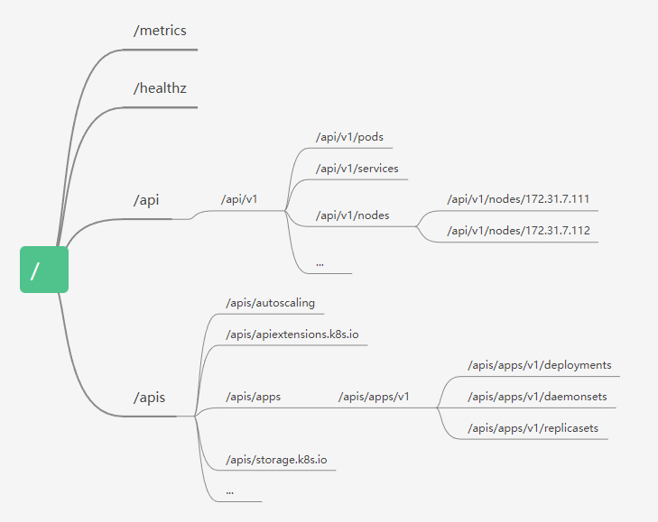

# 资源对象简介

## 一、k8s的设计理念：分层架构

>[Kubernetes（k8s）中文文档 Kubernetes设计架构_Kubernetes中文社区](https://www.kubernetes.org.cn/kubernetes设计架构)

```bash
`云原生生态系统:`
    云原生生态系统是在接口层之上的kubernetes集群管理调度生态系统，有两个范畴：
        kubernetes内部：CRI、CNI、CSI、镜像仓库
             CRI: 容器运行时接口
             CNI：容器网络接口
             CSI：容器存储接口
        kubernetes外部：监控、日志、CI/CD、配置管理等
`接口层：客户端库和实用工具`
    接口层包括kubectl命令行客户端工具和SDK等客户端访问接口。
`管理层：自动化和策略管理`
    管理层实现自动化(如pod弹性伸缩、动态存储卷创建和回收)和策略管理(资源限制、RBAC授权、NetworkPolicy等，主要解决项目之间的pod隔离、网络安全和自动伸缩等功能。)
`应用层：部署和路由`
    应用层实现服务部署(无状态应用如nginx使用deployment、有状态应用如MySQL主从使用statefulSet)和路由(通过service实现服务之间调用)
`核心层：kubernetes API和执行环境`
    核心层包括kubernetes的API、控制器、service、namespace、node等，是运行pod的基础环境
`运行依赖`
     容器
     内核
     硬件
     网络
```

## 二、k8s的设计理念—API设计原则:

>[Kubernetes（k8s）中文文档 kubernetes设计理念_Kubernetes中文社区](https://www.kubernetes.org.cn/kubernetes设计理念)

>• 所有API应该是声明式的。
>• API对象是彼此互补而且可组合的。
>• 高层API以操作意图为基础设计。
>• 低层API根据高层API的控制需要设计。
>• 尽量避免简单封装，不要有在外部API无法显式知道的内部隐藏的机制。
>• API操作复杂度与对象数量成正比。
>• API对象状态不能依赖于网络连接状态。
>• 尽量避免让操作机制依赖于全局状态，因为在分布式系统中要保证全局状态的同步是非常困难的。

## 三、k8s-API简介

>- 内置API： 部署好kubernetes集群后自带的API接口.
>- 自定义资源：CRD(Custom Resource Definition)，部署kubernetes之后通过安装其它组件等方式扩展出来的API

>/apis/myapi/v1/pods
>
>/apis   /myapi   /v1    /pods
>
>分类    api组    api版本   资源对象

## 四、kubernetes API简介

> curl --cacert /etc/kubernetes/ssl/ca.pem -H "Authorization: Bearer TOKEN" https://127.0.0.1:6443



## 五、kubernetes内置资源对象简介

|资源类型|资源名称|
|-------|------|
|资源对象| Pod、ReplicaSet、ReplicationController、Deployment、StatefulSet、DaemonSet、Job、CronJob、HorizontalPodAutoscaling、Node、Namespace、Service、Ingress、Label、CustomResourceDefinition|
|存储对象| Volume、PersistentVolume、PersistentVolumeClaim、Secret、ConfigMap|
|策略对象| SecurityContext、ResourceQuota、LimitRange|
|身份对象| ServiceAccount、Role、ClusterRole|

## 六、kubernetes 资源对象操作命令

https://kubernetes.io/zh/docs/concepts/workloads/controllers/deployment/

|命令集|命令|用途|
|-----|---|----|
|基础命令 |create/delete/edit/get/describe/logs/exec/scale| 增删改查|
|基础命令 |explain |命令说明|
|配置命令 |Label：给node标记label，实现亲pod与node亲和性| 标签管理|
|配置命令 |apply |动态配置|
|集群管理命令|cluster-info/top |集群状态|
|集群管理命令|cordon：警戒线，标记node不被调度|node节点管理|
|集群管理命令|uncordon：取消警戒标记为cordon的node|node节点管理|
|集群管理命令|drain：驱逐node上的pod,用于node下线等场景|node节点管理|
|集群管理命令|taint：给node标记污点，实现反亲pod与node反亲和性|node节点管理|
|集群管理命令|api-resources/api-versions/version| api资源|
|集群管理命令|config |客户端kube-config配置|

## 六、kubernetes 的几个重要概念

>• 资源对象：kubernetes基于声明式API，和资源对象进行交互。
>• yaml文件：为了方便后期管理，通过使用yaml文件通过API管理资源对象。
>• yaml必需字段：
>
>    - apiVersion - 创建该对象所使用的 Kubernetes API 的版本
>    - kind - 想要创建的对象的类型
>    - metadata - 定义识别对象唯一性的数据，包括一个 name 名称 、可选的 namespace
>    - spec：定义资源对象的详细规范信息(统一的label标签、容器名称、镜像、端口映射等)
>    - status（Pod创建完成后k8s自动生成status状态）
