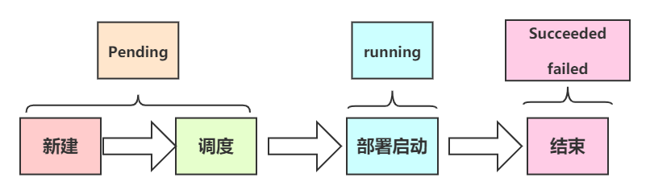

# Pod

```bash
	K8s有很多技术概念，同时对应很多API对象，最重要的也是最基础的是微服务Pod。Pod是在K8s集群中运行部署应用或服务的最小单元，它是可以支持多容器的。Pod的设计理念是支持多个容器在一个Pod中共享网络地址和文件系统，可以通过进程间通信和文件共享这种简单高效的方式组合完成服务。Pod对多容器的支持是K8s最基础的设计理念。比如你运行一个操作系统发行版的软件仓库，一个Nginx容器用来发布软件，另一个容器专门用来从源仓库做同步，这两个容器的镜像不太可能是一个团队开发的，但是他们一块儿工作才能提供一个微服务；这种情况下，不同的团队各自开发构建自己的容器镜像，在部署的时候组合成一个微服务对外提供服务。这就是K8S中的POD。
	
	Pod是K8s集群中所有业务类型的基础，可以看作运行在K8s集群中的小机器人，不同类型的业务就需要不同类型的小机器人去执行。目前K8s中的业务主要可以分为长期伺服型（long-running）、批处理型（batch）、节点后台支撑型（node-daemon）和有状态应用型（statefulapplication）；分别对应的小机器人控制器为Deployment、Job、DaemonSet和StatefulSet。
	
概述：
    1. pod是k8s中的最小单元。
    2. 一个pod中可以运行一个容器，也可以运行多个容器。
    3. 运行多个容器的话，这些容器是一起被调度的。
    4. Pod的生命周期是短暂的，不会自愈，是用完就销毁的实体。
    5. 一般我们是通过Controller来创建和管理pod的
```


## 一、pod初体验

### 1、书写一个简单的资源清单yaml

```yaml
root@k8s-master-01:~/k8s-study.d# vim test.yaml
apiVersion: v1
kind: Pod
metadata:
  name: test-pod
  labels:
    app: test-pod
spec:
  containers:
    - name: nginx
      image: nginx
    - name: tommcat
      image: tomcat
```


### 2、执行

```bash
root@k8s-master-01:~/k8s-study.d# kubectl apply -f test.yaml
pod/test-pod created

# 查看
root@k8s-master-01:~/k8s-study.d#  kubectl get pods
NAME       READY   STATUS              RESTARTS   AGE
test-pod   0/2     ContainerCreating   0          16s

root@k8s-master-01:~/k8s-study.d#  kubectl get pods
NAME       READY   STATUS    RESTARTS   AGE
test-pod   2/2     Running   0          5m46s
```


## 三、Pod带来的好处

```bash
1、Pod做为一个可以独立运行的服务单元，简化了应用部署的难度，以更高的抽象层次为应用部署提供了极大的方便
2、Pod做为最想的应用实例可以独立运行，因此可以方便的进行部署，水平扩展和收缩、方便进行调度管理与资源分配
3、Pod中的容器共享相同的数据和网络地址空间，Pod之间也进行了统一的资源管理与分配
```


## 四、Pod是如何管理多个容器的

```bash
	Pod中可以同时运行多个进程（作为容器运行）协同工作。同一个Pod中的容器会自动的分配到同一个node上。同一个Pod中的容器共享资源、网络环境和依赖，所以它们总是被同时调度。在一个Pod中同时运行多个容器是一种比较高级的用法。只有当你的容器需要紧密配合协作的时候才考虑用这种模式。
```


## 五、Pod中的数据持久性

```bash
Pod在设计支持就不是作为持久化实体的。在调度失败、节点故障、缺少资源或者节点维护的状态下都会死掉会被驱逐。通常，我们是需要借助类似于Docker存储卷这样的资源来做Pod的数据持久化的。
```


## 六、Pod的生命周期




### 1、pod的状态

**第一阶段**

| 状态              | 描述                                                         |
| ----------------- | ------------------------------------------------------------ |
| Pending（挂起）   | API Server 创建了pod资源对象中，正在创建Pod但是Pod中的容器还没有全部被创建完成，处于此状态的Pod应该检查Pod依赖的存储是否有权限挂载、镜像是否可以下载、调度是否正常等 |
| Failed（失败）    | Pod中的所有容器都已终止了，且至少有一个容器是因为失败终止。即容器以非0状态退出或者被系统禁止。 |
| Unknow（未知）    | ApiServer无法正常获取到Pod对象的状态信息，通常是由于无法与所在工作节点的kubelet通信所致。 |
| Succeeded（成功） | Pod中的所有容器都已经成功终止并且不会被重启，pod里所有的containers（容器）均已terminated（结束）。 |
| ImgPullERR        | 镜像拉取失败                                                 |
| ContainerCreating | 容器创建中                                                   |

**第二阶段**

| 状态                      | 描述                                                         |
| ------------------------- | ------------------------------------------------------------ |
| Unschedulable（计划外的） | Pod不能被调度，kube-scheduler没有匹配到合适的node节点        |
| PodScheduled（pod调度中） | pod正处于调度中，在kube-scheduler刚开始调度的时候，还没有将pod分配到指定的pid，在筛选出合适的节点后就会更新etcd数据，将pod分配到指定的pod |
| Initialized（已初始化）   | 所有pod中的初始化容器已经完成了                              |
| ImagePullBackOff          | Pod所在的node节点下载镜像失败                                |
| Running（运行中）         | Pod内部的容器已经被创建并且启动。                            |
| Ready（准备好了）         | 表示pod中的容器已经可以提供访问服务                          |


### 2、pod生命周期的运行步骤


.png)

#### 1.过程描述

```bash
1、启动包括初始化容器的任何容器之前先创建pause基础容器，它初始化Pod环境并为后续加入的容器提供共享的名称空间。
2、按顺序以串行的方式运行用户定义的各个初始化容器进行Pod环境初始化；任何一个初始化容器运行失败都将导致Pod创建失败，并按其restartPolicy的策略进行处理，默认为重启。
3、等待所有容器初始化成功完成后，启动业务容器，多容器Pod环境中，此步骤会并行启动所有业务容器。他们各自按其自定义展开其生命周期；容器启动的那一刻会同时运行业务容器上定义的PostStart钩子事件，该步骤失败将导致相关容器被重启。
4、运行容器启动健康状态监测（startupProbe），判断容器是否启动成功；该步骤失败，同样参照restartPolicy定义的策略进行处理；未定义时，默认状态为Success。
5、容器启动成功后，定期进行存活状态监测（liveness）和就绪状态监测（readiness）；存活监测状态失败将导致容器重启，而就绪状态监测失败会是的该容器从其所属的Service对象的可用端点列表中移除。
6、终止Pod对象时，会想运行preStop钩子事件，并在宽限期（termiunationGracePeriodSeconds）结束后终止主容器，宽限期默认为30秒。

#简述
1、创建pod，并调度到合适节点
2、创建pause基础容器，提供共享名称空间
3、串行业务容器容器初始化
4、启动业务容器，启动那一刻会同时运行主容器上定义的Poststart钩子事件
5、健康状态监测，判断容器是否启动成功
6、持续存活状态监测、就绪状态监测
7、结束时，执行prestop钩子事件
8、终止容器
```


### 3、RestartPolicy重启策略

```bash
	Pod 重启策略（ RestartPolicy ）应用于 Pod 内的所有容器，井且仅在 Pod 所处的 Node 上由 kubelet进行判断和重启操作。当某个容器异常退出或者健康检查失败时， kubelet 将根据 RestartPolicy 设置来进行相应的操作。Pod 的重启策略包括：Always、OnFailure 和 Never，默认值为 Always
```

>Always：当容器失效时，由kubelet自动启动该容器
>
>OnFailure：当容器终止运行且退出代码不为0时，有kubelet自动重启该容器
>
>Never：不论容器运行状态如何，kubelet都不会重启该容器


```bash
	kubelet重启失效容器的时间间隔以sync-frequency乘以2n来计算；例如1、2、4、8倍等，最长延时5min，并且在成功重启后的10min后重置该时间。
	Pod的重启策略与控制方式息息相关，当前可用于管理Pod的控制器包括ReplicationController、Job、DaemonSet及直接通过kubelet管理（静态Pod）。每种控制器对Pod的重启策略要求如下：
```

> 1．RC和DaemonSet：必须设置为Always，需要保证该容器持续运行
>
> 2．Job和CronJob：OnFailure或Never，确保容器执行完成后不再重启。
>
> 3．kubelet：在Pod失效时自动重启它，不论将RestartPolicy设置为什么值，也不会对Pod进行健康检查


### 4、钩子**PostStart**、**PreStop**

```bash
	PostStart :在容器创建后立即执行。但是，并不能保证钩子将在容器ENTRYPOINT之前运行，因为没有参数传递给处理程序。 主要用于资源部署、环境准备等。不过需要注意的是如果钩子花费时间过长以及于不能运行或者挂起，容器将不能达到Running状态。
	容器启动后执行，注意由于是异步执行，它无法保证一定在ENTRYPOINT之后运行。如果失败，容器会被杀死，并根据RestartPolicy决定是否重启
	
	PreStop :在容器终止前立即被调用。它是阻塞的，意味着它是同步的，所以它必须在删除容器的调用出发之前完成。主要用于优雅关闭应用程序、通知其他系统等。如果钩子在执行期间挂起，Pod阶段将停留在Running状态并且不会达到failed状态
	容器停止前执行，常用于资源清理。如果失败，容器同样也会被杀死
```


### 5、Pod的资源清单详解

```bash
apiVersion: v1 # 必选，指定api接口资源版本
kind: Pod    # 必选，定义资源接口类型/角色。pod为容器资源
metadata:    # 必选，定义资源的元数据信息
  name: nginx    # 必选，定义资源名称，在同一个namespace中必须是唯一的
  namespace: web-testing # 可选，不指定默认为default，指定资源所在的命名空间
  labels:    # 可选，定义资源标签
    - app: nginx
  annotations:    # 可选，注释列表
    - app: nginx
spec:    # 必选，用于定义容器的详细信息
  containers:    # 必选，容器列表
  - name: nginx    # 必选，符合RFC 1035规范的容器名称
    image: nginx:v1 # 必选，容器所用的镜像的地址
    imagePullPolicy: Always    # 可选，镜像拉取策略
    workingDir: /usr/share/nginx/html    # 可选，容器的工作目录
    volumeMounts:    # 可选，存储卷配置
    - name: webroot # 存储卷名称
      mountPath: /usr/share/nginx/html # 挂载目录
      readOnly: true    # 只读
    ports:    # 可选，容器需要暴露的端口号列表
    - name: http    # 端口名称
      containerPort: 80    # 端口号
      protocol: TCP    # 端口协议，默认TCP
    env:    # 可选，环境变量配置
    - name: TZ    # 变量名
      value: Asia/Shanghai #变量
    - name: LANG
      value: en_US.utf8
    resources:    # 可选，资源限制和资源请求限制
      limits:    # 最大限制设置
        cpu: 1000m
        memory: 1024MiB
      requests:    # 启动所需的资源
        cpu: 100m
        memory: 512MiB
    readinessProbe: # 可选，容器状态检查
      httpGet:    # 检测方式
        path: /    # 检查路径
        port: 80    # 监控端口
      timeoutSeconds: 2    # 超时时间 
      initialDelaySeconds: 60    # 初始化时间
    livenessProbe:    # 可选，监控状态检查
      exec:    # 检测方式
        command: 
        - cat
        - /health
      httpGet:    # 检测方式
        path: /_health
        port: 8080
        httpHeaders:
        - name: end-user
          value: jason
      tcpSocket:    # 检测方式
        port: 80
      initialDelaySeconds: 60    # 初始化时间
      timeoutSeconds: 2    # 超时时间
      periodSeconds: 5    # 检测间隔
      successThreshold: 2 # 检查成功为2次表示就绪
      failureThreshold: 1 # 检测失败1次表示未就绪
    securityContext:    # 可选，限制容器不可信的行为
      provoleged: false
  restartPolicy: Always    # 可选，默认为Always
  nodeSelector:    # 可选，指定Node节点
    region: subnet7
  imagePullSecrets:    # 可选，拉取镜像使用的secret
  - name: default-dockercfg-86258
  hostNetwork: false    # 可选，是否为主机模式，如是，会占用主机端口
  volumes:    # 共享存储卷列表
  - name: webroot # 名称，与上述对应
    emptyDir: {}    # 共享卷类型，空
    hostPath:        # 共享卷类型，本机目录
      path: /etc/hosts
    secret:    # 共享卷类型，secret模式，一般用于密码
      secretName: default-token-tf2jp # 名称
      defaultMode: 420 # 权限
      configMap:    # 一般用于配置文件
      name: nginx-conf
      defaultMode: 420
```

## 七、init容器

### 1、作用

>- 1.可以为业务容器提前准备好业务容器的运行环境，比如将业务容器需要的配置文件提前生成并放在指定位置、检查数据权限或完整性、软件版本等基础运行环境。
>- 2.可以在运行业务容器之前准备好需要的业务数据，比如从OSS下载、或者从其它位置copy。
>- 3.检查依赖的服务是否能够访问。

### 2、特点

>- 1.一个pod可以有多个业务容器还能在有多个init容器，但是每个init容器和业务容器的运行环境都是隔离的。
>
>- 2.init容器会比业务容器先启动。
>- 3.init容器运行成功之后才会继续运行业务容器。
>- 4.如果一个pod有多个init容器，则需要从上到下逐个运行并且全部成功，最后才会运行业务容器。
>- 5.init容器不支持探针检测(因为初始化完成后就退出再也不运行了)。


## 八、Pause容器

### 1、介绍

>- Pause 容器，又叫 Infra 容器，是pod的基础容器，镜像体积只有几百KB 左右，配置在kubelet中，主要的功能是一个pod中多个容器的网络通信。

### 2、pod中容器的关系
>- Infra 容器被创建后会初始化 Network Namespace，之后其它容器就可以加入到 Infra 容器中共享Infra 容器的网络了，因此如果一个 Pod 中的两个容器 A 和 B，那么关系如下 ：
>  - 1.A容器和B容器能够直接使用 localhost 通信；
>  - 2.A容器和B容器可以看到网卡、IP与端口监听信息。
>  - 3.Pod 只有一个 IP 地址，也就是该 Pod 的 Network Namespace 对应的 IP 地址(由Infra 容器初始化并创建)。
>  - 4.k8s环境中的每个Pod有一个独立的IP地址(前提是地址足够用)，并且此IP被当前 Pod 中所有容器在内部共享使用。
>  - 5.pod删除后Infra 容器随机被删除,其IP被回收。

### 3、Pause容器共享的Namespace

>- 1.NET Namespace：Pod中的多个容器共享同一个网络命名空间，即使用相同的IP和端口信息。
>
>- 2.IPC Namespace：Pod中的多个容器可以使用System V IPC或POSIX消息队列进行通信。
>- 3.UTS Namespace：pod中的多个容器共享一个主机名。MNT Namespace、PID Namespace、User Namespace未共享。

