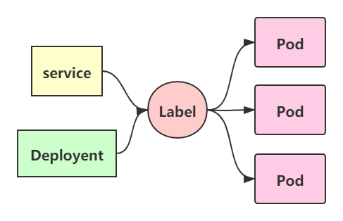
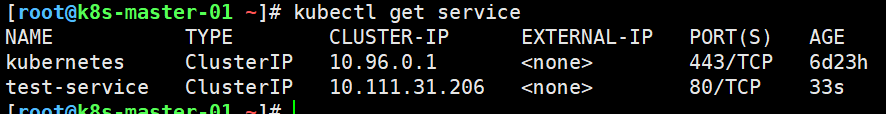
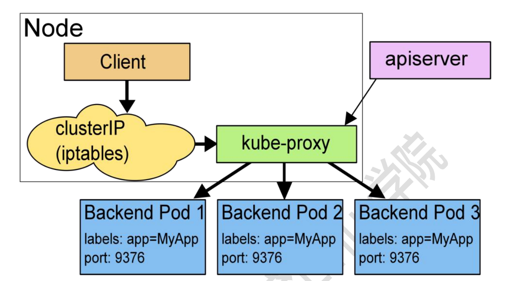
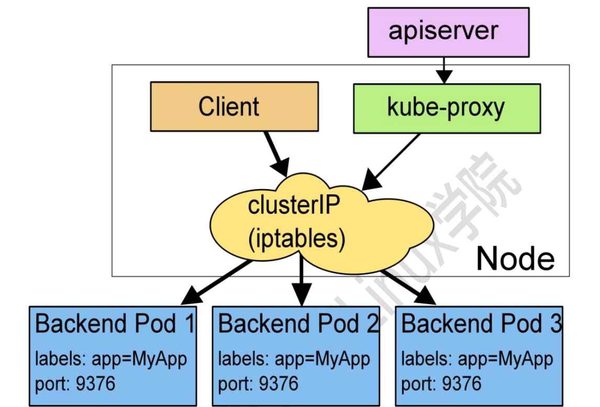
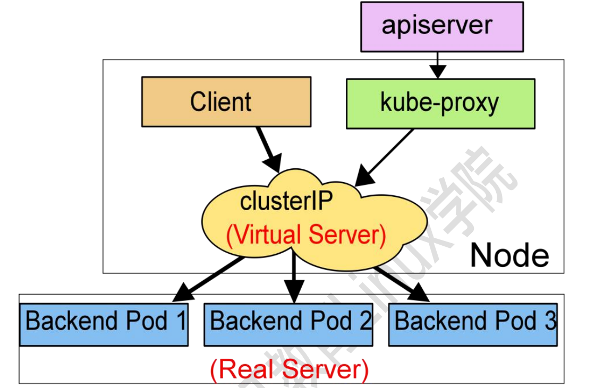

# service资源管理

## 一、简介（k8s集群中智能负载均衡器）

>    ​    service是k8s中的一个重要概念，主要是提供负载均衡和服务自动发现。它是k8s中最核心的资源之一，每一个Service就是我们平常所说的一个“微服务”。在非k8s世界中，管理员可以通过在配置文件中指定IP地址或主机名，容许客户端访问，但在k8s中这种方式是行不通的。因为Pod是有生命周期的，它们可以被创建或销毁。虽然通过控制器能够动态地创建Pod，但当Pod被分配到某个节点时，K8s都会为其分配一个IP地址，而该IP地址不总是稳定可依赖的。因此，在Kubernetes集群中，如果一组Pod（称为backend）为其它Pod（称为frontend）提供服务，那么那些frontend该如何发现，并连接到这组backend的Pod呢？
>    ​	service --> endpoints --> pod
>    ​	由于pod重建之后ip就变了，因此pod之间使用pod的IP直接访问会出现无法访问的问题，而service则解耦了服务和应用，service的实现方式就是通过label标签动态匹配后端endpoint。
>
>    kube-proxy监听着k8s-apiserver，一旦service资源发生变化（调k8s-api修改service信息），kube-proxy就会生成对应的负载调度的调整，这样就保证service的最新状态。




```bash
	如上图所示，Kubernetes 的 Service 定义了一个服务的访问入口，前端的应用（Pod）通过这个入口地址访 问其背后的一组由 Pod 副本组成的集群实例，Service 与其后端的 Pod 副本集群之间是通过 Label Selector 来 实现关联的，而 Deployment 则是保证 Service 的服务能力和服务质量始终处于预期的标准。
	通过分析，识别并建模系统中的所有服务为微服务，最终我们的系统是由多个提供不同业务能力而彼此独立 的微服务单元所组成，服务之间通过 TCP/IP 进行通信，从而形成了强大而又灵活的弹性网络，拥有强大的分布 式能力、弹性扩展能力、容错能力。
```


## 二、创建Service

```bash
kind: Service
apiVersion: v1
metadata:
  name: test-service
  namespace: default
  labels:
    app: test-service
spec:
  type: ClusterIP
  selector:
    app: test-service
  ports:
    - port: 80
      targetPort: 80
```


```bash
[root@k8s-master-01 ~]# kubectl apply -f test_service.yaml
service/test-service created
```




## 三、service的工作方式

```bash
	在 Kubernetes 迭代过程中，给 Service 设置里三种工作方式，分别是：Userspace 方式、Iptables 以及 Ipvs， 这三种方式到现在为止，官方推荐使用 IPVS， 当集群不支持 IPVS 的时候，集群会降级到 Iptables。
```


### 1、Userspace

```bash
	Client Pod 要访问 Server Pod 时,它先将请求发给本机内核空间中的 service 规则，由它再将请求,转给监听 在指定套接字上的 kube-proxy，kube-proxy 处理完请求，并分发请求到指定 Server Pod 后,再将请求递交给内 核空间中的 service,由 service 将请求转给指定的 Server Pod。由于其需要来回在用户空间和内核空间交互通信， 因此效率很差。
```




### 2、Iptables模型

```bash
	直接由内核中的 iptables 规则，接受 Client Pod 的请求，并处理完成后，直接转发给指定 ServerPod。这 种方式不再将请求转发给 kube-proxy，性能提升很多。
```




### 3、Ipvs模型

```bash
	在 ipvs 模式下，kube-proxy 监视 Kubernetes 服务和端点，调用 netlink 接口相应地创建 IPVS 规则， 并 定期将 IPVS 规则与 Kubernetes 服务和端点同步。 该控制循环可确保 IPVS 状态与所需状态匹配。 访问服务 时，IPVS 将流量定向到后端 Pod 之一。 
	IPVS 代理模式基于类似于 iptables 模式的 netfilter 挂钩函数，但是使用哈希表作为基础数据结构，并且 在内核空间中工作。 这意味着，与 iptables 模式下的 kube-proxy 相比，IPVS 模式下的 kube-proxy 重定向 通信的延迟要短，并且在同步代理规则时具有更好的性能。与其他代理模式相比，IPVS 模式还支持更高的网络 流量吞吐量。
```




```bash
	以上不论哪种，kube-proxy 都通过 watch 的方式监控着 kube-APIServer 写入 etcd 中关于 Pod 的最新状态 信息,它一旦检查到一个 Pod 资源被删除了 或 新建，它将立即将这些变化，反应再 iptables 或 ipvs 规则中， 以便 iptables 和 ipvs 在调度 Clinet Pod 请求到 Server Pod 时，不会出现 Server Pod 不存在的情况。 
	自 k8s1.1 以后,service 默认使用 ipvs 规则，若 ipvs 没有被激活，则降级使用 iptables 规则. 但在 1.1 以前， service 使用的模式默认为 userspace。
```


## 四、service类型

```bash
	Service 是 Kubernetes 对外访问的窗口，针对不同的场景，kubernetes 为我们设置了四种 Service 的类型。
	暴露服务的资源类型
```


```bash
1、ClusterIP: 向集群内部暴露服务

2、NodePort：通过宿主主机的NodeIP：NodePort来暴露集群内部服务

3、LoadBalancer : 依赖于弹性IP的向集群外部暴露服务的负载均衡器

4、ExternalName:将其他链接设置一个集群内部的别名。
```


### 1、ClusterIP内网

```bash
	kubernetes 默认就是这种方式，是集群内部访问的方式，外部是无法访问的。其主要用于为集群内 Pod 访 问时,提供的固定访问地址,默认是自动分配地址,可使用 ClusterIP 关键字指定固定 IP。
```


```yaml
[root@k8s-master-01 ~]# vim clusterip.yaml
kind: Service
apiVersion: v1
metadata:
  name: my-svc
spec:
  type: ClusterIP
  selector:
    app: nginx
  ports:
    - port: 80
      targetPort: 80
```


**创建并查看**

```bash
[root@k8s-master-01 ~]# kubectl apply -f clusterip.yaml
service/my-svc created

[root@k8s-master-01 ~]# kubectl get svc
NAME           TYPE        CLUSTER-IP      EXTERNAL-IP   PORT(S)   AGE
kubernetes     ClusterIP   10.96.0.1       <none>        443/TCP   6d23h
my-svc         ClusterIP   10.105.87.145   <none>        80/TCP    2m40s
test-service   ClusterIP   10.111.31.206   <none>        80/TCP    16m

```


### 2、nodeport外网

```bash
	NodePort 是将主机 IP 和端口跟 kubernetes 集群所需要暴露的 IP 和端口进行关联，方便其对外提供服务。内部可以通过 ClusterIP 进行访问，外部用户可以通过 NodeIP:NodePort 的方式单独访问每个 Node 上的实例。
```


```bash
[root@kubernetes-master-01 test]# vim nodeport.yaml
kind: Service
apiVersion: v1
metadata:
  name: my-svc
spec:
  type: NodePort
  selector:
    app: nginx
  ports:
    - port: 80
      targetPort: 80
      nodePort: 30080
      
[root@kubernetes-master-01 test]# kubectl apply -f nodeport.yaml
service/my-svc created

[root@kubernetes-master-01 test]# kubectl get svc
NAME TYPE CLUSTER-IP EXTERNAL-IP PORT(S) AGE
kubernetes ClusterIP 10.96.0.1 <none> 443/TCP 11d
my-svc NodePort 10.96.159.234 <none> 80:30080/TCP 12s
nginx NodePort 10.96.6.147 <none> 80:42550/TCP 17m
```


### 3、LoadBalancer弹性公网

```bash
	LoadBalancer 类型的 service 是可以实现集群外部访问服务的另外一种解决方案。不过并不是所有的 k8s集群都会支持，大多是在公有云托管集群中会支持该类型。负载均衡器是异步创建的，关于被提供的负载均衡器的信息将会通过 Service 的 status.loadBalancer 字段被发布出去。
```


```bash
[root@kubernetes-master-01 ~]# cat > svc.yaml <<EOF
apiVersion: v1
kind: Service
metadata:
name: loadbalancer
spec:
type: LoadBalancer
ports:
- port: 80
targetPort: 80
selector:
app: nginx
EOF

[root@kubernetes-node-01 ~]# kubectl get svc
NAME TYPE CLUSTER-IP EXTERNAL-IP PORT(S) AGE
kubernetes ClusterIP 10.0.0.1 <none> 443/TCP 110d
loadbalancer LoadBalancer 10.0.129.18 81.71.12.240 80:30346/TCP 11s
```


### 4、ExternalName：将其他链接设置一个集群内部的别名。

```bash
	ExternalName Service 是 Service 的一个特例，它没有选择器，也没有定义任何端口或 Endpoints。它的作用是返回集群外 Service 的外部别名。它将外部地址经过集群内部的再一次封装(实际上就是集群 DNS 服务器将CNAME 解析到了外部地址上)，实现了集群内部访问即可。例如你们公司的镜像仓库，最开始是用 ip 访问，等到后面域名下来了再使用域名访问。你不可能去修改每处的引用。但是可以创建一个 ExternalName，首先指向到 ip，等后面再指向到域名。
```


```bash
apiVersion: v1
kind: Service
metadata:
  name: baidu
spec:
  externalName: www.baidu.com
  type: ExternalName
```


### 5、headless service域名(属于ClusterIP)

```bash
	kubernates 中还有一种 service 类型：headless serivces 功能，字面意思无 service 其实就是改 service 对外无提供 IP。一般用于对外提供域名服务的时候。
	
	Service与Pod之间的关系
	service -> endprints -> pod
```


```bash
kind: Service
apiVersion: v1
metadata:
  name: nginx-svc
spec:
  clusterIP: None
  selector:
    app: test-svc
  ports:
    - port: 80
      targetPort: 80
      name: http
[root@kubernetes-master-01 test]# kubectl apply -f headless-service.yaml
service/my-svc created
[root@kubernetes-master-01 test]# kubectl get svc
NAME TYPE CLUSTER-IP EXTERNAL-IP PORT(S) AGE
kubernetes ClusterIP 10.96.0.1 <none> 443/TCP 11d
my-svc ClusterIP None <none> 80/TCP 4s
nginx NodePort 10.96.6.147 <none> 80:42550/TCP 30m

[root@k8s-m-01 ~]# kubectl describe service service
```


### 6、Ingress（配合headless使用）

#### 1）简介

```bash
	Ingress为Kubernetes集群中的服务提供了入口，可以提供负载均衡、SSL终止和基于名称的虚拟主机，在生产环境中常用的Ingress有Treafik、Nginx、HAProxy、Istio等。在Kubernetesv 1.1版中添加的Ingress用于从集群外部到集群内部Service的HTTP和HTTPS路由，流量从Internet到Ingress再到Services最后到Pod上，通常情况下，Ingress部署在所有的Node节点上。Ingress可以配置提供服务外部访问的URL、负载均衡、终止SSL，并提供基于域名的虚拟主机。但Ingress不会暴露任意端口或协议。
	
	HeadLessService实际上是属于ClusterIP

	nginx ingress : 性能强
	traefik : 原生支持k8s
	istio : 服务网格，服务流量的治理
	
	
	service ---> endpoints  ---> pod
	ingress ---> endpoints  ---> pod
```


#### 2）ingress nginx工作原理

```bash
根据ingress配置清单，实时生成nginx配置，使其生效，之后通过nginx反向代理转发流量到pod
```


#### 3）流程

```bash
ingress ---> endpoints（headless service）  ---> pod
```


#### 4）Ingress种类

```bash
1、Nginx Ingress

2、treafik 

3、服务网格：istio
```


#### 5）安装Ingress

```bash
# 下载Ingress Nginx配置清单
[root@k8s-m-01 ~]# wget https://raw.githubusercontent.com/kubernetes/ingress-nginx/controller-v0.44.0/deploy/static/provider/baremetal/deploy.yaml

# 修改镜像
[root@k8s-m-01 ~]# sed -i 's#k8s.gcr.io/ingress-nginx/controller:v0.44.0@sha256:3dd0fac48073beaca2d67a78c746c7593f9c575168a17139a9955a82c63c4b9a#registry.cn-shanghai.aliyuncs.com/wxyuan/open:ingress-nginx.controller.v0.44.0#g' deploy.yaml

# 开始部署
[root@k8s-m-01 ~]# kubectl apply -f deploy.yaml

# 检查
[root@k8s-m-01 ~]# kubectl get pods -n ingress-nginx 
NAME                                        READY   STATUS      RESTARTS   AGE
ingress-nginx-admission-create-g9brk        0/1     Completed   0          3d22h
ingress-nginx-admission-patch-tzlgf         0/1     Completed   0          3d22h
ingress-nginx-controller-8494fd5b55-wpf9g   1/1     Running     0          3d22h
```


#### 6）测试http

```bash
1、部署服务（Deployment + Service）

2、编写ingress配置清单（见下文）
```

- 配置清单

```yaml
kind: Ingress
apiVersion: extensions/v1beta1
metadata:
  name: ingress-ingress-nginx
  annotations:
    kubernetes.io/ingress.class: "nginx"
spec:
  rules:
    - host: www.test-nginx.com
      http:
        paths:
          - path: /
            backend:
              serviceName: wordpress-nginx
              servicePort: 80
```


#### 7）测试https

```bash
1、创建证书
[root@k8s-m-01 ~]# openssl genrsa -out tls.key 2048
[root@k8s-m-01 ~]# openssl req -new -x509 -key tls.key -out tls.crt -subj /C=CN/ST=ShangHai/L=ShangHai/O=Ingress/CN=www.test-nginx.com

2、部署证书
[root@k8s-m-01 ~]# kubectl -n default create secret tls ingress-tls --cert=tls.crt --key=tls.key

3、编写ingress配置清单(见下文)

4、部署并测试
[root@k8s-m-01 ~]# curl -k https://www.test-nginx.com:44490/
```

- 配置清单

```yaml
kind: Ingress
apiVersion: extensions/v1beta1
metadata:
  name: ingress-ingress-nginx-tls
  annotations:
    kubernetes.io/ingress.class: "nginx"
spec:
  tls:
    - hosts: 
        - www.test-nginx.com
      secretName: ingress-tls
  rules:
    - host: www.test-nginx.com
      http:
        paths:
          - path: /
            backend:
              serviceName: wordpress-nginx
              servicePort: 80
```


#### 8）nginx ingress常用语法

```bash
https://kubernetes.github.io/ingress-nginx/user-guide/nginx-configuration/annotations/#service-upstream


# 域名重定向（不能重定向 / ）
nginx.ingress.kubernetes.io/rewrite-target

kind: Ingress
apiVersion: extensions/v1beta1
metadata:
  name: ingress-ingress-nginx-tls
  annotations:
    kubernetes.io/ingress.class: "nginx"
    nginx.ingress.kubernetes.io/rewrite-target: https://www.baidu.com/s?wd=nginx
spec:
  rules:
    - host: www.test-nginx.com
      http:
        paths:
          - path: /
            backend:
              serviceName: wordpress-nginx
              servicePort: 80
              
# 设置ingress白名单
kind: Ingress
apiVersion: extensions/v1beta1
metadata:
  name: ingress-ingress-nginx-tls
  annotations:
    kubernetes.io/ingress.class: "nginx"
    nginx.ingress.kubernetes.io/whitelist-source-range: 192.168.15.53,192.168.15.52
spec:
  rules:
    - host: www.test-nginx.com
      http:
        paths:
          - path: /
            backend:
              serviceName: wordpress-nginx
              servicePort: 80

# 域名重定向
kind: Ingress
apiVersion: extensions/v1beta1
metadata:
  name: ingress-ingress-nginx-tls
  annotations:
    kubernetes.io/ingress.class: "nginx"
    nginx.ingress.kubernetes.io/permanent-redirect: https://www.baidu.com
spec:
  rules:
    - host: www.test-nginx.com
      http:
        paths:
          - path: /
            backend:
              serviceName: wordpress-nginx
              servicePort: 80

# 使用正则的方式匹配（支持的正则比较少）
kind: Ingress
apiVersion: extensions/v1beta1
metadata:
  name: ingress-ingress-nginx-tls
  annotations:
    kubernetes.io/ingress.class: "nginx"
    nginx.ingress.kubernetes.io/rewrite-target: https://www.baidu.com/s?wd=$1
spec:
  rules:
    - host: www.test-nginx.com
      http:
        paths:
          - path: /search/(.+)
            backend:
              serviceName: wordpress-nginx
              servicePort: 80
     
     
# nginx登录
https://kubernetes.github.io/ingress-nginx/examples/auth/basic/


kind: Ingress
apiVersion: extensions/v1beta1
metadata:
  name: ingress-ingress-nginx-tls
  annotations:
    kubernetes.io/ingress.class: "nginx"
    nginx.ingress.kubernetes.io/auth-type: basic
    nginx.ingress.kubernetes.io/auth-secret: basic-auth
    # nginx.ingress.kubernetes.io/auth-realm: 'Authentication Required - foo'
spec:
  rules:
    - host: www.test-nginx.com
      http:
        paths:
          - path: /
            backend:
              serviceName: wordpress-nginx
              servicePort: 80

```

#### 9）设置nginx常用用法的时候

```bash
有两种方式：
	1、注解		： 当前ingress生效
	2、configMap	 ： 全局ingress生效
```


wordpress实例

```bash
# 案例
apiVersion: v1
kind: Namespace
metadata:
  name: mysql
---
kind: Service
apiVersion: v1
metadata:
  name: mysql
  namespace: mysql
spec:
  ports:
    - name: http
      port: 3306
      targetPort: 3306
  selector:
    app: mysql
---
apiVersion: apps/v1
kind: Deployment
metadata:
  name: name-mysql
  namespace: mysql
spec:
  selector:
    matchLabels:
      app: mysql
  template:
    metadata:
      labels:
        app: mysql
    spec:
      containers:
        - name: mysql
          image: mysql:5.7.33
          env:
            - name: MYSQL_ROOT_PASSWORD
              value: "123456"

---
apiVersion: apps/v1
kind: Deployment
metadata:
  name: wordpress
spec:
  replicas: 1
  selector:
    matchLabels:
      app: wordpress
  template:
    metadata:
      labels:
        app: wordpress
    spec:
      containers:
        - name: php
          image: alvinos/php:wordpress-v2
        - name: nginx
          image: alvinos/nginx:wordpress-v2
                
---
apiVersion: v1
kind: Service
metadata:
  name: wordpress
spec:
  ports:
  - port: 80
    protocol: TCP
    targetPort: 80
  selector:
    app: wordpress
---
kind: Ingress
apiVersion: extensions/v1beta1
metadata:
  name: ingress-ingress
  annotations:
    kubernetes.io/ingress.class: "nginx"
spec:
  tls:
    - secretName: ingress-tls
  rules:
    - host: www.test.com
      http:
        paths:
          - path: /
            backend:
              serviceName: wordpress
              servicePort: 80
```


## 五、service别名

```bash
不同名称空间怎么访问

service名称.名称空间
service名称.名称空间.svc
service名称.名称空间.svc.cluster.local
```

