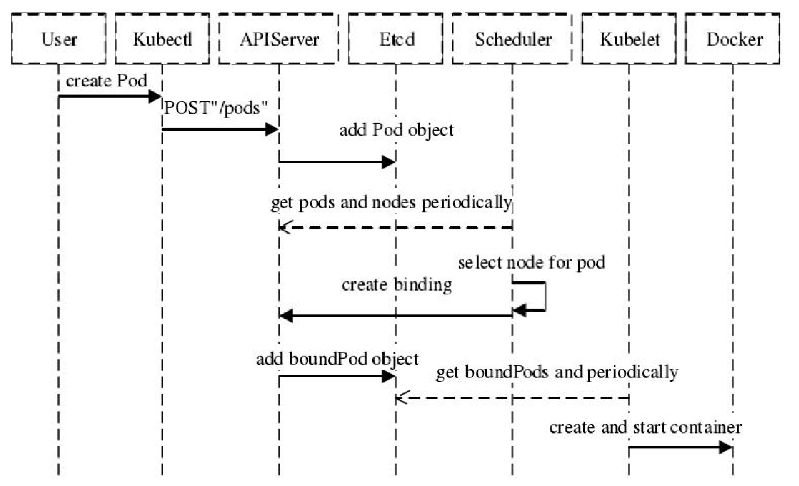
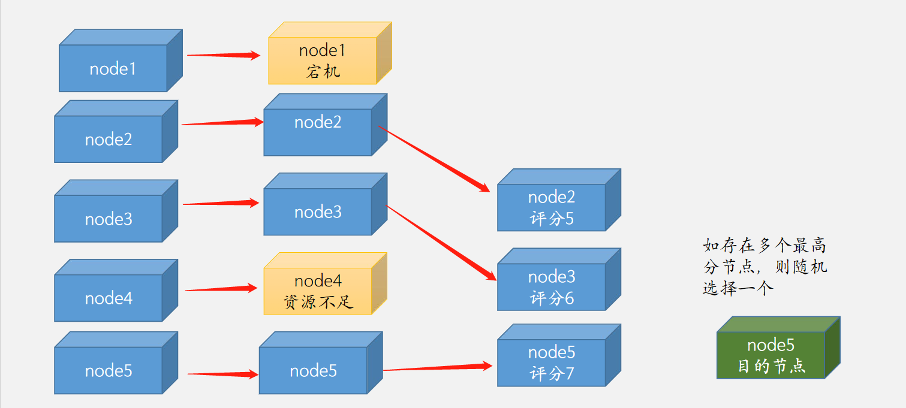

# 亲和与反亲和、污点与容忍、驱逐

## 一、nodeSelector和nodeName

### 1、Pod的调度流程





### 2、nodeSelector

#### 1.简介

> nodeSelector 基于node标签选择器，将pod调度的指定的目的节点上。
>
> https://kubernetes.io/zh/docs/concepts/scheduling-eviction/assign-pod-node/

>   可用于基于服务类型干预Pod调度结果，如对磁盘I/O要求高的pod调度到SSD节点，对内存要求比较高的pod调度的内存较高的节点。

>   也可以用于区分不同项目的pod，如将node添加不同项目的标签，然后区分调度。

```bash
root@k8s-master1:~# kubectl describe nodes 172.16.3.11
Name:               172.16.3.11
Roles:              node
Labels:             beta.kubernetes.io/arch=amd64
                    beta.kubernetes.io/os=linux
                    kubernetes.io/arch=amd64
                    kubernetes.io/hostname=172.16.3.11
                    kubernetes.io/os=linux
                    kubernetes.io/role=node
...
```

#### 2.使用

##### 1）node节点打标签

```bash
# kubectl label node 172.16.3.11 project="trevor"
node/172.16.3.11 labeled
# kubectl label node 172.16.3.11 disktype="ssd"
node/172.16.3.11 labeled
```

##### 2) yaml中指定node节点标签

```yaml
kind: Deployment
apiVersion: apps/v1
metadata:
  labels:
    app: trevor-tomcat-app2-deployment-label
  name: trevor-tomcat-app2-deployment
  namespace: trevor
spec:
  replicas: 1
  selector:
    matchLabels:
      app: trevor-tomcat-app2-selector
  template:
    metadata:
      labels:
        app: trevor-tomcat-app2-selector
    spec:
      containers:
      - name: trevor-tomcat-app2-container
        image: tomcat:7.0.94-alpine 
        imagePullPolicy: IfNotPresent
        #imagePullPolicy: Always
        ports:
        - containerPort: 8080
          protocol: TCP
          name: http
        env:
        - name: "password"
          value: "123456"
        - name: "age"
          value: "18"
        resources:
          limits:
            cpu: 1
            memory: "512Mi"
          requests:
            cpu: 500m
            memory: "512Mi"
      nodeSelector:
        project: trevor
        disktype: hdd
```

### 3、nodeName

```yaml
kind: Deployment
#apiVersion: extensions/v1beta1
apiVersion: apps/v1
metadata:
  labels:
    app: trevor-tomcat-app2-deployment-label
  name: trevor-tomcat-app2-deployment
  namespace: trevor
spec:
  replicas: 1
  selector:
    matchLabels:
      app: trevor-tomcat-app2-selector
  template:
    metadata:
      labels:
        app: trevor-tomcat-app2-selector
    spec:
      nodeName: 172.16.3.11
      containers:
      - name: trevor-tomcat-app2-container
        image: tomcat:7.0.94-alpine 
        imagePullPolicy: IfNotPresent
        #imagePullPolicy: Always
        ports:
        - containerPort: 8080
          protocol: TCP
          name: http
        env:
        - name: "password"
          value: "123456"
        - name: "age"
          value: "18"
        resources:
          limits:
            cpu: 1
            memory: "512Mi"
          requests:
            cpu: 500m
            memory: "512Mi"
```

## 二、node亲和与反亲和

### 1、介绍

> affinity是Kubernetes 1.2版本后引入的新特性，类似于nodeSelector，允许使用者指定一些Pod在Node间调度的约束，目前支持两种形式
>
> requiredDuringSchedulingIgnoredDuringExecution #必须满足pod调度匹配条件，如果不满足则不进行调度
> preferredDuringSchedulingIgnoredDuringExecution #倾向满足pod调度匹配条件，不满足的情况下会调度的不符合条件的Node上

>IgnoreDuringExecution表示如果在Pod运行期间Node的标签发生变化，导致亲和性策略不能满足，也会继续运行当前的Pod

> Affinity与anti-affinity的目的也是控制pod的调度结果，但是相对于nodeSelector，亲和与反亲和功能更加强大：
>
> 1、标签选择器不仅仅支持and，还支持In、NotIn、Exists、DoesNotExist、Gt、Lt。
>
> ​    In：标签的值存在匹配列表中(匹配成功就调度到目的node，实现node亲和)
> ​    NotIn：标签的值不存在指定的匹配列表中(不会调度到目的node，实现反亲和)
> ​    Gt：标签的值大于某个值(字符串)
> ​    Lt：标签的值小于某个值(字符串)
> ​    Exists：指定的标签存在
>
> 2、可以设置软匹配和硬匹配，在软匹配下，如果调度器无法匹配节点，仍然将pod调度到其它不符合条件的节点。
> 3、还可以对pod定义亲和策略，比如允许哪些pod可以或者不可以被调度至同一台node。

>   如果定义一个nodeSelectorTerms(条件)中通过一个matchExpressions基于列表指定了**多个operator条件**，则只要满足其中一个条件，就会被调度到相应的节点上，即or的关系，即如果nodeSelectorTerms下面有多个条件的话，只要满足任何一个条件就可以了
>    如果定义一个nodeSelectorTerms中都通过一个matchExpressions(匹配表达式)指定**key匹配多个条件**，则所有的目的条件都必须满足才会调度到对应的节点，即and的关系，即果matchExpressions有多个选项的话，则必须同时满足所有这些条件才能正常调度

### 2、硬亲和

#### 1.或匹配

```yaml
kind: Deployment
#apiVersion: extensions/v1beta1
apiVersion: apps/v1
metadata:
  labels:
    app: trevor-tomcat-app2-deployment-label
  name: trevor-tomcat-app2-deployment
  namespace: trevor
spec:
  replicas: 1
  selector:
    matchLabels:
      app: trevor-tomcat-app2-selector
  template:
    metadata:
      labels:
        app: trevor-tomcat-app2-selector
    spec:
      containers:
      - name: trevor-tomcat-app2-container
        image: tomcat:7.0.94-alpine
        imagePullPolicy: IfNotPresent
        #imagePullPolicy: Always
        ports:
        - containerPort: 8080
          protocol: TCP
          name: http
      affinity:
        nodeAffinity:
          requiredDuringSchedulingIgnoredDuringExecution:
            nodeSelectorTerms:
            - matchExpressions: #匹配条件1,多个values可以调度
              - key: disktype
                operator: In
                values:
                - hdd # 只有一个value是匹配成功也可以调度
                - xxx
            - matchExpressions: # 匹配条件2,多个matchExpressions加上以及每个matchExpressions values只有其中一个value匹配成功就可以调度
              - key: project
                operator: In
                values:
                - mmm # 即使这俩条件2的都匹配不上也可以调度
                - nnn
```

#### 2.且匹配

```yaml
kind: Deployment
#apiVersion: extensions/v1beta1
apiVersion: apps/v1
metadata:
  labels:
    app: trevor-tomcat-app2-deployment-label
  name: trevor-tomcat-app2-deployment
  namespace: trevor
spec:
  replicas: 1
  selector:
    matchLabels:
      app: trevor-tomcat-app2-selector
  template:
    metadata:
      labels:
        app: trevor-tomcat-app2-selector
    spec:
      containers:
      - name: trevor-tomcat-app2-container
        image: tomcat:7.0.94-alpine
        imagePullPolicy: IfNotPresent
        #imagePullPolicy: Always
        ports:
        - containerPort: 8080
          protocol: TCP
          name: http
      affinity:
        nodeAffinity:
          requiredDuringSchedulingIgnoredDuringExecution:
            nodeSelectorTerms:
            - matchExpressions: #硬亲和匹配条件1
              - key: disktype
                operator: In
                values:
                - ssd
                - xxx #同个key的多个value只有有一个匹配成功就行
              - key: project #硬亲和条件1和条件2必须同时满足,否则不调度
                operator: In
                values:
                - trevor
```

### 3、软亲和

```yaml
kind: Deployment
#apiVersion: extensions/v1beta1
apiVersion: apps/v1
metadata:
  labels:
    app: trevor-tomcat-app2-deployment-label
  name: trevor-tomcat-app2-deployment
  namespace: trevor
spec:
  replicas: 1
  selector:
    matchLabels:
      app: trevor-tomcat-app2-selector
  template:
    metadata:
      labels:
        app: trevor-tomcat-app2-selector
    spec:
      containers:
      - name: trevor-tomcat-app2-container
        image: tomcat:7.0.94-alpine
        imagePullPolicy: IfNotPresent
        #imagePullPolicy: Always
        ports:
        - containerPort: 8080
          protocol: TCP
          name: http
      affinity:
        nodeAffinity:
          preferredDuringSchedulingIgnoredDuringExecution:
          - weight: 80  #软亲和条件1，值越大优先级越高，越优先匹配调度，
            preference: 
              matchExpressions: 
              - key: project 
                operator: In 
                values: 
                  - trevorxx
          - weight: 60  #软亲和条件2，在条件1不满足时匹配条件2
            preference: 
              matchExpressions: 
              - key: disktype
                operator: In 
                values: 
                  - hddxx
```

### 4、软硬亲和结合使用-nodeAffinity-requiredDuring-preferredDuring：

```yaml
kind: Deployment
#apiVersion: extensions/v1beta1
apiVersion: apps/v1
metadata:
  labels:
    app: trevor-tomcat-app2-deployment-label
  name: trevor-tomcat-app2-deployment
  namespace: trevor
spec:
  replicas: 1
  selector:
    matchLabels:
      app: trevor-tomcat-app2-selector
  template:
    metadata:
      labels:
        app: trevor-tomcat-app2-selector
    spec:
      containers:
      - name: trevor-tomcat-app2-container
        image: tomcat:7.0.94-alpine
        imagePullPolicy: IfNotPresent
        #imagePullPolicy: Always
        ports:
        - containerPort: 8080
          protocol: TCP
          name: http
      affinity:
        nodeAffinity:
          requiredDuringSchedulingIgnoredDuringExecution: #硬亲和
            nodeSelectorTerms:
            - matchExpressions: #硬匹配条件1
              - key: "kubernetes.io/role" 
                operator: NotIn
                values:
                - "master" #硬性匹配key 的值kubernetes.io/role不包含master的节点,即绝对不会调度到master节点(node反亲和)
          preferredDuringSchedulingIgnoredDuringExecution: #软亲和
          - weight: 80 
            preference: 
              matchExpressions: 
              - key: project 
                operator: In 
                values: 
                  - trevor
          - weight: 60 
            preference: 
              matchExpressions: 
              - key: disktype
                operator: In 
                values: 
                  - ssd
```

### 5、反亲和

```yaml
kind: Deployment
#apiVersion: extensions/v1beta1
apiVersion: apps/v1
metadata:
  labels:
    app: trevor-tomcat-app2-deployment-label
  name: trevor-tomcat-app2-deployment
  namespace: trevor
spec:
  replicas: 1
  selector:
    matchLabels:
      app: trevor-tomcat-app2-selector
  template:
    metadata:
      labels:
        app: trevor-tomcat-app2-selector
    spec:
      containers:
      - name: trevor-tomcat-app2-container
        image: tomcat:7.0.94-alpine
        imagePullPolicy: IfNotPresent
        #imagePullPolicy: Always
        ports:
        - containerPort: 8080
          protocol: TCP
          name: http
      affinity:
        nodeAffinity:
          requiredDuringSchedulingIgnoredDuringExecution:
            nodeSelectorTerms:
            - matchExpressions: #匹配条件1
              - key: disktype
                operator: NotIn #调度的目的节点没有key为disktype且值为hdd的标签
                values:
                - hdd #绝对不会调度到含有label的key为disktype且值为hdd的hdd的节点,即会调度到没有key为disktype且值为hdd的hdd的节点
```

## 三、pod亲和与反亲和

### 1、介绍

>​    Pod亲和性与反亲和性可以基于已经在node节点上运行的Pod的标签来约束新创建的Pod可以调度到的目的节点，注意不是基于node上的标签而是使用的已经运行在node上的pod标签匹配。

>​    其规则的格式为如果 node节点 A已经运行了一个或多个满足调度新创建的Pod B的规则，那么新的Pod B在亲和的条件下会调度到A节点之上，而在反亲和性的情况下则不会调度到A节点至上。

>​    其中规则表示一个具有可选的关联命名空间列表的LabelSelector，只所以Pod亲和与反亲和需可以通过LabelSelector选择namespace，是因为Pod是命名空间限定的而node不属于任何nemespace所以node的亲和与反亲和不需要namespace，因此作用于Pod标签的标签选择算符必须指定选择算符应用在哪个命名空间。

>​    从概念上讲，node节点是一个拓扑域(具有拓扑结构的域)，比如k8s集群中的单台node节点、一个机架、云供应商可用区、云供应商地理区域等，可以使用topologyKey来定义亲和或者反亲和的颗粒度是node级别还是可用区级别，以便kubernetes调度系统用来识别并选择正确的目的拓扑域。

>Pod 亲和性与反亲和性的合法操作符(operator)有 In、NotIn、Exists、DoesNotExist。

>   在Pod亲和性配置中，在requiredDuringSchedulingIgnoredDuringExecution和preferredDuringSchedulingIgnoredDuringExecution中，topologyKey不允许为空(Empty topologyKey is not allowed.)。


>​    在Pod反亲和性中配置中，requiredDuringSchedulingIgnoredDuringExecution和preferredDuringSchedulingIgnoredDuringExecution 中，topologyKey也不可以为空(Empty topologyKey is not allowed.)。


>​    对于requiredDuringSchedulingIgnoredDuringExecution要求的Pod反亲和性，准入控制器LimitPodHardAntiAffinityTopology被引入以确保topologyKey只能是 kubernetes.io/hostname，如果希望 topologyKey 也可用于其他定制拓扑逻辑，可以更改准入控制器或者禁用。


>   除上述情况外，topologyKey 可以是任何合法的标签键。

### 2、创建一个nginx环境用于测试

```yaml
kind: Deployment
#apiVersion: extensions/v1beta1
apiVersion: apps/v1
metadata:
  labels:
    app: python-nginx-deployment-label
  name: python-nginx-deployment
  namespace: trevor
spec:
  replicas: 1
  selector:
    matchLabels:
      app: python-nginx-selector
  template:
    metadata:
      labels:
        app: python-nginx-selector
        project: python
    spec:
      containers:
      - name: python-nginx-container
        image: nginx:1.20.2-alpine
        #command: ["/apps/tomcat/bin/run_tomcat.sh"]
        #imagePullPolicy: IfNotPresent
        imagePullPolicy: Always
        ports:
        - containerPort: 80
          protocol: TCP
          name: http
        - containerPort: 443
          protocol: TCP
          name: https
        env:
        - name: "password"
          value: "123456"
        - name: "age"
          value: "18"
#        resources:
#          limits:
#            cpu: 2
#            memory: 2Gi
#          requests:
#            cpu: 500m
#            memory: 1Gi


---
kind: Service
apiVersion: v1
metadata:
  labels:
    app: python-nginx-service-label
  name: python-nginx-service
  namespace: trevor
spec:
  type: NodePort
  ports:
  - name: http
    port: 80
    protocol: TCP
    targetPort: 80
    nodePort: 30014
  - name: https
    port: 443
    protocol: TCP
    targetPort: 443
    nodePort: 30453
  selector:
    app: python-nginx-selector
    project: python #一个或多个selector，至少能匹配目标pod的一个标签 
```

### 2、软亲和

```yaml
kind: Deployment
#apiVersion: extensions/v1beta1
apiVersion: apps/v1
metadata:
  labels:
    app: trevor-tomcat-app2-deployment-label
  name: trevor-tomcat-app2-deployment
  namespace: trevor
spec:
  replicas: 1
  selector:
    matchLabels:
      app: trevor-tomcat-app2-selector
  template:
    metadata:
      labels:
        app: trevor-tomcat-app2-selector
    spec:
      containers:
      - name: trevor-tomcat-app2-container
        image: tomcat:7.0.94-alpine
        imagePullPolicy: IfNotPresent
        #imagePullPolicy: Always
        ports:
        - containerPort: 8080
          protocol: TCP
          name: http
      affinity:
        podAffinity:
          preferredDuringSchedulingIgnoredDuringExecution:
          - weight: 100
            podAffinityTerm:
              labelSelector:
                matchExpressions:
                - key: project 
                  operator: In
                  values:
                    - python
              topologyKey: kubernetes.io/hostname 
              namespaces: 
                - trevor
```

### 3、硬亲和

```yaml
kind: Deployment
#apiVersion: extensions/v1beta1
apiVersion: apps/v1
metadata:
  labels:
    app: trevor-tomcat-app2-deployment-label
  name: trevor-tomcat-app2-deployment
  namespace: trevor
spec:
  replicas: 3
  selector:
    matchLabels:
      app: trevor-tomcat-app2-selector
  template:
    metadata:
      labels:
        app: trevor-tomcat-app2-selector
    spec:
      containers:
      - name: trevor-tomcat-app2-container
        image: tomcat:7.0.94-alpine
        imagePullPolicy: IfNotPresent
        #imagePullPolicy: Always
        ports:
        - containerPort: 8080
          protocol: TCP
          name: http
      affinity:
        podAffinity:
          requiredDuringSchedulingIgnoredDuringExecution:
          - labelSelector:
              matchExpressions:
              - key: project
                operator: In
                values:
                  - python
            topologyKey: "kubernetes.io/hostname"
            namespaces:
              - trevor
```

### 4、硬反亲和

```yaml
kind: Deployment
#apiVersion: extensions/v1beta1
apiVersion: apps/v1
metadata:
  labels:
    app: trevor-tomcat-app2-deployment-label
  name: trevor-tomcat-app2-deployment
  namespace: trevor
spec:
  replicas: 1
  selector:
    matchLabels:
      app: trevor-tomcat-app2-selector
  template:
    metadata:
      labels:
        app: trevor-tomcat-app2-selector
    spec:
      containers:
      - name: trevor-tomcat-app2-container
        image: tomcat:7.0.94-alpine
        imagePullPolicy: IfNotPresent
        #imagePullPolicy: Always
        ports:
        - containerPort: 8080
          protocol: TCP
          name: http
      affinity:
        podAntiAffinity:
          requiredDuringSchedulingIgnoredDuringExecution:
          - labelSelector:
              matchExpressions:
              - key: project
                operator: NotIn
                values:
                  - python
            topologyKey: "kubernetes.io/hostname"
            namespaces:
              - trevor
```

### 5、软反亲和

```yaml
kind: Deployment
#apiVersion: extensions/v1beta1
apiVersion: apps/v1
metadata:
  labels:
    app: trevor-tomcat-app2-deployment-label
  name: trevor-tomcat-app2-deployment
  namespace: trevor
spec:
  replicas: 1
  selector:
    matchLabels:
      app: trevor-tomcat-app2-selector
  template:
    metadata:
      labels:
        app: trevor-tomcat-app2-selector
    spec:
      containers:
      - name: trevor-tomcat-app2-container
        image: tomcat:7.0.94-alpine
        imagePullPolicy: IfNotPresent
        #imagePullPolicy: Always
        ports:
        - containerPort: 8080
          protocol: TCP
          name: http
      affinity:
        podAntiAffinity:
          preferredDuringSchedulingIgnoredDuringExecution:
          - weight: 100
            podAffinityTerm:
              labelSelector:
                matchExpressions:
                - key: project 
                  operator: NotIn
                  values:
                    - python
              topologyKey: kubernetes.io/hostname 
              namespaces: 
                - trevor
```

## 四、污点与容忍

### 1、介绍

> 污点(taints),用于node节点排斥 Pod调度，与亲和的作用是完全相反的,即taint的node和pod是排斥调度关系。
>
> 容忍(toleration),用于Pod容忍node节点的污点信息，即node有污点信息也会将新的pod调度到node。
>
> ​    tolerations容忍：
>
> ​        定义 Pod 的容忍度，可以调度至含有污点的node。
>
> ​    基于operator的污点匹配：
>
> ​        如果operator是Exists，则容忍度不需要value而是直接匹配污点类型。
>
> ​        如果operator是Equal，则需要指定value并且value的值需要等于tolerations的key。


> https://kubernetes.io/zh/docs/concepts/scheduling-eviction/taint-and-toleration/

### 2、污点

> NoSchedule: 表示k8s将不会将Pod调度到具有该污点的Node上
>
> PreferNoSchedule: 表示k8s将尽量避免将Pod调度到具有该污点的Node上
>
> NoExecute: 表示k8s将不会将Pod调度到具有该污点的Node上，同时会将Node上已经存在的Pod强制驱逐出去

#### 1.使用

>kubectl taint nodes 172.16.3.11 key1=value1:NoSchedule #设置污点
>
>kubectl describe node 172.16.3.11 #查看污点
>
>kubectl taint node 172.16.3.11 key1:NoSchedule- #取消污点

### 3、容忍

#### 1.使用

```bash
kubectl cordon 172.16.3.13  # 其它节点不调度
kubectl taint nodes 172.16.3.11 key1=value1:NoSchedule  # 给剩下的节点打上污点信息：
```

```yaml
kind: Deployment
#apiVersion: extensions/v1beta1
apiVersion: apps/v1
metadata:
  labels:
    app: trevor-tomcat-app1-deployment-label
  name: trevor-tomcat-app1-deployment
  namespace: trevor
spec:
  replicas: 10
  selector:
    matchLabels:
      app: trevor-tomcat-app1-selector
  template:
    metadata:
      labels:
        app: trevor-tomcat-app1-selector
    spec:
      containers:
      - name: trevor-tomcat-app1-container
        #image: harbor.trevor.local/trevor/tomcat-app1:v7
        image: tomcat:7.0.93-alpine 
        #command: ["/apps/tomcat/bin/run_tomcat.sh"]
        imagePullPolicy: IfNotPresent
        ports:
        - containerPort: 8080
          protocol: TCP
          name: http
#        env:
#        - name: "password"
#          value: "123456"
#        - name: "age"
#          value: "18"
#        resources:
#          limits:
#            cpu: 1
#            memory: "512Mi"
#          requests:
#            cpu: 500m
#            memory: "512Mi"

      tolerations: 
      - key: "key1"
        operator: "Equal"
        value: "value1"
        effect: "NoSchedule"

---
kind: Service
apiVersion: v1
metadata:
  labels:
    app: trevor-tomcat-app1-service-label
  name: trevor-tomcat-app1-service
  namespace: trevor
spec:
  type: NodePort
  ports:
  - name: http
    port: 80
    protocol: TCP
    targetPort: 8080
    #nodePort: 40003
  selector:
    app: trevor-tomcat-app1-selector
```

```bash
kubectl taint nodes 172.16.3.11 key1:NoSchedule- # 污点的删除：
```

## 五、驱逐

### 1、简介

> ​    节点压力驱逐是由各kubelet进程主动终止Pod，以回收节点上的内存、磁盘空间等资源的过程，kubelet监控当前node节点的CPU、内存、磁盘空间和文件系统的inode等资源，当这些资源中的一个或者多个达到特定的消耗水平，kubelet就会主动地将节点上一个或者多个Pod强制驱逐，以防止当前node节点资源无法正常分配而引发的OOM。

> https://kubernetes.io/zh/docs/concepts/scheduling-eviction/node-pressure-eviction/

>宿主机内存：
>memory.available #node节点可用内存，默认 <100Mi

>​    nodefs是节点的主要文件系统,用于保存本地磁盘卷、emptyDir、日志存储等数据，默认是/var/lib/kubelet/，或者是通过kubelet通过--root-dir所指定的磁盘挂载目录
>​    nodefs.inodesFree #nodefs的可用inode，默认<5%
>​    nodefs.available #nodefs的可用空间,默认<10%

>imagefs是可选文件系统，用于给容器提供运行时存储容器镜像和容器可写层。
>    imagefs.inodesFree #imagefs的inode可用百分比
>    imagefs.available #imagefs的磁盘空间可用百分比，默认<15%
>    pid.available #可用pid百分比

>示例：
>evictionHard:
>    imagefs.inodesFree: 5%
>    imagefs.available: 15%
>    memory.available: 300Mi
>    nodefs.available: 10%
>    nodefs.inodesFree: 5%
>    pid.available: 5%

### 2、驱逐实现其他方式

>kube-controller-manager实现 eviction:
>node宕机后的驱逐

>kubelet实现的eviction：
>基于node负载、资源利用率等进行pod驱逐。

### 3、Qos等级

>​    驱逐(eviction，节点驱逐)，用于当node节点资源不足的时候自动将pod进行强制驱逐，以保证当前node节点的正常运行。Kubernetes基于是QoS(服务质量等级)驱逐Pod , Qos等级包括目前包括以下三个:

#### 1.Guaranteed

> limits和request的值相等，等级最高、最后被驱逐

```yaml
resources:
  limits:
    cpu: 500m
    memory: 256Mi
  requests:
    cpu: 500m
    memory: 256Mi
```

#### 2.Burstable

> limit和request不相等，等级折中、中间被驱逐

```yaml
resources:
  limits:
    cpu: 500m
    memory: 256Mi
  requests:
    cpu: 256m
    memory: 128M
```

#### 3.BestEffor

> 没有限制，即resources为空，等级最低、最先被驱逐

### 4、驱逐条件

>eviction-signal：kubelet捕获node节点驱逐触发信号，进行判断是否驱逐，比如通过cgroupfs获取memory.available的值来进行下一步匹配

>operator：操作符，通过操作符对比条件是否匹配资源量是否触发驱逐。

>quantity：使用量，即基于指定的资源使用值进行判断，如memory.available: 300Mi、nodefs.available: 10%等。

> 比如：nodefs.available<10%

### 5、软驱逐

> 软驱逐不会立即驱逐pod，可以自定义宽限期，在条件持续到宽限期还没有恢复，kubelet再强制杀死pod并触发驱逐：
>
> 软驱逐条件:
>
>    eviction-soft： 软驱逐触发条件，比如memory.available < 1.5Gi，如果驱逐条件持续时长超过指定的宽限期，可以触发Pod驱逐。
>
>    eviction-soft-grace-period：软驱逐宽限期， 如 memory.available=1m30s，定义软驱逐条件在触发Pod驱逐之前必须保持多长时间。
>
>    eviction-max-pod-grace-period：终止pod的宽限期，即在满足软驱逐条件而终止Pod时使用的最大允许宽限期（以秒为单位）。


### 6、硬驱逐

> 硬驱逐条件没有宽限期，当达到硬驱逐条件时，kubelet 会强制立即杀死 pod并驱逐：
>
> kubelet 具有以下默认硬驱逐条件(可以自行调整)：

#### 1.查看修改kubelet配置

```bash
root@k8s-master1:~# cat /etc/systemd/system/kubelet.service
[Unit]
Description=Kubernetes Kubelet
Documentation=https://github.com/GoogleCloudPlatform/kubernetes

[Service]
WorkingDirectory=/var/lib/kubelet
ExecStart=/opt/kube/bin/kubelet \
  --config=/var/lib/kubelet/config.yaml \
  --cni-bin-dir=/opt/kube/bin \
  --cni-conf-dir=/etc/cni/net.d \
  --hostname-override=172.16.3.3 \
  --image-pull-progress-deadline=5m \
  --kubeconfig=/etc/kubernetes/kubelet.kubeconfig \
  --network-plugin=cni \
  --pod-infra-container-image=easzlab/pause:3.6 \
  --root-dir=/var/lib/kubelet \
  --v=2
Restart=always
RestartSec=5

[Install]
WantedBy=multi-user.target
```

```bash
root@k8s-master1:~# cat /var/lib/kubelet/config.yaml
kind: KubeletConfiguration
apiVersion: kubelet.config.k8s.io/v1beta1
address: 0.0.0.0
authentication:
  anonymous:
    enabled: false
  webhook:
    cacheTTL: 2m0s
    enabled: true
  x509:
    clientCAFile: /etc/kubernetes/ssl/ca.pem
authorization:
  mode: Webhook
  webhook:
    cacheAuthorizedTTL: 5m0s
    cacheUnauthorizedTTL: 30s
cgroupDriver: systemd
cgroupsPerQOS: true
clusterDNS:
- 10.100.0.2
clusterDomain: xiaowurobot.local
configMapAndSecretChangeDetectionStrategy: Watch
containerLogMaxFiles: 3
containerLogMaxSize: 10Mi
enforceNodeAllocatable:
- pods
eventBurst: 10
eventRecordQPS: 5
evictionHard:
  imagefs.available: 15%
  memory.available: 300Mi
  nodefs.available: 10%
  nodefs.inodesFree: 5%
evictionPressureTransitionPeriod: 5m0s
failSwapOn: true
fileCheckFrequency: 40s
hairpinMode: hairpin-veth
healthzBindAddress: 0.0.0.0
healthzPort: 10248
httpCheckFrequency: 40s
imageGCHighThresholdPercent: 85
imageGCLowThresholdPercent: 80
imageMinimumGCAge: 2m0s
kubeAPIBurst: 100
kubeAPIQPS: 50
makeIPTablesUtilChains: true
maxOpenFiles: 1000000
maxPods: 500
nodeLeaseDurationSeconds: 40
nodeStatusReportFrequency: 1m0s
nodeStatusUpdateFrequency: 10s
oomScoreAdj: -999
podPidsLimit: -1
port: 10250
# disable readOnlyPort
readOnlyPort: 0
resolvConf: /run/systemd/resolve/resolv.conf
runtimeRequestTimeout: 2m0s
serializeImagePulls: true
streamingConnectionIdleTimeout: 4h0m0s
syncFrequency: 1m0s
tlsCertFile: /etc/kubernetes/ssl/kubelet.pem
tlsPrivateKeyFile: /etc/kubernetes/ssl/kubelet-key.pem
```

**修改重启后生效**
