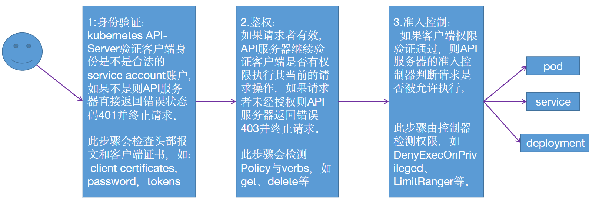
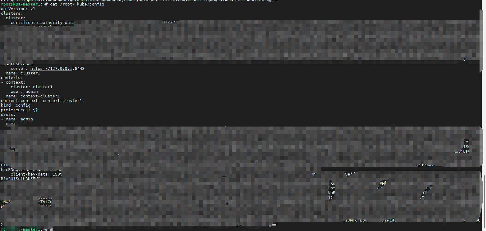
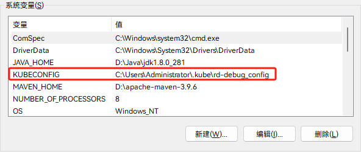

# k8s准入机制

## 一、Kubernetes API 鉴权流程



## 二、当前用户认证文件



## 三、Kubernetes API 鉴权类型

>https://kubernetes.io/zh/docs/reference/access-authn-authz/authorization

### 1、Node(节点鉴权)

> 针对kubelet发出的API请求进行鉴权
>
> 授予node节点的kubelet读取services、endpoints、secrets、configmaps等事件状态，并向API server更新pod与node状态。

### 2、Webhook

> 是一个HTTP回调，发生某些事情时调用的HTTP调用。

```yaml
# Kubernetes API 版本
apiVersion: v1
# API 对象种类
kind: Config
# clusters 代表远程服务。
clusters:
- name: name-of-remote-authz-service
cluster:
# 对远程服务进行身份认证的 CA。
certificate-authority: /path/to/ca.pem
# 远程服务的查询 URL。必须使用 'https'。
server: https://authz.example.com/authorize
```

### 3、ABAC(Attribute-based access control）

> 基于属性的访问控制，1.6之前使用，将属性与账户直接绑定。

```bash
--authorization-mode=...,RBAC,ABAC --authorization-policy-file=mypolicy.json #开启ABAC参数
```

```bash
{"apiVersion": "abac.authorization.kubernetes.io/v1beta1", "kind": "Policy", "spec": {"user": "user1", "namespace": "*", "resource": "*",
"apiGroup": "*"}} #用户user1对所有namespace所有API版本的所有资源拥有所有权限((没有设置"readonly": true)。

{"apiVersion": "abac.authorization.kubernetes.io/v1beta1", "kind": "Policy", "spec": {"user": "user2", "namespace": "myserver", "resource":"pods", "readonly": true}} #用户user2对namespace myserver的pod有只读权限。
```

### 4、RBAC(Role-Based Access Control)

>基于角色的访问控制,将权限与角色(role)先进行关联，然后将角色与用户进行绑定(Binding)从而继承角色中的权限。

>RBAC API声明了四种Kubernetes对象：Role、ClusterRole、RoleBinding和ClusterRoleBinding。
>    Role: 定义一组规则，用于访问命名空间中的 Kubernetes 资源。
>    RoleBinding: 定义用户和角色(Role)的绑定关系。
>    ClusterRole: 定义了一组访问集群中 Kubernetes 资源(包括所有命名空间)的规则。
>    ClusterRoleBinding: 定义了用户和集群角色(ClusterRole)的绑定关系。

## 四、使用

### 1、创建用于并绑定角色

#### 1.创建用户

```bash
# 创建用户
kubectl create serviceaccount trevor-user -n trevor

# 查看
root@k8s-master1:~# kubectl get sa -n trevor
NAME          SECRETS   AGE
default       1         30s
trevor-user   1         23s
```

#### 2.创建角色

```yaml
kind: Role #类似为role即角色
apiVersion: rbac.authorization.k8s.io/v1
metadata:
  namespace: trevor  #角色所在的namespace
  name: trevor-role  #角色名称
rules: #定义授权规则
- apiGroups: ["*"]  #资源对象的API，*表示所有版本
  resources: ["pods/exec"]  #目标资源对象
  #verbs: ["*"]
  ##RO-Role
  verbs: ["get", "list", "watch", "create"] #该角色针对上述资源对象的动作集

- apiGroups: ["*"]
  resources: ["pods"]
  #verbs: ["*"]
  ##RO-Role
  verbs: ["get", "list", "watch"]

- apiGroups: ["apps/v1"]
  resources: ["deployments"]
  #verbs: ["get", "list", "watch", "create", "update", "patch", "delete"]
  ##RO-Role
  verbs: ["get", "watch", "list"]
```

>**`get`**：
>
>- **含义**：允许用户获取资源的详细信息。
>- **例子**：获取 Pod、Service、Deployment 等资源的详细信息。
>
>**`list`**：
>
>- **含义**：允许用户列出资源。
>- **例子**：列出所有 Pods、Services、Deployments 等资源。
>
>**`create`**：
>
>- **含义**：允许用户创建新资源。
>- **例子**：创建新的 Pod、Service、Deployment 等资源。
>
>**`update`**：
>
>- **含义**：允许用户更新现有资源。
>- **例子**：更新 Pod 的配置、Service 的标签等。
>
>**`delete`**：
>
>- **含义**：允许用户删除资源。
>- **例子**：删除 Pod、Service、Deployment 等资源。
>
>**`watch`**：
>
>- **含义**：允许用户观察资源的变更。
>- **例子**：监视 Pod 的状态变化。
>
>**`proxy`**：
>
>- **含义**：允许用户通过 kubectl proxy 访问集群内部的服务。
>- **例子**：使用 `kubectl proxy` 访问 Kubernetes API。
>
>**`exec`**：
>
>- **含义**：允许用户在容器内执行命令。
>- **例子**：使用 `kubectl exec` 命令在 Pod 内部执行命令。
>
>**`portforward`**：
>
>- **含义**：允许用户进行端口转发，使本地端口与 Pod 的端口建立连接。
>- **例子**：使用 `kubectl port-forward` 命令转发 Pod 的端口。
>
>**`attach`**：
>
>- **含义**：允许用户附加到 Pod 的运行时容器。
>- **例子**：使用 `kubectl attach` 命令附加到 Pod。
>
>**`get, list`**：
>
>- **含义**：组合权限，允许用户获取和列出资源。
>- **例子**：获取和列出 Pod、Service、Deployment 等资源。
>
>**`create, delete`**：
>
>- **含义**：组合权限，允许用户创建和删除资源。
>- **例子**：创建和删除 Pod、Service、Deployment 等资源

#### 3.角色绑定

```yaml
kind: RoleBinding  #类型为角色绑定
apiVersion: rbac.authorization.k8s.io/v1
metadata:
  name: role-bind-trevor  #角色绑定的名称
  namespace: trevor   #角色绑定所在的namespace
subjects:  #主体配置，格式为列表
- kind: ServiceAccount
  name: trevor-user  #角色绑定的目标账户
  namespace: trevor
roleRef:  #角色配置，"roleRef" 指定账户是与 Role 还是与 ClusterRole 进行绑定
  kind: Role  # 绑定类型，必须是 Role 或 ClusterRole二者其一
  name: trevor-role # 此字段必须与要绑定的目标 Role 或 ClusterRole 的名称匹配
  apiGroup: rbac.authorization.k8s.io #API版本
```

#### 4.查看token

```bash
root@k8s-master1:~# kubectl get secrets -n trevor
NAME                      TYPE                                  DATA   AGE
default-token-bc8qq       kubernetes.io/service-account-token   3      7m34s
trevor-user-token-xx4f7   kubernetes.io/service-account-token   3      7m27s

root@k8s-master1:~# kubectl describe  secrets -n trevor trevor-user-token-xx4f7
```

### 2、基于token登录


### 3、基于kube-config文件登录

#### 1.创建csr文件

> trevor-user-csr.json

```json
{
  "CN": "China",
  "hosts": [],
  "key": {
    "algo": "rsa",
    "size": 2048
  },
  "names": [
    {
      "C": "CN",
      "ST": "ShangHai",
      "L": "ShangHai",
      "O": "k8s",
      "OU": "System"
    }
  ]
}
```

#### 2.签发证书

```bash
ln -sv /etc/kubeasz/bin/cfssl* /usr/bin/
cfssl gencert -ca=/etc/kubernetes/ssl/ca.pem  -ca-key=/etc/kubernetes/ssl/ca-key.pem -config=/etc/kubeasz/clusters/k8s-cluster1/ssl/ca-config.json  -profile=kubernetes trevor-user-csr.json | cfssljson -bare  trevor-user
```

#### 3.生成普通用户kubeconfig文件

```bash
kubectl config set-cluster cluster1 --certificate-authority=/etc/kubernetes/ssl/ca.pem --embed-certs=true --server=https://172.16.3.3:6443 --kubeconfig=trevor-user.kubeconfig #--embed-certs=true为嵌入证书信息
```

#### 4.设置证书认证参数

```bash
cp *.pem /etc/kubernetes/ssl/
kubectl config set-credentials trevor-user \
--client-certificate=/etc/kubernetes/ssl/trevor-user.pem \
--client-key=/etc/kubernetes/ssl/trevor-user-key.pem \
--embed-certs=true \
--kubeconfig=trevor-user.kubeconfig
```

#### 5.设置上下文参数(多集群使用上下文区分)

```bash
kubectl config set-context cluster1 \
--cluster=cluster1 \
--user=trevor-user \
--namespace=trevor \
--kubeconfig=trevor-user.kubeconfig
```

#### 6.设置默认上下文

```bash
kubectl config use-context cluster1 --kubeconfig=trevor-user.kubeconfig
```

#### 7.获取token

```bash
root@k8s-master1:~# kubectl get secrets -n trevor
NAME                      TYPE                                  DATA   AGE
default-token-bc8qq       kubernetes.io/service-account-token   3      7m34s
trevor-user-token-xx4f7   kubernetes.io/service-account-token   3      7m27s
root@k8s-master1:~# kubectl describe  secrets -n trevor trevor-user-token-xx4f7
```

#### 8.将token写入kube-config

```bash
    client-key-data: ...
    token: ...
```

#### 9.使用测试

## 五、实战-为开发人员创建RBAC账户用于kt-connect接入集群

### 1、创建用户

```bash
kubectl create serviceaccount rd-debug -n default
```

### 2、master-test创建角色和绑定

```yaml
kind: Role
apiVersion: rbac.authorization.k8s.io/v1
metadata:
  namespace: master-test
  name: rd-debug
rules: 
  - apiGroups: ["*"]
    resources: ["pods", "pods/exec", "pods/log", "pods/portforward", "networkpolicies"]
    verbs: ["get", "list", "watch", "create", "delete", "update"]

  - apiGroups: ["*"]
    resources: ["deployments", "statefulsets.apps", "services", "secrets", "serviceaccounts"]
    verbs: ["get", "list", "watch"]
---
apiVersion: rbac.authorization.k8s.io/v1
kind: RoleBinding
metadata:
  name: rd-debug
  namespace: master-test
subjects:
- kind: ServiceAccount
  name: rd-debug
  namespace: default
roleRef:
  kind: Role
  name: rd-debug
  apiGroup: rbac.authorization.k8s.io
```

### 3、serviceaccount创建token

>新版本的[k8s](https://so.csdn.net/so/search?q=k8s&spm=1001.2101.3001.7020)需要手动生成

```yaml
apiVersion: v1
kind: Secret
metadata:
  name: rd-debug-token
  namespace: default
  annotations:
    kubernetes.io/service-account.name: rd-debug
type: kubernetes.io/service-account-token
```

### 4、查看token

```bash
$ kubectl describe  secrets rd-debug-token

$ kubectl get secret rd-debug-token -o=jsonpath='{.data.token}' | base64 --decode
```

### 5、kubeconfig文件准备

>可以基于admin文件做修改
>
>修改contexts，user和user-token

```bash
...
contexts:
- context:
    cluster: externalCluster
    user: rd-debug
  name: external
- context:
    cluster: externalClusterTLSVerify
    user: rd-debug
  name: externalTLSVerify
- context:
    cluster: internalCluster
    user: rd-debug
  name: internal
current-context: externalTLSVerify
kind: Config
preferences: {}
users:
- name: rd-debug
  user:
    token: <serviceaccount-token>
```

### 6、设置KUBECONFIG变量


