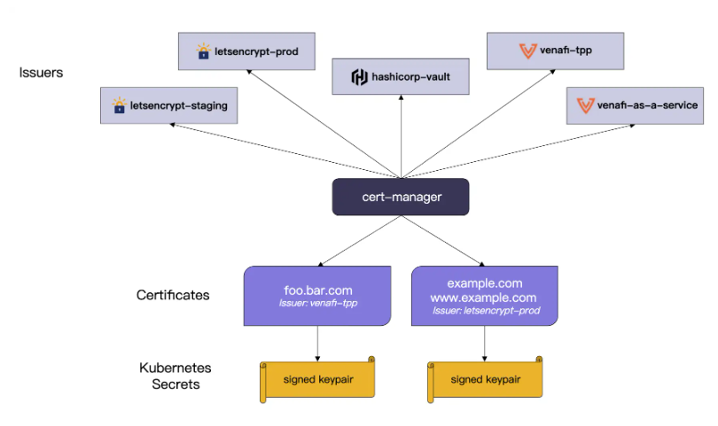
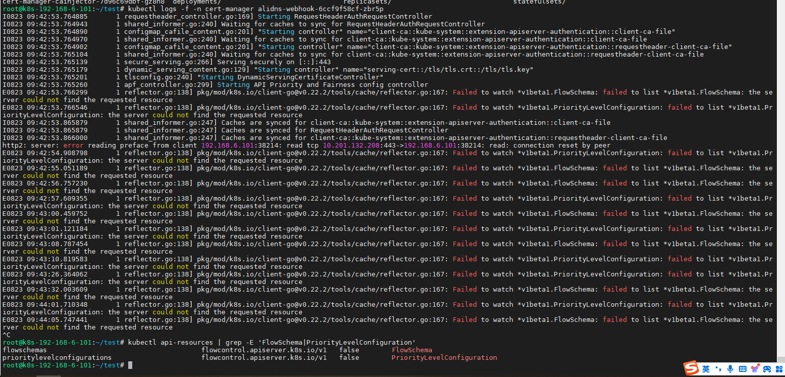

# Kubernetes-Ingress-https自动化


## 一、引入

### 1、需求背景

>​     我们知道 HTTPS的服务非常安全，Google 现在对非 HTTPS的服务默认是拒绝的，而且还能避免国内各种乱七八糟的劫持，所以启用 HTTPS服务是真的非常有必要的。一些正规机构颁发的 CA证书费用又特别高，不过比较幸运的是也有免费的午餐 - Let's Encrypt，虽然只有90天的证书有效期，但是我们完全可以在证书失效之前，重新生成证书替换掉。在 Kubernetes集群中就更方便了，我们可以通过 Kubernetes Ingress 和 Let's Encrypt实现外部服务的自动化 HTTPS

>使用 `HTTPS` 需要向权威机构申请证书，并且需要付出一定的成本，如果需求数量多，则开支也相对增加。 `cert-manager` 是 `Kubernetes` 上的全能证书管理工具，支持利用 `cert-manager` 基于 `ACME` 协议与 `Let's Encrypt` 签发免费证书并为证书自动续期，实现永久免费使用证书。

>​    在 Kubernetes集群中使用 HTTPS 协议，需要一个证书管理器、一个证书自动签发服务，主要通过 Ingress 来发布 HTTPS 服务，因此需要 IngressController并进行配置，启用 HTTPS 及其路由。

### 2、什么是SSL？

>​     SSL 代表安全套接字层协议。 SSL 终止或也称为 SSL 卸载是解密加密流量的过程。当加密流量到达入口控制器时,它会在那里被解密,然后传递给后端应用程序。在入口控制器级别执行 SSL 终止还可以减轻服务器的负担,因为您只在入口控制器级别执行一次,而不是在每个应用程序中。

## 二、cert-manager



### 1、介绍

>​      是一个云原生证书管理开源项目，用于在K8s集群中提供 HTTPS 证书并自动续期，支持 `Let’s Encrypt`, `HashiCorp Vault` 这些免费证书的签发。在k8s集群中，我们可以通过 Kubernetes Ingress 和 `Let’s Encrypt` 实现外部服务的自动化 HTTPS。
>
>​      它使用了 Kubernetes 的自定义资源定义（CRD）机制，让证书的创建、更新和删除变得非常容易。

### 2、设计理念

>​     Cert-Manager 是将 TLS 证书视为一种资源，就像 Pod、Service 和 Deployment 一样，可以使用 Kubernetes API 进行管理。它使用了自定义资源定义（CRD）机制，通过扩展 Kubernetes API，为证书的生命周期提供了标准化的管理方式。

### 3、架构设计

>Cert-Manager 的架构分为两层：控制层和数据层。
>
>​    控制层: 负责证书的管理，包括证书的创建、更新和删除等。
>
>​    数据层: 负责存储证书相关的数据，包括证书的私钥、证书请求、证书颁发机构等。
>
>Cert-Manager 支持多种证书颁发机构，包括**自签名证书selfSigned**、Let's Encrypt、HashiCorp Vault、Venafi 等。它还支持多种验证方式，包括 HTTP 验证、DNS 验证和 TLS-SNI 验证等。这些验证方式可以帮助确保证书的颁发机构是可信的，并且确保证书的私钥不会泄露。

### 4、使用场景

>Cert-Manager 的使用场景非常广泛，包括以下几个方面：

>1. HTTPS 访问：通过 Cert-Manager 可以方便地为 Kubernetes 集群中的 Service 和 Ingress 创建 TLS 证书，以便实现 HTTPS 访问。
>2. 部署安全：Cert-Manager 可以为 Kubernetes 集群中的 Pod 创建 TLS 证书，以确保 Pod 之间的通信是加密的。
>3. 服务间认证：Cert-Manager 可以为 Kubernetes 集群中的 Service 创建 TLS 证书，以确保 Service 之间的通信是加密的。
>4. 其他应用场景：Cert-Manager 还可以用于为其他应用程序创建 TLS 证书，以确保通信是加密的。

### 5、解决的实际问题

>1. 自动化管理证书：Cert-Manager 可以自动化地管理 TLS 证书，无需人工干预，自动签发证书以及过期前 renew 证书等问题，避免了证书管理的复杂性和错误。
>2. 安全性：Cert-Manager 可以帮助确保证书的颁发机构是可信的，并确保证书的私钥不会泄露，从而提高了通信的安全性。
>3. 管理成本：Cert-Manager 可以通过标准化证书的管理方式，简化证书管理的成本和流程。

### 6、cert-manager 创建证书的过程

>在 Kubernetes 中，cert-manager 通过以下流程创建资源对象以签发证书：
>
>1. 创建一个 CertificateRequest 对象，包含证书的相关信息，例如证书名称、域名等。该对象指定了使用的 Issuer 或 ClusterIssuer，以及证书签发完成后，需要存储的 Secret 的名称。
>2. Issuer 或 ClusterIssuer 会根据证书请求的相关信息，创建一个 Order 对象，表示需要签发一个证书。该对象包含了签发证书所需的域名列表、证书签发机构的名称等信息。
>3. 证书签发机构根据 Order 对象中的信息创建一个或多个 Challenge 对象，用于验证证书申请者对该域名的控制权。Challenge 对象包含一个 DNS 记录或 HTTP 服务，证明域名的所有权。
>4. cert-manager 接收到 Challenge 对象的回应ChallengeResponse后，会将其更新为已解决状态。证书签发机构会检查所有的 Challenge 对象，如果全部通过验证，则会签发证书。
>5. 签发证书完成后，证书签发机构会将证书信息写入 Secret 对象，同时将 Order 对象标记为已完成。证书信息现在可以被其他部署对象使用。

>cert-manager 在 k8s 中创建证书的整个过程可以通过以下流程图来描述：

```bash
              +-------------+
              |             |
              |   Ingress/  |
              | annotations |
              |             |
              +------+------+
                     |
                     | watch ingress change
                     |
                     v
              +-------------+
              |             |
              |   Issuer/   |
              | ClusterIssuer |
              |             |
              +------+------+
                     |
                     | Create CertificateRequest
                     |
                     v
              +------+------+
              |             |
              |CertificateRequest|
              |             |
              +------+------+
                     |
                     | Create Order
                     |
                     v
              +------+------+
              |             |
              |      Order  |
              |             |
              +------+------+
                     |
                     | Create Challenges
                     |
                     v
              +------+------+
              |             |
              |  Challenge  |
              |             |
              +------+------+
                     |
                     | Respond to Challenge
                     |
                     v
              +------+------+
              |             |
              |ChallengeResponse|
              |             |
              +------+------+
                     |
                     | Issue Certificate
                     |
                     v
              +------+------+
              |             |
              |     Secret  |
              |             |
              +------+------+
```

>实际上在我们手动实践的时候，可以通过以下命令查看各个过程的信息：

```bash
kubectl get CertificateRequests,Orders,Challenges
```


#### 1.Issuers/ClusterIssuers

>​    定义使用什么证书颁发机构 (CA) 来去颁发证书。
>
>​    Issuers 和 ClusterIssuers 区别：
>
>​       Issuer 是命名空间级别的资源，用于在命名空间内颁发证书。例如，当您需要使用自签名证书来保护您的服务，或者使用 Let's Encrypt 等公共证书颁发机构来颁发证书时，可以使用 Issuer。
>
>​        ClusterIssuer 是集群级别的资源，用于在整个集群内颁发证书。例如，当您需要使用公司的内部 CA 来颁发证书时，可以使用 ClusterIssuer。

#### 2.Certificate

>定义所需的 X.509 证书，该证书将更新并保持最新。Certificate 是一个命名空间资源，当 Certificate 被创建时，它会去创建相应的 CertificateRequest 资源来去申请证书。

## 三、证书签发

### 1、Let's Encrypt

#### 1.介绍

>`Let's Encrypt` 是一个非营利性的证书颁发机构（Certificate Authority，简称 CA），旨在提供免费的 `SSL/TLS` 证书，以帮助网站和网络应用实现加密通信。SSL/TLS 证书是一种数字证书，用于加密数据传输以确保数据在客户端和服务器之间的安全性和隐私性。通过使用 `SSL/TLS` 证书，网站可以实现 `HTTPS` 连接，从而保护用户的数据免受窃听和篡改的威胁。

#### 2.特点

>1. **免费证书**: `Let's Encrypt` 提供免费的 SSL/TLS 证书，使网站所有者能够轻松地将其网站升级为安全的 HTTPS 连接，无需支付昂贵的证书费用。
>2. **自动化**: `Let's Encrypt` 的证书管理工具和客户端使证书的获取和更新自动化，减少了手动证书管理的复杂性。
>3. **开放性**: `Let's Encrypt` 的标准和协议是开放的，并且可以由任何人使用。这有助于推动更广泛的 HTTPS 采用，提高互联网的安全性。
>4. **广泛支持**: `Let's Encrypt` 证书受到许多 Web 服务器和操作系统的支持，包括Apache、Nginx、Certbot、ACME 协议等。这使得在各种托管环境中使用 `Let's Encrypt` 证书变得更加容易。
>5. **自我维护**: `Let's Encrypt` 证书有一个较短的有效期（通常为 90 天），但可以通过自动续订来保持有效。这鼓励了证书的定期更新，提高了安全性。
>6. **支持多域名证书**: `Let's Encrypt` 证书支持多个域名（SAN 证书），允许多个域名共享同一个证书。

### 2、验证方式

>`DNS-01` 和 `HTTP-01` 是 `Let's Encrypt` 证书颁发机构用于验证域名所有权的两种不同的方法，以下是这两种验证方法的简要说明：

#### 1.`DNS-01`验证：

>- `DNS-01` 验证是一种基于域名系统（DNS）的验证方法，它要求域名所有者在 DNS 记录中添加一个特定的 `TXT记录` ，该记录包含一个随机的令牌或密钥。 `Let's Encrypt` 会查询DNS记录以确认令牌的存在，从而验证域名所有权。
>- 优点： `DNS-01` 验证不需要将任何文件或代码添加到您的网站服务器上，因此适用于不同类型的服务器和托管环境。
>- 缺点：配置 `DNS` 记录可能需要一些时间，因此在证书颁发之前可能需要等待一段时间。

#### 2.`HTTP-01`验证：

>- `HTTP-01` 验证是一种基于 `HTTP` 协议的验证方法，它要求域名所有者在其网站根目录下放置一个特定的验证文件。 `Let's Encrypt` 会向您的网站发出一个特定的 `HTTP` 请求，以确认验证文件的存在。
>- 优点： `HTTP-01` 验证相对简单，通常能够快速完成，因为只需要在网站目录中添加一个文件。
>- 缺点：如果您的网站无法通过 `HTTP` 提供文件，或者如果网站是由第三方托管的，可能会导致验证失败。

>选择 `DNS-01` 验证还是 `HTTP-01` 验证通常取决于您的具体需求和托管环境。如果您有完全控制域名的 `DNS` 记录，并且可以轻松地进行配置更改，那么 `DNS-01` 验证可能是一个不错的选择。如果您需要快速获得证书或无法在网站根目录下添加文件，那么 `HTTP-01` 验证可能更适合。

## 四、部署

### 1、安装cert-manager

#### 1.下载最新部署yaml

>https://github.com/cert-manager/cert-manager/releases
>
>cert-manager.crds.yaml
>cert-manager.yaml

#### 2.部署

```bash
kubectl apply -f 1-cert-manager.crds.yaml
kubectl apply -f 2-cert-manager.yaml
```

### 2、安装alidns-webhook

>由于 `cert-manager` 不支持 `AliDNS` ，所以我们只能以 `webhook` 方式来扩展 `DNS` 供应商。 `cert-manager` 为我们推荐了两个已适配 `AliDNS` 的开源项目，分别是[AliDNS-Webhook](https://github.com/pragkent/alidns-webhook)和[cert-manager-alidns-webhook](https://github.com/DEVmachine-fr/cert-manager-alidns-webhook)，原理其实一样只是实现稍微不同，我们后续均使用[AliDNS-Webhook](https://github.com/pragkent/alidns-webhook)进行操作。

#### 1.下载yaml文件

>https://raw.githubusercontent.com/pragkent/alidns-webhook/master/deploy/bundle.yaml

#### 2.部署

>kubectl apply -f 3-alidns-webhook.yaml

### 3、为 webhook 创建 alidns api secret

#### 1.RAM授权设置

##### 1)创建RAM用户

>- 使用阿里云账号登录RAM控制台。
>- 在访问控制控制台左侧导航栏，选择**身份管理 > 用户**。
>- 在用户页面，单击**创建用户**。
>- 在创建用户页面，输入登录名称和显示名称，**选中OpenAPI调用访问**，然后单击确定。记录RAM用户的`AccessKey ID`和`AccessKey Secret`。

##### 2)授予新创建的RAM用户`AliyunDNSFullAccess`策略。

>- 在用户页面，单击上文创建的RAM用户右侧操作列下的**添加权限**。
>- 在添加权限面板系统策略下，输入`AliyunDNSFullAccess`，单击`AliyunDNSFullAccess`，单击确定。
>- 授予RAM用户自定义策略。
>- 在访问控制控制台左侧导航栏，选择**权限管理 > 权限策略**。
>- 在权限策略页面，单击**创建权限策略**。
>- 在创建权限策略页面，单击脚本编辑页签，然后输入以下内容，单击下一步。

```json
{
    "Version": "1",
    "Statement": [
        {
            "Action": "*",
            "Resource": "acs:alidns:*:*:domain/<这里替换为你的域名>",
            "Effect": "Allow"
        },
        {
            "Action": [
                "alidns:DescribeSiteMonitorIspInfos",
                "alidns:DescribeSiteMonitorIspCityInfos",
                "alidns:DescribeSupportLines",
                "alidns:DescribeDomains",
                "alidns:DescribeDomainNs",
                "alidns:DescribeDomainGroups"
            ],
            "Resource": "acs:alidns:*:*:*",
            "Effect": "Allow"
        }
    ]
}
```

>- 输入权限策略的名称，单击确定。并添加当前权限在刚才的账户中

#### 2.Base64编码

```bash
echo -n <AccessKey ID> | base64
echo -n <AccessKey Secret>  | base64
```

#### 3.编写资源清单

>04-alidns-secret.yaml

```yaml
apiVersion: v1
kind: Secret
metadata:
  name: alidns-secret
  namespace: cert-manager
data:
  access-key: xxxxx  # Base64 编码后的 AccessKey ID。
  secret-key: xxxxx # Base64 编码后的 AccessKey Secret。
```

>kubectl apply -f 04-alidns-secret.yaml

### 4、部署 ClusterIssuer

#### 1.编写ClusterIssuer资源清单

>05-clusterIssuer.yaml

```yaml
apiVersion: cert-manager.io/v1
kind: ClusterIssuer
metadata:
  # 自定义个名字
  name: letsencrypt-issuer
  namespace: cert-manager
spec:
  acme:
    server: https://acme-v02.api.letsencrypt.org/directory
    privateKeySecretRef:
      # 自定义个名字
      name: letsencrypt-issuer
    solvers:
    - dns01:
        webhook:
          # 这个不要改，在 AliDNS-Webhook 里写死了
          groupName: acme.yourcompany.com
          # 这个固定写 alidns
          solverName: alidns
          config:
            region: ""
            accessKeySecretRef:
            # 上面 alidns-secret.yaml 中的名字
              name: alidns-secret
              # 上面 alidns-secret.yaml 中的对应数据的 key，下同
              key: access-key
            secretKeySecretRef:
              name: alidns-secret
              key: secret-key
```

>kubectl apply -f 05-clusterIssuer.yaml

## 五、使用

#### 1、手动创建证书

>certificate.yaml

````yaml
apiVersion: cert-manager.io/v1
kind: Certificate
metadata:
  # 自定义个名字
  name: example-tls
  # 此处写你要使用证书的命名空间
  namespace: default
spec:
  # 要签发证书的域名，替换成你自己的
  dnsNames:
    - "api.example.com"
  issuerRef:
    kind: ClusterIssuer
    # 引用 ClusterIssuer，名字和 clusterIssuer.yaml 中保持一致
    name: letsencrypt-issuer
  # 最终签发出来的证书会保存在这个 Secret 里面
  secretName: example-tls
  # 证书有效期，默认时间90天，可申请最短时间是1小时
  duration: 2160h
  # 距离证书到期多久续订证书，如果未设置，则默认为已颁发证书生存期的1/3。最小可接受值为5分钟。
  renewBefore: 360h
````

>ingress引用证书

```bash
# apiVersion: networking.k8s.io/v1
# kind: Ingress
# metadata:
#   name: kuard
#   annotations: {}
# spec:
#   ingressClassName: nginx
  tls:
  - hosts:
    - api.example.com # 已签发证书的域名
    secretName: example-tls # 使用 certificate.yaml 存储签发证书的 Secret
  # rules:
  # - host: api.example.com
  #   http:
  #     paths:
  #     - path: /
  #       pathType: Prefix
  #       backend:
  #         service:
  #           name: kuard
  #           port:
  #             number: 80
```

#### 2、ingress自动创建证书

```yaml
apiVersion: networking.k8s.io/v1
kind: Ingress
metadata:
  name: test-ingress
  namespace: test-ingress
  annotations:
    kubernetes.io/ingress.class: ingress
    kubernetes.io/ingress.rule-mix: "true"
    # 指定关联的 ClusterIssuer
    cert-manager.io/cluster-issuer: letsencrypt-issuer
spec:
  tls:
    # 指定需要证书的域名
    - hosts:
        - test.abc.com
      # 证书将被存储在此 Kubernetes Secret 中
      secretName: test.abc.com.tls
  rules:
    # 指定规则的域名
    - host: test.abc.com
      http:
        paths:
          - path: /
            pathType: ImplementationSpecific
            backend:
              service:
                name: serviceName
                port:
                  number: 8080
```

## 六、使用cert-manager-alidns-webhook

### 1、背景

>[AliDNS-Webhook](https://github.com/pragkent/alidns-webhook)已经使用的api过于老旧，所以报错。且长时间没人维护，故使用[cert-manager-alidns-webhook](https://github.com/DEVmachine-fr/cert-manager-alidns-webhook)



### 2、部署

#### 1.安装工具

```bash
helm repo add cert-manager-alidns-webhook https://devmachine-fr.github.io/cert-manager-alidns-webhook
helm repo update
helm install alidns-webhook cert-manager-alidns-webhook/alidns-webhook --namespace=cert-manager --set groupName=xxxxx


helm delete alidns-webhook -n cert-manager
```

#### 2.创建阿里云 AccessKey ID 和 AccessKey Secret 的 secret

```bash
kubectl create secret generic alidns-secrets -n cert-manager --from-literal="access-token=xxxxxxxxxxxxxxxxxx" --from-literal="secret-key=xxxxxxxxxxxxxxxxxx"
```

#### 3.编写ClusterIssuer资源清单

```yaml
apiVersion: cert-manager.io/v1
kind: ClusterIssuer
metadata:
  name: letsencrypt
  namespace: cert-manager
spec:
  acme:
    email: xxxxx@163.com
    server: https://acme-staging-v02.api.letsencrypt.org/directory
    # 正式申请证书的API
    # server: https://acme-v02.api.letsencrypt.org/directory
    privateKeySecretRef:
      name: letsencrypt
    solvers:
    - dns01:
        webhook:
            config:
              accessTokenSecretRef:
                key: access-token
                name: alidns-secrets
              regionId: cn-beijing
              secretKeySecretRef:
                key: secret-key
                name: alidns-secrets
            groupName: xxxxxx # groupName must match the one configured on webhook deployment (see Helm chart's values) !
            solverName: alidns-solver
```

