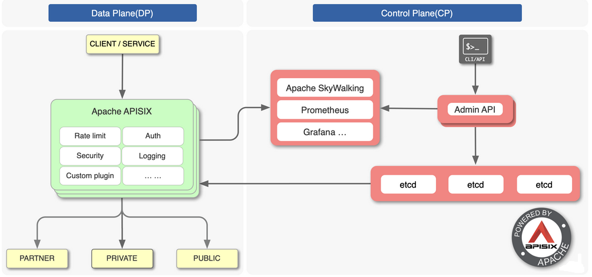
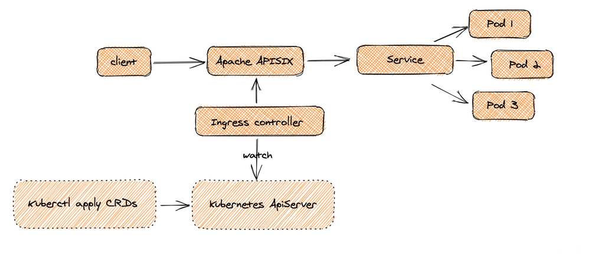

# APISIX介绍

## 一、APISIX

>Apache APISIX是一个基于 `OpenResty` 和 Etcd 实现的动态、实时、高性能、可扩展的微服务 API 网关，目前已经是 Apache 顶级项目。提供了丰富的流量管理功能，如负载均衡、动态路由、动态 upstream、A/B 测试、金丝雀发布、限速、熔断、防御恶意攻击、认证、监控指标、服务可观测性、服务治理等。可以使用 APISIX 来处理传统的南北流量以及服务之间的东西向流量。

>APISIX 基于 Nginx 和 etcd，与传统 API 网关相比，APISIX 具有动态路由和热加载插件功能，避免了配置之后的 reload 操作，同时 APISIX 支持 HTTP(S)、HTTP2、Dubbo、QUIC、MQTT、TCP/UDP 等更多的协议。而且还内置了 Dashboard，提供强大而灵活的界面。同样也提供了丰富的插件支持功能，而且还可以让用户自定义插件。

### 1、架构图

>上图是 APISIX 的架构图，整体上分成数据面和控制面两个部分，控制面用来管理路由，主要通过 etcd 来实现[配置中心](https://cloud.tencent.com/product/tse?from_column=20065&from=20065)，数据面用来处理客户端请求，通过 APISIX 自身来实现，会不断去 watch etcd 中的 route、upstream 等数据。

## 二、APISIX ingress

>同样作为一个 API 网关，APISIX 也支持作为 Kubernetes 的一个 Ingress 控制器进行使用。APISIX Ingress 在架构上分成了两部分，一部分是 APISIX Ingress Controller，作为控制面它将完成配置管理与分发。另一部分 APISIX(代理) 负责承载业务流量。

>当 Client 发起请求，到达 Apache APISIX 后，会直接把相应的业务流量传输到后端（如 Service  Pod），从而完成转发过程。此过程不需要经过 Ingress  Controller，这样做可以保证一旦有问题出现，或者是进行变更、扩缩容或者迁移处理等，都不会影响到用户和业务流量。

>同时在配置端，用户通过 `kubectl apply` 创建资源，可将自定义 CRD 配置应用到 K8s 集群，Ingress Controller 会持续 watch 这些资源变更，来将相应配置应用到 Apache APISIX（通过 admin api）。

>从上图可以看出 APISIX Ingress 采用了数据面与控制面的分离架构，所以用户可以选择将数据面部署在 K8s 集群内部或外部。但  Ingress Nginx 是将控制面和数据面放在了同一个 Pod 中，如果 Pod 或控制面出现一点闪失，整个 Pod  就会挂掉，进而影响到业务流量。这种架构分离，给用户提供了比较方便的部署选择，同时在业务架构调整场景下，也方便进行相关数据的迁移与使用。

## 三、核心特性

>- 全动态，支持高级路由匹配规则，可与 Apache APISIX 官方 50 多个插件 & 客户自定义插件进行扩展使用
>- 支持 CRD，更容易理解声明式配置
>- 兼容原生 Ingress 资源对象
>- 支持流量切分
>- 服务自动注册发现，无惧扩缩容
>- 更灵活的负载均衡策略，自带健康检查功能
>- 支持 gRPC plaintext 与 TCP 4 层代理

## 四、对比

>**Ingress-NGINX** 是由Kubernetes社区实现的Ingress控制器，被广泛使用。它基于nginx，并且主要通过Annotations和ConfigMap进行配置。

>**APISIX Ingress** 控制器则采用了Apache APISIX作为其数据平面，这是一个在ASF（Apache软件基金会）下进行的开源项目

### 1、特性比较

>- **协议支持**：APISIX Ingress和Ingress-Nginx 支持很多多的协议，包括HTTP/HTTPS、HTTP2、gRPC、WebSockets、Proxy Protocol以及QUIC/HTTP3；但ApiSix 额外支持TCP和UDP。
>- **客户端**：APISIX Ingress提供了更丰富的客户端功能，如Rate limiting (L7)、WAF、Timeouts、Safe-list/Block-list等。
>- **流量路由**：两者都支持基于Host、Path、Headers、Querystring和Method的路由，但APISIX Ingress还额外支持基于ClientIP的路由。
>- **上游探针/弹性**：APISIX Ingress提供了健康检查和断路器功能，而Ingress-NGINX则不支持。
>- **负载均衡策略**：两者都支持Round robin和Sticky sessions，但APISIX Ingress还支持Least connections、Ring hash和自定义负载均衡策略。
>- **认证**：APISIX Ingress支持更多的认证方式，如OAuth、OpenID、JWT、LDAP和HMAC。
>- **可观测性**：两者都支持Logging和Metrics，但APISIX Ingress还支持Tracing。
>- **Kubernetes集成**：APISIX Ingress支持Kubernetes CRD和Gateway API，而Ingress-NGINX则不支持。
>- **流量整形**：APISIX Ingress支持Canary、Session Affinity和Traffic Mirroring。
>- **其他**：APISIX Ingress支持热重载（Hot reloading）和Service Discovery。

### 2、差异点

>- **服务发现**：APISIX Ingress支持多种服务发现机制，如Kubernetes、DNS、nacos、eureka和consul_kv，而Ingress-NGINX不支持。
>- **协议支持**：APISIX Ingress不仅支持HTTP/HTTPS协议，还支持TLS加密TCP流量，以及MQTT、Dubbo和kafka代理。
>- **上游探针/弹性**：APISIX Ingress提供了主动和被动健康检查，以及断路器功能，以确保请求被定向到健康的节点。
>- **支持更多插件和认证方法**：APISIX Ingress内置支持80+插件，覆盖了大多数使用场景，而Ingress-NGINX主要通过Annotations和ConfigMap进行配置，插件支持相对有限。
>- **扩展性**：APISIX Ingress提供了多种扩展方法，包括通过Lua开发插件、通过plugin-runner使用JAVA/Python/Go等语言开发插件，以及通过WASM开发插件。

### 3、Ingress NGINX的痛点：不支持热重载

>Ingress-NGINX基于NGINX配置文件实现，添加或修改规则时需要重新加载配置，这会导致负载操作耗时增加，并可能影响在线流量。

### 4、Gateway API

>Kubernetes Gateway  API是一个比Ingress更功能丰富的标准，设计用于通过由多个供应商实现的、具有广泛行业支持的角色导向接口来演进Kubernetes服务网络。APISIX Ingress已经支持了Gateway API的大部分功能，而Ingress-NGINX尚未计划支持Gateway API。

### 5、总结

>通过对比，我们可以得出结论，虽然Ingress-NGINX以其简单易用而受到欢迎，但在微服务架构中，APISIX Ingress在支持服务治理和服务发现方面展现出更多优势，提供了健康检查和断路器等功能。APISIX  Ingress解决了NGINX的热重载问题，并提供了更好的可扩展性和功能。例如，支持Gateway  API和CRD，丰富了Ingress控制器在项目开发方面的能力。
>
>简而言之，如果您需要一个功能更丰富、可扩展性更好的Ingress控制器，强烈推荐APISIX Ingress。如果您是Ingress控制器的新手，且没有太多功能需求，Ingress-NGINX也是一个不错的选择。