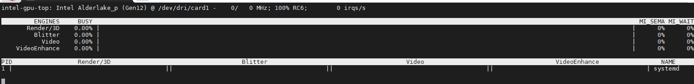

# K8s-Intel_iGPU调度

## 一、背景

有一台1235u软路由，核显不能浪费

系统：Ubuntu

计划使用k8s进行服务部署，并且可以调度GPU

## 二、使用

### 1、确认节点具备 Intel 核显支持

>首先，确保你的节点具有 Intel 核显支持，并且内核驱动程序已经正确加载。你可以使用以下命令检查：

```bash
root@k8s-192-168-6-101:~# lspci -k | grep -A 3 VGA
00:02.0 VGA compatible controller: Device 1234:1111 (rev 02)
        Subsystem: Red Hat, Inc. Device 1100
        Kernel driver in use: bochs-drm
        Kernel modules: bochs
--
00:10.0 VGA compatible controller: Intel Corporation Alder Lake-UP3 GT2 [Iris Xe Graphics] (rev 0c)
        Kernel driver in use: i915
        Kernel modules: i915, xe
00:12.0 Ethernet controller: Red Hat, Inc. Virtio network device
```

### 2、查看gpu使用状态

```bash
root@k8s-192-168-6-101:~# intel_gpu_top
```



### 3、配置设备插件

> Kubernetes 需要设备插件来管理 Intel 核显资源。你可以使用 Intel 提供的 GPU 设备插件。部署过程如下：

>下载并配置 [Intel GPU device plugin](https://github.com/intel/intel-device-plugins-for-kubernetes)。

>使用 `kubectl apply` 部署该插件：

```bash
kubectl apply -f https://raw.githubusercontent.com/intel/intel-device-plugins-for-kubernetes/main/deployments/gpu_plugin/base/intel-gpu-plugin.yaml
```

### 4、标记节点

>你可以通过标签标记拥有 Intel 核显的节点，以便更好地调度工作负载。假设你有一个名为 `node1` 的节点：

```bash
kubectl label nodes node1 intel-gpu=enabled
```

### 5、调度工作负载

>在工作负载的 `Pod` 或 `Deployment` 中，你需要为调度加上对 Intel 核显资源的请求。以下是一个示例：
>
>`gpu.intel.com/i915: 1` 表示请求使用 Intel iGPU 资源。
>
>`nodeSelector` 用于确保该 Pod 被调度到带有核显标签的节点上。

```yaml
apiVersion: v1
kind: Pod
metadata:
  name: intel-gpu-pod
spec:
  containers:
  - name: my-gpu-app
    image: my-gpu-app-image
    resources:
      limits:
        gpu.intel.com/i915: 1
  nodeSelector:
    intel-gpu: enabled
```

### 6、验证资源

>可以通过以下命令验证你的节点是否有可用的 GPU 资源：

```bash
kubectl get nodes -o=jsonpath='{.items[*].status.allocatable}'

{"cpu":"6","ephemeral-storage":"94577504100","gpu.intel.com/i915":"1","hugepages-2Mi":"0","memory":"28760648Ki","pods":"1k"}
```

>确保显示 `gpu.intel.com/i915` 资源。

