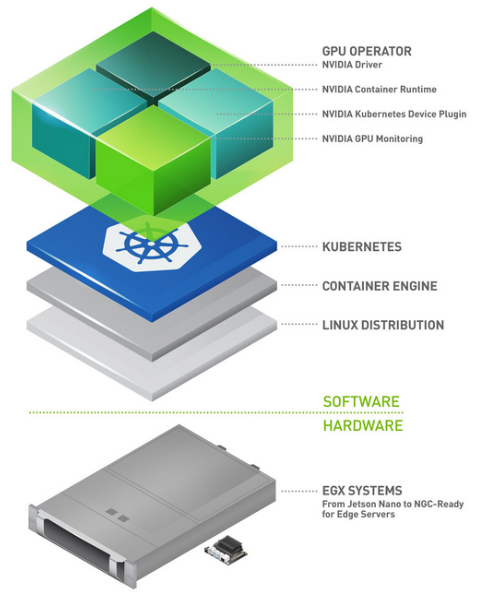
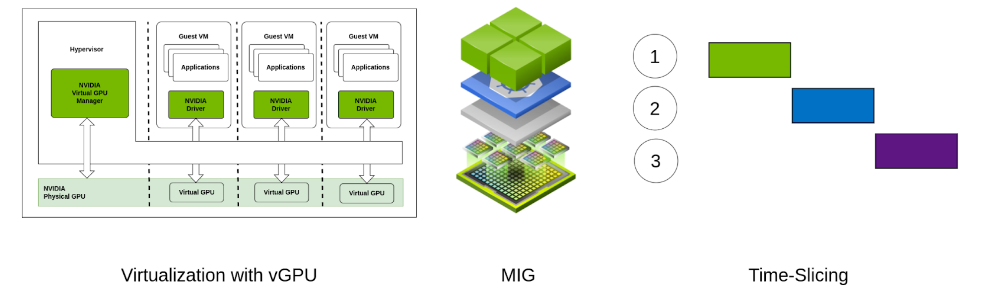
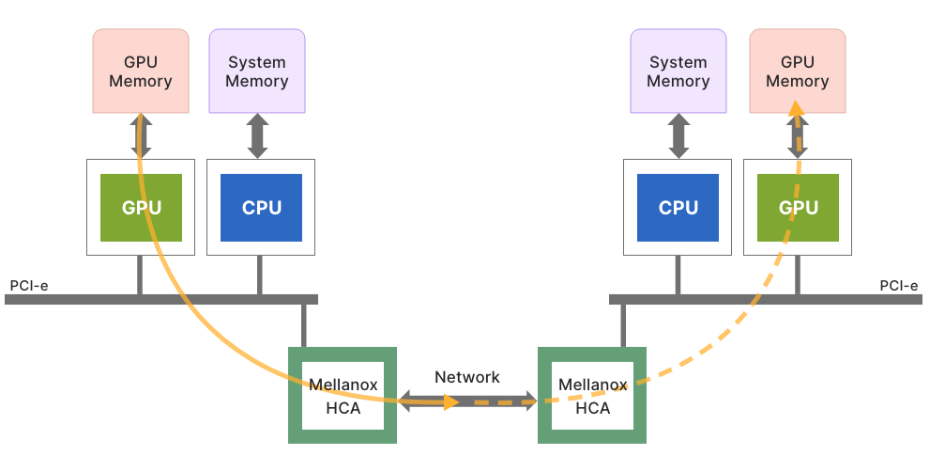
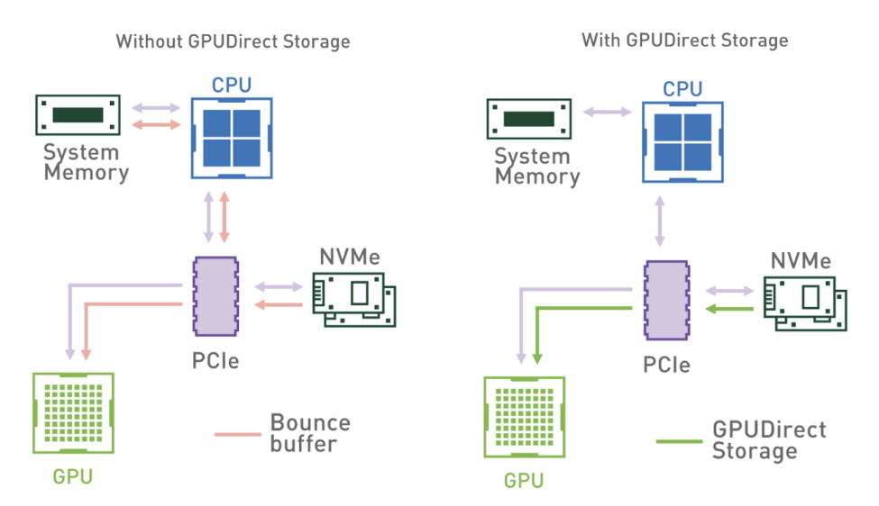
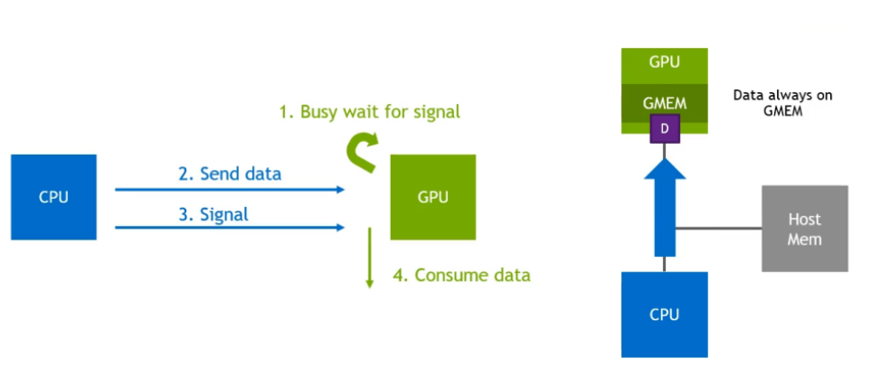
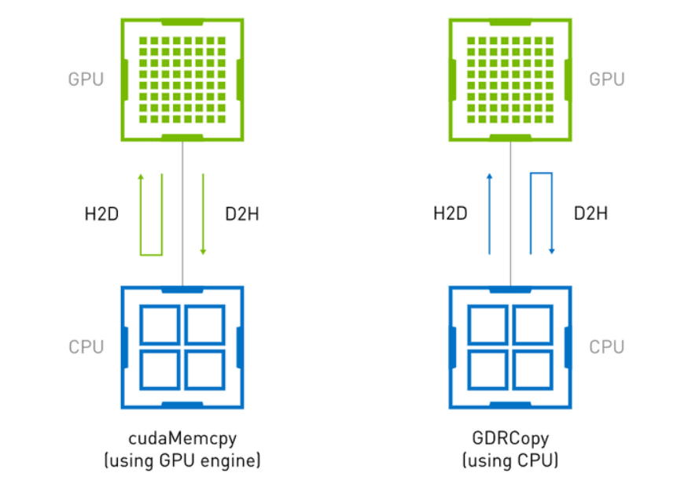
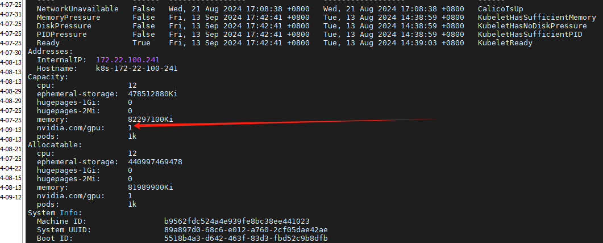

# K8s-NVDIA_GPU调度

## 一、背景

>随着人工智能和机器学习工作负载变得越来越复杂和庞大，我们对于强大且高效的计算资源的需求也日益增长。在 Kubernetes 上运行这些工作负载可以让我们享受到其强大的可扩展性和自动修复功能。但管理 GPU 资源并非易事，这就需要一些特别的工具和技巧。NVIDIA GPU Operator 正是这样一种工具，它可以帮助我们在 Kubernetes 中轻松地部署、管理和优化 GPU。

>有一些 GPU OPERATOR，例如英特尔设备插件OPERATOR，AMD GPU OPERATOR和NVIDIA GPU OPERATOR。但是，NVIDIA GPU OPERATOR 是最受欢迎的OPERATOR之一。它提供了一个全面的解决方案，可以简化 Kubernetes 环境中 GPU 的部署、管理和优化。

## 二、什么是 NVIDIA GPU Operator？

>在 Kubernetes 集群中管理 GPU 可能是一项艰巨的任务。传统方法通常需要手动安装和配置 GPU 驱动程序，这既费时又容易出错。此外，利用高级 GPU 功能并确保 GPU 与其他系统组件之间高效的数据传输需要专门的知识和工具。如果没有简化的方法，这些挑战会阻碍 AI/ML 工作负载的性能和可扩展性。

>NVIDIA GPU OPERATOR提供了多种功能。它使在 Kubernetes 上设置 GPU 驱动程序及其配置变得轻而易举。当需要在给定节点上运行多个 AI 工作负载时，使用 vGPU、多实例 GPU (MIG) 和 GPU 时间切片等高级功能的能力至关重要。此外，GPU 需要与其他应用程序/GPU 以及存储设置进行快速通信。GPUDirect RDMA、GPU Direct 存储和GDR Copy在实现这一点方面发挥着重要作用。GPU OPERATOR有助于轻松地将所有这些功能以及更多功能引入您的 Kubernetes 集群。



## 三、NVIDIA GPU Operator 的核心功能

>自动化安装和维护 GPU 驱动程序：NVIDIA GPU Operator 通过自动化安装和维护 GPU 驱动程序，消除了人工干预的需要。这种自动化确保驱动程序始终保持最新状态并得到正确配置，从而确保 AI/ML 工作负载能够顺畅高效地运行。

### 1、配置高级 GPU 功能：

>- vGPU（虚拟 GPU）：允许多个虚拟机共享单个 GPU，充分利用资源并提高灵活性。
>- MIG（多实例 GPU）：将单个 GPU 划分为多个独立实例，每个实例拥有自己的专用资源，提高工作负载隔离度和效率。
>- 
>  GPU 时间切片：将 GPU 时间分配给多个任务，确保不同工作负载间公平高效地分配 GPU 资源。

### 2、配置 GPUDirect RDMA 和 GPUDirect Storage：

>GPUDirect RDMA（远程直接内存访问）：促进不同节点间 GPU 的直接通信，绕过 CPU，减少延迟，对高性能计算应用至关重要。

>GPUDirect Storage：实现 GPU 与存储设备间的直接数据传输，大幅提高数据访问和处理速度，对数据密集型应用尤为重要。

### 3、配置 GDR Copy

>基于 GPUDirect RDMA 技术的 GDR Copy 是一种低延迟 GPU 内存复制库，允许 CPU 直接映射并访问 GPU 内存。它提高了内存复制操作的效率，减少了开销，从而提升整体性能。

### 4、沙盒化工作负载

>支持在虚拟机或容器中运行应用程序，这些容器或虚拟机受到安全限制。这有助于增强安全性、更佳的资源管理以及模型复现性。

## 四、NVIDIA Device Plugin

### 1、介绍

>**NVIDIA Device Plugin** 是一个轻量级的插件，专注于将 GPU 作为资源暴露给 Kubernetes，使 Kubernetes 可以调度和管理 GPU。它的功能较为单一，主要负责：

>**暴露 GPU 资源：** 通过该插件，Kubernetes 可以发现并调度节点上的 GPU 资源。
>
>**简单的 GPU 管理：** 只提供基本的 GPU 资源调度功能，确保 Kubernetes 能够正确识别和调度 GPU。
>
>**安装简单：** 不涉及 GPU 驱动安装、运行时配置等高级功能，用户需要自己管理驱动和相关工具的安装。

### 2、使用场景

>- 只需要 Kubernetes 集群能识别并调度 GPU 资源，不需要复杂的 GPU 管理功能。
>- 已经在手动管理 GPU 驱动和运行时工具。

### 3、区别

| 特性          | NVDIA GPU Operator                            | NVDIA Device Plugin                   |
| ------------- | --------------------------------------------- | ------------------------------------- |
| 功能范围      | 全面管理 GPU 生态系统，包含驱动、工具和监控等 | 只暴露 GPU 资源供 Kubernetes 使用     |
| 驱动管理      | 自动安装、更新和管理 GPU 驱动                 | 不管理驱动，需用户手动安装            |
| NVIDIA 工具链 | 安装和配置 `nvidia-container-runtime` 等工具  | 不涉及工具链管理                      |
| 监控支持      | 提供 GPU 使用的监控和日志功能                 | 不支持监控                            |
| 安装复杂度    | 相对复杂，安装更多组件                        | 轻量级，安装简单                      |
| 适用场景      | 需要完整 GPU 管理、驱动自动化和监控的集群     | 只需要基础的 GPU 资源调度和管理的集群 |


## 五、核心功能详细解释

### 1、GPU 的并发处理能力

>GPU 的并发处理能力指的是 GPU 利用其并行处理能力同时执行多个操作的能力。这一特性对于提升 AI/ML 工作负载的性能、效率和扩展性至关重要。通过并行处理，GPU 能够显著加快训练和推理速度，管理更大规模和更复杂的数据集，并提供实时响应。

>vGPU、多实例 GPU（MIG）和 GPU 时间切片是实现 GPU 在不同场景和机制中并发的关键技术。下面简要介绍每一种技术。
>
>- vGPU：vGPU 允许多个虚拟机（VMs）共享单个物理 GPU，每个虚拟机都拥有其专用的 GPU 资源。
>- MIG：MIG 在硬件层面上将单个 GPU 分割成多个隔离的实例，每个实例都有其专用的内存和计算资源。这一特性仅适用于 NVIDIA 的 A100 及后续版本 GPU，如 H100、H200、B100、B200。
>- 
>  GPU 时间切片：GPU 时间切片涉及将 GPU 的处理时间分配给多个任务或用户，允许它们以时间分配的方式共享 GPU，这与 CPU 的并发性工作方式非常相似。



### 2、GPUDirect RDMA 和 GPUDirect Storage

>NVIDIA 的 GPUDirect RDMA（远程直接内存访问）和 GPUDirect Storage（GDS）是专为高性能计算应用程序优化数据传输的高级技术。GPUDirect RDMA 允许不同节点之间的 GPU 直接通信，绕过 CPU 并减少延迟。对于需要快速低延迟通信的应用程序，如分布式 AI 训练和实时数据处理，这一直接数据路径至关重要。通过减少 CPU 的参与，GPUDirect RDMA 显著提高了性能和效率



>类似地，GPUDirect Storage 促进了 GPU 和存储设备之间的直接数据传输，绕过了 CPU 和系统内存。这种直接访问存储设备，如 NVMe SSD，能够加速数据传输速度并减少延迟，这对于处理大量数据的应用程序至关重要。通过优化数据流动，GPUDirect Storage 确保 GPU 能够快速访问和处理大型数据集，从而实现更快的计算和更高的效率。



### 3、GDR Copy



>GDR Copy 指的是基于 GPUDirect RDMA 的低延迟 GPU 内存复制库。这个库的一个主要用途是在 CPU（主机）和 GPU 之间传输数据，特别是在 GPU 等待来自主机的数据和信号以开始处理操作时。GDR Copy 通过利用 GPUDirect RDMA 暴露 GPU 内存的一部分给外部设备（如 NICs、CPU 等），来执行由 CPU 驱动的数据复制操作。这使得 GDR Copy 能够以较低的延迟和更高的吞吐量执行 CPU 和 GPU 内存之间的复制操作，与针对小数据量的 GPU 驱动内存复制操作（如 cudaMemcpy）相比。



>图表显示了使用 GDR Copy 与 cudaMemcpy 进行主机-设备内存复制操作时的差异。cudaMemcpy 是 GPU 驱动的操作，它使用 GPU DMA 引擎来移动数据，这在处理小数据量时会带来额外的开销。GDR Copy 允许 CPU 通过 BAR 映射直接访问 GPU 内存，从而实现低延迟的数据传输。

## 六、NVIDIA GPU Operator CRDs

>NVIDIA GPU Operator 使用多个自定义资源定义（CRDs）来管理 Kubernetes 上 GPU 驱动程序及其相关组件的生命周期。以下是一些主要 CRD。

### 1、Cluster Policy CRD

>ClusterPolicy 自定义资源定义（CRD）是 NVIDIA GPU Operator 的核心。它充当部署 Kubernetes 集群中所有必需的 NVIDIA 软件组件的单一点配置。ClusterPolicy CRD 允许管理员指定和管理系统上 GPU 相关组件的整个生命周期，包括驱动程序、运行时、设备插件和监控工具。

>自定义资源允许管理重要属性的配置，例如：
>
>- 驱动程序：NVIDIA 驱动程序的配置，包括镜像、版本和仓库设置。
>- 工具包：NVIDIA 容器工具包的设置，提供运行 GPU 加速容器的工具。
>- devicePlugin：NVIDIA 设备插件的配置，允许 Kubernetes 识别和调度 GPU 资源。
>- mig：支持硬件上 Multi-Instance GPU（MIG）配置的参数。
>- gpuFeatureDiscovery：GPU 功能发现工具的设置，用于检测并标记具有 GPU 能力的节点。
>- dcgmExporter：用于监控 GPU 指标的 NVIDIA 数据中心 GPU 管理器（DCGM）导出器的配置。
>- 
>  validator：确保所有组件正确部署和运行的 GPU Operator Validator 的配置

### 2、NVIDIA 驱动程序 CRD

>NvidiaDriver 自定义资源定义（CRD）专门管理 Kubernetes 节点上的 NVIDIA 驱动程序的部署和生命周期。它确保安装了正确的驱动程序版本，与 GPU 硬件和 Kubernetes 环境兼容。虽然驱动程序配置也可以通过 Cluster Policy CR 控制，但 Driver CR 允许为每个节点指定驱动程序类型和版本。

>以下是一些可管理的配置。
>
>image：指定 NVIDIA 驱动程序的[容器镜像](https://zhida.zhihu.com/search?q=容器镜像&zhida_source=entity&is_preview=1)。这包括仓库、镜像名称和标签。
>repository：包含驱动程序镜像的仓库的 URL 或路径。
>version：要部署的 NVIDIA 驱动程序的具体版本。
>deploy：如何部署驱动程序的配置选项，例如使用 DaemonSets。
>nodeSelector：指定驱动程序应安装在哪些节点上，通常匹配具有 GPU 能力的节点。
>tolerations：节点污点的容忍度，确保驱动程序可以在必要时在受污染的节点上调度。
>resources：驱动程序安装 pod 的资源请求和限制。

## 七、NVIDIA GPU Operator安装

### 1、配源

```bash
helm repo add nvidia https://nvidia.github.io/gpu-operator
helm repo update
```

### 2、创建名称空间

```bash
kubectl create namespace gpu-operator
```

### 3、安装

```bash
helm install --namespace gpu-operator gpu-operator nvidia/gpu-operator
```

### 4、确认安装

```bash
kubectl get pods -n gpu-operatorkubectl get pods -n gpu-operator
NAME                                                         READY   STATUS      RESTARTS   AGE
gpu-feature-discovery-cqql8                                  1/1     Running     0          2m21s
gpu-operator-7c48774d6c-98pms                                1/1     Running     0          21m
gpu-operator-node-feature-discovery-gc-6dd8c5b44f-7tshr      1/1     Running     0          14m
gpu-operator-node-feature-discovery-master-f7b95b446-c79vr   1/1     Running     0          17m
gpu-operator-node-feature-discovery-worker-7knx6             1/1     Running     0          15m
nvidia-container-toolkit-daemonset-gmshm                     1/1     Running     0          2m21s
nvidia-cuda-validator-dxn9r                                  0/1     Completed   0          88s
nvidia-dcgm-exporter-pbsz5                                   1/1     Running     0          2m21s
nvidia-device-plugin-daemonset-wgqvc                         1/1     Running     0          2m21s
nvidia-operator-validator-m6jqm                              1/1     Running     0          2m21s
```

### 5、查看是否找到支持节点

```bash
kubectl describe nodes
```



## 八、部署ollama

### 1、ollama部署

```yaml
apiVersion: apps/v1
kind: Deployment
metadata:
  name: ollama
  namespace: ollama
  labels:
    app: ollama
spec:
  replicas: 1
  selector:
    matchLabels:
      app: ollama
  template:
    metadata:
      labels:
        app: ollama
    spec:
      containers:
      - name: ollama-container
        image: ollama/ollama:0.5.7
        ports:
        - containerPort: 11434
        volumeMounts:
        - name: ollama-data
          mountPath: /root/.ollama
        resources:
          limits:
            nvidia.com/gpu: 1
      volumes:
      - name: ollama-data
        hostPath:
          path: /opt/ai/ollama
          type: Directory
      nodeSelector:
        nvidia.com/gpu.product: NVIDIA-GeForce-GTX-1060
---
apiVersion: v1
kind: Service
metadata:
  name: ollama-service
  namespace: ollama
spec:
  selector:
    app: ollama
  ports:
    - protocol: TCP
      port: 11434
      targetPort: 11434
      nodePort: 11434
  type: NodePort
```

### 2、webui部署

```yaml
apiVersion: apps/v1
kind: Deployment
metadata:
  name: ollama-webui
  namespace: ollama
spec:
  replicas: 1
  selector:
    matchLabels:
      app: ollama-webui
  template:
    metadata:
      labels:
        app: ollama-webui
    spec:
      containers:
      - name: ollama-webui-container
        image: ghcr.io/ollama-webui/ollama-webui:main
        ports:
        - containerPort: 8080
        resources:
          limits:
            memory: "512Mi"
            cpu: "500m"
        volumeMounts:
        - name: ollama-webui-data
          mountPath: /app/backend/data
        # 用于将 host.docker.internal 映射到 Kubernetes 环境
        env:
        - name: HOST_DOCKER_INTERNAL
          valueFrom:
            fieldRef:
              fieldPath: status.hostIP
        - name: OLLAMA_BASE_URL
          value: http://ollama-service:11434
      restartPolicy: Always
      volumes:
        - name: ollama-webui-data
          nfs:
            path: /data/HDD/nfs/app_data/ollama-webui-data
            server: 192.168.6.11
---
apiVersion: v1
kind: Service
metadata:
  name: ollama-webui-service
  namespace: ollama
spec:
  selector:
    app: ollama-webui
  ports:
    - protocol: TCP
      port: 8080
      targetPort: 8080
      nodePort: 8081
  type: NodePort
```
