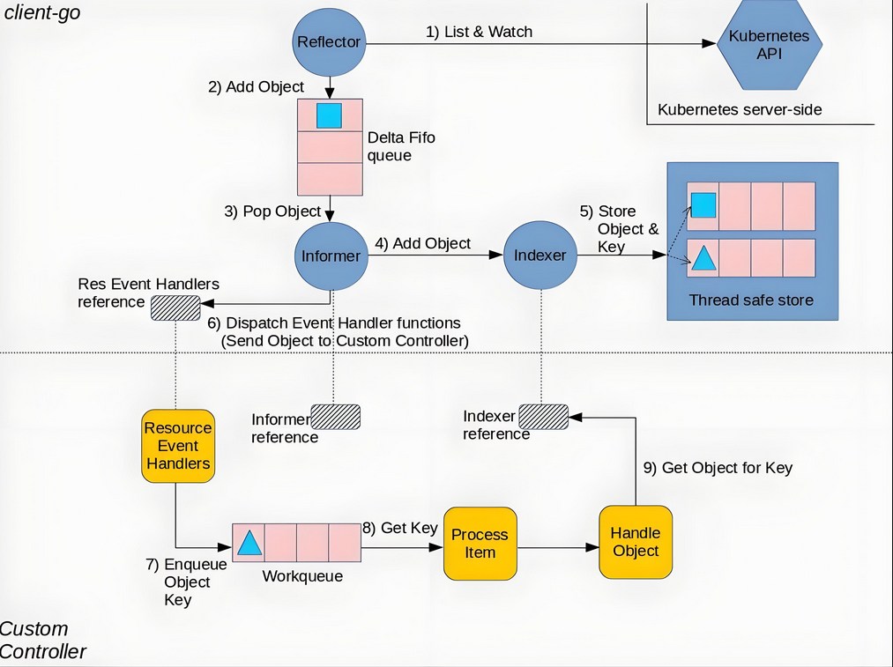
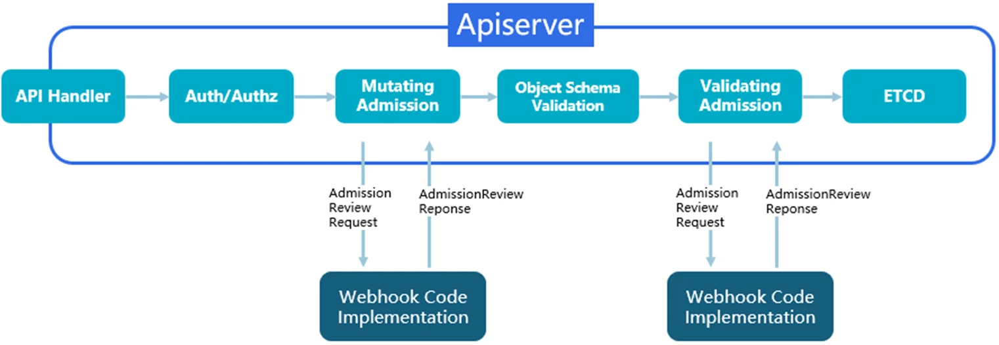

# Operator介绍及

## 一、知识储备

>学k8s主要是学习怎么用k8s，而用k8s就是在用k8s提供各种资源类型,每种资源类背后都有控制器负责管理维护该资源类型

### 1、资源类型和etcd的关系

>资源类型resource type：比如Pod资源类型，相当于一张表
>
>每种资源类型都会对应自己的控制器来负责自动化的管理维护
>
>资源resource：比如一个具体的pod，相当于表中的一条记录
>
>yaml清单仅仅只是用来往etcd数据库插入数据的，至于说要根据数据的规定来做具体的管理维护工作的是躲在背后你看不见的那些控制器代码

## 二、CRD

### 1、是什么？

>CRD（Custom Resource Definition） 是 Kubernetes 提供的核心扩展机制，允许用户自定义 API 资源类型。通过 CRD，开发者可以将业务逻辑抽象为 Kubernetes 原生资源模型，实现与内置资源（如 Pod、Deployment）相同的声明式管理体验。

>CRD全称`Custom Resource Define`是用来自定义新的资源类型的机制。
>
>CRD：自定义一种资源类型，相当于在etcd中定义了一张表（类似数据库表结构）
>
>CR：用于声明yaml文件，kind指定为你上面创建的crd，得到一种自定义的资源，相当于在表中插入了记录
>
>自定义控制器（Controller）：每种资源类型背后都会有控制器来负责维护其状态,监听资源变化并执行业务逻辑（类似数据库触发器）

```yaml
# 示例：定义一个 CronTab 资源
apiVersion: /v1
kind: CustomResourceDefinition
metadata:
  name: 
spec:
  group: 
  versions:
    - name: v1
      served: true
      storage: true
      schema: {...}
  scope: Namespaced
  names:
    plural: crontabs
    singular: crontab
    kind: CronTab
```

#### 1.工作原理

>当创建 CRD 时，Kubernetes API Server 会执行以下操作：
>
>注册资源类型：向 API Server 添加新的 RESTful 端点（如 /apis//v1/crontabs）
>数据持久化：将资源数据存储至 etcd，继承 Kubernetes 的强一致性保障
>事件监听：控制器通过 Watch 机制实时捕获资源变更事件

#### 2.CRD的组成

>apiVersion：定义 CRD 所属的 API 组和版本。
>kind：定义资源类型，这里是 CustomResourceDefinition。
>metadata：包含资源的元数据，如名称。
>spec：定义 CRD 的具体配置，包括 API 组、版本、资源的范围（集群或命名空间）、资源的名称（单数、复数、简写）等。
>schema：定义自定义资源的结构，使用 OpenAPI v3 格式。

### 2、控制器 (Controller)

#### 1.工作原理

>Controller 是 Kubernetes 中的核心组件之一，用于确保集群中的资源状态与用户的期望状态一致。
>
>Controller 通过监听资源对象的变化事件（如创建、更新、删除等），并根据这些事件采取行动来调整实际状态。例如，当用户期望创建一个 MySQL 实例时，Controller 监听到 MySQL CR 的创建事件，并根据该 CR 的 `spec` 定义自动创建相应的 Kubernetes 资源（如 `Deployment`、`Service`）。

#### 2.Controller 的生命周期管理

>Controller 通过一个无限循环的 "控制循环"（Control Loop）来工作，它会不断地获取资源的当前状态，并与期望状态进行对比。如果发现不一致，Controller 会采取相应的操作来修正状态。Controller 的生命周期管理包括以下几个阶段：
>
>>**监听事件**：Controller 通过 Informer 监听自定义资源的增删改等事件。
>>
>>**执行 Reconcile**：每当资源的状态发生变化时，Controller 会调用 `Reconcile` 函数来同步状态。
>>
>>**更新状态**：Controller 操作 Kubernetes 资源（如创建 Pod、删除 Service 等），确保资源状态符合期望，并更新状态信息。

#### 3.核心控制循环解释 (Control Loop)

>控制循环（Control Loop）是 Controller 实现资源管理的核心机制。它的工作原理是：
>
>>**获取资源的实际状态**：通过 Kubernetes API 监听或查询资源的当前状态。
>>
>>**对比期望状态和实际状态**：根据 CR 中定义的 `spec` 与资源的当前状态 (`status`) 进行对比。
>>
>>**采取行动**：如果发现状态不一致，Controller 会采取相应的操作（如创建、删除、更新资源），确保资源的实际状态与用户期望一致。
>>
>>**重复此过程**：控制循环是持续运行的，确保资源状态始终与期望一致。

### 3、为什么？

>内置的资源类型无法满足我的业务需求，那就需要定制自己的新的资源类型

#### 1.核心特点

##### 1）声明式 API 设计

>资源抽象：将运维操作抽象为 YAML 声明（如定义数据库集群规格）
>状态管理：通过 spec（期望状态）与 status（实际状态）实现状态自动协调

##### 2）原生集成优势

>统一操作体验：支持 kubectl get/apply 等标准命令操作自定义资源
>生态兼容性：与 Prometheus、Argo 等工具无缝集成监控和流水线

##### 3）灵活扩展能力

>参数校验：通过 OpenAPI v3 Schema 实现字段类型、枚举值等校验
>多版本支持：支持 v1alpha1/v1beta1/v1 版本演进与自动转换

#### 2.典型应用场景

##### 1）复杂中间件管理

>场景特征：需要维护有状态应用的拓扑关系（如 Redis 集群、Kafka 节点）
>实现方式：通过 Operator 模式实现自愈、备份等高级运维能力
>案例：Etcd Operator 自动处理节点故障恢复

##### 2）领域特定抽象

>AI/ML 任务：定义训练任务的资源需求、GPU 调度策略
>CI/CD 流水线：将构建流水线抽象为自定义资源，实现 GitOps 自动化

##### 3）跨环境配置管理

>多云配置：通过 CRD 统一定义不同云平台的网络策略
>边缘计算：在 KubeEdge 中管理边缘设备的配置下发

##### 4）运维自动化

>自定义 HPA：实现基于业务指标的弹性伸缩（如队列积压数量）
>审批流程：将运维审批流程建模为 CRD 状态机

### 


### 4、如何使用CRD？

>声明一个关于CRD的yaml清单,就可以得到一个新的resource type---（CRD机制）
>
>为资源类型开发专门的控制器逻辑,自定义控制器（比如：client-go框架）

## 三、自定义控制器的开发框架了解

>Client-Go 是最底层的库，提供了对Kubernetes API的原生支持，适合需要高度自定义控制器的开发者。
>Controller-Runtime在 Client-Go 之上提供了更高层次的抽象，简化了控制器的开发过程，适合大多数控制器开发需求。
>Kubebuilder 是最高层次的框架，基于 Controller-Runtime，提供了完整的控制器开发工具链，非常适合快速开发和部署 Kubernetes 控制器和操作器。

### 1、client-go底层原理



#### 1.上半部分

>上半部分：就是client-go组件的informer机制（总结一句话总结所谓的 Informer，就是一个自带缓存和索引机制，可以触发 事件Handler 的客户端库）
>
>Client-Go 的 Informer 机制是 Kubernetes 控制器中常用的模式，用于高效地监听和缓存集群中资源的变化。其工作流程如下：
>
>>**监听**：当 Reflector 基于list&watch接收到资源变更的事件，会获取到变更的对象并在函数 `watchHandler` 中放到 `Delta Fifo` 队列。
>>
>>**缓存与触发**：**Informor**：是流程中最重要的节点，是整个流程的桥梁，它负责两件事:
>>
>>>  - （1）从Delta FIFO 中 pop 出对象并更新到 Indexer 的 cache 中并做好索引；以减少对 API Server 的直接访问，提高性能。
>>>  - （2）调用你自定义 的Controller也就是上图的步骤6）的操作，传递刚刚收到的时间对象的key，只传key即可，控制器会依据key去拿数据。
>>>  - **事件处理**：控制器从队列中取出事件并进行相应的处理。也就是进入了下半部分的流程

#### 2.下半部分

> 就是实现controller的思路，如果自己写controller就要去实现下半部分:
>
> >  步骤7）就是将对象的key放到了workqueue工作队列中
> >
> >  步骤8）就是不断的从工作队列读取key
> >
> >  步骤9）就是根据key从indexer中取对象，然后做处理。

#### 3.总结

>client-go框架的核心组成：
>
>>Reflector：基于list-watch机制与apiserver打交道
>>
>>DeltaFIFO：队列
>>
>>Informer：承上启下的作用，
>>	对上会从DeltaFIFO队列中取出数据，然后调用Indexer来对数据做好索引与缓存
>>	对下会调用你自定义的控制器逻辑来说处理数据
>>
>>Indexer ：制作索引与缓存
>
>总结：Informer 机制不仅仅是client-go 重要的组成部分，而且可以说基本上 Kubernetes 自定义组件都离不开 Informer，Kubernetes 之所以设计Informer这样一个结构，核心需求是为了减少 Kubernetes API Server 和 ETCD 的压力，增强整个集群的稳定性。

### 2、Informer

#### 1.原理

>在 Kubernetes 中，**Informer** 是一个核心组件，它负责监听 Kubernetes API 资源的变化事件（如增、删、改等），并将这些事件通知给相应的 Controller。Informer 是基于 **缓存（Cache）** 的机制，通过减少直接与 API Server 的交互来提升系统的性能和效率。
>
>Informer 依赖本地缓存来加速数据访问。每当 API Server 中的资源发生变化时，Informer 会将变化事件存储在本地缓存中，并通过事件处理机制通知 Controller。缓存的机制允许 Controller 可以快速访问已经监听的资源，而无需频繁与 API Server 通信。

#### 2.工作流程

>**List 阶段**：Informer 启动时，通过 `List` 操作获取当前所有资源的完整状态，并将这些资源存储到本地缓存中。
>
>**Watch 阶段**：Informer 通过 `Watch` 机制持续监听资源的变化事件，如资源的 `Add`（增加）、`Update`（更新）和 `Delete`（删除）。
>
>**本地缓存更新**：每当有资源变化时，Informer 会更新本地缓存，并根据不同的事件类型（添加、更新、删除）触发不同的事件处理函数。
>
>**事件通知**：Informer 会将资源变化事件传递给 Controller，Controller 再根据业务逻辑对事件进行处理。

#### 3.核心组件介绍

##### 1）ClientSet

>**ClientSet** 是与 Kubernetes API Server 交互的客户端工具，负责发出请求来获取资源的列表（`List`）并监听资源的变化（`Watch`）。Informer 依赖 ClientSet 来与 API Server 通信。
>
>每种资源类型都有一个对应的 ClientSet，例如 `PodsClient`、`ServicesClient` 等。

##### 2）Indexer

>**Indexer** 是 Kubernetes 缓存中的一种数据结构，用来根据特定的键（如对象的名称或标签）索引和检索资源对象。它可以高效地从缓存中获取指定资源的信息。
>
>Indexer 提供了一种高效的资源查找方式，特别是在需要从大规模资源列表中查找特定对象时。

##### 3）lister

>**Lister** 是一个用于从本地缓存中快速获取资源的工具，通常结合 Indexer 使用。与直接查询 API Server 不同，Lister 可以从缓存中快速读取资源，提升查询效率。
>
>Lister 允许控制器以类似于直接调用 Kubernetes API 的方式访问缓存数据。

### 3、SharedInformer 与 Controller 的配合

#### 1.SharedInformer介绍

>**SharedInformer** 是 Informer 的高级版本，允许多个 Controller 共享同一个资源的缓存数据。由于 Kubernetes 集群中的资源可能会被多个 Controller 监控，如果每个 Controller 都独立与 API Server 交互，这会增加系统的负载。通过 SharedInformer，不同的 Controller 可以共享同一个数据源，避免重复查询，提升效率。

#### 2.SharedInformer 的典型工作流程:

>1. 启动时，SharedInformer 获取资源的列表并缓存。
>2. 监听资源的变化，并更新缓存。
>3. 将变化事件通知给所有订阅该资源的 Controller。

```bash
+-------------------+           +-----------------------+
|   API Server      |           |     Controller        |
|                   |           |                       |
|  (Add/Update/Delete)-----------> (Reconcile function) |
|   (List/Watch)    |           |   Handles resource    |
+-------------------+           +-----------------------+
          ^                              ^
          |                              |
          |    +------------------+      |
          +----+ SharedInformer   +------+
               | (Cache + Event)  |
               +------------------+
```

## 四、Operator

### 1、Operator是什么

>Kubernetes Operator 是一类 Kubernetes 控制器，它能够自动化管理复杂的应用程序和其生命周期，通常被用来管理有状态应用（如数据库、缓存等）。通过扩展 Kubernetes API，Operator 可以将日常操作流程（如安装、升级、扩展、备份等）转换为 Kubernetes 原生对象，从而实现自动化和声明式管理。

>Operator是一种开发模型= 自定义资源(CRD) + 自定义的控制逻辑(controller)

### 2、Operator框架

>Operator框架指的是实现开发模型的具体框架

### 3、为何要用Operator框架

>Operator 通过将 DevOps 团队日常管理应用的运维知识和流程编码化，使复杂的应用程序管理变得简单和自动化。在 Kubernetes 中，Operator 可以持续监控自定义资源，并自动进行相应操作，确保应用程序的状态与用户期望一致。

>基于该框架可以非常方便的去自定义资源(CRD) + 自定义的控制逻辑(controller)
>方便到什么程度呢？
>	例如：
>		1、自定义CRD，你不用去记忆CRD每个字段的含义
>		直接按照框架规定的标准去定义好一些字段即可，框架可以帮你生产CRD.yaml文件
>
>​	        2、控制的实现逻辑，只需要去固定函数中填充代码即可
>
>基于operator框架可以造出自定义的资源类型（简称CRD），以及自定义控制器（简称为operator）

### 4、Operator 与 Controller 的关系

>Operator 实际上是一个高级 Controller，它不仅负责监控和管理 Kubernetes 中的自定义资源 (CR)，还可以执行特定的业务逻辑。Controller 是 Kubernetes 架构中管理资源状态的核心组件，Operator 是对 Controller 的封装和扩展，专门用于复杂应用的生命周期管理。

### 5、开发步骤

>（1）按照框架依赖的环境，下载好框架（就是一个代码文件夹）
>
>（2）去指定文件中按照规定填写好新资源类型应该有的字段，框架会帮你自动生成CRD.yaml
>
>（3）去指定的文件中填写你的控制器业务逻辑
>		伪代码如下：
>			for {
>				desired := getDesiredState()
>				current := getCurrentState()
>				makeChanges(desired, current)
>			}
>
>（4）裸跑控制器不方便管理，通常会容器化之后以pod+deployment的形式跑在k8s中
>
>（5）基于CRD来创建CR（声明yaml清单，指定kind为你新建的资源类型），
>一旦创建，控制器就会从apiserver中watch到该数据或者变更，完成调谐
>
>部署之后，控制器自然会将其管理起来确保其始终处于预期状态


## 五、RBAC (Role-Based Access Control)

### 1、介绍

>RBAC（基于角色的访问控制）是 Kubernetes 中用于管理用户和服务对集群中资源的访问权限的机制。通过 RBAC，集群管理员可以定义哪些用户或服务账户有权访问哪些资源，以及能够执行哪些操作。

### 2、概念

>**Role**：定义一组对资源的访问权限，如对 `Pods` 的读取权限或对 `Deployments` 的修改权限。
>
>**RoleBinding**：将 `Role` 分配给一个或多个用户或服务账户，授权他们执行 `Role` 中定义的操作。
>
>**ClusterRole**：类似于 `Role`，但 `ClusterRole` 可以跨命名空间作用，通常用于管理全局资源或集群级别的访问权限。
>
>**ClusterRoleBinding**：将 `ClusterRole` 绑定到用户或服务账户，使其在整个集群范围内具备相应的权限。

### 3、创建 RBAC 规则与权限控制

>当部署 Kubernetes Operator 时，通常需要为 Operator 定义一系列 RBAC 规则，确保 Operator 能够访问和管理特定资源。为了确保 Operator 拥有必要的权限，必须创建相关的 `Role` 和 `RoleBinding`，或者 `ClusterRole` 和 `ClusterRoleBinding`。

>创建一个简单的 `ClusterRole`，例如允许 Operator 访问和管理 `Deployment` 资源：

```yaml
apiVersion: rbac.authorization.k8s.io/v1
kind: ClusterRole
metadata:
  name: operator-role
rules:
  - apiGroups: [""]
    resources: ["pods", "services"]
    verbs: ["get", "list", "watch", "create", "update", "patch", "delete"]
  - apiGroups: ["apps"]
    resources: ["deployments"]
    verbs: ["get", "list", "watch", "create", "update", "patch", "delete"]
```

>然后，创建 `ClusterRoleBinding`，将该 `ClusterRole` 绑定到 Operator 的 `ServiceAccount`：

```yaml
apiVersion: rbac.authorization.k8s.io/v1
kind: ClusterRoleBinding
metadata:
  name: operator-role-binding
subjects:
  - kind: ServiceAccount
    name: operator-sa
    namespace: default
roleRef:
  kind: ClusterRole
  name: operator-role
  apiGroup: rbac.authorization.k8s.io
```

### 4、Operator 中的 RBAC 规则应用

>Operator 作为 Kubernetes 控制器的一部分，需要管理集群中的各种资源。因此，正确配置 RBAC 对 Operator 的安全性和功能至关重要。如果 Operator 需要管理多种资源（如 CRD、Deployment、Service 等），则需要为 Operator 创建适当的 `ClusterRole` 和 `ClusterRoleBinding`，确保它具备足够的权限去执行任务。

>在 Operator 项目中，RBAC 通常通过注解的方式生成。例如，Kubebuilder 会自动根据控制器中的注解生成 RBAC 清单：
>
>```go
>// +kubebuilder:rbac:groups=apps,resources=deployments,verbs=get;list;watch;create;update;patch;delete
>```

>这些注解会在 `make manifests` 或 `make install` 时生成对应的 RBAC 文件，确保 Operator 有足够的权限管理 Kubernetes 资源。

## 六、Admission Webhooks

### 1、介绍

>我们知道k8s在各个方面都具备可扩展性，比如通过cni实现多种网络模型，通过csi实现多种存储引擎，通过cri实现多种容器运行时等等。而AdmissionWebhook就是另外一种可扩展的手段。 除了已编译的Admission插件外，可以开发自己的Admission插件作为扩展，并在运行时配置为webhook。

>AdmissionWebhook是在**对象持久化之前**用于对 Kubernetes API Server 的请求进行拦截处理的钩子代码段，它可以动态的添加到APIServer的工作流程中，无需重新编译Kubernetes-APIServer源码。

>在 Kubernetes apiserver 中包含两个特殊的准入控制器：
>
>- MutatingAdmissionWebhook：可以修改请求对象
>
>  >如果启用了MutatingAdmission，当开始创建一种k8s资源对象的时候，创建请求会发到你所编写的controller中，然后我们就可以做一系列的操作。比如我们的场景中，我们会统一做一些功能性增强，当业务开发创建了新的deployment，我们会执行一些注入的操作，比如敏感信息aksk，或是一些优化的init脚本。
>
>- ValidatingAdmissionWebhook：不能修改请求对象，但可以拒绝本次请求
>
>  >而与此类似，只不过ValidatingAdmissionWebhook 是按照你自定义的逻辑是否允许资源的创建。比如，我们在实际生产k8s集群中，处于稳定性考虑，我们要求创建的deployment 必须设置request和limit。
>
>这两种类型的 admission webhook 之间的区别是非常明显的：validating webhooks  可以拒绝请求，但是它们却不能修改在准入请求中获取的对象，而 mutating webhooks  可以在返回准入响应之前通过创建补丁来修改对象，如果 webhook 拒绝了一个请求，则会向最终用户返回错误。



### 2、为什么

#### 1.mutating webhook应用场景举例

>自动注入sidecar容器
>
>自动配置资源限制
>
>注入配置或者标签

>现在非常火热的的 Service Mesh 应用 istio就是通过 mutating webhooks 来自动将 Envoy这个 sidecar 容器注入到 Pod 中去的：

#### 2.Validating Webhook应用场景举例

>强制标签和注解策略
>
>必须用私有仓库的镜像
>
>安全策略审计：例如不允许使用特权模式

### 3、使用技巧

>1. **确保安全**：使用 HTTPS 保护 Webhook 通信，并验证 Webhook 服务器的 SSL 证书。
>2. **性能优化**：确保 Webhook 服务器能够快速响应，以避免延迟 Kubernetes 资源的创建或更新。
>3. **错误处理**：正确处理错误响应和超时，确保 Kubernetes 系统的稳定性。

### 4、mutating webhook实战案例

>需求：为所有新创建的pod打上标签：environment: production

#### 1.储备知识

>基于flask框架开发一个web程序，对外提供api接口
>
>安装python3解释器
>为解释器环境安装flask代码包: pip3 install flask

```python
from flask import Flask

app = Flask(__name__)  # 创建一个 Flask 应用实例


@app.route('/xxx', methods=['GET'])  # http://192.168.71.2:8888/xxx
def mutate():
    print("run....................")

    return "hello"


@app.route('/yyy', methods=['GET'])  # http://192.168.71.2:8888/xxx
def test():
    print("run22222222222222222....................")

    return "hello2222222222222222222222222"


if __name__ == '__main__':
    app.run(host='0.0.0.0', port=8888, )
```

#### 2.webhook程序准备

> webhook.py

```python
from flask import Flask, request, jsonify  # 导入 Flask 框架、请求处理和 JSON 响应模块
import json
import ssl
import base64

app = Flask(__name__)  # 创建一个 Flask 应用实例


def create_patch(metadata):
    """
    创建 JSON Patch 以添加 'mutate' 注释。
    如果 metadata.annotations 不存在，则首先创建该路径。
    """
    if 'labels' in metadata:
        dic = metadata['labels']
    else:
        dic = {}

    patch = [
        # 添加 'labels' 键，如果不存在
        {'op': 'add', 'path': '/metadata/labels', 'value': dic},
        # 添加 'environment' 标签
        {'op': 'add', 'path': '/metadata/labels/environment', 'value': 'production'}
    ]

    patch_json = json.dumps(patch)
    patch_base64 = base64.b64encode(patch_json.encode('utf-8')).decode('utf-8')
    return patch_base64


@app.route('/mutate', methods=['POST'])  # https://webhook-service.default.svc:443/mutate
def mutate():
    """
    处理 Mutating Webhook 的请求，对 Pod 对象应用 JSON Patch。
    """
    admission_review = request.get_json()  # 从请求中提取 AdmissionReview 对象

    # 验证 AdmissionReview 格式是否正确
    # admission_review['request']['object']
    if 'request' not in admission_review or 'object' not in admission_review['request']:
        return jsonify({
            'kind': 'AdmissionReview',
            'apiVersion': 'admission.k8s.io/v1',
            'response': {
                'allowed': False,  # 如果格式无效，则禁止当前提交过来的资源请求
                'status': {'message': 'Invalid AdmissionReview format'}
            }
        })

    req = admission_review['request']  # 提取请求对象
    print('--->', req)
    # 生成 JSON Patch
    metata = req['object']['metadata']
    patch_json = create_patch(metata)

    # 准备 AdmissionResponse 响应
    admission_response = {
        'kind': 'AdmissionReview',
        'apiVersion': 'admission.k8s.io/v1',
        'response': {
            'uid': req['uid'],
            'allowed': True,
            'patchType': 'JSONPatch',
            'patch': patch_json  # 直接包含 Patch 数据作为 JSON 字符串
        }
    }

    print(admission_response)
    return jsonify(admission_response)


if __name__ == '__main__':
    # 加载 SSL 证书和私钥
    context = ssl.create_default_context(ssl.Purpose.CLIENT_AUTH)
    context.load_cert_chain('/certs/tls.crt', '/certs/tls.key')

    # Run the Flask application with SSL
    app.run(host='0.0.0.0', port=443, ssl_context=context)
```

#### 3.docker镜像制作

>制作镜像（包含webhook.py的运行环境，依赖python3解释器、依赖flask框架）

```dockerfile
# 使用官方 Python 镜像作为基础镜像
FROM python:3.9-slim

# 设置工作目录
WORKDIR /app

# 将当前目录的所有文件复制到容器的 /app 目录
COPY webhook.py .

# 安装 Flask 及其依赖
RUN pip install Flask

# 启动 Flask 应用
CMD ["python", "webhook.py"]
```

```bash
# 然后构建镜像：
docker build -t xiaowu-mute-webhook:v1.0 .

# 打标签上传
docker tag xiaowu-mute-webhook:v1.0 registry.cn-shanghai.aliyuncs.com/xiaowu-k8s-test/xiaowu-mute-webhook:v1.0

docker push registry.cn-shanghai.aliyuncs.com/xiaowu-k8s-test/xiaowu-mute-webhook:v1.0
```

#### 4.配置webhook的Secret

##### 1)生成CA私钥

```bash
openssl genrsa -out ca.key 2048
```

##### 2)生成自签名 CA 证书，有效期为 100 年

```bash
openssl req -x509 -new -nodes -key ca.key -subj "/CN=webhook-service.default.svc" -days 36500 -out ca.crt
```

##### 3)创建证书请求配置文件

```bash
cat > webhook-openssl.cnf << 'EOF'
[req]
default_bits = 2048
prompt = no
default_md = sha256
req_extensions = req_ext
distinguished_name = dn

[ dn ]
C = CN
ST = Shanghai
L = Shanghai
O = xiaowu
OU = xiaowu
CN = webhook-service.default.svc

[ req_ext ]
subjectAltName = @alt_names

[alt_names]
DNS.1 = webhook-service
DNS.2 = webhook-service.default
DNS.3 = webhook-service.default.svc
DNS.4 = webhook-service.default.svc.cluster.local


[req_distinguished_name]
CN = webhook-service.default.svc

[v3_req]
keyUsage = critical, digitalSignature, keyEncipherment
extendedKeyUsage = serverAuth
subjectAltName = @alt_names

[ v3_ext ]
authorityKeyIdentifier=keyid,issuer:always
basicConstraints=CA:FALSE
keyUsage=keyEncipherment,dataEncipherment
extendedKeyUsage=serverAuth,clientAuth
subjectAltName=@alt_names

EOF
```

##### 4)使用webhook-openssl.cnf这个配置文件生成 CSR：

```bash
# 生成 Webhook 服务的私钥
openssl genrsa -out webhook.key 2048

# 使用 OpenSSL 配置文件生成 CSR
openssl req -new -key webhook.key -out webhook.csr -config webhook-openssl.cnf


# 最终得到webhook.crt、webhook.key
```

##### 5)将生成的证书和私钥存储在 Kubernetes Secret 中

```bash
kubectl delete secrets webhook-certs

kubectl create secret tls webhook-certs \
  --cert=webhook.crt \
  --key=webhook.key \
  --namespace=default --dry-run=client -o yaml | kubectl apply -f -
```

#### 5.创建deployment来部署webhook服务

```yaml
apiVersion: apps/v1
kind: Deployment
metadata:
  name: webhook-deployment
  namespace: default
spec:
  replicas: 1
  selector:
    matchLabels:
      app: webhook
  template:
    metadata:
      labels:
        app: webhook
    spec:
      containers:
      - name: webhook
        image: registry.cn-shanghai.aliyuncs.com/xiaowu-k8s-test/xiaowu-mute-webhook:v1.0 # 替换为你的镜像

        volumeMounts:
        - name: webhook-certs
          mountPath: /certs
          readOnly: true
      volumes:
      - name: webhook-certs
        secret:
          secretName: webhook-certs
---
apiVersion: v1
kind: Service
metadata:
  name: webhook-service
  namespace: default
spec:
  ports:
  - port: 443
    targetPort: 443
  selector:
    app: webhook
```

#### 6.基于kind: mutatingwebhookconfiguration 该资源类型创建出一个资源，相当于于一道关卡在该资源中声明把请求转给的目标webhook程序的api地址

##### 1)基于脚本来生成yaml：

```bash
#!/bin/bash

base64 -w 0 ca.crt > ca.crt.base64

# 定义文件路径
ca_base64_file="ca.crt.base64"
yaml_file="m-w-c.yaml"

# 读取 ca.crt.base64 的内容
ca_base64_content=$(cat "$ca_base64_file" | tr -d '\n')

# 生成替换后的 YAML 文件内容
# 将 base64 内容插入到 YAML 文件中
cat <<EOF > "$yaml_file"
apiVersion: admissionregistration.k8s.io/v1
kind: MutatingWebhookConfiguration
metadata:
  name: example-mutating-webhook
webhooks:
  - name: example.webhook.com
    clientConfig:
      service:
        name: webhook-service
        namespace: default
        path: "/mutate"
      # 替换为 cat ca.crt.base64的内容
      caBundle: "$ca_base64_content"
    rules:
      - operations: ["CREATE"]
        apiGroups: [""]
        apiVersions: ["v1"]
        resources: ["pods"]
    admissionReviewVersions: ["v1"]
    sideEffects: None
EOF

echo "YAML 文件已更新。"
```

#### 7.创建pod进行测试

```bash
[root@k8s-master-01 /work]# cat test.yaml 
apiVersion: v1
kind: Pod
metadata:
  name: test-pod
spec:
  containers:
  - name: nginx
    image: nginx:1.18
```

### 5、validate webhook开发示例

#### 1.python脚本准备

>validating-webhook.py

```python
from flask import Flask, request, jsonify
import ssl
import logging

app = Flask(__name__)
logging.basicConfig(level=logging.INFO)

@app.route('', methods=['POST'])
def validate():
    admission_review = request.get_json()

    if 'request' not in admission_review or 'object' not in admission_review['request']:
        return jsonify({
            'kind': 'AdmissionReview',
            'apiVersion': 'admission.k8s.io/v1',
            'response': {
                'allowed': False,
                'status': {'message': 'Invalid AdmissionReview format'}
            }
        })

    req = admission_review['request']

    # 只处理 Pod
    if req['kind']['kind'] == 'Pod':
        pod = req['object']
        labels = pod.get('metadata', {}).get('labels', {})

        # 检查是否有 'environment' 标签
        if 'environment' not in labels:
            return jsonify({
                'kind': 'AdmissionReview',
                'apiVersion': 'admission.k8s.io/v1',
                'response': {
                    'uid': req['uid'],
                    'allowed': False,
                    'status': {
                        'metadata': {},
                        'code': 400,
                        'message': 'Pod must have an "environment" label'
                    }
                }
            })

        return jsonify({
            'kind': 'AdmissionReview',
            'apiVersion': 'admission.k8s.io/v1',
            'response': {
                'uid': req['uid'],
                'allowed': True,
                'status': {
                    'metadata': {},
                    'code': 200
                }
            }
        })

    return jsonify({
        'kind': 'AdmissionReview',
        'apiVersion': 'admission.k8s.io/v1',
        'response': {
            'allowed': True,
            'status': {
                'metadata': {},
                'code': 200
            }
        }
    })

if __name__ == '__main__':
    context = ssl.create_default_context(ssl.Purpose.CLIENT_AUTH)
    context.load_cert_chain('/certs/tls.crt', '/certs/tls.key')
    app.run(host='0.0.0.0', port=443, ssl_context=context)
```

## 七、总结

>下面是请求在 Kubernetes 中从提交到最终转发到 Webhook Pod 的调用流程，使用箭头标注各个步骤：

>1. **用户提交请求**
>
>   - `kubectl apply -f test.yaml` ↓
>
>2. **API Server 接收请求**
>
>   - Kubernetes API Server 解析并检查请求是否匹配 Mutating Webhook 的配置。 ↓
>
>3. **API Server 触发 Mutating Webhook**
>
>   - 如果请求匹配 Webhook 规则，API Server 会中断正常流程，准备将请求发送给 Webhook 服务。 ↓
>
>4. **转换请求为 AdmissionReview**
>
>   - API Server 将原始请求转换为 `AdmissionReview` 格式。 ↓
>
>5. **通过 HTTPS 发送请求**
>
>   - API Server 使用 
>
>     ```
>     clientConfig
>     ```
>
>      中指定的 URL，通过 HTTPS 将 
>
>     ```
>     AdmissionReview
>     ```
>
>      请求发送到 Webhook 服务。
>
>     - 如果使用 Service
>       - 通过 `https://webhook-service.default.svc:443/mutate` 将请求发送到 Webhook 服务的 Cluster IP。 ↓
>
>6. **Webhook Service 接收请求**
>
>   - Kubernetes Service 监听端口（如 443），并将请求路由到 Webhook Pod。 ↓
>
>7. **Webhook Pod 处理请求**
>
>   - Webhook Pod 内的应用（例如 Flask 服务器）接收到 `AdmissionReview` 请求，执行相应的逻辑（如修改、验证）。 ↓
>
>8. **Webhook 返回 AdmissionResponse**
>
>   - Webhook 处理完成后，生成 `AdmissionResponse`，并通过 HTTPS 返回给 API Server。 ↓
>
>9. **API Server 处理 AdmissionResponse**
>
>   - API Server 接收到 Webhook 的响应，继续处理原始请求，根据响应内容决定是否允许操作或进行其他变更。

>通过这个流程，用户提交的请求最终会经过 Webhook 服务的验证或修改，然后再返回到 API Server 进行后续的处理。