# Istio介绍

## 一、微服务架构

### 1、特性

#### 1.围绕业务构建团队

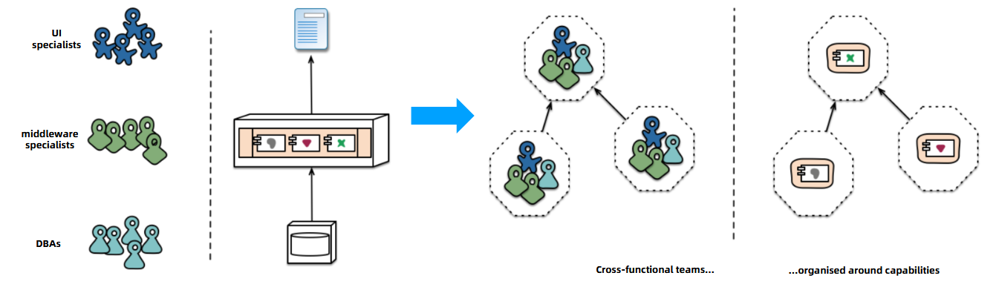

#### 2.去中心化的数据管理

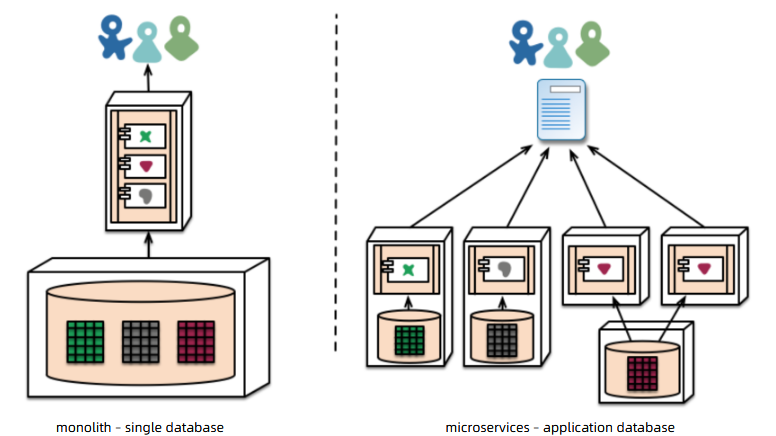

### 2、优势

>团队层面：内聚，独立开发业务，没有依赖
>
>产品层面：服务彼此独立，独立部署，没有依赖

### 3、痛点

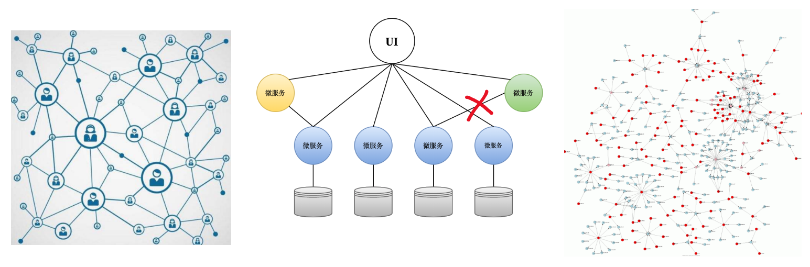

#### 1.服务间网络通信

>分布式计算的 8 个谬论（Fallacies of Distributed Computing Explained）
>
>>网络是可靠的
>>
>>网络延迟是 0
>>
>>带宽是无限的
>>
>>网络是安全的
>>
>>网络拓扑从不改变
>>
>>只有一个管理员
>>
>>传输成本是 0
>>
>>网络是同构的

### 4、如何管理和控制服务间的通信？

>服务注册/发现
>
>路由，流量转移
>
>弹性能力（熔断、超时、重试）
>
>安全
>
>可观测性

## 二、Service Mesh引入

### 1、Service Mesh 的演进过程

#### 1.第一阶段：控制逻辑和业务逻辑耦合

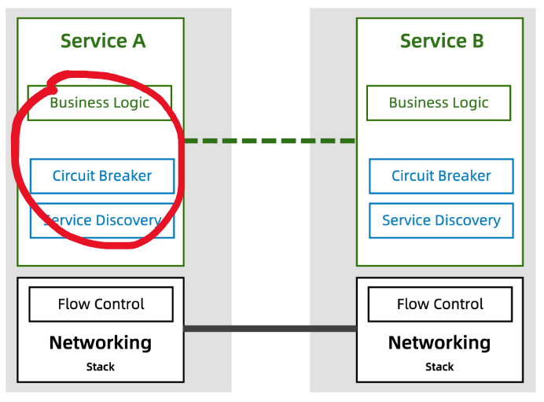

#### 2.第二阶段：公共库

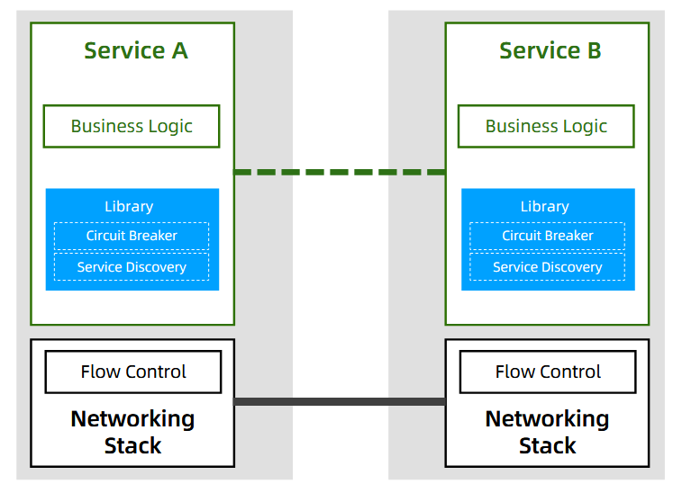

>解耦
>
>消除重复
>
>成本
>
>语言绑定
>
>仍有侵入

#### 3.第三阶段：代理

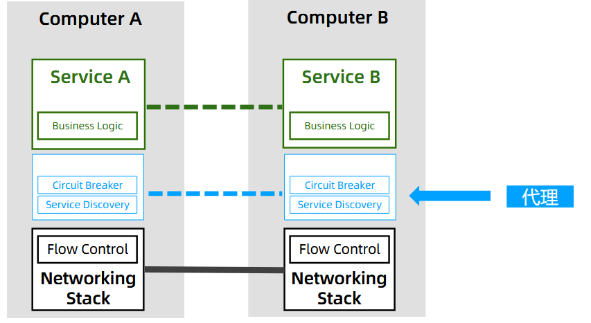

>功能简陋
>
>思路正确

#### 4.第四阶段：边车模式（Sidecar)

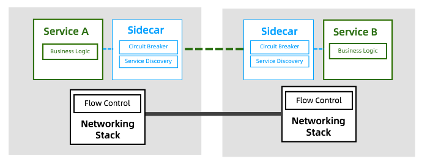

#### 5.第五阶段：Service Mesh 的出现

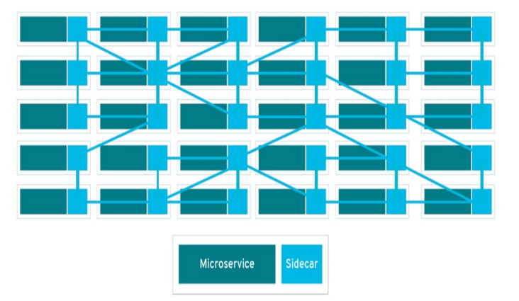

#### 6.总结

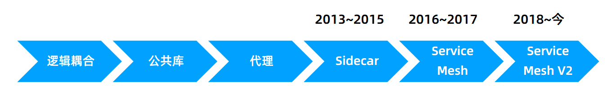

### 2、介绍

>Service Mesh 的中文译为 “服务网格” ，是一个用于处理服务和服务之间通信的基础设施层，它负责为构建复杂的云原生应用传递可靠的网络请求，并为服务通信实现了微服务所需的基本组件功能，例如服务发现、负载均衡、监控、流量管理、访问控制等。在实践中，服务网格通常实现为一组和应用程序部署在一起的轻量级的网络代理，但对应用程序来说是透明的。
>
>下图，绿色方块为应用服务，蓝色方块为 Sidecar Proxy，应用服务之间通过 Sidecar Proxy 进行通信，整个服务通信形成图中的蓝色网络连线，图中所有蓝色部分就形成一个网络，这个就是服务网格名字的由来。 

#### 1.网络拓扑模式

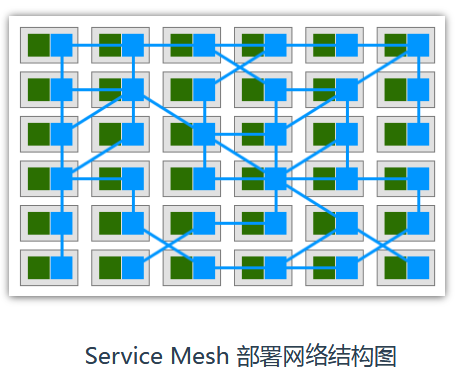

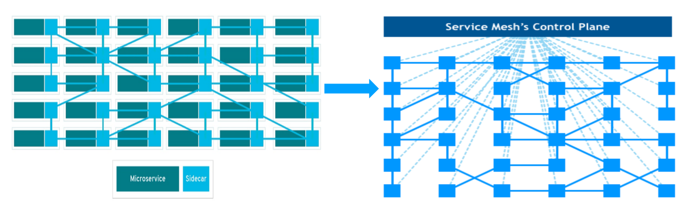

### 3、主要功能

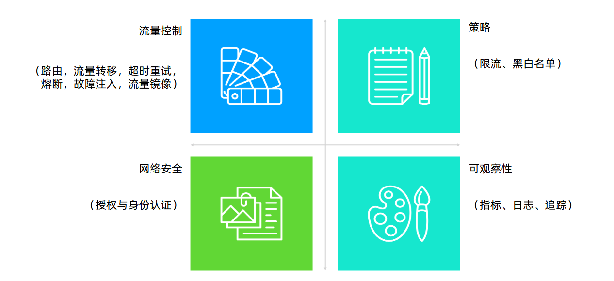

### 4、特点

>Service Mesh有以下特点：
>• 治理能力独立（Sidecar）
>• 应用程序无感知
>• 服务通信的基础设施层
>• 解耦应用程序的重试/超时、监控、追踪和服务发现

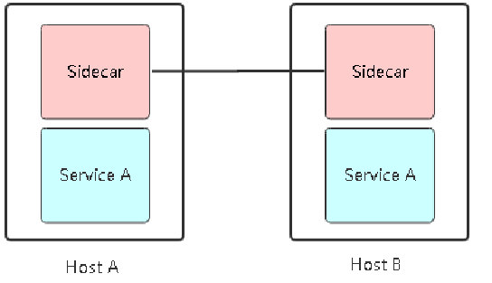

### 5、和k8s的关系

#### 1.Kubernetes

>- 解决容器编排与调度问题
>- 本质上是管理应用生命周期（调度器）
>- 给予 Service Mesh 支持和帮助

#### 2.Service Mesh

>• 解决服务间网络通信问题
>• 本质上是管理服务通信（代理）
>• 是对 Kubernetes 网络功能方面的扩展和延伸

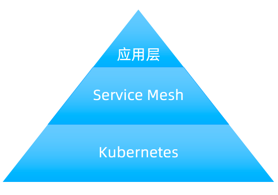

### 6、Service Mesh 和 API 网关的异同点

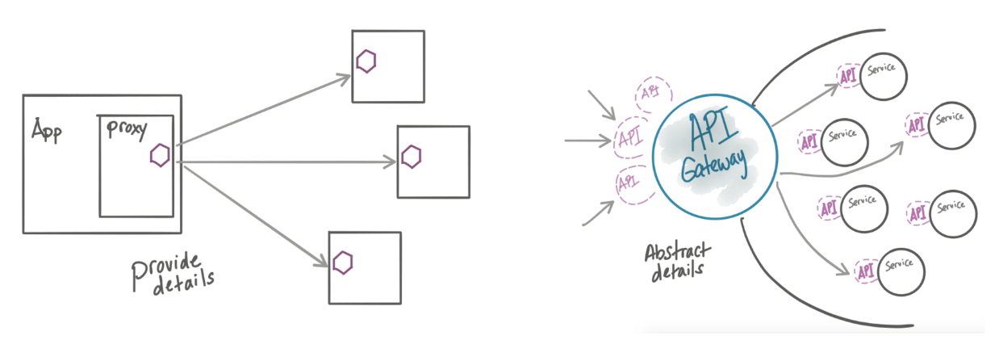

>• 功能有重叠，但角色不同
>• Service Mesh 在应用内，API 网关在应用之上（边界） 

## 三、Service Mesh 产品发展史

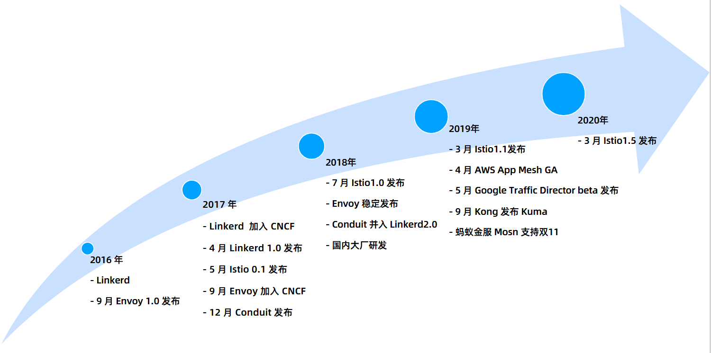

### 1、Linkerd

>第一个 Service Mesh 产品
>
>2016 年底在 GitHub 上发布 0.x
>
>2017 年加入 CNCF，4 月发布 1.0 版本
>
>Conduit – Linkerd2.0：支持 Kubernetes，轻量化
>
>Linkerd 的败局？
>
>>**Istio 背景强大**：由 Google、IBM、Lyft 等支持，一开始就拥有强大的社区和企业背书。
>>
>>**Kubernetes 紧耦合发展**：Istio 早早就与 Kubernetes 深度集成，成为 CNCF 和 Google 云的重点推广对象。
>>
>>**标准影响力**：Istio 推动了如 Envoy 和 Gateway API 等标准，更有可能成为 “事实标准”。
>>
>>**Linkerd 采用 Rust / Go 实现，强调轻量和简洁**，没有使用 Envoy，而是自研 proxy。虽然这让它在资源消耗和性能方面略胜一筹，但在功能扩展和生态兼容性上却受限：
>>
>>>缺少深度自定义能力
>>>
>>>插件机制薄弱
>>>
>>>第三方集成较少

### 2、envoy

>2016 年 9 月发布
>
>定位于 Sidecar 代理
>
>第 3 个从 CNCF 毕业的产品
>
>稳定可靠，性能出众
>
>Istio 的默认数据平面
>
>xDS 协议成为数据平面的事实标准

### 3、Istio

>2017 年 5 月发布 0.1
>
>光环加身：Google，IBM，Lyft 背书
>
>第二代 Service Mesh，增加了控制平面，奠定目前 Service Mesh 的产品形态
>
>收编 Envoy，直接拥有高水准的数据平面
>
>受到社区强烈追捧

### 4、AWS App Mesh

>2018 年 re:Invent 公布
>
>2019 年 4 月 GA 发布
>
>支持自家的多种计算资源的部署

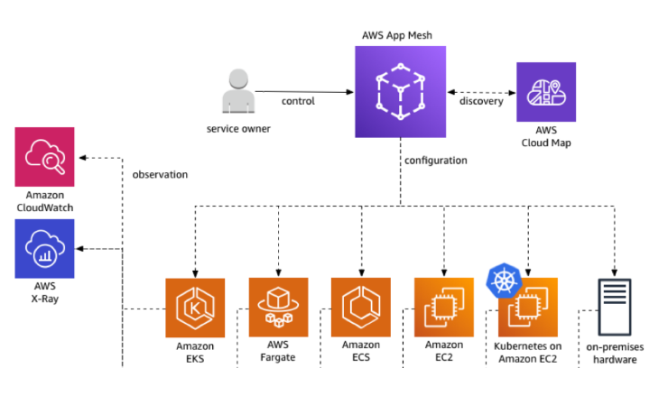

### 5、国内发展情况

>蚂蚁金服：SOFA Mesh，MOSN 数据平面
>
>几大云厂商（腾讯、阿里、百度）
>
>华为、微博
>
>其他

### 6、市场竞争

>云厂商的重视（市场考虑）
>
>重要性： 构建云原生应用的重要一环
>
>硝烟弥漫的云市场

## 四、Istio介绍

>官方定义：它是一个完全开源的服务网格，作为透明的一层接入到现有的分布式应用中。它也是一个平台，可以与任何日志、遥测和策略系统进行集成。Istio 多样化的特性让你能够成功且高效地运行微服务架构，并提供保护、连接和监控微服务的统一方法。
>
>Isito是Service Mesh的产品化落地，是目前最受欢迎的服务网格，功能丰富、成熟度高。

## 五、为什么使用Istio

### 1、为什么 Istio 能 C 位出镜？

>出击及时（2017 年 5 月发布 0.1版本）
>
>三巨头光环加身: Google、IBM、Lyft
>
>第二代 Service Mesh
>
>Envoy 的加入让 Istio 如虎添翼
>
>功能强大
>
>各大平台、厂商的支持
>
>过度营销？

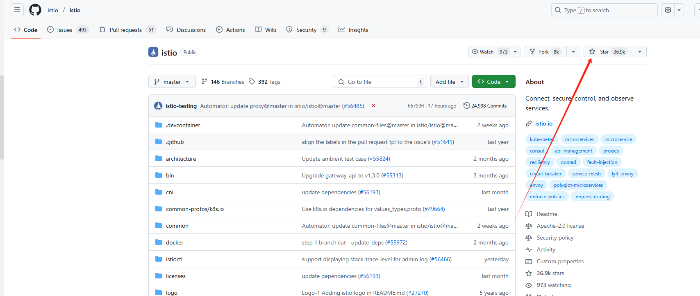

### 2、为什么？

>优势：轻松构建服务网格，应用代码无需更改，功能强大

## 六、核心功能

### 1、连接（Connect）

>- 路由
>- 流量转移
>- 负载均衡（弹性）
>- 灰度发布（测试）

### 2、安全（Secure）

>- 认证
>- 鉴权

### 3、控制（Control）

>- 限流
>- ACL（黑白名单）

### 4、观察（Observe）

>- 监控（指标）
>- 日志
>- 调用链（追踪）

### 2、Kubernetes与Istio结合

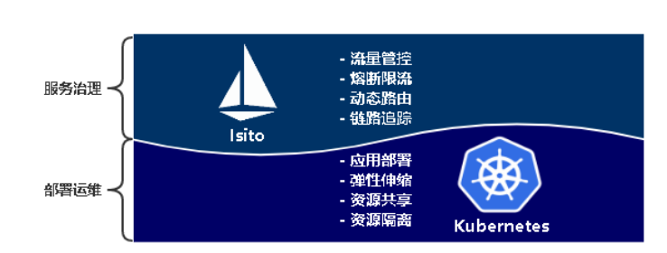

## 七、架构与组件

>Istio服务网格在逻辑上分为数据平面和控制平面。

### 1、控制平面

>使用全新的部署模式：istiod，这个组件负责处理Sidecar注入、证书分发、配置管理等功能，替代 原有组件，降低复杂度，提高易用性。
>
>>Pilot：策略配置组件，为Proxy提供服务发现、智能路由、错误处理等。
>>
>>Citadel：安全组件，提供证书生成下发、加密通信、访问控制。
>>
>>Galley：配置管理、验证、分发。

### 2、数据平面

>由一组Proxy组成，这些Proxy负责所有微服务网络通信，实现高效转发和策略。使用envoy实现，envoy是一个基于C++实现的L4/L7 Proxy转发器，是Istio在数据平面唯一的组件。

## 八、基本概念-核心资源（CRD）

>Istio 有 4 个配置资源，落地所有流量管理需求：
>
>>VirtualService（虚拟服务）：实现服务请求路由规则的功能。
>>
>>DestinationRule（目标规则）：实现目标服务的负载均衡、服务发现、故障处理和故障注入的功能。
>>
>>Gateway（网关）：让服务网格内的服务，可以被全世界看到。
>>
>>ServiceEntry（服务入口） ：允许管理网格外的服务的流量。
>>
>>Sidecar

### 1、虚拟服务（Virtual Service）

>将流量路由到给定目标地址
>
>请求地址与真实的工作负载解耦
>
>包含一组路由规则
>
>通常和目标规则（Destination Rule）成对出现
>
>丰富的路由匹配规则

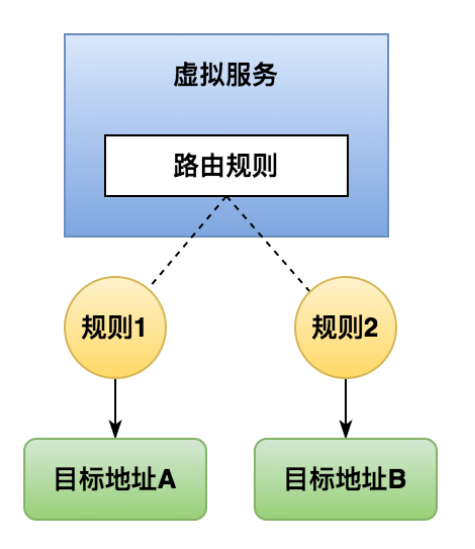

### 2、目标规则（Destination Rule）

>定义虚拟服务路由目标地址的真实地址，即子集（subset）
>
>设置负载均衡的方式
>
>>随机
>>
>>权重
>>
>>最少请求数

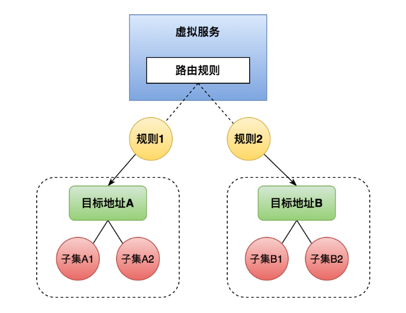

### 3、网关（Gateway）

>管理进出网格的流量
>
>处在网格边界

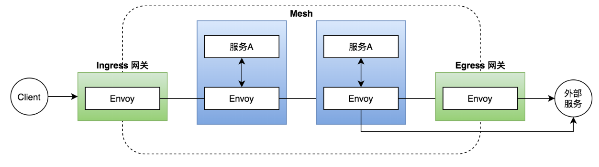

### 4、服务入口（Service Entry）

>把外部服务注册到网格中
>
>功能：
>
>>为外部目标转发请求
>>
>>添加超时重试等策略
>>
>>扩展网格

### 5、Sidecar

>调整 Envoy 代理接管的端口和协议
>
>限制 Envoy 代理可访问的服务

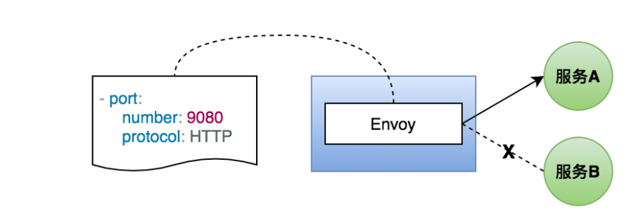

### 6、网络弹性和测试

#### 1.弹性能力

>超时
>
>重试
>
>熔断

#### 2.测试能力

>故障注入
>
>流量镜像

## 九、Istio架构变更版本变化

### 1、架构变更路线

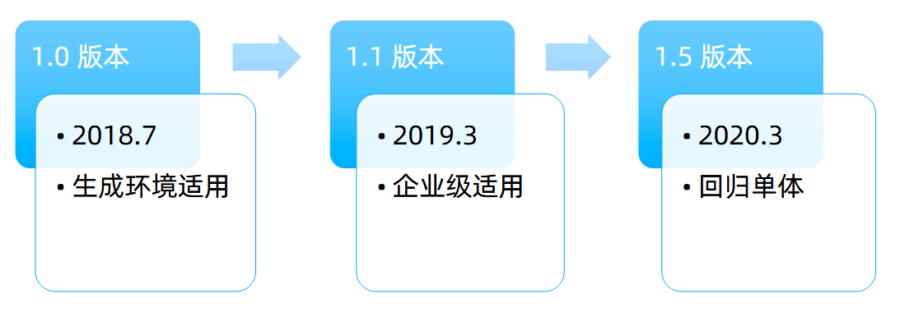

### 2、架构 1.0 版本

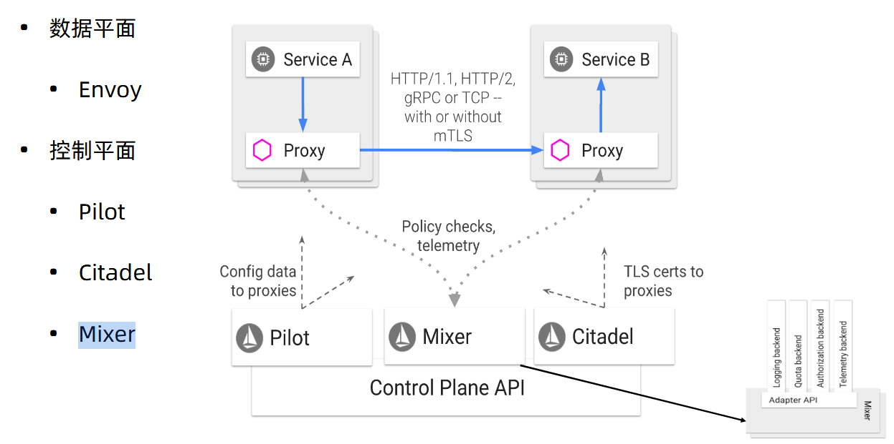

### 3、架构 1.1 版本

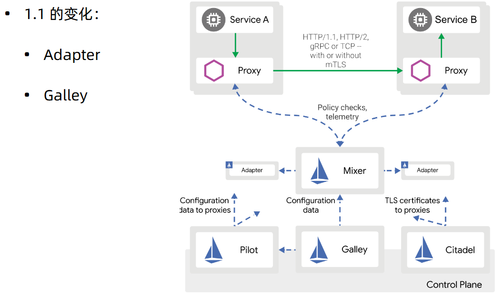

### 4、架构之殇

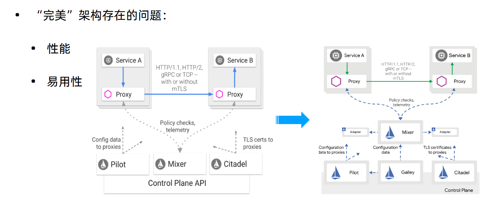

### 5、设计的取舍

### 6、用户至上还是架构至上

### 7、回归单体 - Istio 的自我救赎

>原有架构的复杂性
>
>>维护性
>>
>>多组件分离的必要性？
>>
>>伸缩性
>>
>>安全性
>
>“复杂是万恶之源，学会停止焦虑，爱上单体” —— Istio 开发团队

### 8、架构 1.5 版本

>在Istio1.5版本发生了一个重大变革，彻底推翻原有控制平面的架构，将有原有多个组件整合为单体结构“istiod”，同时废弃了Mixer 组件

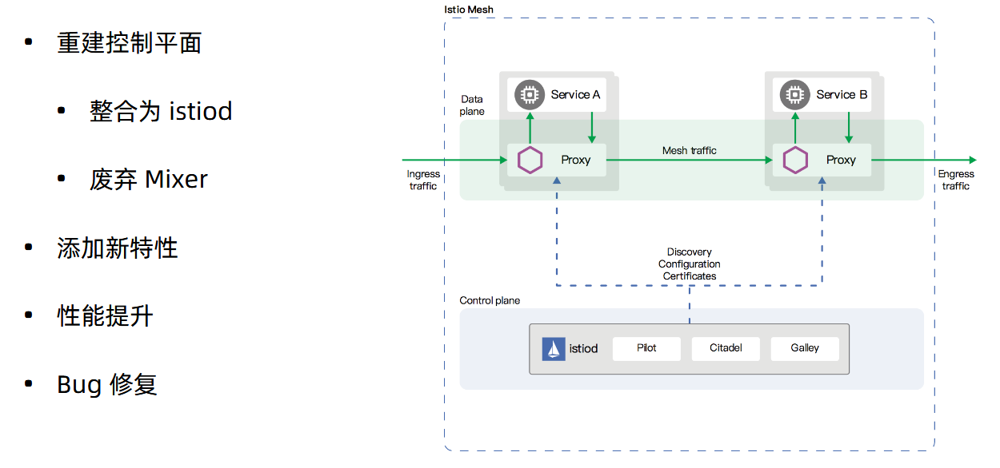

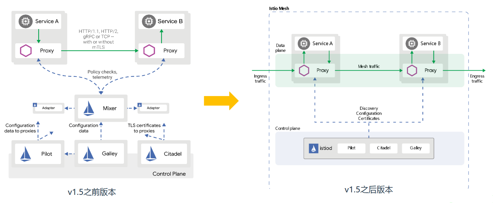

## 十、服务可视化重要性

### 1、什么是可观察性？

>可观察性≠监控
>
>从开发者的角度探究系统的状态
>
>组成：指标、日志、追踪

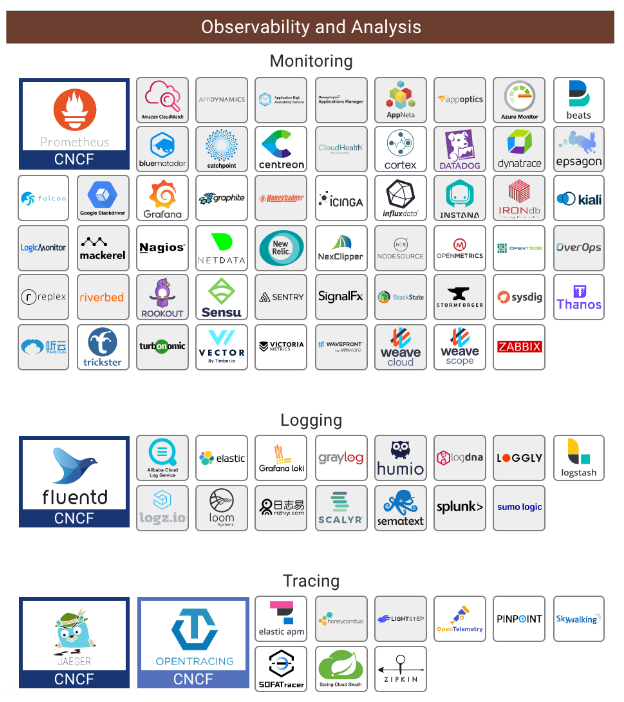

### 2、指标（Metrics）

>以聚合的方式监控和理解系统行为
>
>Istio 中的指标分类：
>
>>代理级别的指标（Proxy-level）
>>
>>服务级别的指标（Service-level）
>>
>>控制平面指标（Control plane）

#### 1.代理级别指标

>收集目标：Sidecar 代理
>
>资源粒度上的网格监控
>
>容许指定收集的代理（针对性的调试）

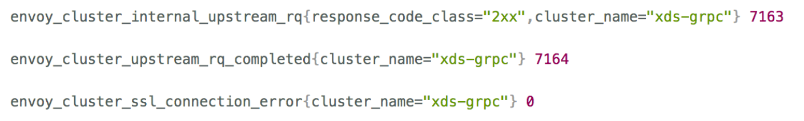

#### 2.服务级别的指标

>用于监控服务通信
>
>四个基本的服务监控需求：延迟、流量、错误、饱和
>
>默认指标导出到 Prometheus（可自定义和更改）
>
>可根据需求开启或关闭

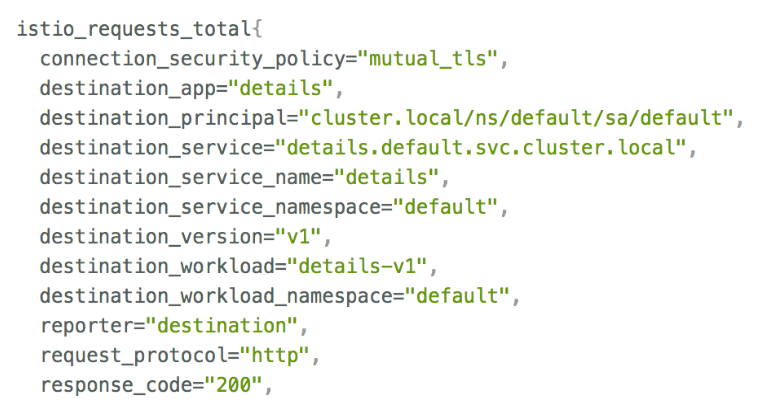

#### 3.控制平面指标

>对自身组件行为的监控
>
>用于了解网格的健康情况

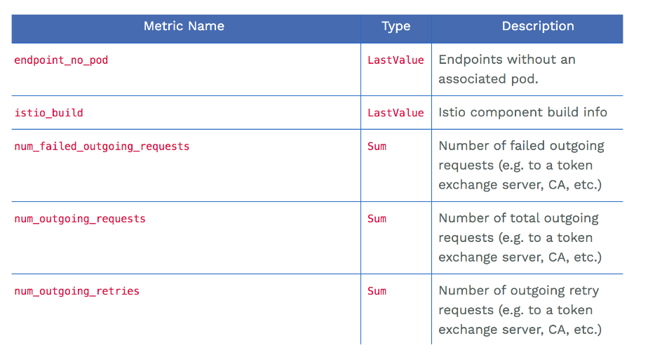

### 3、访问日志（Access logs）

>通过应用产生的事件来了解系统
>
>包括了完整的元数据信息（目标、源）
>
>生成位置可选（本地、远端，如 filebeat）
>
>日志内容:
>
>>应用日志
>>
>>Envoy 日志 $ kubectl logs -l app=demo -c istio-proxy

### 4、分布式链路追踪（Distributed tracing）

>通过追踪请求，了解服务的调用关系
>
>常用于调用链的问题排查、性能分析等
>
>支持多种追踪系统（Jeager、Zipkin、Datadog）

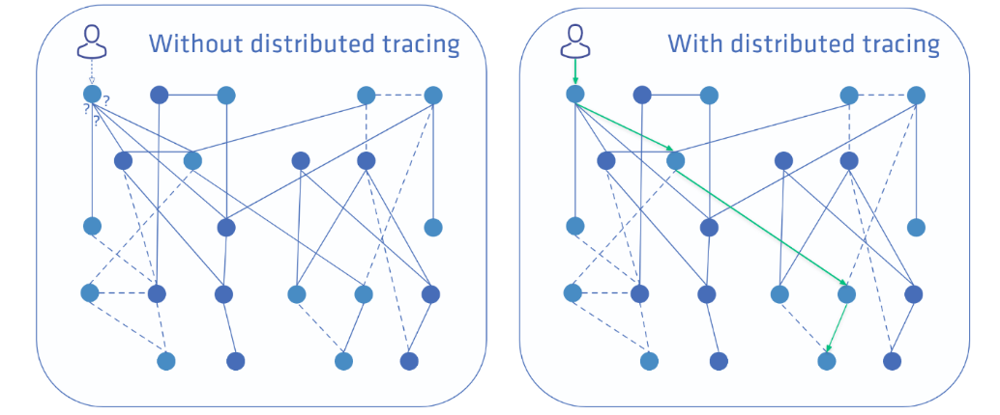

#### 1.示例

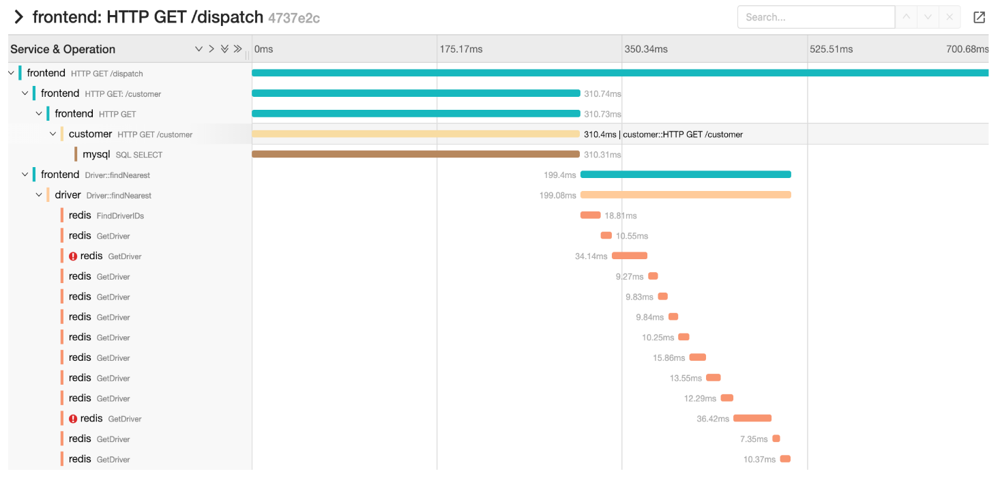

## 十一、Istio 是如何设计安全架构的？

### 1、Istio 的安全架构

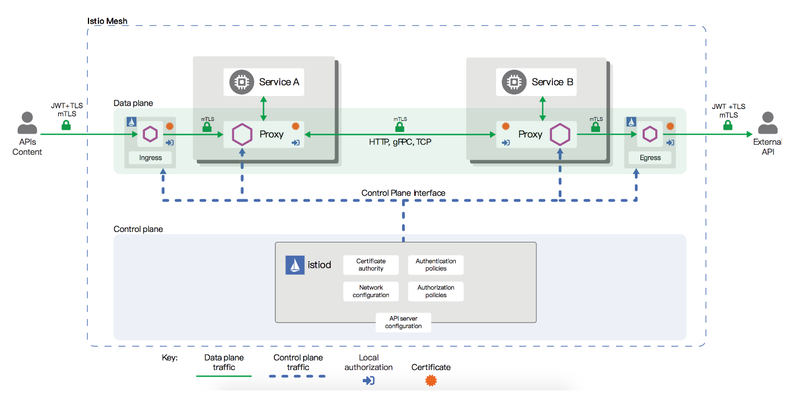

### 2、认证

>认证方式
>
>策略存储
>
>支持兼容模式

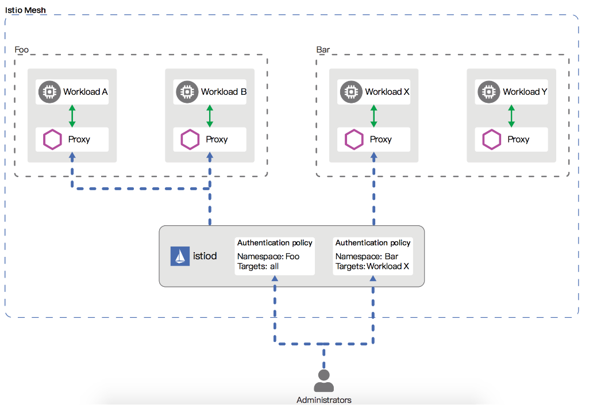

#### 1.认证方式

##### 1)对等认证（Peer authentication）

>用于服务间身份认证
>
>Mutual TLS（mTLS）

##### 2)请求认证（Request authentication）

>用于终端用户身份认证
>
>JSON Web Token（JWT）

#### 2.认证策略

>配置方式
>
>配置生效范围
>
>>网格
>>
>>命名空间
>>
>>工作负载（服务）
>
>策略的更新

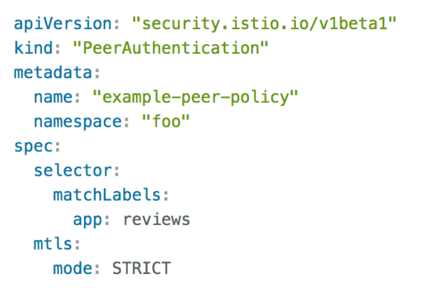

#### 3.授权

>授权级别
>
>策略分发
>
>授权引擎
>
>无需显式调用

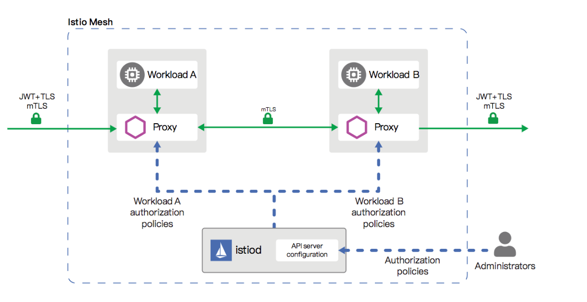

#### 4.授权策略

>通过创建 AuthorizationPolicy 实现
>
>组成部分
>
>>选择器（Selector）
>>
>>行为（Action）
>>
>>规则列表（Rules）
>>
>>>来源（from）
>>>
>>>操作（to）
>>>
>>>匹配条件（when）

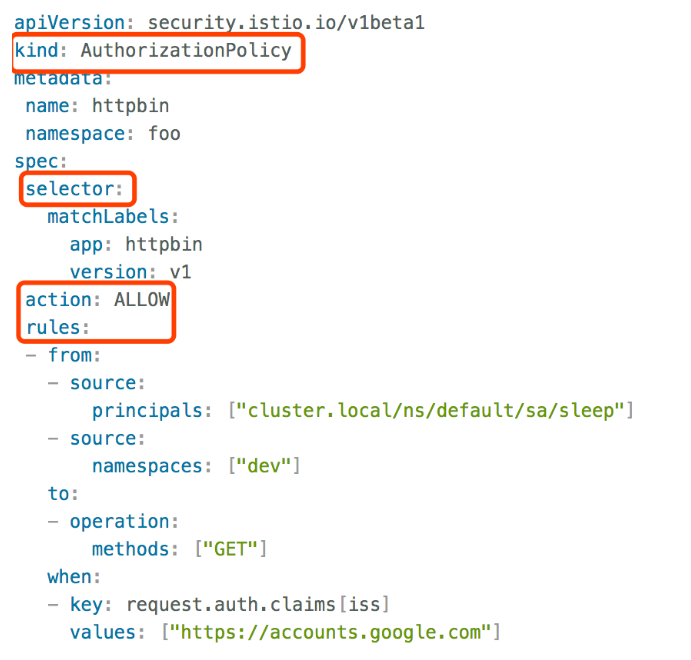

#### 5.授权策略的设置

>范围（目标）设置：metadata/namespace，selector
>
>值匹配：精确、模糊、前缀、后缀
>
>全部容许和拒绝
>
>自定义条件

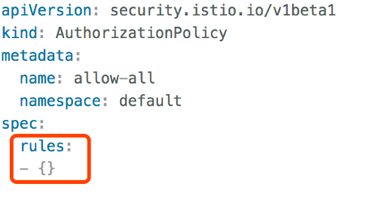

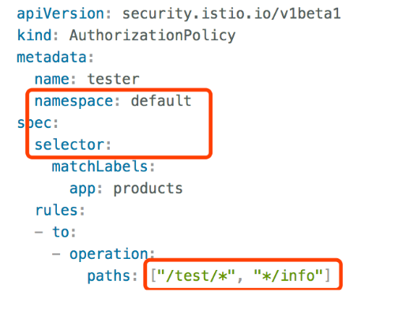

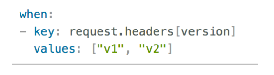

