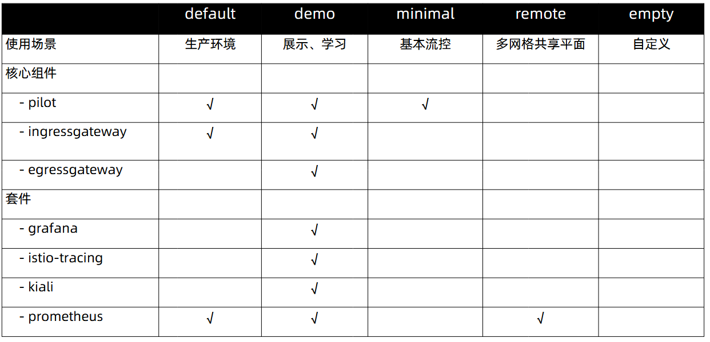
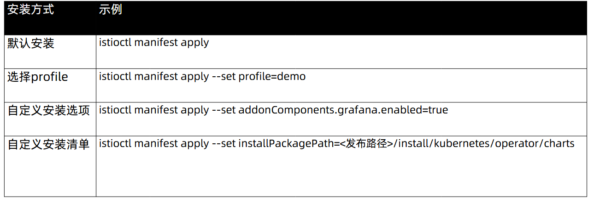
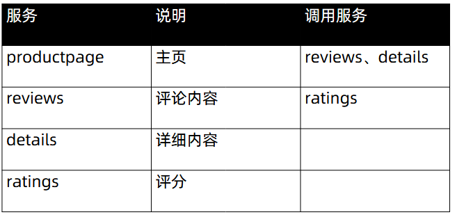
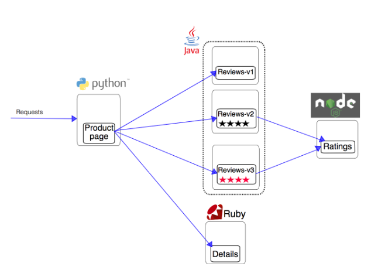

# 安装

## 一、部署

### 1、命令安装

```bash
cd /usr/local/src
curl -L https://istio.io/downloadIstio | sh -
ln -s /usr/local/src/istio-1.27.0 /usr/local/istio

# 设置环境变量
vim /etc/profile.d/istio.sh

export PATH=/usr/local/istio/bin:$PATH


chmod +x /etc/profile.d/istio.sh
source /etc/profile.d/istio.sh
```

### 2、配置档案（configuration profile）



### 3、命令安装



#### 1.安装方式一

```bash
istioctl manifest apply --set profile=demo
```

#### 2.安装方式二

```bash
istioctl profile dump default > /root/default.yml
kubectl get pods -n istio-system
```

#### 3.安装方式三

##### 1）生成清单用apply安装

```bash
istioctl manifest generate > $HOME/generated-manifest.yaml
istioctl manifest generate --set profile=demo > $HOME/generated-manifest.yaml

kubectl create ns istio-system
kubectl apply -f $HOME/generated-manifest.yaml
```

##### 2）检查

```bash
istioctl verify-install -f $HOME/generated-manifest.yaml
```

>Istioctl dashboard 方式

## 二、配置自动注入Envoy（Sidecar）

### 1、自动注入

```bash
kubectl label namespace default istio-injection=enabled
kubectl get namespace default --show-labels
```

### 2、手动注入

```bash
kubectl apply -f <(istioctl kube-inject -f samples/bookinfo/platform/kube/bookinfo.yaml)
```

## 三、部署Bookinfo应用学习istio





### 1、应用部署

```bash
kubectl apply -f samples/bookinfo/platform/kube/bookinfo.yaml
```

### 2、创建ingress网关

```bash
kubectl apply -f samples/bookinfo/networking/bookinfo-gateway.yaml
```

