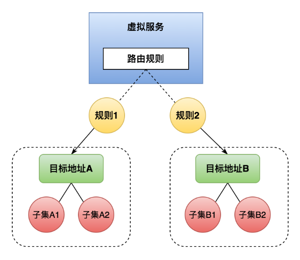
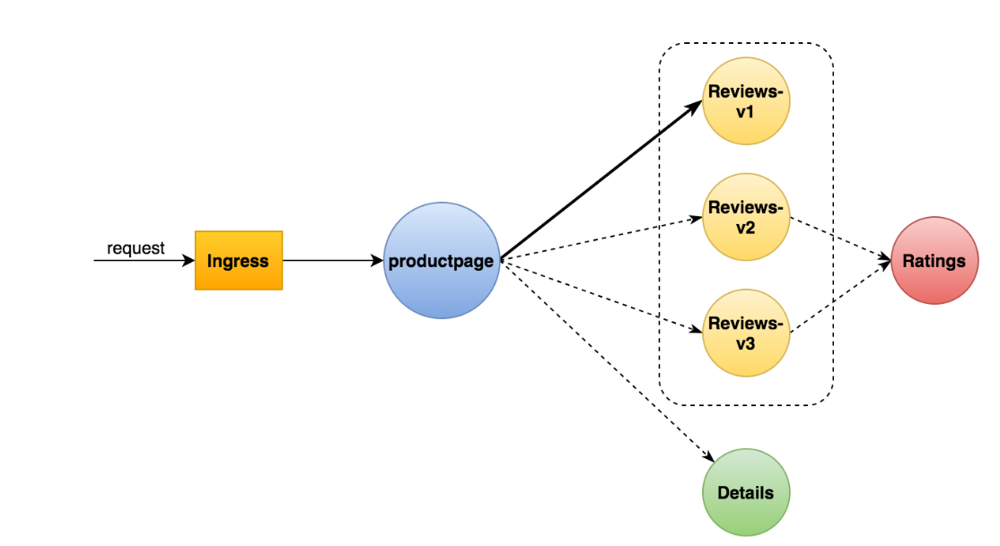
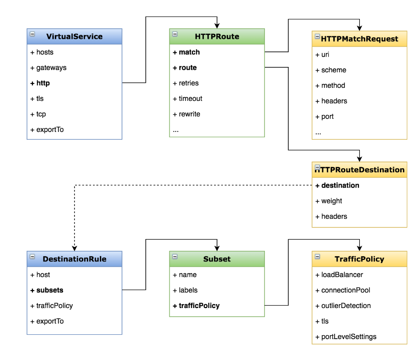
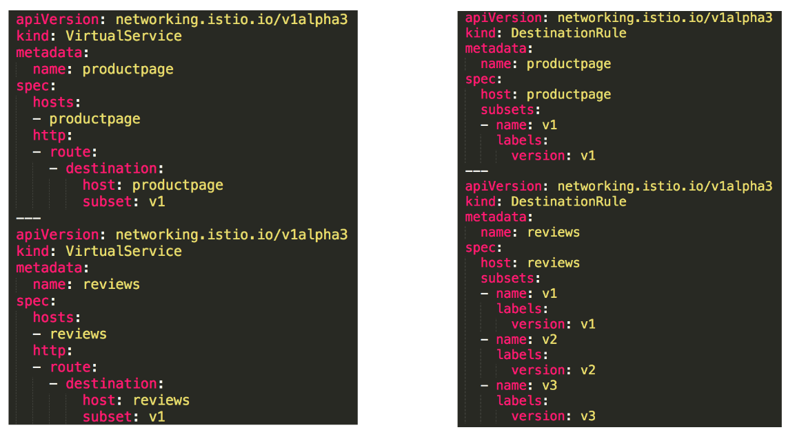

# 动态路由

>用Virtual Service和Destination Rule设置路由规则

## 一、基本概念



>虚拟服务（Virtual Service）
>
>>定义路由规则
>>
>>描述满足条件的请求去哪里
>
>目标规则（Destination Rule）
>
>>定义子集、策略
>>
>>描述到达目标的请求怎么处理

## 二、目标

>将请求路由到服务的不同版本
>
>学会动态路由的配置
>
>掌握 Virtual Service 和 Destination Rule 的配置方法



## 三、演示

### 1、应用路由规则

>一直访问 reviews-v1

```bash
kubectl apply -f samples/bookinfo/networking/virtual-service-all-v1.yaml
kubectl apply -f samples/bookinfo/networking/destination-rule-all.yaml
```

## 四、配置选项

### 1、逻辑图



### 2、分析



## 五、引用场景

>按服务版本路由
>
>按比例切分流量
>
>根据匹配规则进行路由
>
>定义各种策略（负载均衡、连接池等）


