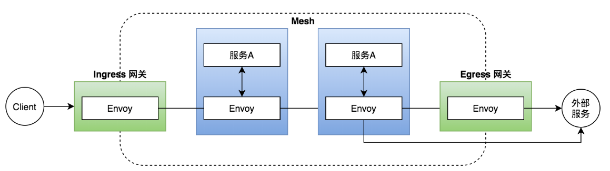
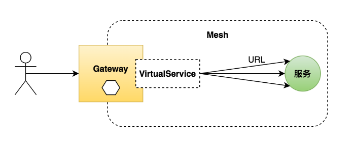
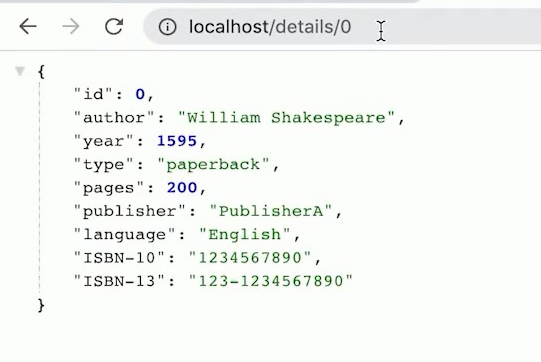
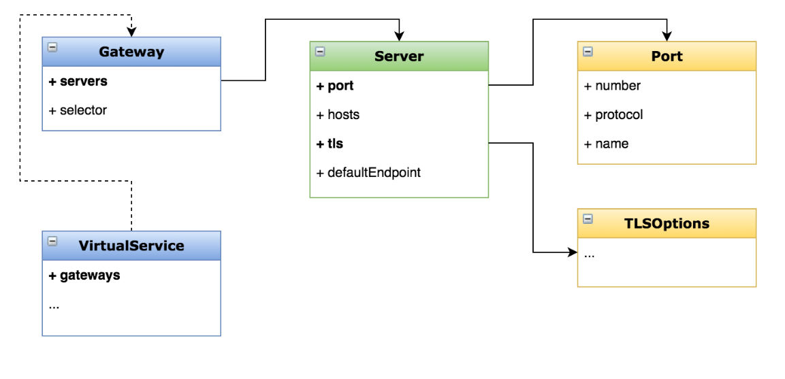

# 网关

## 一、什么是网关？

>一个运行在网格边缘的负载均衡器
>
>接收外部请求，转发给网格内的服务
>
>配置对外的端口、协议与内部服务的映射关系



## 二、目标

>创建一个入口网关，将进入网格的流量分发到不同地址
>
>学会用 Gateway 控制入口流量
>
>掌握 Gateway 的配置方法



## 三、应用

>暴漏details服务

### 1、配置

>virtualservice.yaml

```yaml
apiVersion: networking.istio.io/v1alpha3
kind: VirtualService
metadata:
  name: test-gateway
spec:
  hosts:
  - "*"
  gateways:
  - test-gateway
  http:
  - match:
    - uri:
        prefix: /details
    - uri:
        exact: /health
    route:
    - destination:
        host: details
        port:
          number: 9080

```

>gateway.yaml

```yaml
apiVersion: networking.istio.io/v1alpha3
kind: Gateway
metadata:
  name: test-gateway
spec:
  selector:
    istio: ingressgateway
  servers:
  - port:
      number: 80
      name: http
      protocol: HTTP
    hosts:
    - "*"
```

### 2、验证

>192.168.6.101/details/0



## 四、配置选项



## 五、应用场景

>暴露网格内服务给外界访问
>
>访问安全（HTTPS、mTLS 等）
>
>统一应用入口，API 聚合

