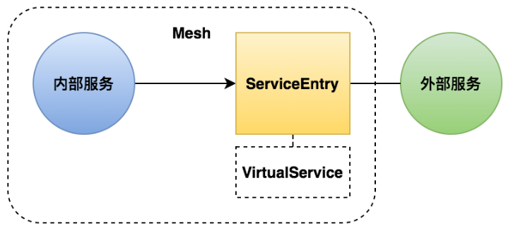
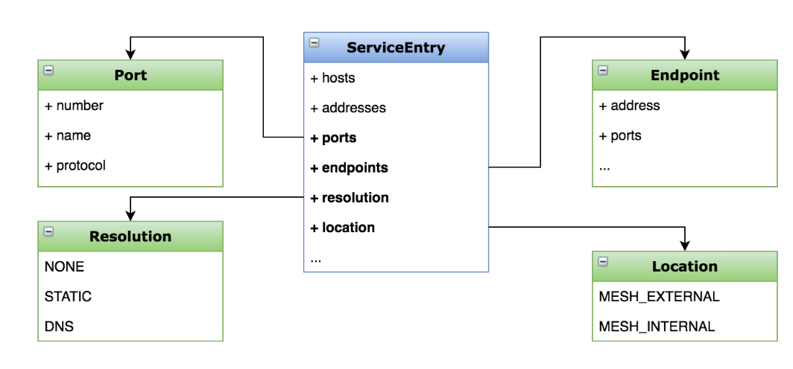

# 服务入口（ServiceEntry）

## 一、什么是服务入口（ServiceEntry）

>添加外部服务到网格内
>
>管理到外部服务的请求
>
>扩展网格



## 二、目标

>将 httpbin 注册为网格内部的服务，并配置流控策略
>
>学会通过 ServiceEntry 扩展网格
>
>掌握 ServiceEntry 的配置方法

## 三、实操

### 1、添加sleep服务

```bash
kubectl apply -f samples/sleep/sleep.yaml
```

### 2、关闭出流量可访问权限（outboundTrafficPolicy = REGISTRY_ONLY）

```bash
kubectl get configmap istio -n istio-system -o yaml | sed 's/mode: ALLOW_ANY/mode: REGISTRY_ONLY/g' | kubectl replace -n istio-system -f -
```

### 3、为外部服务（httpbin）配置 ServiceEntry

>serviceentry.yaml

```yaml
apiVersion: networking.istio.io/v1alpha3
kind: ServiceEntry
metadata:
  name: httpbin-ext
spec:
  hosts:
  - httpbin.org
  ports:
  - number: 80
    name: http
    protocol: HTTP
  resolution: DNS
  location: MESH_EXTERNAL
```

### 

## 四、配置分析

