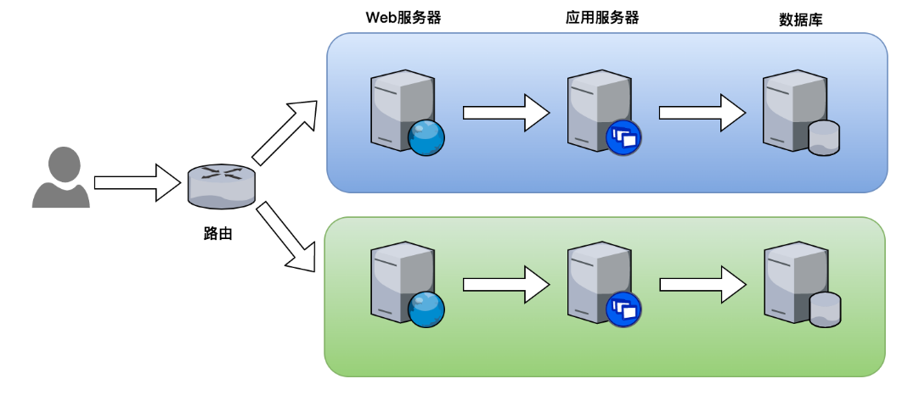
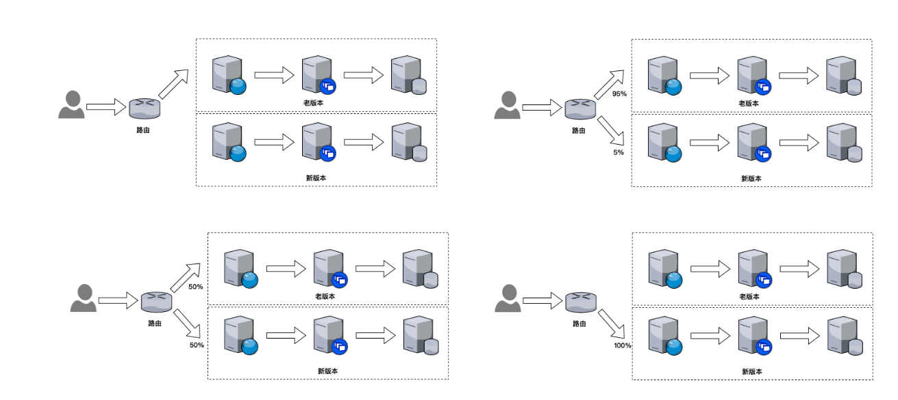
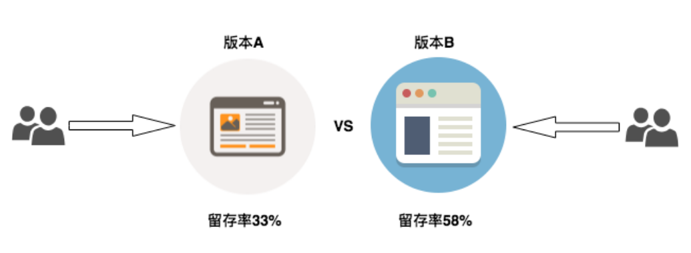
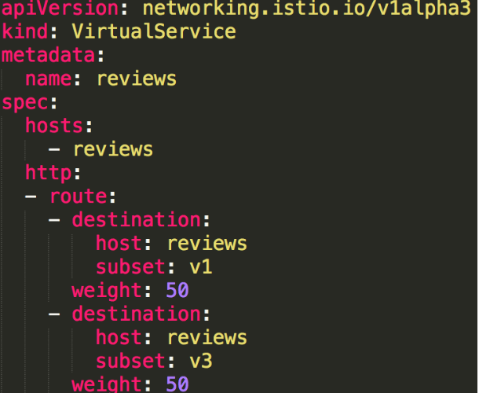

# 流量转移：灰度发布

## 一、基于权重的路由

>将请求按比例路由到对应的服务版本
>
>学会设置路由的权重
>
>理解灰度发布、蓝绿部署、A/B 测试的概念
>
>理解与 Kubernetes 基于部署的版本迁移的区别

## 二、发布方案介绍

### 1、蓝绿部署



### 2、金丝雀发布（灰度）



### 3、A/B测试



## 三、实操

>利用 reviews 服务的多版本，模拟灰度发布
>
>在 VirtualService 中配置权重

```bash
官方代码：
samples/bookinfo/networking/virtual-service-all-v1.yaml
// 50% 转到v3
samples/bookinfo/networking/virtual-service-reviews-50-v3.yaml
```




