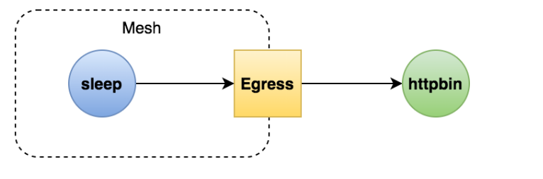

# 用 Egress 网关实现访问外部服务

## 一、访问外部服务的方法

>配置 global.outboundTrafficPolicy.mode = ALLOW_ANY
>
>使用服务入口（ServiceEntry）
>
>配置 Sidecar 让流量绕过代理
>
>配置 Egress 网关

## 二、概念

>定义了网格的出口点，允许你将监控、路由等功能应用于离开网格的流量

## 三、应用场景

>所有出口流量必须流经一组专用节点（安全因素）
>
>为无法访问公网的内部服务做代理

## 四、目标

>创建一个 Egress 网关，让内部服务通过它访问外部服务
>
>学会使用 Egress 网关
>
>理解 Egress 的存在意义



## 五、实战

>查看 egressgateway 组件是否存在
>
>为外部服务定义 ServiceEntry
>
>定义 Egress gateway
>
>定义路由，将流量引导到 egressgateway
>
>查看日志验证

>gw.yaml

```yaml
apiVersion: networking.istio.io/v1alpha3
kind: Gateway
metadata:
  name: istio-egressgateway
spec:
  selector:
    istio: egressgateway
  servers:
  - port:
      number: 80
      name: http
      protocol: HTTP
    hosts:
    - httpbin.org

```

>se.yaml

```yaml
apiVersion: networking.istio.io/v1alpha3
kind: ServiceEntry
metadata:
  name: httpbin
spec:
  hosts:
  - httpbin.org
  ports:
  - number: 80
    name: http-port
    protocol: HTTP
  resolution: DNS

```

>vs.yaml

```yaml
apiVersion: networking.istio.io/v1alpha3
kind: VirtualService
metadata:
  name: vs-for-egressgateway
spec:
  hosts:
  - httpbin.org
  gateways:
  - istio-egressgateway
  - mesh
  http:
  - match:
    - gateways:
      - mesh
      port: 80
    route:
    - destination:
        host: istio-egressgateway.istio-system.svc.cluster.local
        subset: httpbin
        port:
          number: 80
      weight: 100
  - match:
    - gateways:
      - istio-egressgateway
      port: 80
    route:
    - destination:
        host: httpbin.org
        port:
          number: 80
      weight: 100
---
apiVersion: networking.istio.io/v1alpha3
kind: DestinationRule
metadata:
  name: dr-for-egressgateway
spec:
  host: istio-egressgateway.istio-system.svc.cluster.local
  subsets:
  - name: httpbin

```