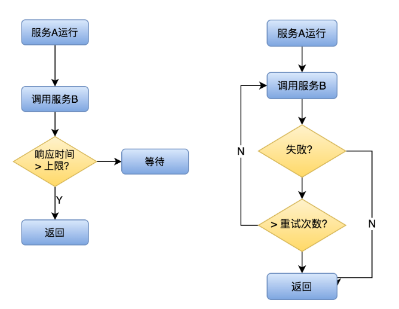
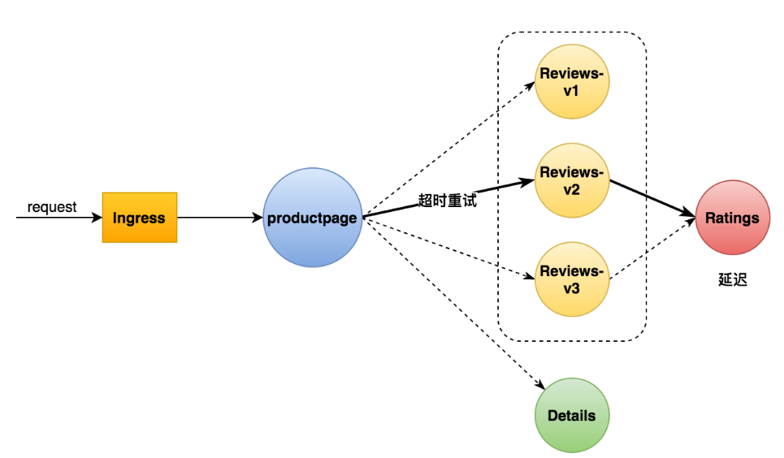
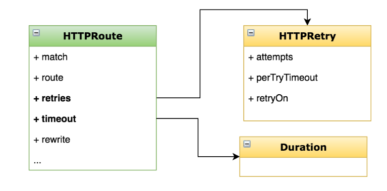

# 超时重试-提升系统的健壮性和可用性

## 一、基本概念



>超时：控制故障范围，避免故障扩散
>
>重试：解决网络抖动时通信失败的问题

## 二、目标

>添加超时策略
>
>添加重试策略
>
>学会在 VirtualService 中添加超时和重试的配置项
>
>理解超时重试对提升应用健壮性的意义



## 三、实战

### 1、给 ratings 服务添加延迟

```yaml
apiVersion: networking.istio.io/v1alpha3
kind: VirtualService
metadata:
  name: ratings
spec:
  hosts:
  - ratings
  http:
  - fault:
      delay:
        percent: 100
        fixedDelay: 2s
    route:
    - destination:
        host: ratings
        subset: v1

```

### 2、给 reviews 服务添加超时策略

```yaml
apiVersion: networking.istio.io/v1alpha3
kind: VirtualService
metadata:
  name: reviews
spec:
  hosts:
  - reviews
  http:
  - route:
    - destination:
        host: reviews
        subset: v2
    timeout: 1s

```

### 3、给 ratings 服务添加重试策略

```yaml
apiVersion: networking.istio.io/v1alpha3
kind: VirtualService
metadata:
  name: ratings
spec:
  hosts:
  - ratings
  http:
  - fault:
      delay:
        percent: 100
        fixedDelay: 5s
    route:
    - destination:
        host: ratings
        subset: v1
    retries:
      attempts: 2
      perTryTimeout: 1s

```




