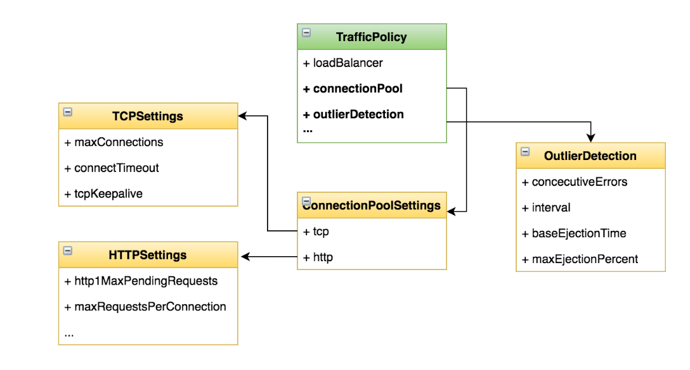

# 熔断

## 一、什么是熔断（Circuit Breaking）

>一种过载保护的手段
>
>目的：避免服务的级联失败
>
>关键点：三个状态、失败计数器（阈值）、超时时钟

## 二、目标

>为 httpbin 服务添加熔断配置
>
>通过负载测试工具触发熔断
>
>学会在 DestinationRule 中添加熔断的配置项

## 三、实战

### 1、编写熔断机制

```yaml
apiVersion: networking.istio.io/v1alpha3
kind: DestinationRule
metadata:
  name: httpbin       # 这个 DestinationRule 的名字，建议与 VirtualService 中使用的 host 一致或有意义
spec:
  host: httpbin       # 指定目标服务名称（Kubernetes Service 名），将应用该规则到这个服务
  trafficPolicy:
    connectionPool:
      tcp:
        maxConnections: 1  # 限制每个连接池中最多允许的 TCP 连接数为 1，控制并发连接数
      http:
        http1MaxPendingRequests: 1     # 当连接池中所有连接都在使用时，最多允许的挂起请求数（排队请求）为 1
        maxRequestsPerConnection: 1    # 每个 HTTP 连接上最多只处理 1 个请求（强制短连接），可用于测试或故障注入
    outlierDetection:
      consecutiveErrors: 1        # 如果某个实例连续出错 1 次，就认为它异常（例如 HTTP 5xx）
      interval: 1s                # 每隔 1 秒检测一次实例的健康状况
      baseEjectionTime: 3m       # 一旦实例被驱逐，不健康的实例将在 3 分钟内不会被选中参与请求
      maxEjectionPercent: 100    # 最多允许驱逐 100% 的实例，意味着可以让整个服务下线（慎用）

```



### 2、压测

#### 1.安装压测客户端

```bash
# 安装fortio荷载测试客户端：
samples/httpbin/sample-client/fortio-deploy.yaml

kubectl apply -f <(istioctl kube-inject -f samples/httpbin/sample-client/fortio-deploy.yaml)
```

#### 2.单次调用

```bash
FORTIO_POD=$(kubectl get pod | grep fortio | awk '{ print $1 }')
kubectl exec -it $FORTIO_POD  -c fortio /usr/local/bin/fortio -- load -curl  http://httpbin:8000/get
```

#### 3.压测

```bash
kubectl exec -it $FORTIO_POD  -c fortio /usr/local/bin/fortio -- load -c 2 -qps 0 -n 20 -loglevel Warning http://httpbin:8000/get
kubectl exec -it $FORTIO_POD  -c fortio /usr/local/bin/fortio -- load -c 3 -qps 0 -n 20 -loglevel Warning http://httpbin:8000/get
```

### 3、查看熔断次数

```bash
kubectl exec -it $FORTIO_POD  -c istio-proxy  -- sh -c 'curl localhost:15000/stats' | grep httpbin | grep pending
cluster.out.httpbin.springistio.svc.cluster.local|http|version=v1.upstream_rq_pending_active: 0
cluster.out.httpbin.springistio.svc.cluster.local|http|version=v1.upstream_rq_pending_failure_eject: 0
cluster.out.httpbin.springistio.svc.cluster.local|http|version=v1.upstream_rq_pending_overflow: 12
cluster.out.httpbin.springistio.svc.cluster.local|http|version=v1.upstream_rq_pending_total: 39
```

