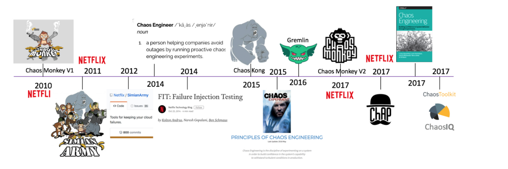
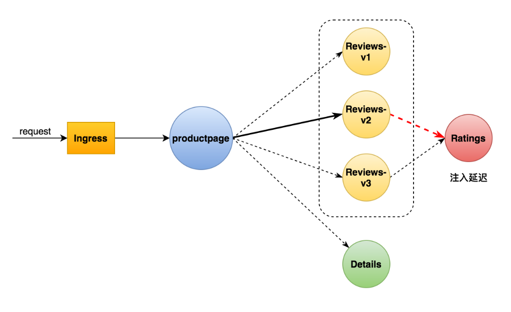
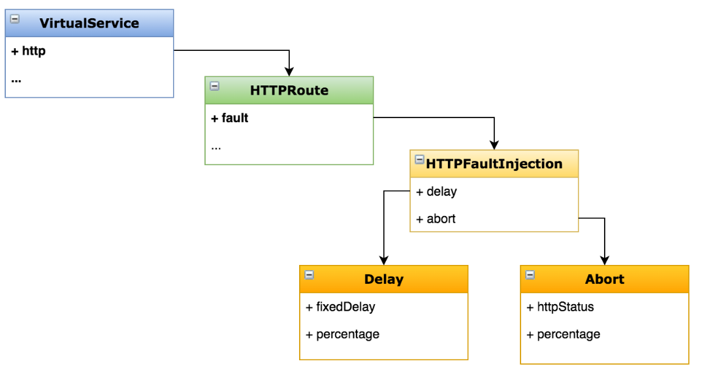
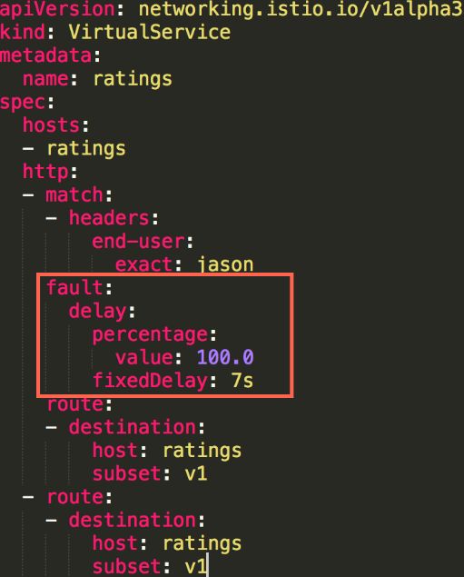

# 故障注入

## 一、了解

>Netflix 的 Chaos Monkey
>
>混沌工程（Chaos engineering）



## 二、目标：配置延迟故障

>为 ratings 服务添加一个延迟故障
>
>学会在 VirtualService 中添加故障
>
>学习 HTTPFaultInjection 配置项




## 三、实操

>路由到 reviews v2 版本
>
>添加延迟配置



```bash
官方代码：
kubectl apply -f samples/bookinfo/networking/virtual-service-all-v1.yaml
kubectl apply -f samples/bookinfo/networking/virtual-service-reviews-test-v2.yaml
kubectl apply -f samples/bookinfo/networking/virtual-service-ratings-test-delay.yaml
```




