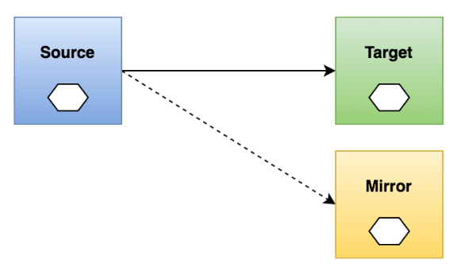
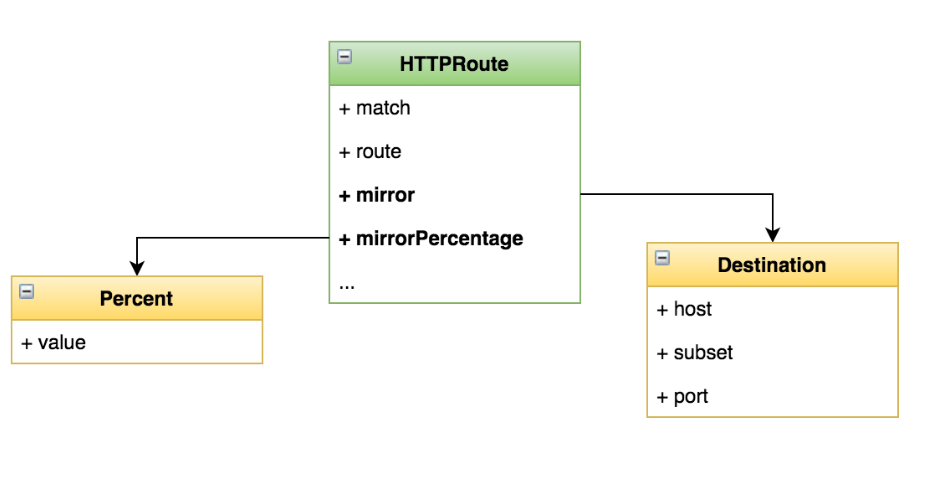

# 流量镜像（Traffic Mirroring）

## 一、了解

>实时复制请求到镜像服务

### 1、场景

>线上问题排查（troubleshooting）
>
>观察生产环境的请求处理能力（压力测试）
>
>复制请求信息用于分析



## 二、目标

>将发送到 v1 版本的流量镜像到 v2 版本
>
>学会在 VirtualService 中通过 mirror 字段配置镜像

## 三、实操

>部署 httpbin 服务的 v1、v2 版本
>
>配置镜像

### 1、v1、v2版本部署

```yaml
apiVersion: apps/v1
kind: Deployment
metadata:
  name: httpbin-v1
spec:
  replicas: 1
  selector:
    matchLabels:
      app: httpbin
      version: v1
  template:
    metadata:
      labels:
        app: httpbin
        version: v1
    spec:
      containers:
      - image: docker.io/kennethreitz/httpbin
        imagePullPolicy: IfNotPresent
        name: httpbin
        command: ["gunicorn", "--access-logfile", "-", "-b", "0.0.0.0:80", "httpbin:app"]
        ports:
        - containerPort: 80

```

```yaml
apiVersion: apps/v1
kind: Deployment
metadata:
  name: httpbin-v2
spec:
  replicas: 1
  selector:
    matchLabels:
      app: httpbin
      version: v2
  template:
    metadata:
      labels:
        app: httpbin
        version: v2
    spec:
      containers:
      - image: docker.io/kennethreitz/httpbin
        imagePullPolicy: IfNotPresent
        name: httpbin
        command: ["gunicorn", "--access-logfile", "-", "-b", "0.0.0.0:80", "httpbin:app"]
        ports:
        - containerPort: 80

```

```yaml
apiVersion: v1
kind: Service
metadata:
  name: httpbin
  labels:
    app: httpbin
spec:
  ports:
  - name: http
    port: 8000
    targetPort: 80
  selector:
    app: httpbin

```

### 2、配置服务路由

```yaml
apiVersion: networking.istio.io/v1alpha3
kind: VirtualService
metadata:
  name: httpbin              # VirtualService 的名称，建议与目标服务关联
spec:
  hosts:
    - httpbin               # 要将流量路由到的目标服务名（Kubernetes Service 名称）
  http:
  - route:
    - destination:
        host: httpbin       # 路由的目标服务名
        subset: v1          # 路由的目标子集（由 DestinationRule 中的 subset 定义）
      weight: 100           # 流量百分比，这里是 100%，表示全部流量路由到 v1 子集
---
apiVersion: networking.istio.io/v1alpha3
kind: DestinationRule
metadata:
  name: httpbin             # DestinationRule 的名称，建议与服务名称一致
spec:
  host: httpbin             # 目标服务名称（Kubernetes Service 名称）
  subsets:
  - name: v1                # 定义子集 v1
    labels:
      version: v1           # 匹配 Pod 上的标签 version=v1，确定哪些 Pod 属于 v1 子集
  - name: v2                # 定义子集 v2
    labels:
      version: v2           # 匹配 version=v2 的 Pod，适用于后续灰度发布、A/B 测试等

```

### 3、配置流量镜像

```yaml
apiVersion: networking.istio.io/v1alpha3
kind: VirtualService
metadata:
  name: httpbin                  # VirtualService 名称
spec:
  hosts:
    - httpbin                   # 目标服务（Kubernetes Service 名）
  http:
  - route:
    - destination:
        host: httpbin           # 主请求将被发送到这个服务
        subset: v1              # 主请求路由到 DestinationRule 中定义的 v1 子集
      weight: 100               # 100% 的实际流量发送到 v1
    mirror:
      host: httpbin             # 镜像流量的目标服务（通常和主服务相同）
      subset: v2                # 镜像流量发送到子集 v2（即 version=v2 的 Pod）
    mirror_percentage: 
      value: 100                # 将 100% 的主请求“复制一份”发送到 v2，但不会影响主请求响应
```




