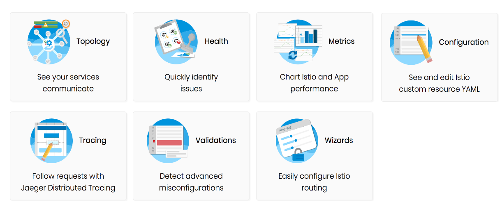
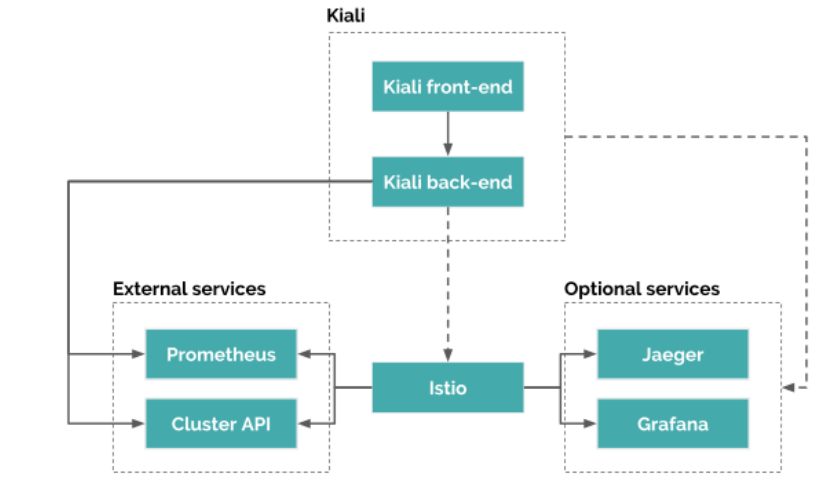
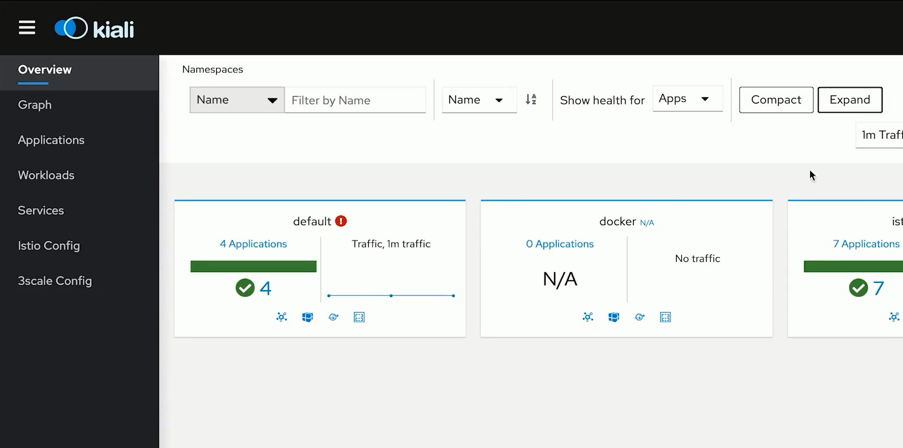
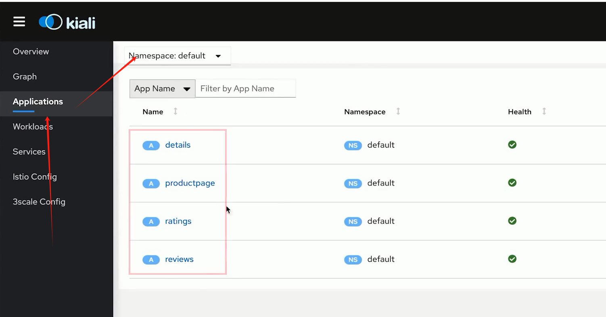
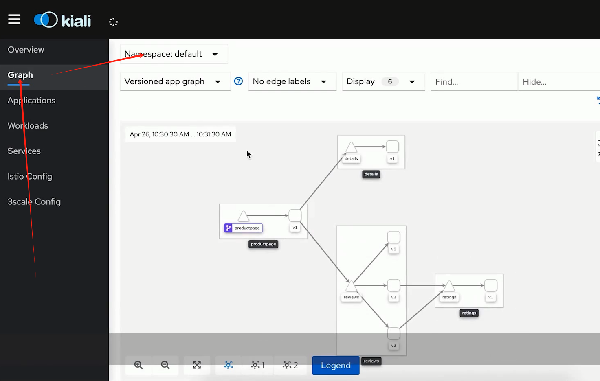
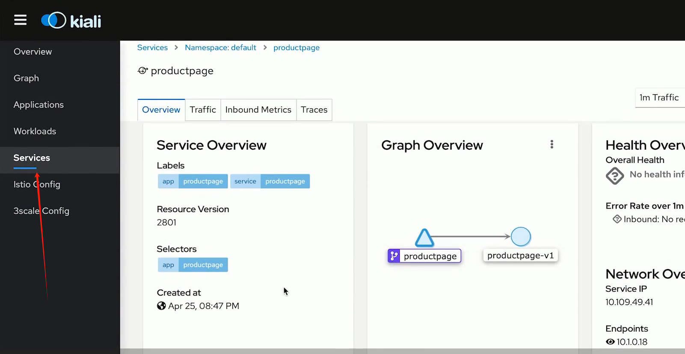
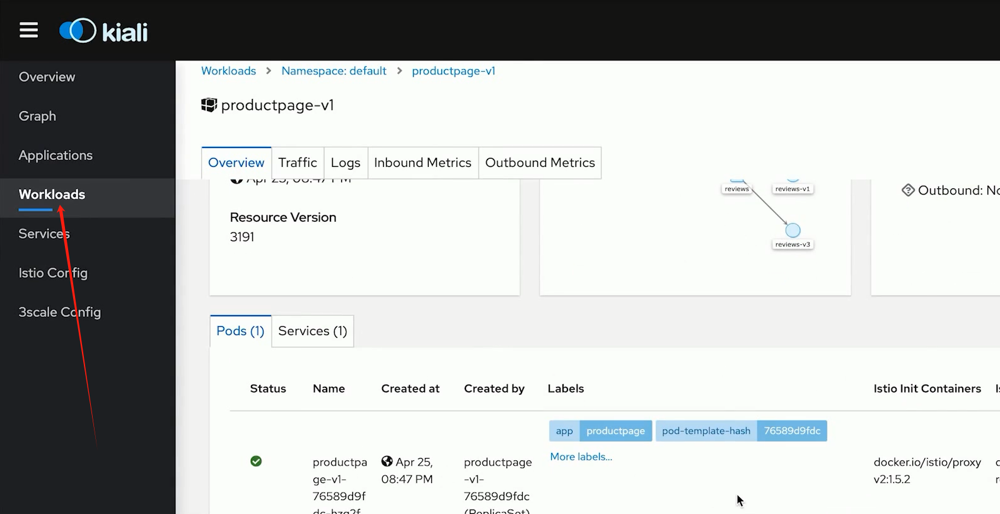
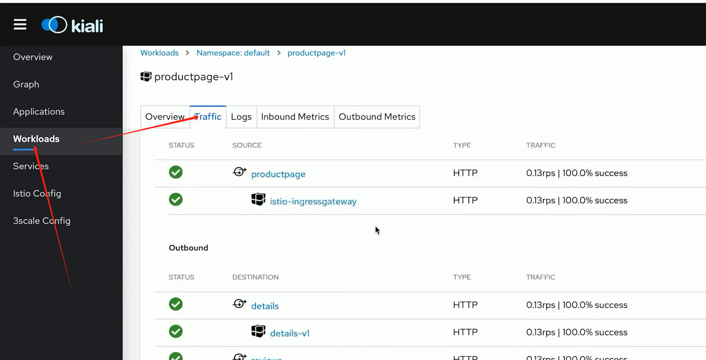
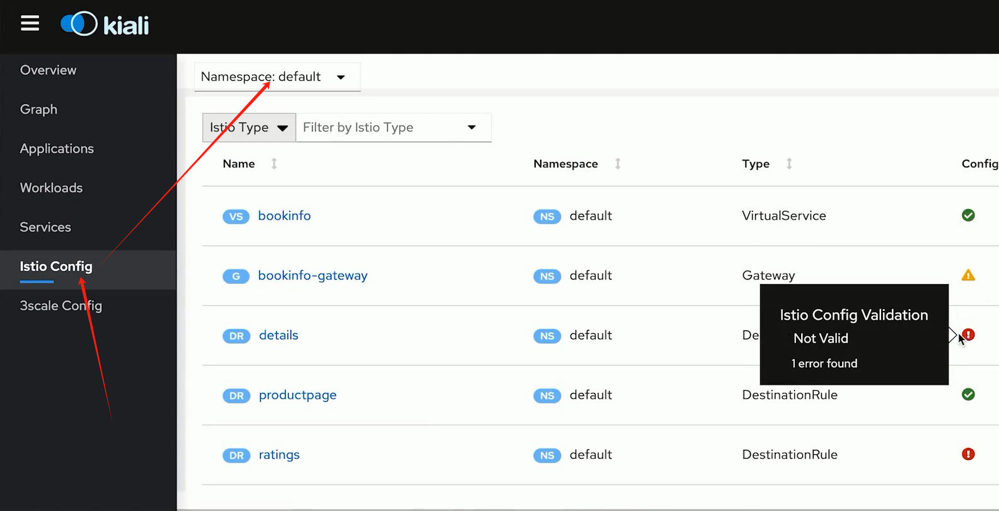

# Kiali观测你的微服务应用

## 一、微服务架构可视化的重要性

### 1、痛点

>服务间依赖关系错综复杂
>
>问题排查困难，扯皮甩锅时有发生

### 2、优势

> 梳理服务的交互关系
>
> 了解应用的行为与状态

## 二、什么是Kiali

### 1、官方定义

>Istio 的可观察性控制台
>
>通过服务拓扑帮助你理解服务网格的结构
>
>提供网格的健康状态视图
>
>具有服务网格配置功能

## 三、功能



## 四、架构



## 五、安装

### 1、服务安装

```bash
cd /usr/local/src/istio-1.27.0/samples/addons
root@k8s-master-01:/usr/local/src/istio-1.27.0/samples/addons# kubectl apply -f kiali.yaml -n istio-system
```

### 2、服务暴漏

```bash
```


## 六、实操

### 1、总览



### 2、查看应用



### 3、查看应用拓扑接口



### 4、查看服务具体信息



### 5、查看流量和pod情况





### 6、Istio配置




