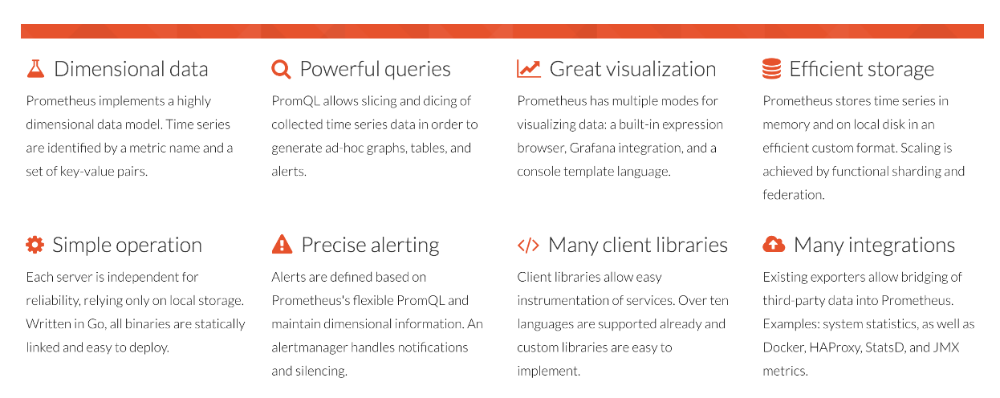
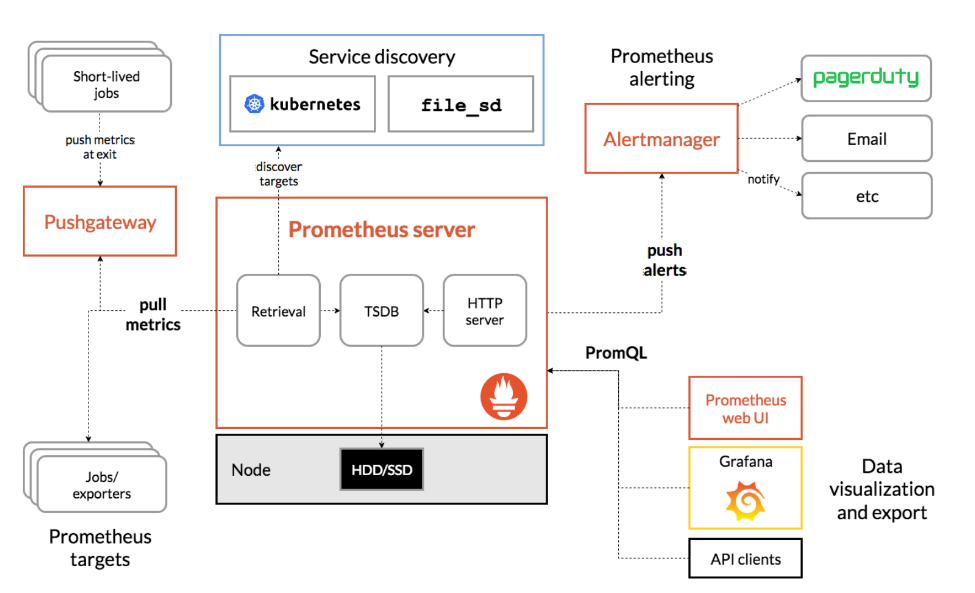
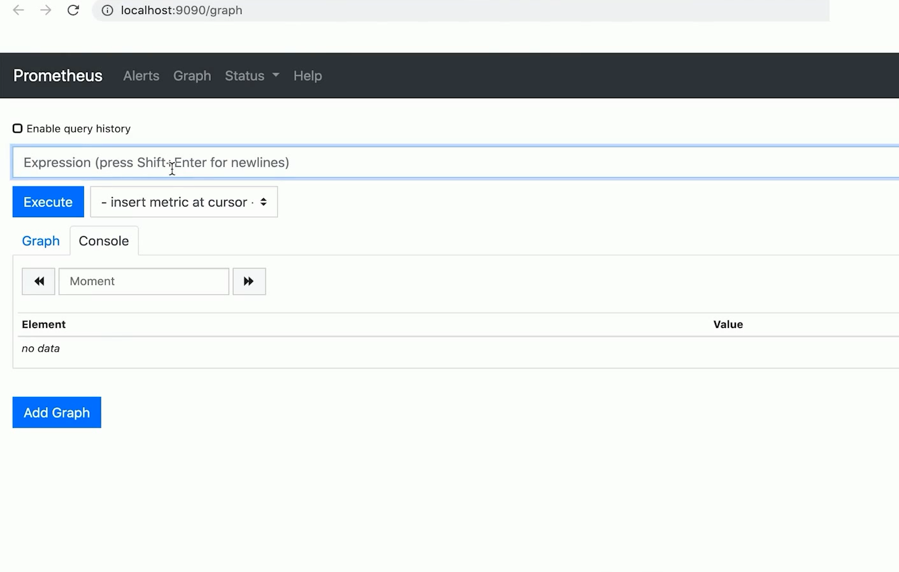
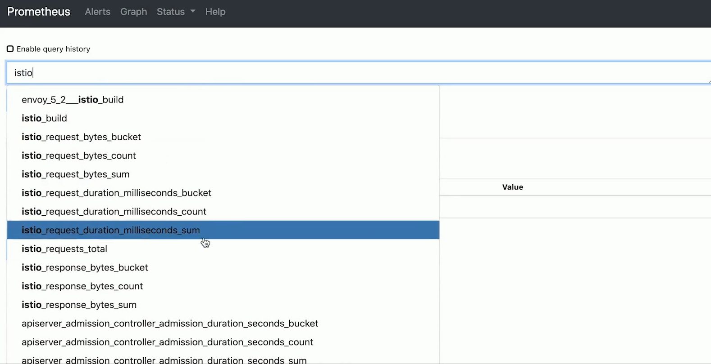
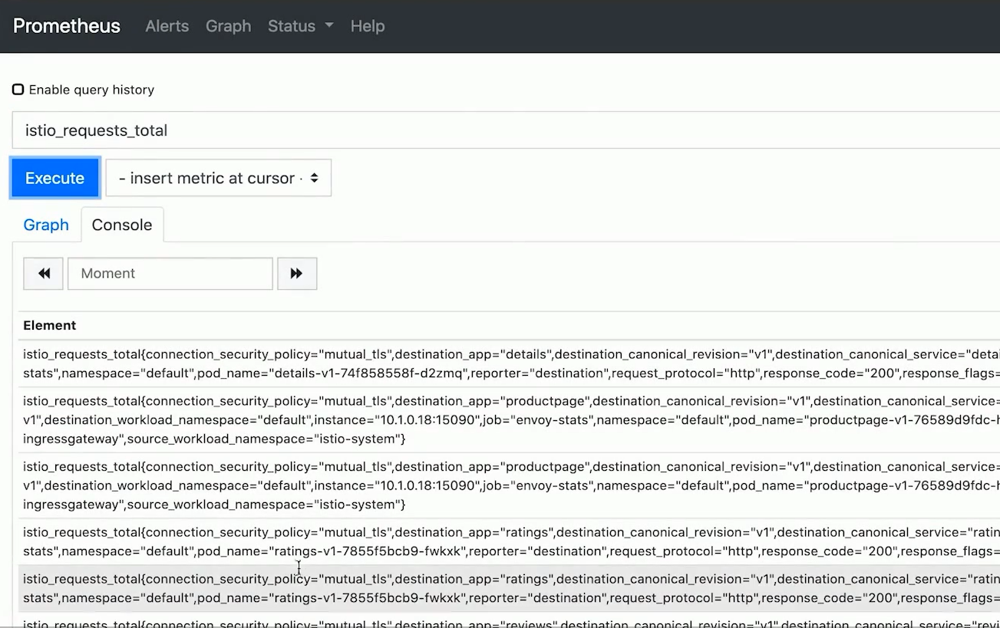
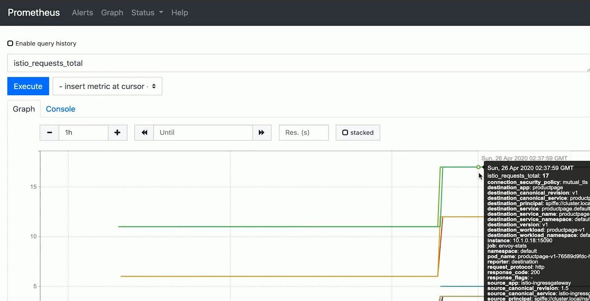
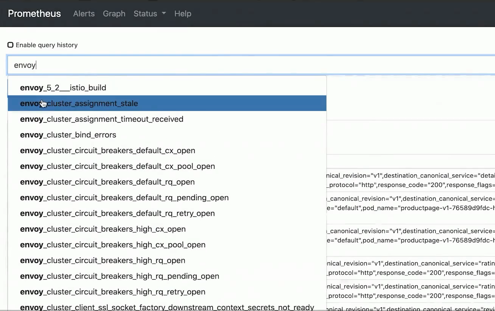
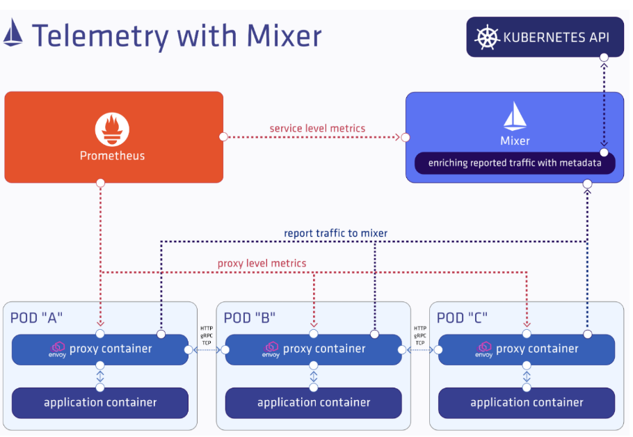
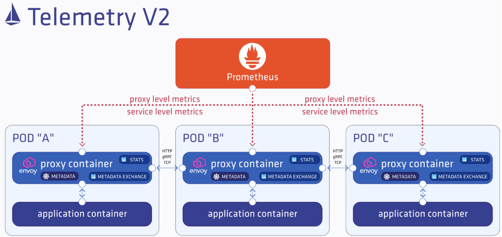
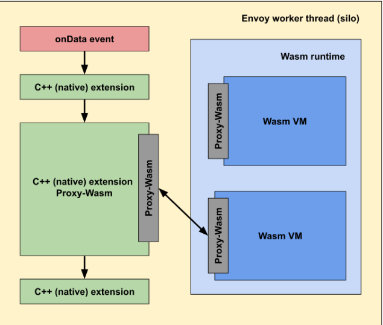

# Prometheus收集指标

## 一、介绍

## 二、架构图

## 三、目标

>通过 Prometheus 收集指标并查看指标数据
>
>学会用 Prometheus 查看指标数据
>
>了解 Istio 1.5 中新的遥测方法 （Telemetry V2）

## 四、实操

### 1、Prometheus访问

>192.168.6.101:9090

#### 1.Istio

#### 2.Envoy

## 五、Istio 1.5 的遥测指标

>请求数（istio_requests_total）
>请求时长（istio_request_duration_milliseconds）
>请求大小（istio_request_bytes）
>响应大小（istio_response_bytes）
>TCP 发送字节数（istio_tcp_sent_bytes_total）
>TCP 接受字节数（istio_tcp_received_bytes_total）
>TCP 连接打开数（istio_tcp_connections_opened_total）
>TCP 连接关闭数（istio_tcp_connections_closed_total）

## 六、Istio 1.5 遥测的变化

### 1、老版本

### 2、新版本

## 七、WebAssembly in Envoy

>解决静态化编译（构建时）的弊端

### 1、优势

>无需修改 Envoy
>
>避免远程调用
>
>隔离性/安全/多样性
>
>可移植/可维护

