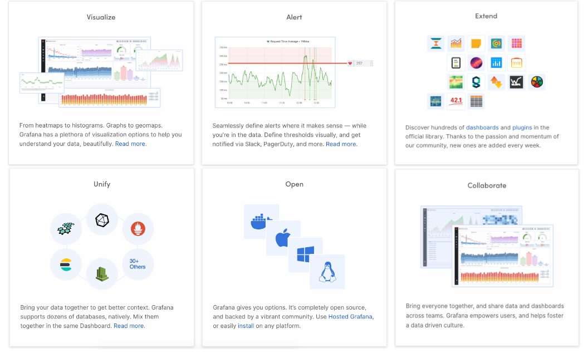
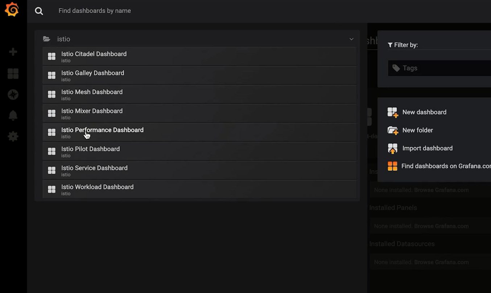
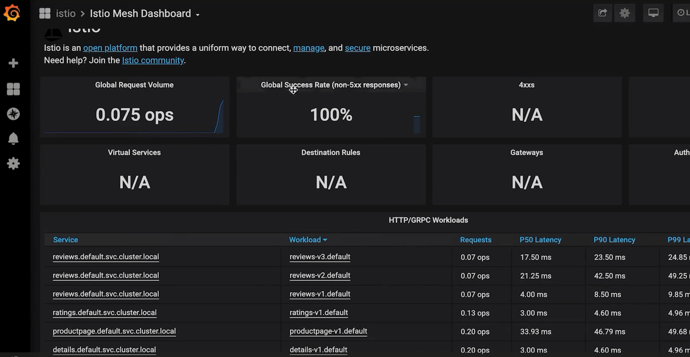
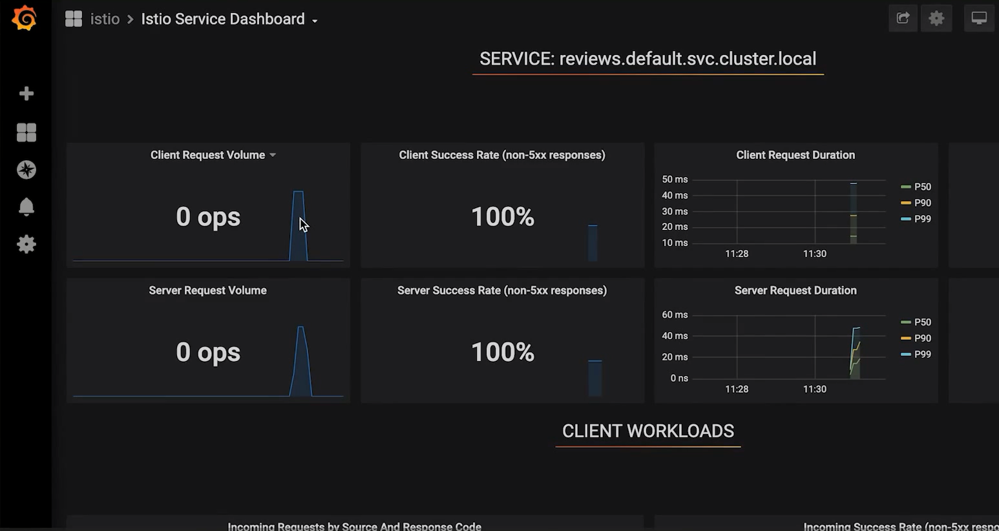
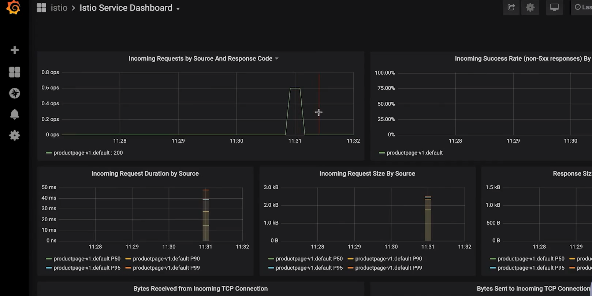
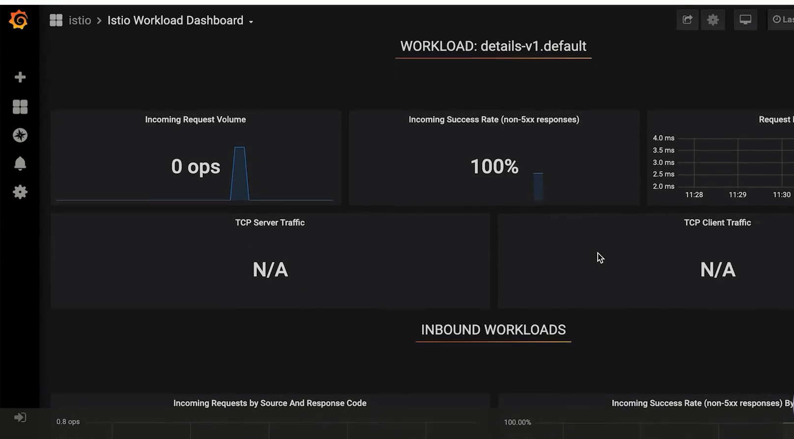
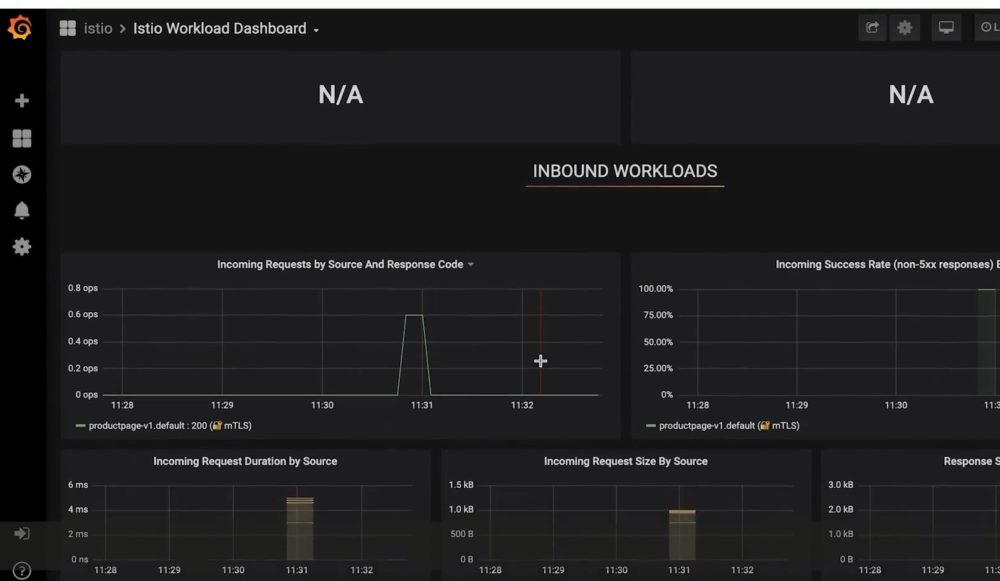
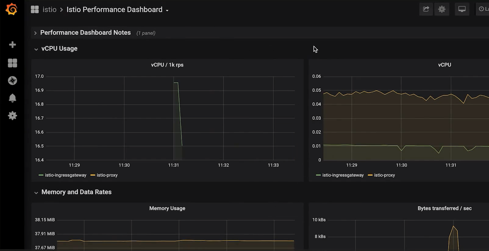
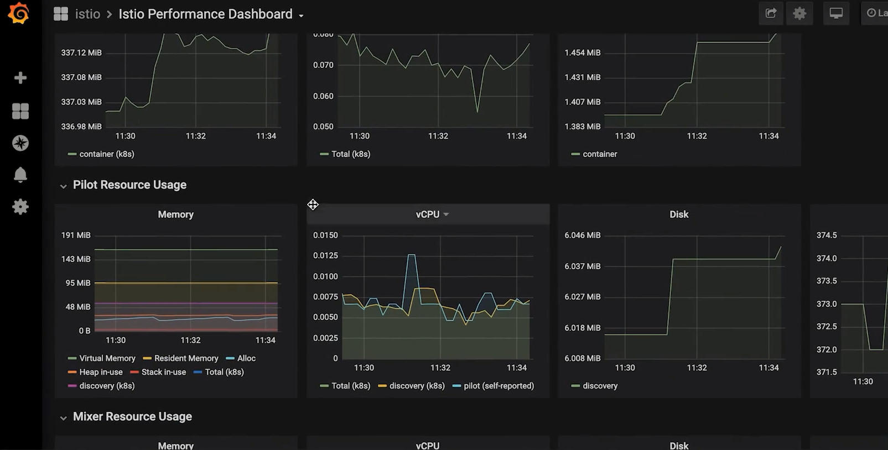

# Grafana查看系统

## 1、介绍



## 2、Istio Dashboard

### 1.Mesh Dashboard：查看应用（服务）数据

>网格数据总览
>
>服务视图
>
>工作负载视图

### 2.Performance Dashboard：查看 Istio 自身（各组件）数据

>Istio 系统总览
>
>各组件负载情况

## 3、实战

>192.168.6.101:3000

```bash
--set values.grafana.enabled=true
```

### 1.mesh





### 2.service





### 3.workload





### 4.Performance






