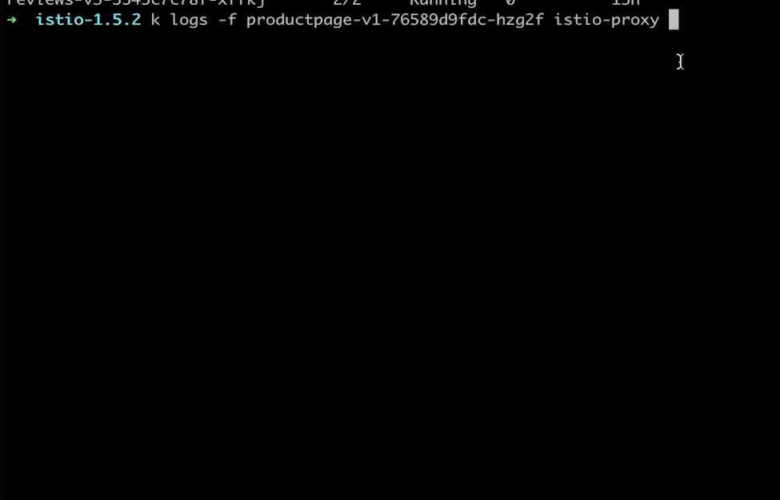
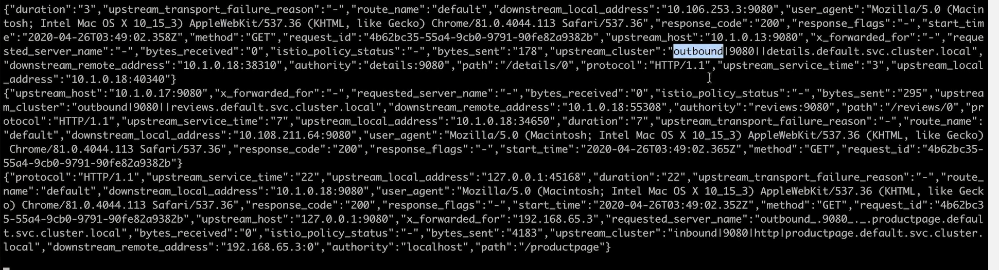
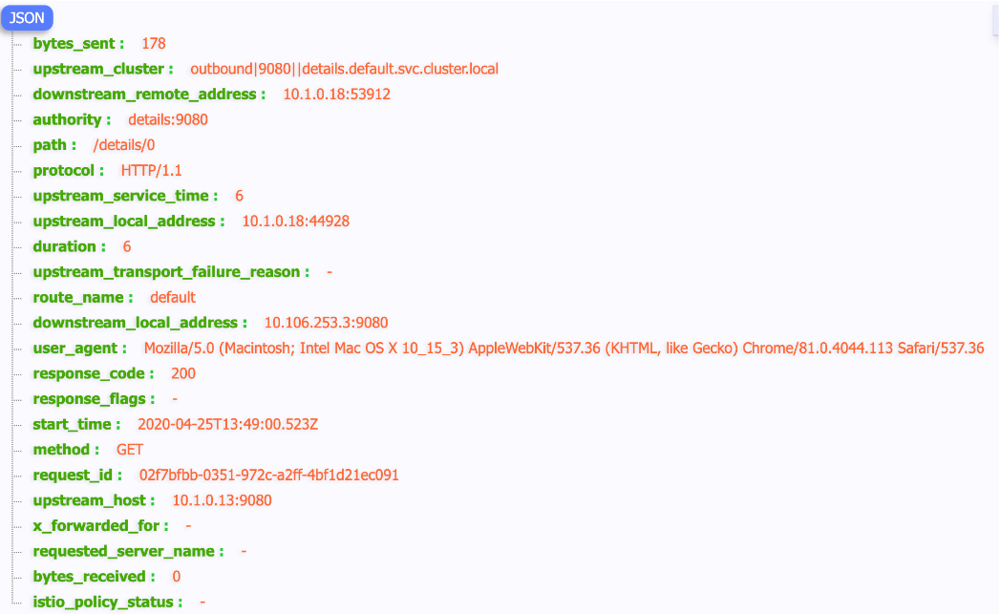
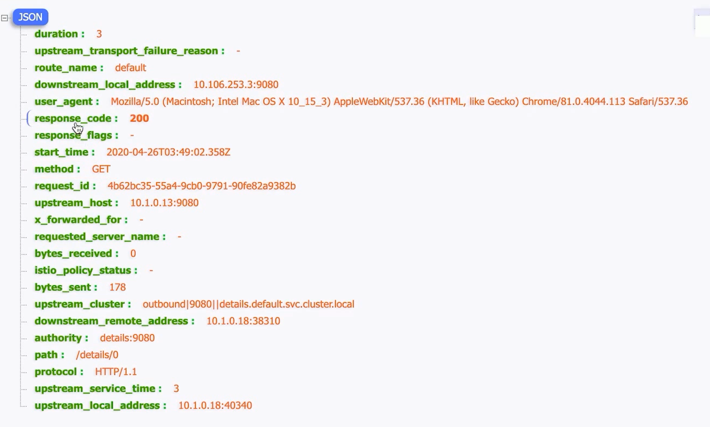
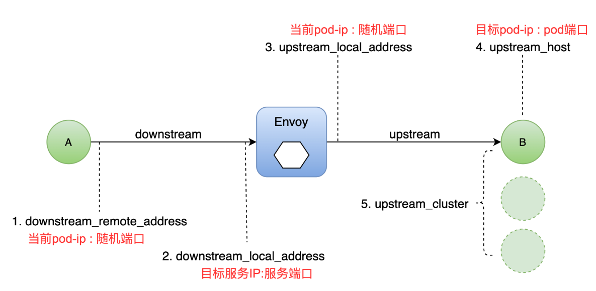
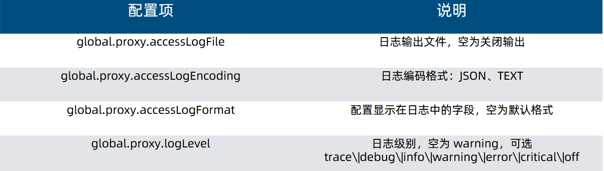

# Envoy的日志获取

## 一、目标

>通过查看 Envoy 日志了解流量信息
>
>学会通过分析日志调试流量异常

## 二、实战

### 1、日志内容获取

>istio configmap修改

```bash
--set values.global.proxy.accessLogFile="/dev/stdout"
```





### 2、日志项分析





### 3、Envoy 流量五元组



### 4、调试关键字段：RESPONSE_FLAGS

>UH：upstream cluster 中没有健康的 host，503
>UF：upstream 连接失败，503
>UO：upstream overflow（熔断）
>NR：没有路由配置，404
>URX：请求被拒绝因为限流或最大连接次数
>
>...

## 三、Envoy 日志配置项



