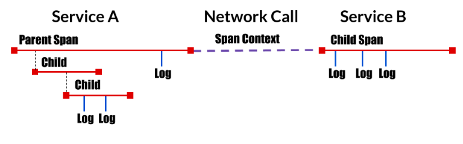
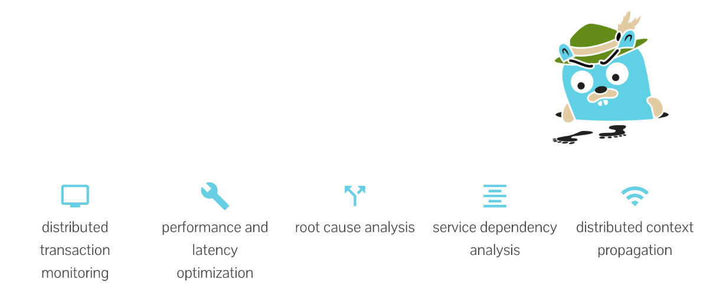
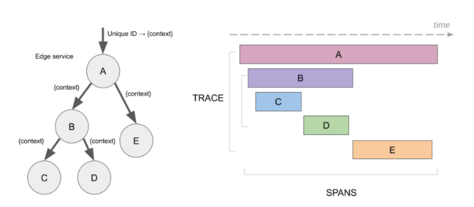
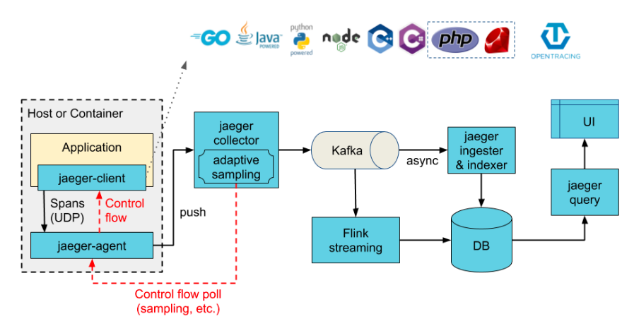
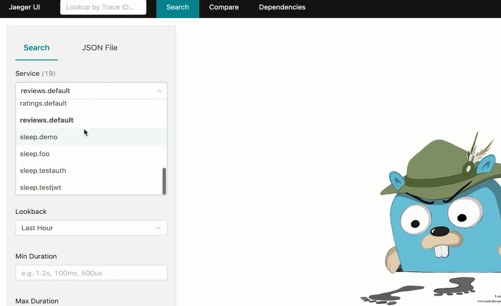
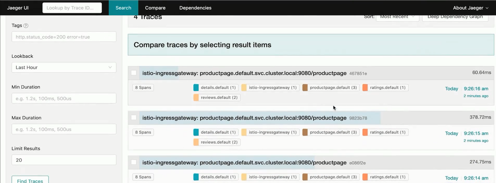
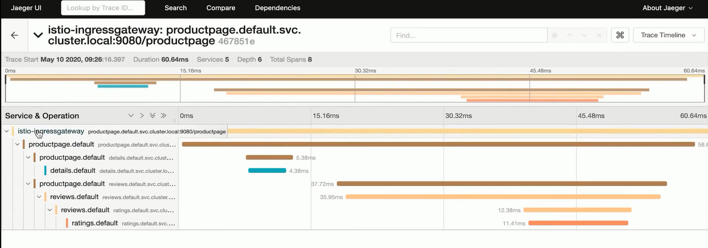
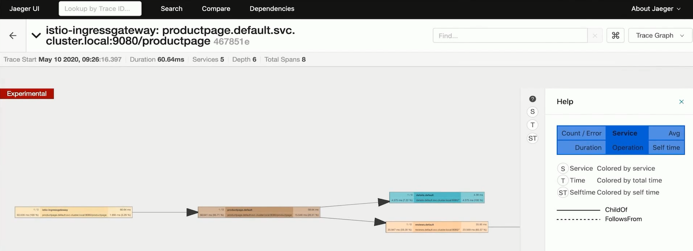

# 分布式追踪

## 一、概念

>分析和监控应用的监控方法
>查找故障点、分析性能问题
>起源于 Google 的 Dapper
>OpenTracing：
>
>> API 规范、框架、库的组合



## 二、什么是Jaeger？

>开源、端到端的分布式追踪系统
>
>针对复杂的分布式系统，对业务链路进行监控和问题排查



## 三、专业术语



### 1、Span

>逻辑单元
>
>有操作名、执行时间
>
>嵌套、有序、因果关系

### 2、Trace

>数据/执行路径
>
>Span 的组合

## 四、架构



### 1、组件

>Client libraries
>
>Agent
>
>Collector
>
>Query
>
>Ingester

## 五、实战

### 1、安装

```bash
--set values.tracing.enabled=true
--set values.global.tracer.zipkin.address = <jaeger-collector-service>.<jaeger-collector-namespace>:9411
```

### 2、进入WEB-UI

>192.168.6.101:16686








