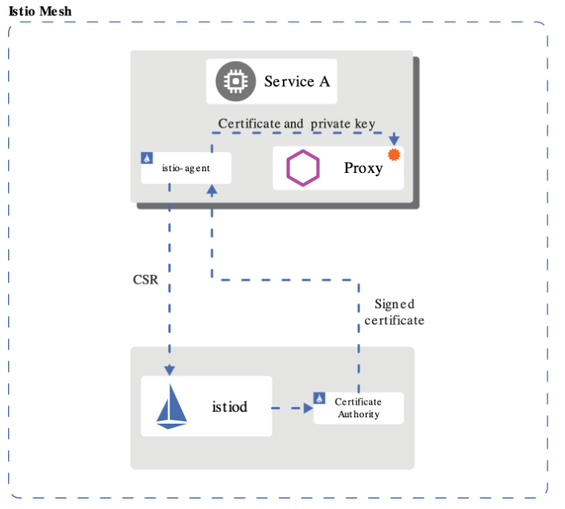
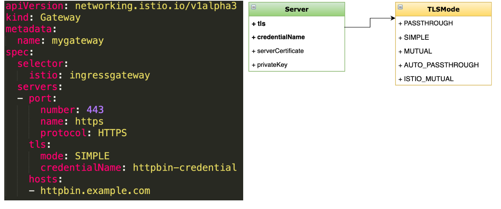

# TLS 安全网关

## 一、Istio 1.5 的安全更新

>• SDS （安全发现服务）趋于稳定、默认开启
>• 对等认证和请求认证配置分离
>• 自动 mTLS 从 alpha 变为 beta，默认开启
>• Node agent 和 Pilot agent 合并， 简化 Pod 安全策略的配置
>• 支持 first-party-jwt （ServiceAccountToken） 作为 third-party-jwt 的备用
>• …

## 二、目标：配置基于 SDS 的安全网关

>配置安全网关，为外部提供 HTTPS 访问方式
>
>学习配置全局自动的 TLS、mTLS
>
>了解 SDS 及工作原理

## 三、安全发现服务（SDS）



>• 身份和证书管理
>• 实现安全配置自动化
>• 中心化 SDS Server
>• 优点：
>  • 无需挂载 secret 卷
>  • 动态更新证书，无需重启
>  • 可监视多个证书密钥对

## 四、演示

### 1、证书密钥准备

#### 1.为服务创建根证书和私钥

```bash
openssl req -x509 -sha256 -nodes -days 365 -newkey rsa:2048 -subj '/O=example Inc./CN=example.com' -keyout example.com.key -out example.com.crt
```

#### 2.为httpbin.example.com创建证书和私钥

```bash
openssl req -out httpbin.example.com.csr -newkey rsa:2048 -nodes -keyout httpbin.example.com.key -subj "/CN=httpbin.example.com/O=httpbin organization"
openssl x509 -req -days 365 -CA example.com.crt -CAkey example.com.key -set_serial 0 -in httpbin.example.com.csr -out httpbin.example.com.crt
```

#### 3.创建secret

```bash
kubectl create -n istio-system secret tls httpbin-credential --key=httpbin.example.com.key --cert=httpbin.example.com.crt
```

### 2、配置https

>httpbin.yaml

```yaml
apiVersion: v1
kind: Service
metadata:
  name: httpbin
  labels:
    app: httpbin
spec:
  ports:
  - name: http
    port: 8000
  selector:
    app: httpbin
---
apiVersion: apps/v1
kind: Deployment
metadata:
  name: httpbin
spec:
  replicas: 1
  selector:
    matchLabels:
      app: httpbin
      version: v1
  template:
    metadata:
      labels:
        app: httpbin
        version: v1
    spec:
      containers:
      - image: docker.io/citizenstig/httpbin
        imagePullPolicy: IfNotPresent
        name: httpbin
        ports:
        - containerPort: 8000

```

>gateway.yaml

```yaml
apiVersion: networking.istio.io/v1alpha3
kind: Gateway
metadata:
  name: mygateway  # Gateway 的名称
spec:
  selector:
    istio: ingressgateway  # 选择运行 Istio ingressgateway 的 Pod（通常是 istio-ingressgateway 服务）
  servers:
  - port:
      number: 443         # 监听的端口号，443 是 HTTPS 的默认端口
      name: https         # 端口名称，必须是唯一的，可以随意命名但常用如 http/https
      protocol: HTTPS     # 协议类型，这里是 HTTPS
    tls:
      mode: SIMPLE        # TLS 模式为 SIMPLE，表示使用单向 TLS（仅服务器提供证书）
      credentialName: httpbin-credential  # Kubernetes Secret 名称，包含 TLS 证书和私钥
    hosts:
    - httpbin.example.com  # 要暴露的主机名，仅当请求的 Host 匹配这个值时才处理请求

```

### 3、请求验证

```bash
curl -HHost:httpbin.example.com \
--resolve httpbin.example.com:443:127.0.0.1 \
--cacert example.com.crt "https://httpbin.example.com:443/status/418"
```



