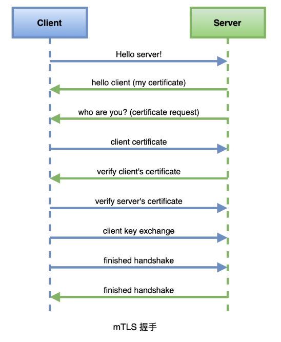
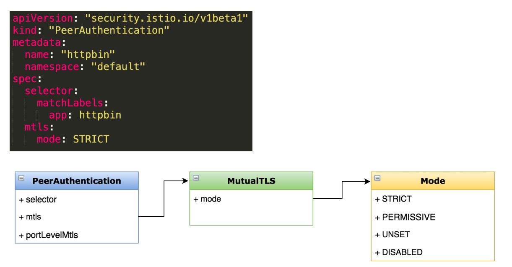

# 双向TLS

## 一、认证策略

### 1、分类

>• 对等认证（PeerAuthentication）
>• 请求认证（RequestAuthentication)

### 2、认证策略范围

>• 网格
>• 命名空间
>• 特定服务

### 3、优先级：最窄原则

## 二、目标

>为网格内的服务开启自动 mTLS
>
>学会配置不同级别的 mTLS 策略
>
>理解对等认证的应用场景

## 三、工作原理



>• TLS：客户端根据服务端证书验证其身份
>• mTLS：客户端、服务端彼此都验证对方身份

## 四、实验

### 1、客户端服务准备

```bash
kubectl create ns testauth
kubectl apply -f samples/sleep/sleep.yaml -n testauth
```

### 2、无TLS请求

```bash
kubectl exec -it sleep-6bdb595bcb-7dzgz -n testauth -c sleep -- curl http://httpbin.default:8000/ip
```

### 3、兼容模式

>同时使用加密和明文

```yaml
kubectl apply -f - <<EOF
apiVersion: "security.istio.io/v1beta1"
kind: "PeerAuthentication"
metadata:
  name: "default"
  namespace: "default"
spec:
  mtls:
    mode: PERMISSIVE
EOF
```

### 4、严格模式

```yaml
kubectl apply -f - <<EOF
apiVersion: "security.istio.io/v1beta1"
kind: "PeerAuthentication"
metadata:
  name: "default"
  namespace: "default"
spec:
  mtls:
    mode: STRICT
EOF
```

### 5、服务注入

```bash
kubectl apply -f <(istioctl kube-inject -f samples/sleep/sleep.yaml) -n testauth
```

### 6、网格全局配置

```yaml
kubectl apply -f - <<EOF
apiVersion: "security.istio.io/v1beta1"
kind: "PeerAuthentication"
metadata:
  name: "default"
spec:
  mtls:
    mode: STRICT
EOF
```



