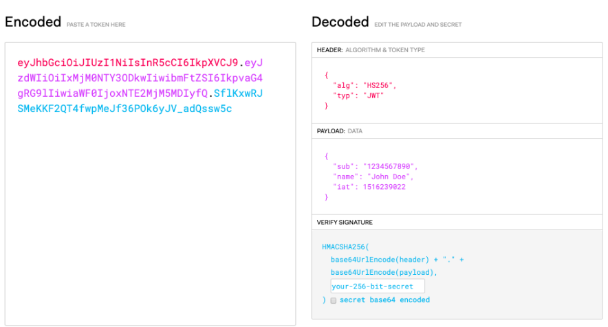
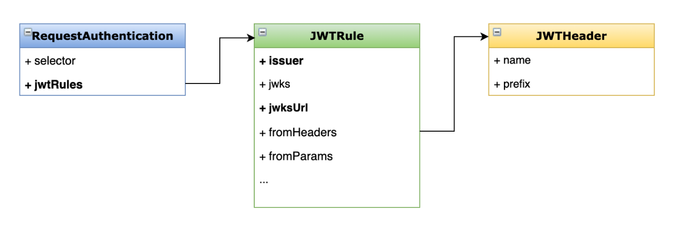
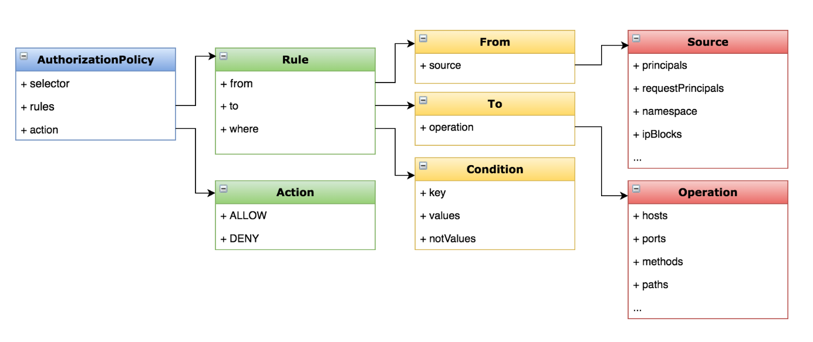

# JWT身份认证与授权

## 一、什么是JWT？



>• JSON Web Token
>• 以 JSON 格式传递信息
>• 应用场景
>  • 授权
>  • 信息交换
>• 组成部分
>  • Header、payload、signature

## 二、目标

>实现基于 JWT 的授权访问
>
>学会配置 JWT 的认证与授权
>
>了解授权策略的配置选项

## 三、演示

### 1、环境准备

```bash
kubectl create ns testjwt
kubectl apply -f <(istioctl kube-inject -f samples/sleep/sleep.yaml) -n testjwt
kubectl apply -f <(istioctl kube-inject -f samples/httpbin/httpbin.yaml) -n testjwt
```

### 2、连通性测试

```bash
kubectl exec $(kubectl get pod -l app=sleep -n foo -o jsonpath={.items..metadata.name}) -c sleep -n testjwt -- curl "http://httpbin.testjwt:8000/headers" -s -o /dev/null -w "%{http_code}\n"
```

### 3、创建请求认证

```yaml
kubectl apply -f - <<EOF
apiVersion: "security.istio.io/v1beta1"
kind: "RequestAuthentication"  # 定义类型：用于指定 JWT 验证规则
metadata:
  name: "jwt-example"           # 资源名称
  namespace: testjwt           # 所属命名空间
spec:
  selector:
    matchLabels:
      app: httpbin             # 选择器：只对带有 app=httpbin 标签的 Pod 生效
  jwtRules:
  - issuer: "testing@secure.istio.io"  # JWT 的签发者（iss 字段），用于验证 JWT 是否来自该身份
    jwksUri: "https://raw.githubusercontent.com/xiaowu/xiaowu-servicemesh/master/c3-19/jwks.json"
                                  # 公钥地址（JWKS URI），用于校验 JWT 的签名
EOF
```

### 4、测试不合法的jwt访问

```bash
kubectl exec $(kubectl get pod -l app=sleep -n foo -o jsonpath={.items..metadata.name}) -c sleep -n testjwt -- curl "http://httpbin.testjwt:8000/headers" -H "Authorization: Bearer invalidToken"
401
```

**但是不带token还是可以访问**

```bash
kubectl exec $(kubectl get pod -l app=sleep -n foo -o jsonpath={.items..metadata.name}) -c sleep -n testjwt -- curl "http://httpbin.testjwt:8000/headers" -s -o /dev/null -w "%{http_code}\n"
```

### 5、创建授权策略

```yaml
kubectl apply -f - <<EOF
apiVersion: security.istio.io/v1beta1
kind: AuthorizationPolicy           # 定义类型：用于控制访问权限的策略
metadata:
  name: require-jwt                 # 策略名称
  namespace: testjwt               # 所属命名空间
spec:
  selector:
    matchLabels:
      app: httpbin                 # 选择器：只对带有 app=httpbin 标签的工作负载（Pod）生效
  action: ALLOW                    # 动作：ALLOW 表示允许符合规则的请求（默认是拒绝）
  rules:
  - from:
    - source:
        requestPrincipals: ["testing@secure.istio.io/testing@secure.istio.io"]
        # 请求来源必须携带 JWT，并且解析出的 request principal 必须匹配这个值
        # 格式为：<issuer>/<subject>
        # 在这里 issuer 是 testing@secure.istio.io，subject 也是 testing@secure.istio.io
EOF

```

### 6、解析Token

```bash
TOKEN=$(curl https://raw.githubusercontent.com/xiaowu/xiaowu-servicemesh/master/c3-19/demo.jwt -s) && echo $TOKEN | cut -d '.' -f2 - | base64 --decode -
```

### 7、请求认证配置



### 8、授权策略配置



https://istio.io/latest/docs/reference/config/security/conditions/


