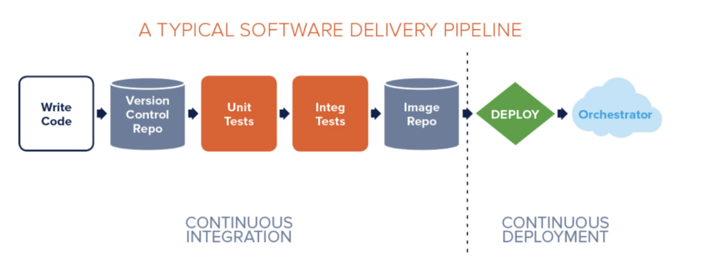
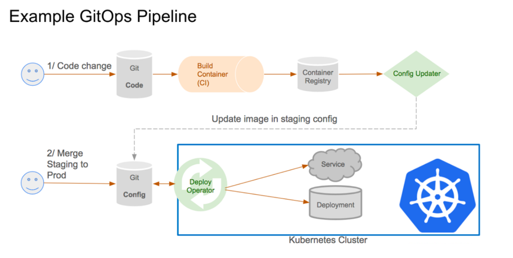
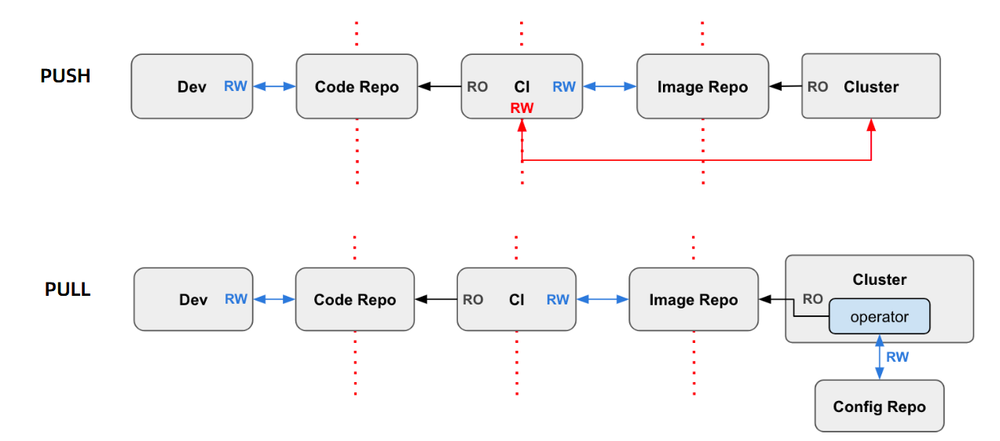
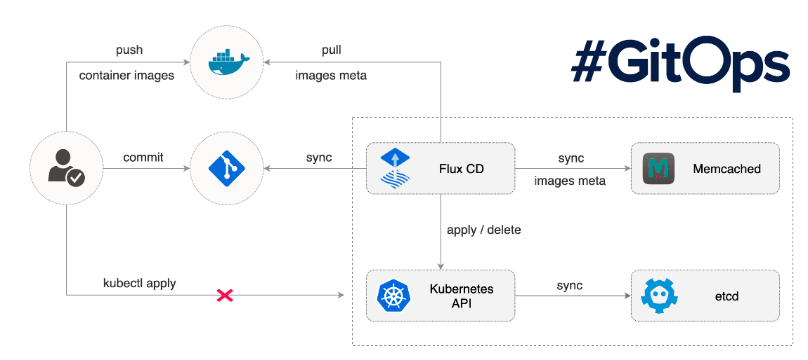

# 项目准备级构建过程

## 一、典型的CI/CD过程



## 二、GitOps持续交付过程

>• GitOps：集群管理和应用分发的持续交付方式
>• 使用 Git 作为信任源，保存声明式基础架构（declarative infrastructure）和应用程序
>• 以 Git 作为交付过程（pipeline）的中心
>• 开发者只需要通过 pull request 完成应用的部署和运维任务
>• 优势：
>  • 提高生产率、改进开发体验、一致性和标准化、安全



## 三、push vs pull 流程（pipeline）



## 四、Flux


>• 官方定义
>  • The GitOps operator for Kubernetes
>• 自动化部署工具（基于 GitOps）
>• 特性
>  • 自动同步、自动部署
>  • 声明式
>  • 基于代码（Pull request），而不是容器



## 五、项目准备

### 1、安装fluxctl

```bash
brew install fluxctl
```

### 2、创建ns

```bash
kubectl create ns flux
```

### 3、部署flux

#### 1.克隆资源清单

```bash
git clone repo https://github.com/fluxcd/flux.git
```

#### 2.修改deployment

>修改git-url、branch、user、email

```bash
https://github.com/fluxcd/flux/blob/master/deploy/flux-deployment.yaml
```

#### 3.部署

```bash
kubectl apply -k deploy
```

#### 4.方法二：命令行修改关联信息

```bash
fluxctl install \
--git-user=xxx \
--git-email=xxx@xxx \
--git-url=git@github.com:xxx/smdemo \
--namespace=flux | kubectl apply -f -
```

### 4、写入deploy key

```bash
export FLUX_FORWARD_NAMESPACE=flux
```

### 5、获取ssh key 加到git仓库

```bash
fluxctl identity --k8s-fwd-ns flux
```

### 6、建demo ns,添加注入

```bash
kubectl create ns demo
kubectl label namespace demo istio-injection=enabled
```

### 7、上传资源清单到git仓库

#### 1.添加httpbin

```yaml
apiVersion: v1
kind: ServiceAccount
metadata:
  name: httpbin
---
apiVersion: v1
kind: Service
metadata:
  name: httpbin
  labels:
    app: httpbin
spec:
  ports:
  - name: http
    port: 8000
    targetPort: 80
  selector:
    app: httpbin
---
apiVersion: apps/v1
kind: Deployment
metadata:
  name: httpbin
spec:
  replicas: 1
  selector:
    matchLabels:
      app: httpbin
      version: v1
  template:
    metadata:
      labels:
        app: httpbin
        version: v1
    spec:
      serviceAccountName: httpbin
      containers:
      - image: docker.io/kennethreitz/httpbin
        imagePullPolicy: IfNotPresent
        name: httpbin
        ports:
        - containerPort: 80
```

```bash
# 加速同步，默认五分钟同步一次
fluxctl sync --k8s-fwd-ns flux
```

#### 2.添加sleep

```yaml
apiVersion: v1
kind: ServiceAccount
metadata:
  name: sleep
  namespace: demo
---
apiVersion: v1
kind: Service
metadata:
  name: sleep
  namespace: demo
  labels:
    app: sleep
spec:
  ports:
  - port: 80
    name: http
  selector:
    app: sleep
---
apiVersion: apps/v1
kind: Deployment
metadata:
  name: sleep
  namespace: demo
spec:
  replicas: 1
  selector:
    matchLabels:
      app: sleep
  template:
    metadata:
      labels:
        app: sleep
    spec:
      serviceAccountName: sleep
      containers:
      - name: sleep
        image: governmentpaas/curl-ssl
        command: ["/bin/sleep", "3650d"]
        imagePullPolicy: IfNotPresent
        volumeMounts:
        - mountPath: /etc/sleep/tls
          name: secret-volume
      volumes:
      - name: secret-volume
        secret:
          secretName: sleep-secret
          optional: true
```

