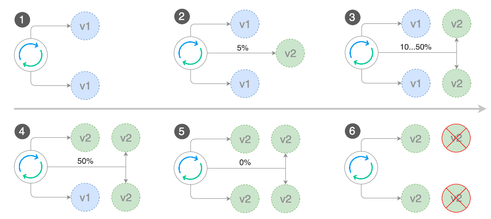
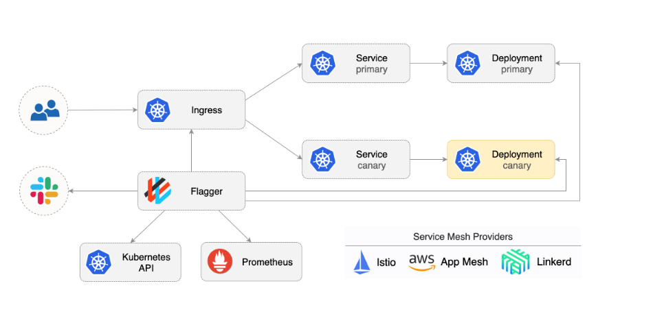
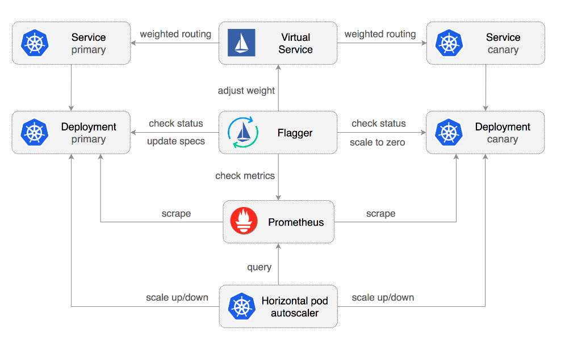

# 自动化灰度发布

## 一、灰度发布过程



## 二、自动化灰度发布 - Flagger

### 1、介绍



>• 自动灰度发布工具
>• 支持多种 Service Mesh
>  • Istio
>  • Linkerd
>  • App AWS Mesh
>• 指标监控灰度发布状态
>• 通知（slack、Microsoft team)

### 2、工作流程



**状态**

>• Initializing
>• Initialized
>• Progressing
>• Succeeded(failed)

## 三、实战

### 1、add repo

```bash
helm repo add flagger https://flagger.app
```

### 2、crd安装

```bash
kubectl apply -f https://raw.githubusercontent.com/weaveworks/flagger/master/artifacts/flagger/crd.yaml
```

### 3、部署flagger with istio

```bash
helm upgrade -i flagger flagger/flagger \
--namespace=istio-system \
--set crd.create=false \
--set meshProvider=istio \
--set metricsServer=http://prometheus.istio-system:9090
```

### 4、配置slack

https://api.slack.com/messaging/webhooks

```bash
helm upgrade -i flagger flagger/flagger \
--namespace=istio-system \
--set crd.create=false \
--set slack.url=https://hooks.slack.com/services/xxxxxx \
--set slack.channel=general \
--set slack.user=flagger
```

### 5、配置grafana

```bash
helm upgrade -i flagger-grafana flagger/grafana \
--namespace=istio-system \
--set url=http://prometheus.istio-system:9090 \
--set user=admin \
--set password=admin
```

### 6、部署flagger,或者下载repo直接执行

```bash
kubectl apply -k github.com/weaveworks/flagger//kustomize/istio
```

### 7、配置网关

```yaml
apiVersion: networking.istio.io/v1alpha3
kind: Gateway
metadata:
  name: public-gateway
  namespace: istio-system
spec:
  selector:
    istio: ingressgateway
  servers:
    - port:
        number: 80
        name: http
        protocol: HTTP
      hosts:
        - "*"
```

### 8、部署应用和tester

```bash
kubectl apply -k github.com/weaveworks/flagger//kustomize/tester
#或者 先clone repo
k apply -f deployment.yaml -n demo
k apply -f service.yaml -n demo
```

### 9、添加HPA

```yaml
k apply -n demo -f - <<EOF
apiVersion: autoscaling/v2beta1
kind: HorizontalPodAutoscaler
metadata:
  name: httpbin
spec:
  scaleTargetRef:
    apiVersion: apps/v1
    kind: Deployment
    name: httpbin
  minReplicas: 2
  maxReplicas: 4
  metrics:
  - type: Resource
    resource:
      name: cpu
      # scale up if usage is above
      # 99% of the requested CPU (100m)
      targetAverageUtilization: 99
EOF

```

### 10、配置灰度发布的配置信息

```yaml
apiVersion: flagger.app/v1beta1
kind: Canary
metadata:
  name: httpbin                    # Canary 资源名称
  namespace: demo                 # 所在命名空间
spec:
  # 目标 Deployment 的引用
  targetRef:
    apiVersion: apps/v1
    kind: Deployment
    name: httpbin                # 要进行金丝雀发布的 Deployment 名称

  # 金丝雀发布的最长超时时间，超时会自动回滚，默认是 600 秒，这里设置为 60 秒
  progressDeadlineSeconds: 60

  # 可选，关联的自动扩缩容资源（HPA）
  autoscalerRef:
    apiVersion: autoscaling/v2beta1
    kind: HorizontalPodAutoscaler
    name: httpbin

  # Flagger 自动创建的 Service 配置（作用于流量分发）
  service:
    port: 8000                   # Service 暴露的端口（外部访问）
    targetPort: 80               # Pod 中容器的端口（实际接收请求的端口）
    gateways:
    - public-gateway.istio-system.svc.cluster.local
                                 # 使用的 Istio Gateway（可用于跨命名空间访问）

  # 金丝雀发布分析配置
  analysis:
    interval: 30s               # 分析评估间隔，每 30 秒评估一次指标
    threshold: 5                # 如果连续 5 次指标不达标，则回滚发布
    maxWeight: 100              # 金丝雀版本最多接受的流量百分比
    stepWeight: 20              # 每次流量提升的步长（20%）

    metrics:
    - name: request-success-rate
      thresholdRange:
        min: 99                 # 请求成功率最低要达到 99%，否则判定失败
      interval: 1m             # 每分钟检查一次该指标

    - name: latency
      templateRef:
        name: latency
        namespace: istio-system  # 指定延迟指标的模板位置（在 istio-system 命名空间）
      thresholdRange:
        max: 500               # P99 请求延迟不得超过 500ms
      interval: 30s            # 每 30 秒评估一次该指标

    # 可选的 webhook 测试配置，用于在金丝雀发布期间执行负载测试
    webhooks:
      - name: load-test
        url: http://flagger-loadtester.test/  # 负载测试服务地址
        timeout: 5s                           # 超时时间
        metadata:
          cmd: "hey -z 1m -q 10 -c 2 http://httpbin-canary.demo:8000/headers"
          # 使用 hey 命令发起压力测试
          # -z 1m：测试时长 1 分钟
          # -q 10：每秒请求数（QPS）
          # -c 2：并发连接数为 2
```

### 11、修改镜像版本模拟发布

>修改镜像版本，查看虚拟服务内权重

### 12、


